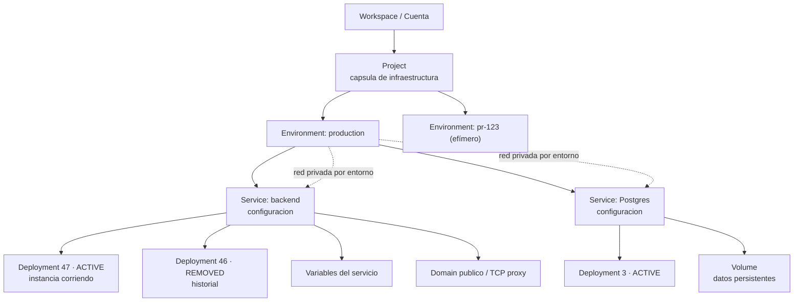
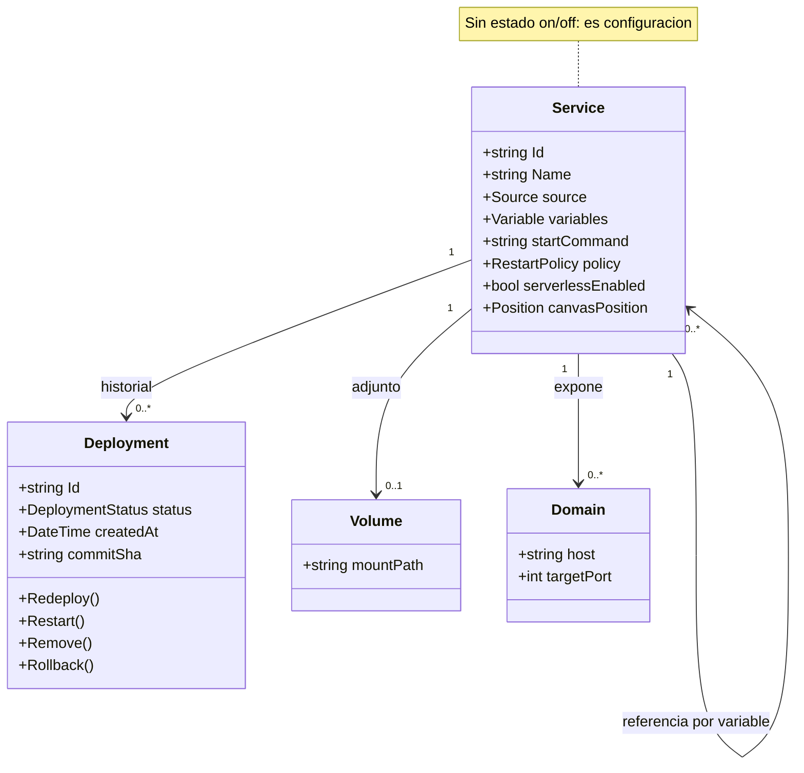
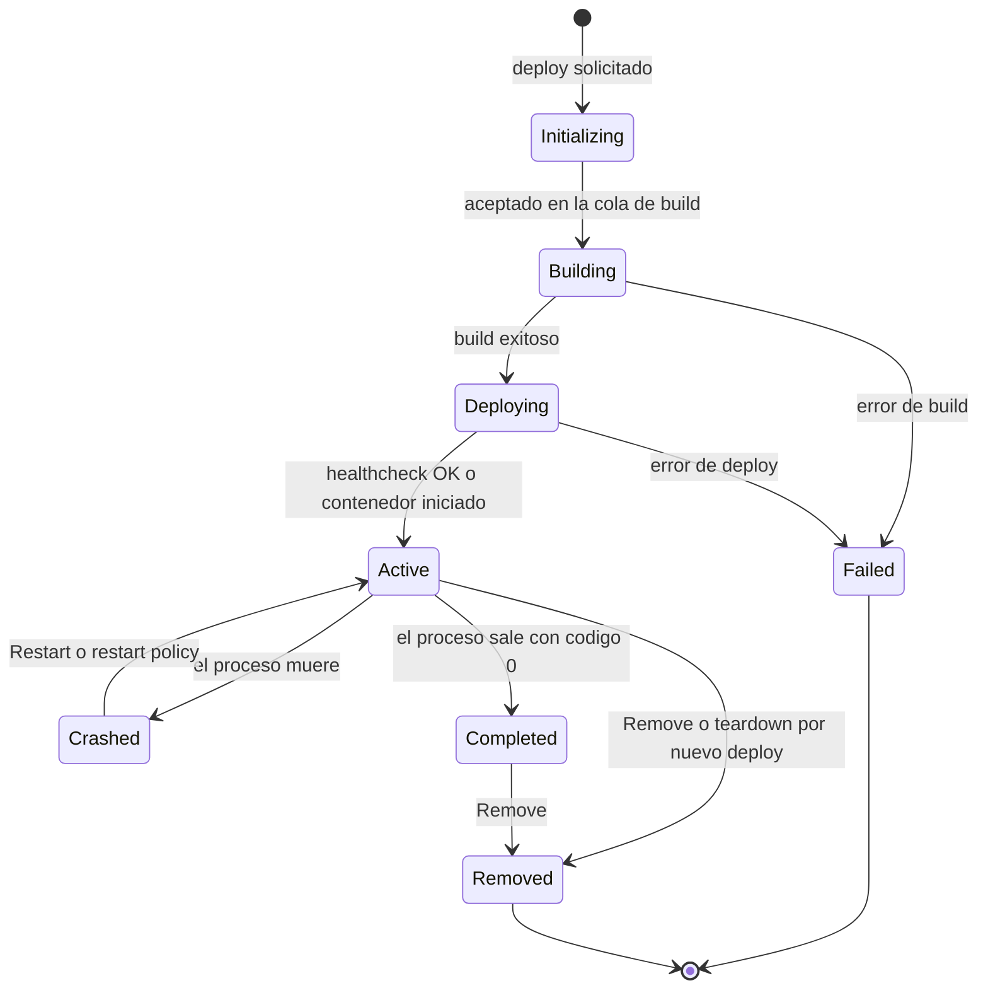
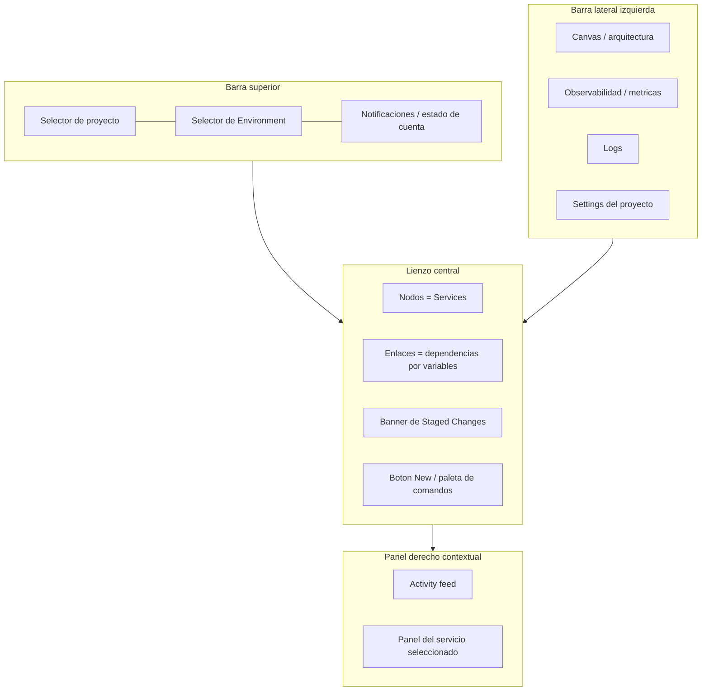
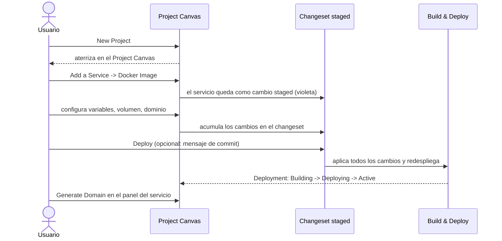
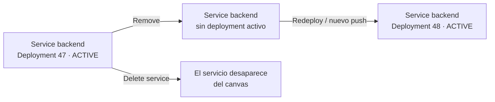
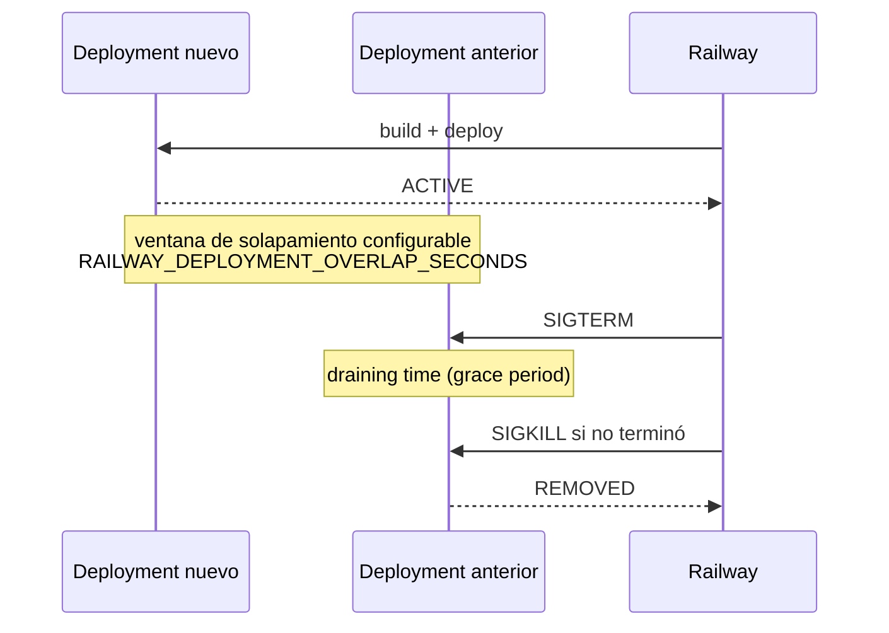
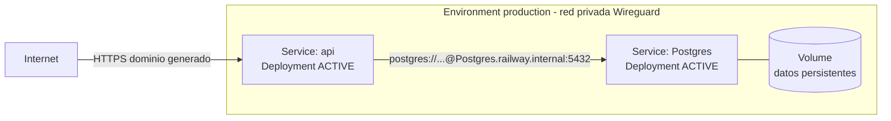

# Análisis · Railway: modelo de abstracción, UX/UI del canvas y librerías equivalentes para .NET 10 + Blazor

> **Tipo:** análisis funcional y de UX/UI (`SelfHosted.Service.Core.Documentos/Analisis/Analisis-Rayway`).
> **Fecha:** 2026-07-26 · **Estado:** `draft`.
> **Origen:** `PROMPTs/01-Crear-Analisis/Crear-Analisis-RailWay.md` · **Rule Set:** `RuleSet-Lean`.
> **Alcance:** documentar las características funcionales, el modelo de abstracción y la
> experiencia/interfaz de usuario de [Railway](https://railway.com/) centradas en el **canvas de
> proyecto** y el **despliegue de contenedores**; y evaluar librerías de canvas para replicar esa
> experiencia en **.NET 10 con páginas Blazor Interactive Server**.

> **Restricción metodológica.** Este documento no inventa información. Cada afirmación sobre
> Railway está respaldada por la documentación oficial citada en [§11](#11-referencias) o por las
> capturas de pantalla aportadas por el usuario en `PROMPTs/01-Crear-Analisis/Crear-Analisis-RailWay/INPUTs/`.
> Las conclusiones propias del análisis se marcan explícitamente como **[Interpretación]**, y lo
> que no pudo verificarse se lista en [§12](#12-limitaciones-y-puntos-no-verificados).

---

## Tabla de contenido

1. [Contexto y objetivo](#1-contexto-y-objetivo)
2. [Qué es Railway](#2-qué-es-railway)
3. [Modelo de abstracción](#3-modelo-de-abstracción)
   - 3.1 [Jerarquía de entidades](#31-jerarquía-de-entidades)
   - 3.2 [Definición formal de cada entidad](#32-definición-formal-de-cada-entidad)
   - 3.3 [La distinción central: Service ≠ Deployment](#33-la-distinción-central-service--deployment)
   - 3.4 [Ciclo de vida del Deployment](#34-ciclo-de-vida-del-deployment)
   - 3.5 [Las aristas del canvas: qué conecta a qué](#35-las-aristas-del-canvas-qué-conecta-a-qué)
   - 3.6 [Invariantes del modelo](#36-invariantes-del-modelo)
4. [UX/UI: el canvas de proyecto](#4-uxui-el-canvas-de-proyecto)
   - 4.1 [Anatomía de la pantalla](#41-anatomía-de-la-pantalla)
   - 4.2 [Evidencia visual: análisis de las capturas](#42-evidencia-visual-análisis-de-las-capturas)
   - 4.3 [Creación de servicios desde el canvas](#43-creación-de-servicios-desde-el-canvas)
   - 4.4 [Staged Changes: el patrón UX diferencial](#44-staged-changes-el-patrón-ux-diferencial)
   - 4.5 [Otros gestos del lienzo](#45-otros-gestos-del-lienzo)
5. [Administración y operación](#5-administración-y-operación)
   - 5.1 [Acciones sobre el deployment](#51-acciones-sobre-el-deployment)
   - 5.2 [Remove del deployment activo](#52-remove-del-deployment-activo)
   - 5.3 [Restart y política de reinicio](#53-restart-y-política-de-reinicio)
   - 5.4 [Despliegue y teardown con solapamiento](#54-despliegue-y-teardown-con-solapamiento)
   - 5.5 [Serverless / App Sleeping](#55-serverless--app-sleeping)
   - 5.6 [Matriz acción → entidad afectada](#56-matriz-acción--entidad-afectada)
6. [Ejemplos prácticos](#6-ejemplos-prácticos)
   - 6.1 [API + Postgres conectados por red privada](#61-api--postgres-conectados-por-red-privada)
   - 6.2 [Bajar un servicio sin perder su configuración](#62-bajar-un-servicio-sin-perder-su-configuración)
   - 6.3 [Entorno de PR como copia del canvas](#63-entorno-de-pr-como-copia-del-canvas)
7. [Traducción del modelo a un entorno Docker self-hosted](#7-traducción-del-modelo-a-un-entorno-docker-self-hosted)
8. [Evaluación de librerías de canvas para .NET 10 + Blazor Interactive Server](#8-evaluación-de-librerías-de-canvas-para-net-10--blazor-interactive-server)
   - 8.1 [Requisitos derivados del relevamiento](#81-requisitos-derivados-del-relevamiento)
   - 8.2 [El condicionante de Blazor Interactive Server](#82-el-condicionante-de-blazor-interactive-server)
   - 8.3 [Candidatos nativos .NET](#83-candidatos-nativos-net)
   - 8.4 [Candidatos JavaScript vía JSInterop](#84-candidatos-javascript-vía-jsinterop)
   - 8.5 [Matriz de evaluación](#85-matriz-de-evaluación)
   - 8.6 [Recomendación](#86-recomendación)
9. [Glosario de términos](#9-glosario-de-términos)
10. [Conclusiones](#10-conclusiones)
11. [Referencias](#11-referencias)
12. [Limitaciones y puntos no verificados](#12-limitaciones-y-puntos-no-verificados)

---

## 1. Contexto y objetivo

El proyecto `SelfHosted.Service.Core` busca construir un servicio web en **.NET 10 / Blazor
Interactive Server** para administrar proyectos de infraestructura basados en contenedores Docker,
tomando como referencia de UX/UI el **canvas de Railway** (antecedente interno:
`Host.Infra.Documentos/Analisis/Infra-Container/Container-Admin/Analisis-Infra-Container.md`, §6
"La idea: clonar el canvas de Railway con una app .NET" [\[31\]](#11-referencias)).

Antes de diseñar ese clon hace falta **entender con precisión qué modela Railway**: qué entidades
existen, cuál tiene estado y cuál no, qué representa cada nodo del lienzo y qué significa cada
acción de la barra de operación. Ese es el objetivo de este documento, junto con la evaluación de
las librerías con las que ese lienzo podría construirse en Blazor.

**Preguntas que el documento responde:**

| # | Pregunta | Sección |
|---|---|---|
| 1 | ¿Cuál es la jerarquía de abstracciones de Railway y qué nombre tiene cada pieza? | [§3](#3-modelo-de-abstracción) |
| 2 | ¿Por qué un *Service* no se "prende y apaga" y un *Deployment* sí? | [§3.3](#33-la-distinción-central-service--deployment) |
| 3 | ¿Qué representan las conexiones dibujadas en el canvas? | [§3.5](#35-las-aristas-del-canvas-qué-conecta-a-qué) |
| 4 | ¿Cómo es la experiencia de crear y operar infraestructura desde el lienzo? | [§4](#4-uxui-el-canvas-de-proyecto) |
| 5 | ¿Qué hace exactamente *Remove*, *Restart*, *Serverless*? | [§5](#5-administración-y-operación) |
| 6 | ¿Con qué librería se construye un lienzo equivalente en Blazor Interactive Server? | [§8](#8-evaluación-de-librerías-de-canvas-para-net-10--blazor-interactive-server) |

---

## 2. Qué es Railway

Railway es una plataforma de infraestructura tipo **PaaS**: el usuario aporta el código, una imagen
Docker o una plantilla, y la plataforma se encarga de construir la imagen, correr el contenedor, la
red, los dominios y la observabilidad.

La documentación oficial define la unidad de trabajo así:

> *"A project represents a capsule for composing infrastructure in Railway. You can think of a
> project as an application stack, a service group, or even a collection of service groups."*
> — Railway Docs, *The Basics* [\[1\]](#11-referencias)

Y define la unidad desplegable en términos explícitamente **contenedorizados**:

> *"A Railway service is a deployment target. Under the hood, services are containers deployed from
> an image."* — Railway Docs, *Services* [\[3\]](#11-referencias)

Dos consecuencias importantes para este análisis:

1. **Un Service es un contenedor.** La equivalencia que el prompt plantea ("un Service = un
   contenedor") está respaldada literalmente por la documentación [\[3\]](#11-referencias).
2. **El canvas no es decoración.** Los servicios de un mismo proyecto quedan unidos por una red
   privada real: *"Services within a project are automatically joined to a private network scoped
   to that project"* [\[1\]](#11-referencias), implementada con *"encrypted Wireguard tunnels using
   internal DNS"* [\[13\]](#11-referencias).

---

## 3. Modelo de abstracción

### 3.1 Jerarquía de entidades



**Lectura de la jerarquía:** el `Project` agrupa; el `Environment` aísla; el `Service` configura; el
`Deployment` ejecuta. Los recursos laterales (`Variables`, `Volume`, `Domain`) cuelgan del
`Service`, no del `Deployment`: sobreviven a cualquier redespliegue.

### 3.2 Definición formal de cada entidad

| Entidad | Definición oficial (cita) | ¿Tiene estado de ejecución? | Ref. |
|---|---|---|---|
| **Project** | *"Projects are containers for environments and services in Railway."* | No | [\[2\]](#11-referencias) |
| **Environment** | *"an isolated instance of all services in a project"*; *"All changes made to a service are scoped to a single environment."* | No | [\[10\]](#11-referencias) |
| **Service** | *"A Railway service is a deployment target. Under the hood, services are containers deployed from an image."* | **No** — es configuración | [\[3\]](#11-referencias) |
| **Deployment** | *"Deployments are attempts to build and deliver your service."* | **Sí** — tiene máquina de estados | [\[4\]](#11-referencias) |
| **Volume** | *"Volumes allow you to store persistent data for services on Railway."* | No (persiste dato) | [\[14\]](#11-referencias) |
| **Variable** | Variables de servicio, compartidas y de referencia; *"Reference variables are those defined by referencing variables in other services…"* | No | [\[12\]](#11-referencias) |
| **Template** | *"Templates provide a way to jumpstart a project by packaging a service or set of services into a reusable, distributable format."* | No | [\[15\]](#11-referencias) |
| **Canvas** | *"the default view for a project"*, donde se gestionan servicios y entornos; el Quick Start lo llama *"your mission control"* | — | [\[2\]](#11-referencias)[\[16\]](#11-referencias) |

**Tipos de servicio.** La documentación distingue servicios **persistentes** (aplicaciones, APIs,
colas, bases de datos, siempre corriendo) de **scheduled jobs / cron jobs** (ejecución por
calendario) [\[3\]](#11-referencias).

**Orígenes admitidos para un Service** [\[3\]](#11-referencias):

| Origen | Detalle |
|---|---|
| Repositorio GitHub | `Connect Repo`; build y deploy automáticos ante nuevos commits sobre la rama vinculada |
| Imagen Docker pública | Docker Hub, GitHub Container Registry, Quay.io, GitLab Container Registry, Microsoft Container Registry |
| Imagen Docker privada | requiere plan Pro; credenciales al crear el servicio |
| Directorio local / Empty Service | `Empty Service` + `railway up` desde la CLI |

La captura `Captura-01.png` confirma este menú en la UI real, con las opciones **GitHub
Repository · Database · Template · Docker Image · Function · Bucket · Empty Service**
[\[32\]](#11-referencias).

### 3.3 La distinción central: Service ≠ Deployment

Este es el punto que el prompt pide tratar explícitamente, y es la clave del modelo:

| | **Service** | **Deployment** |
|---|---|---|
| Qué es | La **configuración**: fuente, variables, comandos de build/start, recursos, política de reinicio | El **intento de construir y entregar** esa configuración: la instancia corriendo |
| Cita | *"services are containers deployed from an image"*; almacena *"variables, source references, and build/start commands"* [\[3\]](#11-referencias) | *"Deployments are attempts to build and deliver your service."* [\[4\]](#11-referencias) |
| Existencia | **Existe siempre** mientras no se lo elimine del proyecto | Se crea en cada deploy; los viejos pasan a historial |
| Estado on/off | **No lo tiene** | Sí: `Initializing`, `Building`, `Deploying`, `Active`, `Failed`, `Completed`, `Crashed`, `Removed` [\[4\]](#11-referencias) |
| Multiplicidad | 1 nodo en el canvas | N por servicio a lo largo del tiempo; normalmente **1 activo** |
| Analogía Docker | La definición de un servicio en `docker-compose.yml` | El contenedor concreto creado a partir de esa definición |

**[Interpretación]** Esta separación es la que hace que el canvas sea estable: el nodo del lienzo
representa al **Service** (algo permanente y posicionable), mientras que su color/insignia de estado
refleja al **Deployment** activo (algo volátil). Si el nodo representara al deployment, el lienzo se
reconstruiría en cada push. Es exactamente el patrón *desired state* / *current state*.



### 3.4 Ciclo de vida del Deployment

Estados y transiciones, con las definiciones textuales de la documentación
[\[4\]](#11-referencias):



| Estado | Definición oficial |
|---|---|
| `Initializing` | *"Every Deployment in Railway begins as `Initializing` - once it has been accepted into Railway's build queue, the status will change to `Building`."* |
| `Building` | Railway construye una imagen Docker desplegable con el código y la configuración |
| `Deploying` | *"Once the build succeeds, Railway will attempt to deploy your image and the Deployment's status becomes `Deploying`."* |
| `Active` | Se alcanza cuando el healthcheck tiene éxito o, si no hay healthcheck, cuando el contenedor arranca |
| `Failed` | *"If an error occurs during the build or deploy process, the Deployment will stop and the status will become `Failed`."* |
| `Completed` | *"This is the status of the Deployment when the running app exits with a zero exit code."* |
| `Crashed` | *"A Deployment will remain in the `Active` state unless it crashes, at which point it will become `Crashed`."* |
| `Removed` | Estado al que pasan los deployments retirados; quedan en la sección de historial |

### 3.5 Las aristas del canvas: qué conecta a qué

En Railway conviven **dos tipos de vínculo** entre servicios, y solo uno es explícito para el
usuario:

| Vínculo | Cómo se establece | Visibilidad | Evidencia |
|---|---|---|---|
| **Red privada** | Automático: todos los servicios de un proyecto/entorno quedan en la misma red | Implícito (no hay que dibujar nada) | *"Services within a project are automatically joined to a private network scoped to that project."* [\[1\]](#11-referencias) |
| **Referencia de variable** | El usuario escribe `${{Postgres.DATABASE_URL}}` en las variables de otro servicio | **Explícito**: genera la relación de dependencia que el canvas muestra | [\[12\]](#11-referencias)[\[17\]](#11-referencias) |

Sintaxis de las *reference variables* [\[12\]](#11-referencias):

```bash
# Variable de otro servicio (el namespace es el nombre del servicio)
DATABASE_URL=${{ Postgres.DATABASE_URL }}

# Dominio público de otro servicio
API_URL=https://${{ backend.RAILWAY_PUBLIC_DOMAIN }}

# Variable compartida del proyecto
SENTRY_DSN=${{ shared.SENTRY_DSN }}

# Variable del propio servicio
FULL_URL=${{ RAILWAY_PUBLIC_DOMAIN }}/api
```

La guía de buenas prácticas justifica el mecanismo — *"Rather than manually copying, pasting, and
hard-coding variables like a public domain or those from another service, you can use reference
variables to build them dynamically"* — y acompaña el texto con una imagen descrita como
*"Screenshot showing related services within a project and their connection links"*
[\[17\]](#11-referencias): es decir, **el canvas dibuja los enlaces entre servicios relacionados**.

**[Interpretación]** La arista del canvas de Railway **no** es "una red" como en un diagrama de
infraestructura clásico: la red ya está dada por el proyecto/entorno. La arista representa una
**dependencia de configuración** (quién consume la variable de quién), que es lo que realmente
importa para saber a quién hay que redesplegar cuando algo cambia. Esta es una diferencia de fondo
respecto de la intuición "arista = red Docker" que aparece en el análisis previo
[\[31\]](#11-referencias), y conviene tenerla presente en el diseño del clon.

**Detalle técnico de la red privada** [\[13\]](#11-referencias):

- Nombre DNS interno: `<service-name>.railway.internal` — ej. `http://api.railway.internal:PORT`.
- *"Each environment has its own isolated network"* — el aislamiento real es **por entorno**, no
  solo por proyecto (ver la inconsistencia señalada en [§12](#12-limitaciones-y-puntos-no-verificados)).
- Túneles Wireguard cifrados (ChaCha20, Curve25519, BLAKE2s) formando una malla entre servicios.
- Resolución DNS a IPv4 e IPv6 en entornos nuevos; **solo IPv6 en entornos legacy**.
- *"Private networking is only available at **runtime**, not during the build phase."*
- Sin costo de egreso: el tráfico interno no cuenta para la facturación de salida.

### 3.6 Invariantes del modelo

Reglas que se desprenden de las definiciones anteriores y que un clon debería respetar:

| # | Invariante | Fundamento |
|---|---|---|
| I1 | Un `Project` contiene **N** `Service` | [\[2\]](#11-referencias) |
| I2 | Un `Service` **es** un contenedor desplegado desde una imagen | [\[3\]](#11-referencias) |
| I3 | Un `Service` no tiene estado on/off; su configuración existe siempre | [\[3\]](#11-referencias)[\[4\]](#11-referencias) |
| I4 | El ciclo de vida vive en el `Deployment` | [\[4\]](#11-referencias) |
| I5 | Toda configuración está *scoped* a un `Environment` | [\[10\]](#11-referencias) |
| I6 | La conectividad privada es automática dentro del entorno | [\[1\]](#11-referencias)[\[13\]](#11-referencias) |
| I7 | Los datos persistentes viven en el `Volume`, adjunto al servicio | [\[14\]](#11-referencias) |
| I8 | Los cambios se acumulan en un *changeset* antes de aplicarse | [\[11\]](#11-referencias) |

---

## 4. UX/UI: el canvas de proyecto

### 4.1 Anatomía de la pantalla

El canvas *"is the default view for a project"*, donde el usuario puede *"manage services and
environments or select a service to view its configuration"* [\[2\]](#11-referencias); el tutorial
lo describe como *"your mission control"*, donde *"your project's infrastructure, environments, and
deployments are all controlled from here"* [\[16\]](#11-referencias).



### 4.2 Evidencia visual: análisis de las capturas

**`Captura-02.png` — listado de proyectos (nivel superior).**

| Elemento observado | Lectura de UX |
|---|---|
| Título "Projects" + buscador con atajo `Ctrl K` | La paleta de comandos es ciudadana de primera clase, no un extra |
| Botón `+ New` destacado en violeta | Acción primaria única y siempre visible |
| Contador "2 Projects" + "Sort By: Recent Activity" | Ordenamiento por actividad: la unidad de navegación es *lo que cambió*, no el nombre |
| Alternador vista grilla / lista | Dos densidades de información |
| Tarjeta de proyecto con **miniatura del lienzo punteado** | **El lienzo es la identidad del proyecto**: la vista previa del canvas actúa como "portada" |
| Estado vacío "● No services" dentro de la miniatura | El estado vacío se comunica *dentro* de la metáfora del lienzo |
| Barra lateral izquierda con iconos (proyectos, plantillas, métricas, equipo, settings, docs) | Navegación global persistente y comprimida |

**`Captura-01.png` — canvas de un proyecto con el modal de creación.**

| Elemento observado | Lectura de UX |
|---|---|
| Fondo punteado a pantalla completa, con paneo/zoom implícito | Metáfora de lienzo infinito |
| Modal centrado con campo *"Describe your project or paste a repo link"* | Entrada en lenguaje natural o pegado de URL como primera opción |
| Lista de orígenes: GitHub Repository, Database, Template, Docker Image, Function, Bucket, Empty Service | **Taxonomía de nodos**: el usuario elige *qué clase de bloque* agrega |
| Chevrons `>` en varias opciones | Flujo progresivo (elegir origen → elegir instancia concreta) |
| Selector `production` en la barra superior | El lienzo siempre se muestra **en el contexto de un entorno** |
| Panel derecho "Activity" con eventos ("2 changes in Postgres", "Deployment successful", "New environment") | Historial permanente y contextual junto al lienzo |
| Iconos de estado en la actividad (✓ verde) | Semaforización del estado de despliegue |

**[Interpretación]** Ambas capturas muestran un producto donde **el lienzo es el modelo mental
completo**: en el listado, el proyecto se representa por su lienzo; dentro del proyecto, todo —
crear, configurar, ver actividad — ocurre alrededor del lienzo. Esa es la diferencia frente a
Portainer/Coolify, que presentan listas y tarjetas [\[31\]](#11-referencias).

### 4.3 Creación de servicios desde el canvas

> *"Services can be created by clicking the New button in the top right corner of the project
> canvas, or by typing `new service` from the command palette"* (`Cmd + K` / `Ctrl + K`)
> [\[3\]](#11-referencias)

Flujo completo según el Quick Start [\[16\]](#11-referencias):



Elementos de UI nombrados por la documentación en este flujo: **New Project**, **Project Canvas**,
**Add a Service**, **Docker Image**, **Deploy**, **Generate Domain**, logs de build/deploy
[\[16\]](#11-referencias).

### 4.4 Staged Changes: el patrón UX diferencial

Es, junto con el lienzo, la decisión de diseño más distintiva:

> *"Changes made in your Railway project, like adding, removing, or making changes to components,
> will be staged in a changeset for you to review and apply."* [\[11\]](#11-referencias)

| Aspecto | Comportamiento documentado |
|---|---|
| Indicador visual | *"the number of staged changes … in a banner on the canvas"*; los cambios *"will appear as purple in the UI"* |
| Revisión | Botón **Details** → diff de valores viejos vs. nuevos |
| Descarte granular | "x" al lado de cada cambio individual |
| Mensaje | Se puede añadir un mensaje de commit antes de desplegar |
| Aplicación | **Deploy** aplica todos los cambios a la vez y redespliega los servicios afectados |
| Aplicar sin desplegar | Mantener `Alt` al desplegar *"allows you to commit the changes without triggering a redeploy"* |
| Excepciones | *"Networking changes are not yet staged and are applied immediately"*; agregar bases de datos o plantillas solo afecta al entorno actual |

**[Interpretación]** El changeset convierte al canvas en un **editor transaccional**: se edita un
"borrador" de la infraestructura y recién al confirmar se materializa. Trasladado a un clon
self-hosted, esto significa que el modelo persistido debe distinguir *estado deseado pendiente* de
*estado aplicado*, y que la UI necesita un tercer estilo de nodo/arista (además de "corriendo" y
"caído"): **"pendiente de aplicar"**.

### 4.5 Otros gestos del lienzo

| Gesto / función | Descripción | Ref. |
|---|---|---|
| **Paleta de comandos** | `Cmd + K` / `Ctrl + K`; permite `new service` sin usar el mouse | [\[3\]](#11-referencias) |
| **Drag & drop de servicios** | Mover y agrupar visualmente servicios en el lienzo (*service groups*) | [\[3\]](#11-referencias) |
| **Drop de `docker-compose.yml`** | *"You can drag and drop your Compose file onto your project canvas, and your services (and any mounted volumes) will be auto-imported as staged changes."* | [\[18\]](#11-referencias) |
| **Plantillas** | Desplegar un conjunto de servicios preconfigurados en el lienzo con pocos clics | [\[15\]](#11-referencias) |
| **Selector de entorno** | El lienzo muestra los servicios del entorno seleccionado | [\[10\]](#11-referencias) |
| **Activity feed** | *"The activity feed shows all the changes that have been made to a project"* | [\[2\]](#11-referencias) |
| **Volumen adjunto al nodo** | El volumen se muestra en el canvas asociado al servicio que lo usa | [\[14\]](#11-referencias) |
| **Danger zone** | Eliminar el proyecto *"will delete all services, environments, and deployments associated with the project"* | [\[2\]](#11-referencias) |

Restricción de nomenclatura a tener en cuenta: los nombres de servicio tienen *"a max length of 32
characters"* [\[3\]](#11-referencias) — el nombre también es el host DNS interno.

---

## 5. Administración y operación

### 5.1 Acciones sobre el deployment

Todas se invocan desde el menú de tres puntos al final de la fila del deployment
[\[5\]](#11-referencias):

| Acción | Definición oficial | Efecto |
|---|---|---|
| **Redeploy** | *"A successful, failed, or crashed deployment can be re-deployed by clicking the three dots at the end of a previous deployment."* | Vuelve a desplegar usando el mismo código fuente |
| **Restart** | *"Restarts the process within the deployment's container, this is often used to bring a service back online after a crash."* | Reinicia el proceso **sin reconstruir** |
| **Rollback** | *"Rollback to previous deployments if mistakes were made."* | Redespliega el código de un deployment anterior |
| **Remove** | *"Stops the currently running deployment, this also marks the deployment as `REMOVED` and moves it into the history section."* | Detiene el deployment activo; el servicio sobrevive |
| **Cancel / Abort** | *"Users can cancel deployments in progress…"* | Aborta un build/deploy en curso |

### 5.2 Remove del deployment activo

Es uno de los temas que el prompt pide tratar y merece precisión, porque es donde la distinción
`Service` / `Deployment` se vuelve tangible:

> **Remove** — *"Stops the currently running deployment, this also marks the deployment as
> `REMOVED` and moves it into the history section."* [\[4\]](#11-referencias)



| | **Remove deployment** | **Delete service** | **Delete project** |
|---|---|---|---|
| Qué desaparece | La instancia en ejecución | El servicio completo (nodo del canvas) | Todo el proyecto |
| Qué sobrevive | Service, variables, volumen, dominios | Nada de ese servicio | Nada |
| Nodo en el canvas | **Permanece**, sin deployment activo | Se elimina | — |
| Reversible con | Redeploy / nuevo deploy | Recrear el servicio | — |
| Evidencia | [\[4\]](#11-referencias)[\[5\]](#11-referencias) | [\[3\]](#11-referencias) | *"will delete all services, environments, and deployments associated with the project"* [\[2\]](#11-referencias) |

**[Interpretación]** *Remove* es el equivalente conceptual de `docker stop` + `docker rm` del
contenedor, **conservando** su definición en el compose. Es la operación que permite "apagar" algo
sin perder cómo estaba configurado — justamente porque el estado on/off no vive en el `Service`.

### 5.3 Restart y política de reinicio

`Restart` es una acción manual: *"Restart a `Crashed` Deployment by visiting your project and
clicking on the 'Restart' button that appears in-line on the Deployment"* [\[5\]](#11-referencias).

Su contraparte automática es la **restart policy** del servicio [\[7\]](#11-referencias):

| Política | Definición oficial |
|---|---|
| `Always` | *"Railway will automatically restart your service every time it stops, regardless of the reason."* |
| `On Failure` (por defecto) | *"Railway will only restart your service if it stops due to an error (e.g., crashes, exits with a non-zero code)."* |
| `Never` | *"Railway will never automatically restart your service, even if it crashes."* |

- Por defecto: `On Failure` con **máximo 10 reintentos**; los planes pagos pueden configurar
  reintentos ilimitados.
- Con múltiples réplicas, *"a restart will only affect the replica that crashed, while the other
  replica(s) continue handling the workload"*.

### 5.4 Despliegue y teardown con solapamiento

El despliegue de Railway no es "parar y arrancar": es un reemplazo con ventana de solapamiento
[\[6\]](#11-referencias).



- *"Once the new deployment is active, the previous deployment remains active for a configurable
  amount of time"*.
- El solapamiento es lo que habilita el despliegue **sin downtime**: la versión nueva ya atiende
  antes de que la anterior termine.
- Ajustable desde Settings, configuración como código o la variable
  `RAILWAY_DEPLOYMENT_OVERLAP_SECONDS`.

### 5.5 Serverless / App Sleeping

> *"Serverless allows you to increase the efficiency of resource utilization on Railway and may
> reduce the usage cost of a service, by ensuring it is running only when necessary."*
> [\[8\]](#11-referencias)

| Aspecto | Comportamiento documentado | Ref. |
|---|---|---|
| Activación | Service → **Settings → Deploy → Serverless** → *"Enable Serverless"*. *"Enabling Serverless on a service tells Railway to stop a service when it is inactive"* | [\[9\]](#11-referencias) |
| Criterio de dormido | Sin **paquetes salientes** durante más de **10 minutos** (peticiones de red, conexiones a base de datos, NTP) | [\[8\]](#11-referencias) |
| Tráfico entrante | *"inbound traffic is excluded from considering when to sleep a service"* | [\[8\]](#11-referencias) |
| Despertar | *"A service is woken when it receives traffic from the internet or from another service in the same project through the private network."* | [\[8\]](#11-referencias) |
| Costo de arranque | La primera petición puede sufrir *cold boot*; puede haber demoras o respuestas `502 Bad Gateway` | [\[8\]](#11-referencias) |
| Alcance | El ajuste aplica a **todas las réplicas** a la vez; los servicios dormidos siguen ocupando un slot de infraestructura | [\[8\]](#11-referencias) |

**[Interpretación]** El criterio "salientes, no entrantes" es contraintuitivo pero coherente: mide
si la aplicación **está haciendo trabajo**, no si alguien la está mirando. Un servicio con
health-checks externos periódicos nunca dormiría si se midiera el tráfico entrante.

Controles de costo relacionados: límites duros de uso — *"all your workloads will be taken offline
to prevent them from incurring further resource usage"* al alcanzar el límite — y límites de CPU/RAM
por réplica [\[9\]](#11-referencias).

### 5.6 Matriz acción → entidad afectada

| Acción de UI | Actúa sobre | ¿Reconstruye imagen? | ¿Sobrevive la configuración? | ¿Sobrevive el dato del volumen? |
|---|---|---|---|---|
| **Deploy** (aplicar staged changes) | Service → nuevo Deployment | Sí (si cambió la fuente) | Sí | Sí |
| **Redeploy** | Deployment | Sí | Sí | Sí |
| **Rollback** | Deployment anterior | Sí | Sí | Sí |
| **Restart** | Proceso del contenedor | No | Sí | Sí |
| **Remove** | Deployment activo | No | **Sí** | Sí |
| **Serverless sleep** | Deployment (automático) | No | Sí | Sí |
| **Delete service** | Service | — | No | No |
| **Delete project** | Project completo | — | No | No |

---

## 6. Ejemplos prácticos

### 6.1 API + Postgres conectados por red privada

**Escenario:** desplegar una API .NET y una base Postgres en el mismo proyecto, conectadas de forma
privada, con la API expuesta públicamente.

**Pasos en el canvas:**

1. `New Project` → aterrizás en el Project Canvas, entorno `production` [\[16\]](#11-referencias).
2. `New` → **Database** → Postgres. Aparece el nodo `Postgres` como cambio *staged* (violeta)
   [\[11\]](#11-referencias).
3. `New` → **GitHub Repository** (o **Docker Image**) → nodo `api`.
4. En `api` → Variables:
   ```bash
   ConnectionStrings__Default=${{ Postgres.DATABASE_URL }}
   ```
   Esto crea la dependencia `api → Postgres`, que el canvas dibuja como enlace
   [\[12\]](#11-referencias)[\[17\]](#11-referencias).
5. `Deploy` → se aplican todos los cambios juntos y se despliegan ambos servicios
   [\[11\]](#11-referencias).
6. En `api` → **Generate Domain** para exponerlo a internet [\[16\]](#11-referencias).

**Topología resultante:**



**Qué hay que entender del ejemplo:**

- La API **no necesita** que Postgres exponga un puerto público: la resolución
  `Postgres.railway.internal` funciona sin configuración [\[13\]](#11-referencias).
- El tráfico `api → Postgres` no genera costo de egreso [\[13\]](#11-referencias)[\[17\]](#11-referencias).
- Durante el **build** de la API la red privada **no está disponible**: cualquier migración de base
  de datos debe correr en el *start command*, no en el build [\[13\]](#11-referencias).
- Si el entorno es *legacy*, el DNS interno resuelve **solo a IPv6** → la aplicación debe poder
  hablar IPv6 [\[13\]](#11-referencias).

### 6.2 Bajar un servicio sin perder su configuración

**Escenario:** un servicio de pruebas consume recursos y se quiere apagar, pero sin perder
variables, volumen ni dominio.

| Opción | Resultado | Cuándo conviene |
|---|---|---|
| **Remove** del deployment activo | Se detiene la instancia; el nodo permanece en el canvas sin deployment activo [\[4\]](#11-referencias) | Apagado manual, indefinido |
| **Serverless / App Sleeping** | Se detiene solo tras 10 min sin tráfico saliente y despierta con la primera petición [\[8\]](#11-referencias) | Servicios de uso esporádico |
| **Restart policy = `Never`** | No se reinicia solo al caerse [\[7\]](#11-referencias) | Evitar que un job vuelva a levantarse |
| **Delete service** | Se pierde todo lo del servicio [\[3\]](#11-referencias) | Baja definitiva |

Traducción del caso a Docker plano **[Interpretación]**:

```bash
# "Remove" del deployment activo ~ parar y borrar el contenedor, conservando la definición
docker stop api && docker rm api          # la definición sigue en el compose / en la BD del clon
docker volume ls | grep api-data          # el volumen NO se toca

# "Delete service" ~ borrar también la definición y sus recursos
docker rm -f api && docker volume rm api-data
```

### 6.3 Entorno de PR como copia del canvas

**Escenario:** validar una rama sin tocar producción.

- Al abrir un Pull Request se crea un entorno temporal, *"created when a Pull Request is opened on a
  branch and are deleted as soon as the PR is merged or closed"* [\[10\]](#11-referencias).
- Ese entorno es *"an isolated instance of all services in a project"*: mismo dibujo de canvas,
  servicios distintos, variables distintas y **red privada propia** [\[10\]](#11-referencias)[\[13\]](#11-referencias).
- La duplicación de un entorno copia *"services, variables, and configuration"*, y los cambios
  quedan *staged* esperando aprobación [\[10\]](#11-referencias).
- Para llevar cambios de un entorno a otro existe **Sync**: se elige entorno destino y origen, se
  revisan los cambios etiquetados como **New / Edited / Removed** y se despliega
  [\[10\]](#11-referencias).

**[Interpretación]** El entorno es una **dimensión del modelo**, no una carpeta: el mismo grafo de
servicios instanciado N veces. En el clon self-hosted, la clave primaria del "servicio desplegado"
debe ser `(ProjectId, EnvironmentId, ServiceId)`, y el layout del canvas (posiciones) debería
compartirse entre entornos para que el dibujo sea reconocible.

---

## 7. Traducción del modelo a un entorno Docker self-hosted

**[Interpretación]** — Esta sección es análisis propio, no documentación de Railway. Sirve de puente
entre el modelo relevado y el objetivo del proyecto `SelfHosted.Service.Core`.

| Abstracción Railway | Equivalente razonable en Docker self-hosted | Observaciones |
|---|---|---|
| `Project` | Proyecto lógico + red bridge dedicada (`proj-<slug>-net`) | La red por proyecto reproduce la conectividad automática |
| `Environment` | Sufijo de nombres + red propia por entorno | Railway aísla por entorno, no solo por proyecto [\[13\]](#11-referencias) |
| `Service` | Registro en la BD (SQLite/EF) con imagen, comando, variables, política | **Nunca** un contenedor: es la definición |
| `Deployment` | Contenedor concreto creado vía Docker Engine API | Guardar historial de deployments con estado y timestamps |
| Estados del deployment | Mapeo desde `State`/`Status` de `docker inspect` | `created→Initializing`, `running→Active`, `exited(0)→Completed`, `exited(≠0)→Crashed`, `removing/removed→Removed` |
| DNS interno `x.railway.internal` | DNS embebido de Docker en redes user-defined: el alias es el nombre del contenedor | Equivalencia directa y gratuita |
| Reference variable `${{svc.VAR}}` | Resolución en el backend antes de crear el contenedor + arista en el grafo | Es lo que alimenta las aristas del canvas |
| `Volume` | Volumen nombrado de Docker, adjunto al servicio | Sobrevive a *Remove* del deployment |
| Dominio público | Regla en el reverse proxy (Traefik/Nginx) | Fuera del alcance de este documento |
| `Remove` deployment | `stop` + `rm` del contenedor, conservando el registro del servicio | Ver [§5.2](#52-remove-del-deployment-activo) |
| `Restart` | `docker restart` | No reconstruye imagen |
| Restart policy | `--restart` de Docker (`no`, `on-failure[:max]`, `always`) | Correspondencia casi 1:1 con [\[7\]](#11-referencias) |
| Teardown con solapamiento | Arrancar el nuevo, esperar N segundos, `SIGTERM` al viejo | Requiere reverse proxy que conmute el upstream |
| App Sleeping | Métrica de tráfico saliente + `stop` automático; despertar por proxy on-demand | Es la pieza **más costosa** de replicar |
| Staged Changes | Tabla de *changeset* pendiente + diff + aplicar en lote | Ver [§4.4](#44-staged-changes-el-patrón-ux-diferencial) |
| Templates | Import/export del grafo (JSON) o de `docker-compose.yml` | Railway ya acepta drop de Compose [\[18\]](#11-referencias) |

El puente técnico con Docker desde .NET ya fue identificado en el análisis previo:
**`Docker.DotNet`**, cliente C# de la Docker Engine API [\[30\]](#11-referencias)[\[31\]](#11-referencias).

---

## 8. Evaluación de librerías de canvas para .NET 10 + Blazor Interactive Server

### 8.1 Requisitos derivados del relevamiento

Cada requisito nace de una característica concreta documentada en §3–§5:

| # | Requisito | Origen |
|---|---|---|
| R1 | **Nodos totalmente personalizados** (icono, nombre, badge de estado, métricas, menú contextual) | Tiles de servicio del canvas [\[2\]](#11-referencias) |
| R2 | **Aristas entre nodos**, idealmente con puertos, para representar dependencias por variables | [§3.5](#35-las-aristas-del-canvas-qué-conecta-a-qué) |
| R3 | **Pan, zoom y zoom-to-fit** sobre lienzo infinito | Capturas [\[32\]](#11-referencias) |
| R4 | **Drag & drop con posición persistente** por proyecto/entorno | *service groups* [\[3\]](#11-referencias) |
| R5 | **Agrupación de nodos** (grupos de servicios / recursos anidados como volúmenes) | [\[3\]](#11-referencias)[\[14\]](#11-referencias) |
| R6 | **Actualización de estado en vivo** del nodo sin redibujar el grafo | Estados del deployment [\[4\]](#11-referencias) |
| R7 | **Selección → panel lateral contextual** | [\[2\]](#11-referencias) |
| R8 | **Serialización del grafo y del layout** (para EF Core + SQLite) | Persistencia del proyecto |
| R9 | **Tercer estilo visual "pendiente de aplicar"** (equivalente al violeta de staged changes) | [\[11\]](#11-referencias) |
| R10 | **Drop de archivos sobre el lienzo** (`docker-compose.yml`) | [\[18\]](#11-referencias) |
| R11 | **Minimap / navigator** para proyectos grandes | Escalabilidad visual |
| R12 | **Fluidez aceptable bajo Interactive Server** | Ver §8.2 |

### 8.2 El condicionante de Blazor Interactive Server

Es el factor de decisión dominante y hay que enunciarlo con claridad. La documentación oficial de
Microsoft lo dice sin rodeos entre las limitaciones del modelo Blazor Server
[\[20\]](#11-referencias):

> *"Higher latency usually exists. Every user interaction involves a network hop."*

y describe el mecanismo:

> *"UI updates, event handling, and JavaScript calls are handled over a SignalR connection using
> the WebSockets protocol."*

**[Interpretación] Implicancia para un canvas:** arrastrar un nodo genera decenas de eventos
`pointermove` por segundo. Si esos eventos se manejan en C#, **cada uno es un viaje de ida y vuelta
al servidor**, y el arrastre se percibe con *lag* proporcional a la latencia de red. En una LAN
(caso `i7infra`, host doméstico) el impacto es bajo; sobre internet con 100–200 ms de RTT es
inaceptable.

**Mitigaciones posibles (ordenadas por relación costo/beneficio):**

| Mitigación | Descripción |
|---|---|
| M1 | Manejar el arrastre/zoom **en JavaScript** y notificar a C# **solo al soltar** (`pointerup`) — la posición final es lo único que hay que persistir |
| M2 | Usar CSS `transform` para el movimiento visual y no re-renderizar el árbol Razor durante el gesto |
| M3 | Reducir el estado renderizado: virtualización de nodos fuera del viewport |
| M4 | Garantizar **WebSockets** (no long-polling) en el despliegue del contenedor |
| M5 | Para el canvas concreto, considerar `InteractiveAuto` / WASM si el lag resultara bloqueante — **cambia el requisito del proyecto**, por lo que se propone, no se asume |

### 8.3 Candidatos nativos .NET

| Librería | Paquete / versión | Licencia | Frameworks | Descargas | Notas |
|---|---|---|---|---|---|
| **Blazor.Diagrams (Z.Blazor.Diagrams)** | `Z.Blazor.Diagrams` 3.0.4.1 (2026-03-02) | **MIT** | net6.0 … **net10.0** | ~1.7 M | *"fully customizable and extensible all-purpose diagrams library for Blazor (both Server Side and WASM)"*; *"95% of ZBD is made using C#/Blazor, JS is only used when absolutely necessary"* [\[21\]](#11-referencias)[\[22\]](#11-referencias) |
| **Excubo.Blazor.Diagrams** | `Excubo.Blazor.Diagrams` 4.1.136 (2025-11-15) | Ver paquete | net10.0 | ~138 K | *"lightweight and highly customizable diagram component"*; depende de `AutomaticGraphLayout` y `Excubo.Blazor.Canvas` [\[23\]](#11-referencias) |
| **Syncfusion Blazor Diagram** | `Syncfusion.Blazor.Diagram` (34.x) | Comercial (con *community license* sujeta a condiciones — verificar) | Blazor Server y WASM; la doc indica *"Configure the Interactive render mode is Server"* | — | Nodos, conectores, anotaciones, formas de flowchart, ruteo ortogonal; suite con soporte comercial [\[24\]](#11-referencias) |
| **WTG.Z.Blazor.Diagrams** | fork publicado en NuGet (4.0.28) | Ver paquete | — | — | Fork de ZBD listado en NuGet; alternativa si se requiere una línea de mantenimiento distinta [\[22\]](#11-referencias) |

**Capacidades declaradas de Blazor.Diagrams** relevantes para R1–R11 [\[21\]](#11-referencias):

- *"Links between nodes, ports and even other links"* → **R2** ✔
- *"Panning, Zooming and Zooming to fit a set of nodes"* → **R3** ✔
- *"Groups as first class citizen, with all the features of nodes"* → **R5** ✔
- *"only draw nodes that are visible to the users"* (virtualización) → **R11/M3** ✔
- *"Customizable Diagram overview/navigator for large diagrams"* → **R11** ✔
- *"Custom nodes, links and groups"* + separación *"data layer (models)"* / *"UI layer (widgets)"* →
  **R1, R6, R8** ✔ (los nodos son componentes Razor: se pueden construir con **MudBlazor**, que es
  la librería de UI prevista para el proyecto)
- Snap to grid → asistencia de layout ✔

### 8.4 Candidatos JavaScript vía JSInterop

Útiles si se decide manejar el lienzo del lado del cliente para eludir la latencia de SignalR
(mitigación M1 llevada al extremo): el componente Blazor hospeda la librería JS y solo intercambia
el grafo serializado y los eventos de alto nivel.

| Librería | Perfil | Consideración para Blazor |
|---|---|---|
| **React Flow / xyflow** | Estándar de facto de node-editors web; drag & drop, zoom/pan, tipos de nodo y aristas [\[25\]](#11-referencias) | Requiere React dentro de la página: aumenta mucho la complejidad del build en un proyecto .NET |
| **Rete.js** | Framework de workflows visuales con render en React/Vue/Angular/Svelte [\[29\]](#11-referencias) | Misma objeción: dependencia de un framework JS |
| **litegraph.js** | Motor + editor sobre HTML5 Canvas2D; es el que usa **ComfyUI** [\[27\]](#11-referencias) | Vanilla JS, integrable; estética "editor de nodos", más lejos del look de Railway |
| **Drawflow** | Librería vanilla de flujos por drag & drop, simple y liviana [\[26\]](#11-referencias) | La más fácil de envolver en un componente Blazor; menos features avanzadas |
| **jsPlumb Community Edition** | Conectores/anclas; **doble licencia MIT/GPLv2**; el repositorio community *"no longer receives updates"* [\[28\]](#11-referencias) | Riesgo de mantenimiento: **descartable** para un proyecto nuevo |

**[Interpretación]** Todas estas opciones implican mantener una capa de *interop* bidireccional
(estado C# ⇄ estado JS), que es precisamente el tipo de complejidad que la elección de Blazor busca
evitar. Solo se justifican si el requisito de fluidez del arrastre resulta incompatible con el
manejo en C#.

### 8.5 Matriz de evaluación

Escala: ✔ cumple · ◐ parcial o requiere trabajo · ✖ no cumple o desconocido · **†** inferido del
diseño de la librería, no verificado con una prueba.

| Criterio | Blazor.Diagrams | Excubo.Blazor.Diagrams | Syncfusion Diagram | React Flow (interop) | Drawflow (interop) |
|---|---|---|---|---|---|
| R1 Nodos custom (Razor + MudBlazor) | ✔ | ◐ | ✔ | ✖ (JS/React) | ✖ (JS) |
| R2 Aristas con puertos | ✔ | ✔ | ✔ | ✔ | ◐ |
| R3 Pan / zoom / fit | ✔ | ✔ | ✔ | ✔ | ✔ |
| R4 Drag con posición persistente | ✔ | ✔ | ✔ | ✔ | ✔ |
| R5 Grupos | ✔ | ◐ † | ✔ | ✔ | ✖ |
| R6 Estado en vivo por nodo | ✔ (binding C#) | ✔ | ✔ | ◐ (interop) | ◐ (interop) |
| R7 Selección → panel lateral | ✔ | ✔ | ✔ | ◐ | ◐ |
| R8 Serialización del grafo | ✔ (modelos C#) | ✔ | ✔ | ◐ | ◐ |
| R9 Estilo "pendiente" | ✔ (CSS propio) | ✔ | ✔ | ✔ | ◐ |
| R10 Drop de archivo en el lienzo | ◐ (JS del lado del contenedor) | ◐ | ◐ | ◐ | ◐ |
| R11 Minimap / navigator | ✔ | ◐ † | ✔ | ✔ | ✖ |
| R12 Fluidez en Interactive Server | ◐ (requiere M1–M4) † | ◐ † | ◐ † | ✔ (todo en cliente) | ✔ |
| Licencia / costo | **MIT** | Verificar | **Comercial** | MIT | MIT |
| Soporte net10.0 | ✔ | ✔ | ✔ | n/a | n/a |
| Todo en C# (sin JS propio) | ✔ | ✔ | ✔ | ✖ | ✖ |
| Tamaño de comunidad | ~1.7 M descargas, 1.4 k ★ | ~138 K descargas | Suite comercial | Muy grande | Media |

### 8.6 Recomendación

**Primera opción: `Z.Blazor.Diagrams` (Blazor.Diagrams).**

Fundamentos verificables:

1. **Encaje de stack**: soporta `net10.0` y declara explícitamente Blazor **Server Side** y WASM
   [\[21\]](#11-referencias)[\[22\]](#11-referencias) — es el único requisito no negociable del proyecto.
2. **Licencia MIT** y ~1.7 M de descargas con release reciente (3.0.4.1, marzo 2026)
   [\[22\]](#11-referencias): sin costo ni riesgo de licencia para un proyecto self-hosted.
3. **Cobertura funcional**: nodos custom, puertos, links, grupos, minimap, virtualización y snapping
   cubren R1–R5 y R11 sin desarrollo propio [\[21\]](#11-referencias).
4. **Nodos = componentes Razor**, por lo que el tile de servicio puede construirse con MudBlazor y
   enlazarse directamente al estado del deployment (R1, R6).
5. **Continuidad con el análisis previo**, que ya la había identificado como la vía "todo en C#"
   [\[31\]](#11-referencias).

**Condición de aceptación:** antes de comprometer la arquitectura, hacer una **prueba de concepto
medida** — 30–50 nodos, arrastre sostenido, sobre la red real de uso — y verificar la fluidez. Si el
arrastre no es fluido, aplicar M1 (arrastre en JS, persistencia en `pointerup`) y M2 antes de
descartar la librería.

**Plan B (si la PoC falla):** envolver **Drawflow** o **litegraph.js** en un componente Blazor con
JSInterop de grano grueso — el grafo viaja como JSON al inicializar y solo se notifican eventos
semánticos ("nodo movido", "arista creada", "nodo seleccionado"). Cuesta una capa de interop, pero
elimina por completo la latencia del gesto.

**Descartes explícitos:**

- **jsPlumb Community Edition**: el repositorio *"no longer receives updates"* [\[28\]](#11-referencias).
- **React Flow / Rete.js**: introducen un framework JS completo en un proyecto .NET; costo
  desproporcionado salvo que ya exista frontend React.
- **Syncfusion**: técnicamente apto y con soporte comercial, pero implica licencia paga (o cumplir
  las condiciones de la *community license*); solo se justifica si la organización ya la posee
  [\[24\]](#11-referencias).

---

## 9. Glosario de términos

| Término | Definición | Ref. |
|---|---|---|
| **App Sleeping** | Nombre coloquial de *Serverless*: detención automática del servicio tras ~10 min sin tráfico saliente, con despertar por tráfico entrante | [\[8\]](#11-referencias) |
| **Canvas (Project Canvas)** | Vista por defecto del proyecto; lienzo donde se gestionan servicios y entornos. El Quick Start lo llama *"mission control"* | [\[2\]](#11-referencias)[\[16\]](#11-referencias) |
| **Changeset** | Conjunto de cambios acumulados y pendientes de aplicar (ver *Staged Changes*) | [\[11\]](#11-referencias) |
| **Cold boot** | Demora de la primera petición a un servicio dormido; puede manifestarse como `502 Bad Gateway` | [\[8\]](#11-referencias) |
| **Command palette** | Buscador de acciones invocado con `Cmd + K` / `Ctrl + K`; permite `new service` | [\[3\]](#11-referencias) |
| **Deployment** | *"Attempts to build and deliver your service"*: la instancia en ejecución, con ciclo de vida propio | [\[4\]](#11-referencias) |
| **Deployment overlap** | Ventana configurable en la que el deployment nuevo y el anterior conviven, para lograr despliegue sin downtime (`RAILWAY_DEPLOYMENT_OVERLAP_SECONDS`) | [\[6\]](#11-referencias) |
| **Draining time** | Período de gracia entre el `SIGTERM` y el `SIGKILL` al deployment anterior | [\[6\]](#11-referencias) |
| **Empty Service** | Servicio creado sin fuente, para desplegar luego con `railway up` desde la CLI | [\[3\]](#11-referencias) |
| **Environment** | *"An isolated instance of all services in a project"*; cada uno tiene su red privada aislada | [\[10\]](#11-referencias)[\[13\]](#11-referencias) |
| **Healthcheck** | Comprobación que, si está configurada, determina el paso de `Deploying` a `Active` | [\[4\]](#11-referencias) |
| **PR Environment** | Entorno temporal creado al abrir un Pull Request y eliminado al cerrarlo o mergearlo | [\[10\]](#11-referencias) |
| **Private Networking** | Red privada automática entre servicios del mismo entorno, sobre túneles Wireguard, con DNS `<service>.railway.internal`; solo disponible en runtime | [\[1\]](#11-referencias)[\[13\]](#11-referencias) |
| **Project** | *"A capsule for composing infrastructure"*; contenedor de entornos y servicios | [\[1\]](#11-referencias)[\[2\]](#11-referencias) |
| **Redeploy** | Volver a desplegar un deployment usando su mismo código fuente | [\[5\]](#11-referencias) |
| **Reference variable** | Variable definida referenciando otra, de otro servicio (`${{Servicio.VAR}}`), compartida (`${{shared.VAR}}`) o propia | [\[12\]](#11-referencias) |
| **Remove** | Acción que detiene el deployment activo, lo marca `REMOVED` y lo mueve al historial; **el servicio sobrevive** | [\[4\]](#11-referencias) |
| **Replica** | Cada instancia paralela de un deployment; un restart afecta solo a la réplica caída | [\[7\]](#11-referencias) |
| **Restart** | Reinicio del proceso dentro del contenedor del deployment, sin reconstrucción | [\[5\]](#11-referencias) |
| **Restart policy** | `Always` / `On Failure` (por defecto, máx. 10 reintentos) / `Never` | [\[7\]](#11-referencias) |
| **Rollback** | Redesplegar el código de un deployment anterior | [\[5\]](#11-referencias) |
| **Serverless** | *"Ensuring it is running only when necessary"*; se activa en Settings → Deploy → Serverless | [\[8\]](#11-referencias)[\[9\]](#11-referencias) |
| **Service** | *"A deployment target… containers deployed from an image"*: la **configuración**, sin estado on/off | [\[3\]](#11-referencias) |
| **Service group** | Agrupación visual de servicios en el lienzo mediante drag & drop | [\[3\]](#11-referencias) |
| **Shared variable** | Variable a nivel proyecto, referenciable con `${{shared.KEY}}` | [\[12\]](#11-referencias) |
| **Staged Changes** | Cambios acumulados en un changeset, mostrados en violeta y en un banner del canvas, aplicados en lote con **Deploy** | [\[11\]](#11-referencias) |
| **Template** | Empaquetado reutilizable de un servicio o conjunto de servicios con su configuración | [\[15\]](#11-referencias) |
| **Volume** | Almacenamiento persistente montado en una ruta del servicio; se muestra adjunto al nodo en el canvas | [\[14\]](#11-referencias) |

---

## 10. Conclusiones

1. **El modelo de Railway se sostiene sobre una separación explícita entre configuración y
   ejecución**: el `Service` es la configuración —existe siempre, no tiene estado on/off— y el
   `Deployment` es la instancia con ciclo de vida ([§3.3](#33-la-distinción-central-service--deployment)).
   Es la decisión de diseño que hace posible un canvas estable y operaciones como *Remove* sin
   pérdida de configuración.
2. **Un `Service` es un contenedor**, literalmente: *"services are containers deployed from an
   image"* [\[3\]](#11-referencias). La equivalencia con el mundo Docker es directa y hace viable el
   clon self-hosted.
3. **Las aristas del canvas representan dependencias de configuración (referencias de variables), no
   redes.** La red privada ya está dada automáticamente por el entorno [\[1\]](#11-referencias)[\[13\]](#11-referencias).
   Este es el hallazgo con mayor impacto sobre el diseño del clon: modelar aristas = redes sería
   reproducir mal la abstracción.
4. **El patrón *Staged Changes* es tan diferencial como el lienzo**: convierte al canvas en un editor
   transaccional con diff, mensaje de commit y aplicación en lote [\[11\]](#11-referencias). Un clon
   que despliegue en cada clic pierde buena parte de la experiencia.
5. **La operación se expresa en un vocabulario acotado y consistente** — Deploy, Redeploy, Restart,
   Rollback, Remove, Cancel, Sleep — cada uno con un efecto preciso sobre una entidad precisa
   ([§5.6](#56-matriz-acción--entidad-afectada)).
6. **Para el lienzo en .NET 10 + Blazor Interactive Server, la mejor opción verificable es
   `Z.Blazor.Diagrams`** (MIT, `net10.0`, Blazor Server soportado, nodos custom, puertos, grupos,
   minimap, virtualización) [\[21\]](#11-referencias)[\[22\]](#11-referencias).
7. **El riesgo dominante no es la librería sino el modelo de hosting**: *"Every user interaction
   involves a network hop"* [\[20\]](#11-referencias). Debe validarse con una PoC de arrastre antes
   de comprometer la arquitectura, con las mitigaciones M1–M4 de [§8.2](#82-el-condicionante-de-blazor-interactive-server)
   como plan de contingencia.

---

## 11. Referencias

1. Railway Docs — *The Basics*. https://docs.railway.com/overview/the-basics
2. Railway Docs — *Projects*. https://docs.railway.com/projects
3. Railway Docs — *Services*. https://docs.railway.com/services
4. Railway Docs — *Deployments (reference)*. https://docs.railway.com/reference/deployments
5. Railway Docs — *Deployment Actions*. https://docs.railway.com/deployments/deployment-actions
6. Railway Docs — *Deployment Teardown*. https://docs.railway.com/deployments/deployment-teardown
7. Railway Docs — *Restart Policy*. https://docs.railway.com/deployments/restart-policy
8. Railway Docs — *Serverless / App Sleeping*. https://docs.railway.com/reference/app-sleeping
9. Railway Docs — *Cost Control* (Enabling Serverless, límites de uso). https://docs.railway.com/pricing/cost-control
10. Railway Docs — *Environments*. https://docs.railway.com/environments
11. Railway Docs — *Staged Changes*. https://docs.railway.com/guides/staged-changes
12. Railway Docs — *Using Variables*. https://docs.railway.com/variables · *Variables Reference*: https://docs.railway.com/variables/reference
13. Railway Docs — *Private Networking* y *How It Works*. https://docs.railway.com/networking/private-networking · https://docs.railway.com/networking/private-networking/how-it-works
14. Railway Docs — *Volumes*. https://docs.railway.com/volumes
15. Railway Docs — *Templates*. https://docs.railway.com/templates
16. Railway Docs — *Quick Start*. https://docs.railway.com/quick-start
17. Railway Docs — *Best Practices*. https://docs.railway.com/overview/best-practices
18. Railway Changelog #0182 — *Drag and Drop Docker Compose* (19-abr-2024). https://railway.com/changelog/2024-04-19-drag-and-drop-docker
19. Railway Docs — *Networking* (overview: dominios, TCP proxy, edge network). https://docs.railway.com/networking
20. Microsoft Learn — *ASP.NET Core Blazor hosting models* (.NET 10). https://learn.microsoft.com/en-us/aspnet/core/blazor/hosting-models?view=aspnetcore-10.0
21. Blazor.Diagrams — repositorio oficial. https://github.com/Blazor-Diagrams/Blazor.Diagrams · Docs: https://blazor-diagrams.zhaytam.com/
22. NuGet — *Z.Blazor.Diagrams* 3.0.4.1 (2026-03-02, MIT, net6.0–net10.0). https://www.nuget.org/packages/Z.Blazor.Diagrams/ · Fork listado: https://www.nuget.org/packages/WTG.Z.Blazor.Diagrams
23. NuGet — *Excubo.Blazor.Diagrams* 4.1.136 (2025-11-15). https://www.nuget.org/packages/Excubo.Blazor.Diagrams
24. Syncfusion — *Blazor Diagram · Getting Started*. https://help.syncfusion.com/diagram-sdk/blazor/getting-started
25. xyflow — *React Flow* y catálogo *awesome-node-based-uis*. https://reactflow.dev/ · https://github.com/xyflow/awesome-node-based-uis
26. Drawflow — librería vanilla de flujos por drag & drop. https://github.com/jerosoler/Drawflow
27. Comfy-Org — *litegraph.js* (motor de grafos HTML5 Canvas2D usado por ComfyUI). https://github.com/Comfy-Org/litegraph.js/
28. jsPlumb — *Community Edition* (doble licencia MIT/GPLv2; repositorio sin actualizaciones). https://github.com/jsplumb/community-edition
29. Rete.js — framework de workflows visuales. https://retejs.org/
30. .NET Foundation — *Docker.DotNet* (cliente C# de la Docker Engine API). https://github.com/dotnet/Docker.DotNet
31. Análisis interno previo — `Host.Infra.Documentos/Analisis/Infra-Container/Container-Admin/Analisis-Infra-Container.md` (§6).
32. Capturas de pantalla aportadas por el usuario — `PROMPTs/01-Crear-Analisis/Crear-Analisis-RailWay/INPUTs/Captura-01.png` y `Captura-02.png`.

---

## 12. Limitaciones y puntos no verificados

| # | Punto | Estado |
|---|---|---|
| L1 | **Alcance de la red privada: ¿proyecto o entorno?** *The Basics* dice *"a private network scoped to that project"* [\[1\]](#11-referencias), mientras que *Private Networking* afirma *"Each environment has its own isolated network"* [\[13\]](#11-referencias). **Inconsistencia en la documentación oficial.** Este análisis adopta el alcance **por entorno**, por ser la fuente más específica y técnica. | Señalado, no resuelto |
| L2 | **Semántica exacta de las aristas dibujadas.** Está documentado que existen *"connection links"* entre servicios relacionados [\[17\]](#11-referencias) y que las reference variables crean la dependencia [\[12\]](#11-referencias). No se encontró una página que declare textualmente "la arista del canvas se dibuja a partir de la reference variable". | Inferencia fundada, no cita literal |
| L3 | **Gestos finos del lienzo** (atajos de zoom, alineación, selección múltiple, autolayout) no están documentados en las páginas consultadas. | No verificado |
| L4 | **Vista "Architecture View"** aparece mencionada en el changelog de Railway (ene-2026); no se pudo abrir la entrada específica (HTTP 404 en la URL probada). | No verificado |
| L5 | **Licenciamiento de Syncfusion** (community license y sus condiciones) y de `Excubo.Blazor.Diagrams`: deben confirmarse en la página del producto/paquete antes de adoptarlos. | Pendiente de confirmación |
| L6 | **Rendimiento real de `Z.Blazor.Diagrams` bajo Interactive Server**: no se encontró documentación ni benchmark oficial. Las marcas **†** de [§8.5](#85-matriz-de-evaluación) son inferencias de diseño; requieren la PoC descrita en [§8.6](#86-recomendación). | Requiere prueba empírica |
| L7 | Las capturas aportadas corresponden a una cuenta con **"Trial expired"**, por lo que algunas capacidades de la UI podrían estar limitadas o no visibles en ellas. | Observación |
| L8 | Precios, cuotas y límites de plan no fueron relevados: quedan fuera del alcance (enfoque UX/UI y modelo de abstracción). | Fuera de alcance |

---

> **Estado:** `draft` · generado el 2026-07-26 según `PROMPTs/01-Crear-Analisis/Crear-Analisis-RailWay.md`
> bajo `RuleSet-Lean`. Verificar vigencia de la documentación de Railway y de las versiones de las
> librerías antes de tomar decisiones de implementación.
