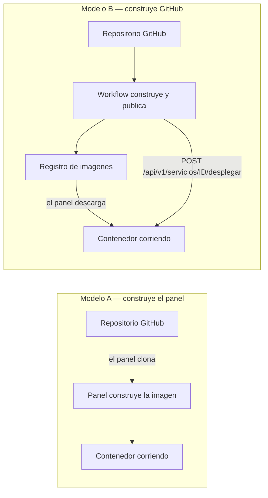

# Caso de estudio — Alta de un servicio desde un repositorio remoto

**Documento:** `Caso-De-Estudio-Repositorio-Desde-Repositorio.md`
**Versión:** 1.0
**Fecha:** 2026-07-31
**Estado:** Emitido
**Profile aplicado:** `Study-Guide-Documentation`, con `RuleSet-Study-Guide`
**Producto evaluado:** SelfHosted Service, especificación en `DEV/SelfHosted.Service.Core/SDD/`
**Caso evaluado:** publicar `https://github.com/UTN-FRP-TUP-Aplicada-2025/SAI.Service.Core` como servicio administrado
**Naturaleza:** evaluación del modelo y de la maqueta contra un caso práctico real. No es especificación del producto y ninguna categoría de `SDD/Docs/` lo consume como insumo.

---

## Tabla de contenido

- [1. Qué es este documento y cómo leerlo](#1-qué-es-este-documento-y-cómo-leerlo)
- [2. Marco de referencia](#2-marco-de-referencia)
- [3. El resultado, primero](#3-el-resultado-primero)
- [4. Los dos modelos de construcción, que el caso mezcla](#4-los-dos-modelos-de-construcción-que-el-caso-mezcla)
- [5. Respuesta 1 — Qué pasos seguir y qué campos llenar](#5-respuesta-1--qué-pasos-seguir-y-qué-campos-llenar)
- [6. Respuesta 2 — Si hay que construir un workflow](#6-respuesta-2--si-hay-que-construir-un-workflow)
- [7. Respuesta 3 — Cómo se aplica el caso dado](#7-respuesta-3--cómo-se-aplica-el-caso-dado)
- [8. Los cinco bloqueos, con su evidencia](#8-los-cinco-bloqueos-con-su-evidencia)
- [9. Qué le falta al modelo, y qué no](#9-qué-le-falta-al-modelo-y-qué-no)
- [10. Preguntas guía](#10-preguntas-guía)
- [11. Criterios de calidad de un alta bien hecha](#11-criterios-de-calidad-de-un-alta-bien-hecha)
- [12. Anexo A — Plantilla comentada del alta por repositorio](#12-anexo-a--plantilla-comentada-del-alta-por-repositorio)
- [13. Anexo B — Lista de verificación previa](#13-anexo-b--lista-de-verificación-previa)
- [14. Observaciones](#14-observaciones)
- [15. Registro de evidencias](#15-registro-de-evidencias)

---

## 1. Qué es este documento y cómo leerlo

Este documento toma un caso real —publicar un servicio web .NET que hoy vive en un repositorio de GitHub— y lo recorre contra el modelo de SelfHosted Service, para responder tres preguntas: qué pasos y qué campos exige el alta, si hace falta construir un workflow, y cómo se aplicaría concretamente el caso.

Se escribe antes de aprobar la maqueta de la Fase B2, y ese momento importa: lo que un caso práctico destape acá todavía se puede corregir en la especificación sin costo de código.

**Cómo leerlo.** La sección 3 da el resultado. La 4 explica la bifurcación de fondo, que es lo que el caso no tenía resuelto y sin lo cual las tres respuestas no se entienden. Las secciones 5, 6 y 7 responden una pregunta del prompt cada una. La 8 concentra los bloqueos con su evidencia, y de ahí en adelante el material es formativo: preguntas guía, criterios de calidad y plantillas.

**Una desviación declarada respecto del Profile.** `Study-Guide-Documentation` produce un cuerpo documental navegable desde un README, con un documento por unidad temática. El prompt pide volcar el resultado en **un** archivo, y esa instrucción prevalece por `Rule-All` («limitar la ejecución al alcance solicitado»). Se conserva la estructura interna que el Profile exige —marco de referencia, ejemplos concretos, preguntas guía, criterios de calidad y anexos— dentro de un documento único.

---

## 2. Marco de referencia

Los tres ejes del Profile, instanciados para este dominio. El resto del documento los referencia y no los vuelve a definir.

### 2.1 Actores

| Actor | Qué decide | Qué no decide |
|---|---|---|
| **Administrador del panel** | Da de alta el servicio, elige la vía, completa el origen, la red, los puertos y los recursos, y aplica los cambios | El contenido del repositorio, y si existe o no un archivo de construcción |
| **Autor del repositorio** | Qué hay en el repositorio: código, archivo de construcción, workflow de integración continua | Cómo se despliega en el servidor autoalojado |
| **Automatismo de integración continua** | Cuándo se construye y, si tiene credencial de máquina, cuándo se dispara el despliegue | Nada de la configuración del servicio: sólo puede pedir un despliegue |
| **Motor de contenedores** | Ejecuta lo que el panel le pide | Nada: el panel decide y él obedece |

En este caso las tres primeras figuras son la misma persona, y eso oculta una frontera real: el panel no puede arreglar lo que falta del lado del repositorio, aunque sea el mismo humano el que lo escriba.

### 2.2 Escenarios

| Escenario | Definición | ¿Es el del caso? |
|---|---|---|
| **E1 · Adopción** | El contenedor ya corre en el servidor y se lo incorpora al panel | No |
| **E2 · Alta desde imagen publicada** | La imagen ya existe en un registro y el panel sólo la descarga y la corre | No, y en la sección 4 se discute por qué podría convenir |
| **E3 · Alta desde repositorio** | El panel clona, construye la imagen y la corre | **Sí, es el que el caso plantea** |
| **E4 · Despliegue disparado desde afuera** | Un automatismo externo pide el despliegue por la API | **Sí, el caso lo plantea también**, y por eso hay dos escenarios y no uno |

### 2.3 Contextos

| Contexto | Qué cambia |
|---|---|
| **C1 · Repositorio público o privado** | Si hace falta credencial para clonar |
| **C2 · Red bridge o macvlan** | Si el servicio se alcanza por un puerto del host o por una dirección propia en la red local |
| **C3 · Quién construye la imagen** | Determina la variante de origen y si hace falta workflow. Es la bifurcación de la sección 4 |
| **C4 · Alcance de entrega vigente** | El producto se entrega por alcances, y no todas las capacidades del caso pertenecen al primero |

---

## 3. El resultado, primero

**El caso, tal como está enunciado, no se puede ejecutar de punta a punta hoy.** Hay cinco bloqueos, y sólo uno es del producto: los otros cuatro son datos que faltan o decisiones que nadie tomó.

| # | Bloqueo | Naturaleza | Dónde se resuelve |
|---|---|---|---|
| B1 | `SAI.Service.Core` **no tiene archivo de construcción**, y la variante `repositorio` lo exige | Hecho verificado del repositorio | En el repositorio, agregando un `Dockerfile` |
| B2 | La dirección pedida, `192.168.1.120`, **está fuera del rango gestionado** `192.168.1.128/26` | Hecho verificado de la especificación | Eligiendo una dirección del rango, o cambiando el rango |
| B3 | El caso mezcla **dos modelos de construcción mutuamente alternativos**: que construya el panel y que construya GitHub | Ambigüedad del caso | Decidiendo cuál, con la tabla de la sección 4 |
| B4 | El disparo automático del origen repositorio **no está decidido** (`Q-5`) | Decisión abierta del producto | Agente humano del proyecto |
| B5 | La credencial que el panel usa para llegar al repositorio **no tiene superficie donde darse de alta** | Hueco de la especificación | `03-UX-UI-DX` |

Lo que sí funciona sin fricción: el nombre, los recursos —1 GB de memoria y dos procesadores son expresables tal cual—, el puerto 8080, la política de reinicio y el modelo de estados del servicio. El modelo del producto cubre el caso; lo que el caso destapa son huecos de borde, no de centro.

**Interpretación, declarada como tal:** que un caso real de veinte líneas destape cinco bloqueos no es señal de que el modelo esté mal. Cuatro de los cinco son exactamente lo que la Fase B2 existe para encontrar, y encontrarlos antes de codificar es el resultado buscado.

---

## 4. Los dos modelos de construcción, que el caso mezcla

Esta es la sección que hay que entender antes de las tres respuestas.

El caso dice dos cosas que no conviven. Primero elige la tarjeta **Repositorio remoto**, cuyo texto en la maqueta es «Tengo el código en un repositorio y quiero que el panel construya». Después dice: «necesito dar de alta las credenciales, un token en github, para cuando se corra el workflow desde github action lance la llamada para el deploy».

Son dos arquitecturas distintas y hay que elegir una.



| Eje | Modelo A · construye el panel | Modelo B · construye GitHub |
|---|---|---|
| Variante de origen | `repositorio` | `imagen-privada` (o `imagen-publica`) |
| Qué exige del repositorio | Un archivo de construcción versionado | Un workflow que construya y publique |
| Quién necesita credencial | El **panel**, para clonar si el repositorio es privado | El **workflow**, para publicar; y una credencial de máquina para llamar al panel |
| ¿Hace falta workflow? | **No** para construir | **Sí**, es el corazón del modelo |
| Carga sobre el servidor | Construye el servidor autoalojado | El servidor sólo descarga y corre |
| Estado en el producto | Vía declarada; su **disparo automático está abierto** (`Q-5`) | `F-16`, prioridad **Could Have** |

**Cuál corresponde al caso.** La frase «para cuando se corra el workflow desde github action lance la llamada para el deploy» es literalmente el Modelo B: el endpoint que E-13 declara recibe `etiquetaImagen`, o sea el nombre de una imagen **ya construida y publicada**. Un workflow que llama a ese endpoint está diciendo «ya publiqué la versión 1.4.3, andá a buscarla». Eso presupone que la imagen existe, y por lo tanto que alguien la construyó: GitHub.

En el Modelo A el workflow no hace falta para construir, porque construye el panel. Podría existir un workflow que le avise al panel «hay commit nuevo, reconstruí», pero **eso es justamente lo que `Q-5` deja abierto** y hoy no está especificado.

**Recomendación, declarada como criterio propio y no como evidencia.** Para este caso conviene el **Modelo B**, por dos razones verificables: el repositorio ya tiene un workflow de integración continua que compila y prueba en .NET 10, de modo que agregarle la construcción y publicación de la imagen es extender algo que existe; y construir .NET en el servidor autoalojado carga al servidor de referencia con un trabajo que el ejecutor de GitHub ya hace gratis. La contra es de prioridad: `F-16` es Could Have y `F-15` —los tokens de API que el workflow necesita— es Should Have, así que el Modelo B **depende de capacidades que no están en el primer alcance**.

---

## 5. Respuesta 1 — Qué pasos seguir y qué campos llenar

El recorrido del alta tiene cinco pasos, según el indicador de avance de la superficie `SUP-17`: **Nombre · Origen · Red · Puertos · Dimensiones**. Se puede guardar en cualquier punto: lo que queda a medias es un borrador, no un error.

### 5.1 Paso 1 — Nombre

| Campo | Valor para el caso | Regla |
|---|---|---|
| Nombre del servicio | `sai-service` | `RN-01`, unicidad y formato. Es el alias DNS con el que otros servicios del proyecto lo van a alcanzar |

Si se guarda acá y nada más, el servicio queda como **nodo en estado borrador** en el lienzo: visible, no desplegable y fuera del conjunto de cambios pendientes. Es la vía «Servicio sin origen», que no es una vía con mecánica propia sino el alta detenida en este paso.

### 5.2 Paso 2 — Origen, variante `repositorio`

Los campos que `RN-08` declara obligatorios para esta variante, y ninguno de otra:

| Campo | Obligatorio | Valor para el caso | Observación |
|---|---|---|---|
| `proveedor` | Sí | `github` | El único valor que la especificación instancia. **No está declarado si el conjunto admite otros** |
| `url` | Sí | `https://github.com/UTN-FRP-TUP-Aplicada-2025/SAI.Service.Core` | Verificado como remoto real del repositorio local |
| `rama` | Sí | `main` | Es la rama que el workflow existente vigila |
| `rutaDockerfile` | Sí | **No existe** | Bloqueo B1 |
| `contextoBuild` | Sí | `.` | Relativa al repositorio |
| `argumentosBuild` | No | `CONFIGURATION=Release` | Sin expresiones de referencia |
| `credencialRepositorioId` | Si el repositorio es privado | Sin superficie de alta | Bloqueo B5 |
| `reconstruirEnDespliegue` | — | `true` para el Modelo A | Es lo que hace que cada despliegue reconstruya |

Un campo de otra variante —por ejemplo `etiqueta`, que pertenece a las variantes de imagen— **es dato inválido y no campo opcional vacío**: la API responde `422` señalándolo.

**Verificación del origen.** Es una operación propia, distinta de validar la configuración, y su informe declara su propio alcance. Para esta variante comprueba que el repositorio y la rama sean alcanzables y que la ruta del archivo de construcción exista en esa rama, devolviendo el último commit. No bloquea guardar; sí bloquea pasar el servicio a pendiente de aplicar.

### 5.3 Paso 3 — Red

Acá el caso obliga a elegir, y la elección cambia el paso siguiente.

| Modo | Qué significa | Consecuencia sobre los puertos |
|---|---|---|
| `bridge` | El contenedor vive detrás del host; se lo alcanza por un puerto del host | Se publican puertos |
| `macvlan` | El contenedor tiene **dirección propia en la red local**, como si fuera otra máquina | **No se publican puertos** (`RN-07`): el campo aparece deshabilitado |

Pedir «que funcione con la IP local 192.168.1.120» describe `macvlan`. Y ahí aparece el bloqueo B2: `RN-06` exige que toda dirección fija pertenezca al rango gestionado y no esté excluida. El rango declarado es `192.168.1.128/26`, de `192.168.1.129` a `192.168.1.190`, con `192.168.1.129` excluida. **`192.168.1.120` queda fuera.**

No es una interpretación: la especificación usa exactamente esa dirección como su ejemplo de rechazo. El caso de prueba `T-08` declara «Dirección `192.168.1.120`, fuera del rango gestionado `192.168.1.128/26` → Rechazado `422`, con `192.168.1.141` sugerida como siguiente libre».

| Campo | Valor para el caso | Observación |
|---|---|---|
| `modo` | `macvlan` | Derivado de que se pide dirección propia |
| `ipFija` | `192.168.1.141` en lugar de `.120` | La siguiente libre, según la propia especificación |
| `aliasDns` | `sai-service` | |
| `interfazPadre` | `enp1s0` | La declarada en el rango gestionado |

La alternativa es cambiar el rango gestionado desde la superficie de configuración del sistema, que es donde vive. Es una decisión de infraestructura de red, no del servicio: mover el rango afecta a todos los servicios y exige que el rango nuevo también esté excluido del que reparte el servidor DHCP.

### 5.4 Paso 4 — Puertos

Con `macvlan` este paso **no se completa**: el campo está deshabilitado y el servicio se alcanza en `http://192.168.1.141:8080`, porque el contenedor tiene su propia dirección y expone su puerto directamente.

Con `bridge` se publica: contenedor `8080` → host `8080`, protocolo `tcp`. Ahí rige `RN-38`: un puerto del host no puede estar publicado por más de un servicio, y el sistema lo rechaza con `422` antes de que el motor falle, sugiriendo el próximo puerto libre.

### 5.5 Paso 5 — Dimensiones

| Campo | Valor para el caso | Verificado |
|---|---|---|
| `recursos.limiteMemoriaMb` | `1024` | El modelo declara el campo en mebibytes |
| `recursos.reservaMemoriaMb` | A definir | El modelo lo tiene; el caso no lo menciona |
| `recursos.limiteCpus` | `2.0` | El modelo lo declara como decimal |
| `politicaReinicio` | `unless-stopped` | Valor usado en todos los ejemplos de la especificación |
| `variables` | Las que el servicio necesite | Admiten referencias a variables de otros servicios del proyecto |
| `montajes` | Los que el servicio necesite | El caso no los menciona |
| `healthcheck` | `heredado-de-la-imagen` | |

Los tres valores que el caso pide —1 GB, dos procesadores, puerto 8080— **son expresables sin fricción**. Es el tramo del caso que el modelo cubre mejor.

### 5.6 Qué pasa al terminar

El alta **no despliega**, y la intuición del caso es correcta. El servicio queda en estado `pendiente-de-aplicar`, dentro del conjunto de cambios pendientes del proyecto, y se aplica en lote desde el cajón de cambios. Los tres estados del servicio —`borrador`, `pendiente-de-aplicar`, `aplicado`— son **ortogonales** al estado del despliegue: un servicio aplicado puede tener su último despliegue fallido.

---

## 6. Respuesta 2 — Si hay que construir un workflow

**Depende del modelo, y la respuesta corta es: en el Modelo A no, en el Modelo B sí.**

### 6.1 Lo que el repositorio ya tiene

`SAI.Service.Core` tiene un workflow, `.github/workflows/ci.yml`, que se dispara con push y pull request sobre `main` y ejecuta restore, verificación de formato, build en Release y tests, sobre .NET 10 y `ubuntu-latest`. Su propio comentario de cabecera declara que cubre las etapas 1 a 4 del pipeline y que **«los stages 5 a 10 (e2e, SCA, SBOM, imagen, firma, publicacion) se agregan en etapas posteriores»**.

O sea: hoy ese workflow **no construye ni publica imagen**. Compila y prueba.

### 6.2 Qué habría que agregarle en el Modelo B

Tres cosas, en este orden:

1. **Un archivo de construcción en el repositorio.** Sin esto no hay imagen que construir, ni en GitHub ni en el panel. Es el bloqueo B1 y es común a los dos modelos.
2. **Un paso de construcción y publicación** en el workflow, que suba la imagen a un registro alcanzable desde el servidor autoalojado.
3. **Una llamada al endpoint de despliegue** del panel, al terminar la publicación.

El contrato de esa llamada está declarado y es cerrado:

```http
POST /api/v1/servicios/{id}/desplegar
Authorization: Bearer <credencial de máquina>
Content-Type: application/json

{
  "etiquetaImagen": "1.4.3",
  "esperarActivo": true,
  "tiempoLimiteSegundos": 180,
  "mensaje": "Despliegue automatico desde workflow ci 482"
}
```

Con su tabla de comportamiento: `202` si se acepta, `200` si se pidió esperar y el servicio quedó activo, `504` si se superó el tiempo límite —devolviendo el último estado conocido y las últimas líneas del registro—, `422` si la imagen no existe en el registro, `403` si el token no tiene el ámbito, y `409` si hay conflicto de dirección al recrear.

### 6.3 Las dos credenciales, que no son la misma

El caso dice «dar de alta las credenciales, un token en github». Hay **dos** credenciales distintas y conviene no confundirlas, porque viven en lugares distintos y una de ellas no tiene dónde darse de alta:

| Credencial | Dirección | Dónde vive | Estado |
|---|---|---|---|
| **De máquina** | El workflow llama al panel | Superficie de configuración del sistema, con ámbito `despliegues:ejecutar`, vigencia y revocación | Especificada. Se muestra **una única vez** al emitirla |
| **De repositorio** | El panel clona el repositorio | `credencialRepositorioId` en el origen | **Sin superficie de alta.** Bloqueo B5 |

La primera es la que el Modelo B necesita, y está bien resuelta: la superficie de configuración del sistema emite, lista y revoca, muestra prefijo, ámbitos, vigencia y último uso, y **nunca el valor**.

La segunda es la que el Modelo A necesita si el repositorio es privado, y es el hueco: ninguna superficie declara dónde se dan de alta las credenciales de registro ni las de repositorio. La especificación las declara como entidades distintas entre sí y distintas de las credenciales de máquina, pero no dice dónde se crean.

**No verificado:** si `SAI.Service.Core` es público o privado. Se puede comprobar abriendo la URL sin sesión. Si es público, el Modelo A no necesita credencial de repositorio y B5 deja de bloquear este caso concreto, sin dejar de ser un hueco del producto.

### 6.4 La prioridad, que conviene mirar antes de planificar

| Capacidad | Prioridad declarada |
|---|---|
| `F-15` · Tokens de API con ámbitos, vigencia y revocación, emitidos desde la interfaz | **Should Have** |
| `F-16` · Disparo de despliegue desde un workflow de GitHub Actions con token de ámbito mínimo | **Could Have** |

Las dos son el Modelo B, y ninguna es Must. El despliegue automatizado desde GitHub es de los últimos tramos del producto, no del primero.

---

## 7. Respuesta 3 — Cómo se aplica el caso dado

Bajo el Modelo A, que es la vía que el caso eligió al hacer click en la tarjeta, el recorrido completo queda así:

| # | Paso | Estado para este caso |
|---|---|---|
| 1 | Crear un proyecto, o abrir uno existente | Sin obstáculo |
| 2 | En el lienzo, alta de servicio, vía **Repositorio remoto** | Sin obstáculo |
| 3 | Nombre: `sai-service` | Sin obstáculo |
| 4 | Origen: URL, rama `main`, ruta del archivo de construcción, contexto `.` | **Bloqueado por B1**: el repositorio no tiene archivo de construcción |
| 5 | Verificar el origen | No se puede hasta resolver 4 |
| 6 | Red: `macvlan`, dirección fija, interfaz padre `enp1s0` | **Bloqueado por B2** con `192.168.1.120`; se destraba con `192.168.1.141` |
| 7 | Puertos | No aplica en `macvlan`; el servicio queda en `192.168.1.141:8080` |
| 8 | Dimensiones: 1024 MB, 2.0 CPUs, reinicio `unless-stopped` | Sin obstáculo |
| 9 | Validar la configuración | Distinta de verificar el origen, y con su propio informe |
| 10 | Guardar y dejar pendiente de aplicar | Exige las dos verificaciones en verde |
| 11 | Aplicar el conjunto de cambios del proyecto | Acá recién se despliega |
| 12 | Automatizar el despliegue desde GitHub | Modelo B; ver sección 6 |

### 7.1 Lo mínimo para que el caso corra hoy

Tres cambios, y ninguno es del panel:

1. **Agregar un `Dockerfile` al repositorio** `SAI.Service.Core`, con su contexto de construcción. Sin esto no hay camino, ni por repositorio ni por imagen.
2. **Usar una dirección del rango gestionado**, `192.168.1.141` según la sugerencia que la propia especificación emite, o correr el servicio en `bridge` publicando el puerto 8080.
3. **Aceptar que el despliegue es manual** en este alcance: el alta deja el servicio pendiente de aplicar y el humano aplica el conjunto de cambios.

### 7.2 Por qué la variante «archivo de construcción en línea» no sirve acá

Podría parecer que, sin `Dockerfile` en el repositorio, alcanza con pegar su contenido en la variante `dockerfile`. No alcanza, y el motivo está declarado: esa variante lleva **el contenido del archivo de construcción y no una ruta**, y tiene un límite técnico declarado —sin contexto de construcción no puede copiar archivos locales—. Un servicio .NET que se compila desde su código fuente necesita justamente eso: copiar el código al contexto. La variante sirve para ajustar una imagen ya publicada, que es lo que su propio texto de tarjeta dice: «Quiero tomar una imagen publicada y ajustarla».

---

## 8. Los cinco bloqueos, con su evidencia

| # | Afirmación | Evidencia | Tipo |
|---|---|---|---|
| B1 | El repositorio no tiene archivo de construcción | `find . -iname "Dockerfile*"` sobre `DEV/SAI.Service.Core`: sin resultados. `find . -iname "*compose*"`: sin resultados | Hecho verificado |
| B1 | La variante `repositorio` exige la ruta del archivo de construcción | `RN-08` reformulada: «`repositorio`: URL, rama y **ruta del archivo de construcción** …, más el contexto de construcción» | Hecho verificado |
| B2 | `192.168.1.120` está fuera del rango gestionado | Rango declarado en E-8: subred `192.168.1.128/26`, desde `192.168.1.129` hasta `192.168.1.190`, con `192.168.1.129` excluida | Hecho verificado |
| B2 | La especificación ya usa esa dirección como ejemplo de rechazo | Caso de prueba `T-08`: «Dirección `192.168.1.120`, fuera del rango gestionado `192.168.1.128/26` → Rechazado `422`, con `192.168.1.141` sugerida» | Hecho verificado |
| B3 | El endpoint de despliegue recibe una etiqueta de imagen ya publicada | E-13, cuerpo de la petición: `"etiquetaImagen": "1.4.3"` | Hecho verificado |
| B3 | La tarjeta de la vía declara que construye el panel | Texto de la tarjeta en la maqueta: «Tengo el código en un repositorio y quiero que el panel construya» | Hecho verificado |
| B4 | El disparo automático del origen repositorio no está decidido | Pendiente `Q-5`: «Si el **disparo automático del origen repositorio** es por ejecutor autoalojado, por consulta periódica, o siempre manual». Abierta, destinatario el agente humano | Hecho verificado |
| B5 | La credencial de repositorio no tiene superficie de alta | La superficie de configuración del sistema gobierna **credenciales de máquina**, que son otra entidad. Ninguna de las diecinueve superficies declara el alta de credenciales de registro ni de repositorio | Hecho verificado |
| — | El workflow existente no construye ni publica imagen | `.github/workflows/ci.yml`: pasos restore, format, build y test. Comentario de cabecera: «los stages 5 a 10 (e2e, SCA, SBOM, imagen, firma, publicacion) se agregan en etapas posteriores» | Hecho verificado |

---

## 9. Qué le falta al modelo, y qué no

Esta sección es la devolución a la especificación, que es para lo que el caso se corrió.

### 9.1 Lo que el caso confirma que está bien

- **La separación de vía y origen se sostiene ante un caso real.** El caso eligió una vía y el modelo supo decir exactamente qué campos exigía y cuáles rechazaba.
- **Las dos verificaciones separadas prueban su valor acá.** Verificar que el repositorio y la rama existen es una consulta a un sistema externo; validar que el puerto no colisione es una consulta al modelo propio. Tratarlas como una sola habría dado un informe que no se entiende.
- **La regla de la dirección atrapó el error antes de que el motor fallara**, que es exactamente lo que el producto se propone.
- **Los recursos, el puerto y la política de reinicio se expresan sin fricción.**

### 9.2 Lo que el caso destapa

| # | Hallazgo | Destinatario propuesto |
|---|---|---|
| H1 | **La credencial de repositorio y la de registro no tienen superficie de alta.** El modelo las declara como entidades distintas y ninguna superficie las administra | `03-UX-UI-DX` |
| H2 | **El conjunto de valores de `proveedor` no está declarado.** La especificación instancia `github` como literal, no como enumeración. Un selector de un valor y un campo cerrado son decisiones distintas | Es la pendiente `Q-7`, abierta |
| H3 | **No hay un camino declarado del repositorio a la imagen publicada.** El producto modela «el panel construye» y «la imagen ya existe», y no modela el caso intermedio, que es el más común en un equipo con integración continua: GitHub construye, publica, y avisa | Agente humano; luego `05-Arquitectura-Tecnica` |
| H4 | **El caso más natural del producto depende de dos capacidades no-Must.** Un servidor autoalojado con repositorios en GitHub es el escenario típico del producto, y su automatización es Should y Could | Agente humano, al revisar la prioridad de `F-15` y `F-16` |
| H5 | **La tarjeta de la vía «Repositorio remoto» promete que el panel construye, y `Q-5` deja abierto cuándo.** El texto es una afirmación de producto sobre algo que no está decidido | `03-UX-UI-DX` y agente humano |

**Interpretación, declarada como tal:** H3 es el hallazgo de fondo. Los otros cuatro son huecos puntuales; H3 es un modelo que no contempla el flujo más frecuente del dominio que dice servir. No es un defecto de la especificación escrita —es coherente consigo misma— sino del recorte del problema.

---

## 10. Preguntas guía

Las que hay que poder responder para dar de alta un servicio desde un repositorio y para evaluar si un alta está bien hecha:

1. ¿Quién construye la imagen: el panel o el repositorio? Todo lo demás se deriva de esta respuesta.
2. ¿El repositorio tiene archivo de construcción versionado? Si no, ninguna de las dos vías funciona.
3. ¿El repositorio es público o privado? Determina si hace falta credencial y cuál.
4. ¿El servicio necesita dirección propia en la red, o alcanza con un puerto del host? Determina el modo de red y si el paso de puertos existe.
5. Si necesita dirección propia, ¿la que quiero está dentro del rango gestionado y no excluida?
6. ¿El puerto del host que quiero publicar ya lo publica otro servicio, o algún contenedor del parque no adoptado?
7. ¿Qué se despliega cuando aplico: la última versión de la rama, o una etiqueta fija? ¿Quién decide cuándo se reconstruye?
8. Si automatizo el despliegue, ¿qué ámbito mínimo necesita la credencial de máquina, y dónde queda registrado su último uso?

---

## 11. Criterios de calidad de un alta bien hecha

| Criterio | Cómo se reconoce |
|---|---|
| **El origen es de una sola variante** | No hay campos de otra variante completados. Un campo ajeno es dato inválido, no campo vacío |
| **Las dos verificaciones están en verde y son recientes** | Cada informe declara su propio alcance y su momento. Un tilde sin decir qué se consultó no es evidencia |
| **La dirección o el puerto están comprobados contra el resto del parque** | La comprobación incluye lo que el panel no administra: el parque preexistente también ocupa puertos |
| **El servicio declara sus límites de recursos** | Un servicio sin límite de memoria en un servidor de referencia es el modo de falla más barato de evitar |
| **La reconstrucción es una decisión declarada, no un efecto** | Que cada despliegue reconstruya o no está en el modelo; conviene que esté decidido y no heredado del ejemplo |
| **Se sabe qué versión corre** | Con el digesto registrado por despliegue, «volver a la versión anterior» es una operación posible |

---

## 12. Anexo A — Plantilla comentada del alta por repositorio

```jsonc
{
  "nombre": "sai-service",              // RN-01: unico en el proyecto; es el alias DNS
  "estado": "borrador",                 // borrador -> pendiente-de-aplicar -> aplicado
  "origen": {
    "tipo": "repositorio",              // fija que campos son validos y cuales ajenos
    "proveedor": "github",              // unico valor instanciado por la especificacion (Q-7 abierta)
    "url": "https://github.com/UTN-FRP-TUP-Aplicada-2025/SAI.Service.Core",
    "rama": "main",
    "rutaDockerfile": "<FALTA>",        // B1: no existe en el repositorio
    "contextoBuild": ".",
    "argumentosBuild": { "CONFIGURATION": "Release" },
    "credencialRepositorioId": null,    // B5: sin superficie de alta; null si el repo es publico
    "reconstruirEnDespliegue": true     // cada despliegue reconstruye desde la rama
  },
  "comando": null,                      // null hereda el de la imagen
  "red": {
    "modo": "macvlan",                  // direccion propia en la LAN
    "aliasDns": "sai-service",
    "ipFija": "192.168.1.141",          // B2: .120 esta fuera del rango 192.168.1.128/26
    "interfazPadre": "enp1s0"
  },
  "puertos": [],                        // RN-07: en macvlan no se publican puertos
  "recursos": {
    "limiteMemoriaMb": 1024,            // 1 GB
    "reservaMemoriaMb": 256,
    "limiteCpus": 2.0                   // dos procesadores
  },
  "politicaReinicio": "unless-stopped",
  "autoArranque": true,
  "healthcheck": { "modo": "heredado-de-la-imagen", "comando": null, "intervaloSegundos": 30 },
  "disparoExterno": null                // Modelo B: se habilita con credencial de maquina
}
```

Variante `bridge`, si se prefiere no dar dirección propia:

```jsonc
  "red": { "modo": "bridge", "aliasDns": "sai-service", "ipFija": null, "interfazPadre": null },
  "puertos": [ { "contenedor": 8080, "host": 8080, "protocolo": "tcp", "publicar": true } ]
  // RN-38: el puerto 8080 del host no puede estar publicado por otro servicio
```

---

## 13. Anexo B — Lista de verificación previa

Antes de empezar el alta:

- [ ] El repositorio tiene archivo de construcción, y su ruta relativa está identificada
- [ ] Está decidido quién construye: el panel o el repositorio
- [ ] Si el repositorio es privado, hay una credencial disponible y un lugar donde declararla
- [ ] La dirección fija pretendida está dentro del rango gestionado y no excluida
- [ ] El rango gestionado está excluido del que reparte el servidor DHCP de la red
- [ ] El puerto del host pretendido no lo publica otro servicio ni un contenedor del parque
- [ ] Están definidos los límites de memoria y de procesadores
- [ ] Está decidido si cada despliegue reconstruye
- [ ] Si se automatiza: existe la credencial de máquina con el ámbito `despliegues:ejecutar`

---

## 14. Observaciones

Separadas en hechos e interpretaciones, según `Rule-Evidences`.

### 14.1 Hechos

1. `SAI.Service.Core` no contiene ningún archivo de construcción ni de composición.
2. Su workflow de integración continua compila y prueba, y declara por escrito que la construcción y publicación de imagen quedan para etapas posteriores.
3. `192.168.1.120` está fuera del rango gestionado que la especificación declara, y esa dirección exacta figura en la especificación como ejemplo de rechazo.
4. El endpoint de despliegue recibe una etiqueta de imagen ya publicada.
5. Ninguna de las diecinueve superficies especificadas administra credenciales de registro ni de repositorio.
6. `F-15` es Should Have y `F-16` es Could Have.
7. La pendiente `Q-5` está abierta y sin valor supuesto.

### 14.2 Interpretaciones

1. El caso mezcla dos modelos de construcción. Es una ambigüedad del enunciado, no un defecto del producto.
2. Para este caso conviene el Modelo B, por reutilizar el workflow existente y no cargar al servidor con la construcción. Es criterio propio, no evidencia.
3. El hallazgo de fondo es H3: el producto no modela el camino intermedio entre «el panel construye» y «la imagen ya existe», que es el más frecuente en un equipo con integración continua.
4. Que un caso de veinte líneas destape cinco bloqueos, cuatro de ellos ajenos al producto, es un resultado esperable y útil de esta evaluación.

### 14.3 No verificado

1. Si el repositorio es público o privado. Se comprueba abriendo su URL sin sesión.
2. Si el registro de imágenes que usaría el Modelo B está definido y es alcanzable desde el servidor de referencia.
3. Si el servidor de referencia tiene la interfaz `enp1s0` disponible para macvlan. La especificación la declara; no se verificó contra el servidor.
4. La capacidad de disco del servidor de referencia, que ninguna fuente declara.

---

## 15. Registro de evidencias

| # | Fuente | Qué se verificó |
|---|---|---|
| E1 | `find . -iname "Dockerfile*"` y `find . -iname "*compose*"` sobre `DEV/SAI.Service.Core` | Sin resultados en ambos |
| E2 | `git remote get-url origin` en `DEV/SAI.Service.Core` | `https://github.com/UTN-FRP-TUP-Aplicada-2025/SAI.Service.Core.git` |
| E3 | `DEV/SAI.Service.Core/.github/workflows/ci.yml` | Pasos y comentario sobre las etapas 5 a 10 |
| E4 | `DEV/SAI.Service.Core/src/` | Cinco proyectos: Api, Application, Domain, Infrastructure, Web |
| E5 | `PRODUCT-INTAKE-SelfHosted-Service.md` v3.3, anexo E-16, `RN-06`, `RN-07`, `RN-08`, `RN-38` | Reglas de dirección, puertos y datos obligatorios por variante |
| E6 | Íd., anexo E-8 | Rango gestionado `192.168.1.128/26`, exclusiones y reservas |
| E7 | Íd., anexo E-22, caso `T-08` | `192.168.1.120` como ejemplo de rechazo, con `.141` sugerida |
| E8 | Íd., anexo E-2 | Modelo del servicio: origen por variante, red, puertos, recursos, disparo externo |
| E9 | Íd., anexo E-13 | Contrato del endpoint de despliegue y su tabla de comportamiento |
| E10 | Íd., §4, capacidades `F-11` a `F-16` | Prioridades MoSCoW |
| E11 | Íd., §19, pendientes `Q-5` y `Q-7` | Estado abierto |
| E12 | `SDD/Docs/03-UX-UI-DX/Wireframes/Wireframes-Configuracion-Del-Sistema.md` | La sección de credenciales gobierna credenciales de máquina |
| E13 | `SDD/Maquetas/SelfHosted-Service/assets/js/Datos-Maqueta.js` | Textos de las tarjetas de las siete vías |

---

## Control de cambios

| Versión | Fecha | Cambios | Autor |
|---|---|---|---|
| 1.0 | 2026-07-31 | Emisión inicial. Evaluación del modelo y de la maqueta de SelfHosted Service contra el caso de publicar `SAI.Service.Core` desde su repositorio. Responde las tres preguntas del prompt, declara cinco bloqueos con su evidencia y eleva cinco hallazgos a la especificación. | Agente de análisis |
