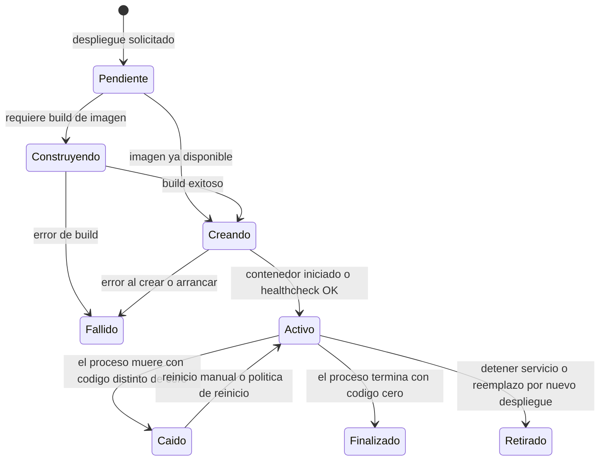
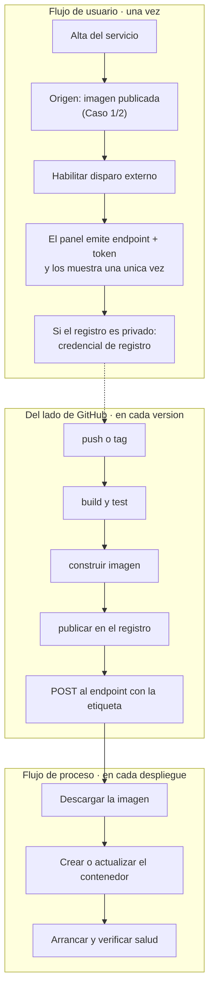

# Casos de estudio redefinidos — Entrada para el orquestador SDD

**Documento:** `Casos-Estudios-Re-Definidos.md`
**Versión:** 2.7
**Fecha:** 2026-07-31
**Estado:** Emitido — pendiente de reintroducción en el flujo del orquestador
**Profile aplicado:** `Study-Guide-Documentation`, con `RuleSet-Study-Guide`
**Producto:** SelfHosted Service · especificación en `DEV/SelfHosted.Service.Core/SDD/`
**Naturaleza:** documento de trabajo del agente humano del proyecto. **No es especificación.** Es la entrada que se reintroduce en el orquestador para redefinir flujos de usuario, modelos de datos y ejemplos, y para replantear la maqueta.
**Precede a:** la aprobación de la maqueta de la Fase B2, que sigue abierta.

---

## Tabla de contenido

- [1. Qué cambia respecto de la versión 1.0](#1-qué-cambia-respecto-de-la-versión-10)
- [2. La corrección de fondo: son tres ejes, no dos](#2-la-corrección-de-fondo-son-tres-ejes-no-dos)
- [3. El hallazgo principal: el modelo ya soporta el Caso 3](#3-el-hallazgo-principal-el-modelo-ya-soporta-el-caso-3)
- [4. Flujo de usuario y flujo de proceso](#4-flujo-de-usuario-y-flujo-de-proceso)
- [5. Caso 1/2 — Alta desde una imagen publicada](#5-caso-12--alta-desde-una-imagen-publicada)
- [6. Caso 3 — Servicio preparado para despliegue externo](#6-caso-3--servicio-preparado-para-despliegue-externo)
- [7. Caso 4 — Adoptar lo que ya corre en el servidor](#7-caso-4--adoptar-lo-que-ya-corre-en-el-servidor)
- [8. El flujo de proceso de despliegue y sus tres disparadores](#8-el-flujo-de-proceso-de-despliegue-y-sus-tres-disparadores)
- [9. Orquestación del proyecto y coherencia del conjunto](#9-orquestación-del-proyecto-y-coherencia-del-conjunto)
- [10. Qué pasa con «Repositorio remoto»](#10-qué-pasa-con-repositorio-remoto)
- [11. Redefiniciones a aplicar en el SDD](#11-redefiniciones-a-aplicar-en-el-sdd)
- [12. Decisiones pendientes](#12-decisiones-pendientes)
- [13. Anexo A — Workflow de ejemplo](#13-anexo-a--workflow-de-ejemplo)
- [14. Anexo B — Archivo de construcción de ejemplo](#14-anexo-b--archivo-de-construcción-de-ejemplo)
- [15. Anexo C — Los tres servicios de ejemplo, completos](#15-anexo-c--los-tres-servicios-de-ejemplo-completos)
- [16. Anexo D — Plantilla para el próximo caso](#16-anexo-d--plantilla-para-el-próximo-caso)
- [17. Observaciones y límites](#17-observaciones-y-límites)
- [18. Registro de evidencias](#18-registro-de-evidencias)

---

## 1. Qué cambia respecto de la versión 1.0

La versión 1.0 trató los casos como **alternativas**: o construye el panel, o construye GitHub. El repaso de casos del agente humano corrigió esa lectura, y la corrección es acertada:

> «Si te fijas, ahí va a tener que ir a dockerhub para tomar la imagen, lo que nos deja en el **Caso 1** y **Caso 2**. Es decir que el **Caso 3** se basa en el **Caso 1/2**.»

**El Caso 3 no es un origen alternativo: es el Caso 1/2 más un disparador externo.** Cuando el workflow termina de publicar y llama al panel, el panel hace exactamente lo que haría en el Caso 1/2: descargar una imagen de un registro y recrear el contenedor. No hay un tercer procedimiento.

Eso invalida el eje sobre el que la versión 1.0 organizaba todo —«Modelo A contra Modelo B»— y lo reemplaza por una composición: **un origen, y un disparador que puede o no ser externo**.

| | Versión 1.0 | Versión 2.x |
|---|---|---|
| Relación entre casos | Alternativos y excluyentes | El Caso 3 **compone** sobre el Caso 1/2 |
| Ejes del modelo | Dos: vía y origen | **Tres**: vía, origen y disparador |
| Unificación de las dos variantes de imagen | Propuesta abierta con dos formas | **Interfaz común con variante derivada**, que conserva `RN-08` intacta (§5.3) |
| «Repositorio remoto» | Camino alternativo descartado | Capacidad **distinta**, que sigue existiendo y no es el Caso 3 |
| Redefiniciones | Once | **Treinta y tres**, reagrupadas en estructurales, de interfaz y de modelo |

---

## 2. La corrección de fondo: son tres ejes, no dos

El intake ya separó dos ejes que estaban colapsados, y esa separación fue el fix de definiciones de servicio del 2026-07-29:

| Eje | Qué es | Cuántos valores | ¿Se persiste? |
|---|---|---|---|
| **Vía de alta** | Cómo llega el usuario a crear el servicio | Siete | No |
| **Origen** | Qué queda declarado como fuente de la imagen | Cinco variantes | Sí |

**Falta un tercero, y es el que el repaso de casos destapa: el disparador del despliegue.** Quién inicia la cadena que descarga la imagen y recrea el contenedor.

| Eje | Qué es | Valores | ¿Se persiste? |
|---|---|---|---|
| **Disparador** | Quién inicia el despliegue | Usuario · orquestador del proyecto · automatismo externo | Parcialmente: `disparoExterno` sí, los otros dos son actos |

Los tres son **independientes**. Un servicio de origen imagen privada puede desplegarse a mano, dentro del conjunto de cambios del proyecto, o por un POST del workflow, y las tres cosas a la vez. Confundir origen con disparador es lo que hace que el menú de siete tarjetas parezca ofrecer «la forma de desplegar desde GitHub» cuando en realidad ofrece «de dónde sale la imagen».

**Este es el mismo error de forma que el fix anterior corrigió un nivel más arriba.** Aquella vez el catálogo y la adopción figuraban como orígenes cuando eran vías. Ahora «Repositorio remoto» figura como la vía del despliegue automatizado cuando es un origen, y el despliegue automatizado es un disparador.

---

## 3. El hallazgo principal: el modelo ya soporta el Caso 3

**El modelo de datos no necesita cambiar para el Caso 3. Ya lo declara, y su ejemplo canónico es exactamente ese caso.**

El intake declara `disparoExterno` como **propiedad transversal del servicio y no un origen**, con esta formulación textual: «Bloque opcional con su token y su último uso. Es **propiedad transversal del servicio, no un origen**: cualquier variante puede tenerlo, y E-13 ya lo ejercita sobre este mismo servicio 101, de origen imagen».

Y el servicio 101 del anexo E-2 es esto:

```jsonc
{
  "nombre": "api",
  "estado": "aplicado",
  "origen": {
    "tipo": "imagen-privada",              // <- Caso 2
    "registroUrl": "registry.interno.lan",
    "imagen": "registro-privado/portal-api",
    "etiqueta": "1.4.2",
    "politicaActualizacion": "fijada",
    "credencialRegistroId": 3
  },
  "disparoExterno": {                       // <- Caso 3, compuesto sobre el anterior
    "habilitado": true,
    "tokenPrefijo": "sk-a41f",
    "ambito": "despliegues:ejecutar",
    "ultimoUso": { "en": "2026-07-29T11:02:00-03:00", "actor": "token:sk-a41f", "resultado": "desplegado" }
  }
}
```

Y el anexo E-13 muestra el workflow llamando a `POST /api/v1/servicios/101/desplegar` con `"etiquetaImagen": "1.4.3"`.

**O sea: el Caso 3 del repaso es, literalmente, el ejemplo canónico del intake.** Origen imagen privada, disparo externo habilitado, y el workflow enviando la etiqueta nueva.

**Lo que falla no es el modelo: es la interfaz.** Las diecinueve superficies especificadas y las siete tarjetas del alta **no ofrecen en ningún punto habilitar el disparo externo**. El campo existe en el modelo, el endpoint existe en la API, el ámbito de credencial existe en la configuración del sistema, y el usuario no tiene dónde decir «este servicio se despliega desde mi workflow».

Es la misma clase de defecto que la Fase B2 ya encontró tres veces en la maqueta: **el modelo declara la capacidad y el cableado no la expone**.

---

## 4. Flujo de usuario y flujo de proceso

El repaso pide diferenciarlos, y es la distinción correcta. Railway la resuelve con una separación de entidades que el análisis de referencia relevó y que conviene adoptar como vocabulario.

### 4.1 La distinción, en el producto de referencia

| | **Service** | **Deployment** |
|---|---|---|
| Qué es | La **configuración**: fuente, variables, comandos, recursos, política de reinicio | El **intento de construir y entregar** esa configuración |
| Existencia | Existe siempre mientras no se lo elimine | Se crea en cada despliegue; los viejos pasan a historial |
| Estado on/off | **No lo tiene** | Sí: inicializando, construyendo, desplegando, activo, fallido, caído, retirado |
| Multiplicidad | Un nodo en el lienzo | N por servicio a lo largo del tiempo |

El análisis de referencia lo interpreta así: «el nodo del lienzo representa al **Service** (algo permanente y posicionable), mientras que su color e insignia de estado reflejan al **Deployment** activo (algo volátil). Es exactamente el patrón *desired state* / *current state*».

### 4.2 La traducción a nuestro vocabulario

| Concepto del repaso | Entidad del modelo | Qué lo gobierna |
|---|---|---|
| **Flujo de usuario** | El **servicio**: configuración persistida | Estados `borrador` → `pendiente-de-aplicar` → `aplicado` |
| **Flujo de proceso** | El **despliegue**: intento concreto | Máquina de estados del anexo E-17 |

Nuestro modelo **ya tiene las dos entidades separadas**, y ya tiene declarado que sus estados son ortogonales: los tres estados del servicio no son los del despliegue, y un servicio `aplicado` puede tener su último despliegue `Fallido`.

La máquina de estados del despliegue está declarada:



**Nótese la bifurcación de `Pendiente`.** El modelo ya distingue «requiere build» de «imagen ya disponible». El Caso 1/2 y el Caso 3 entran por la rama derecha —`Pendiente → Creando`— y sólo el origen repositorio entra por la izquierda. Es otra evidencia de que el Caso 3 comparte procedimiento con el Caso 1/2.

### 4.3 Dónde está el corte

El corte entre los dos flujos es la **confirmación**, y el instrumento que la materializa es el conjunto de cambios pendientes:

- **Flujo de usuario:** el humano crea y configura. Nada se despliega. Cada cambio se acumula en el conjunto de cambios del proyecto y el nodo se pinta como pendiente de aplicar.
- **Confirmación:** el humano aplica.
- **Flujo de proceso:** la cadena corre. Descarga, crea o actualiza el contenedor, arranca, y el despliegue recorre su máquina de estados.

El análisis de referencia describe el mismo corte en el producto comercial: «el changeset convierte al canvas en un **editor transaccional**: se edita un borrador de la infraestructura y recién al confirmar se materializa».

---

## 5. Caso 1/2 — Alta desde una imagen publicada

### 5.1 Enunciado

Desplegar un servicio a partir de una imagen ya publicada en un registro. Si la imagen es privada, hace falta credencial.

### 5.2 Por qué se unifican

Las dos variantes comparten tres campos de cinco, verificado contra el modelo:

| Campo | `imagen-publica` | `imagen-privada` |
|---|---|---|
| Registro | `registro`: selector de registro público admitido | `registroUrl`: dirección libre |
| Imagen | `imagen` | `imagen` |
| Etiqueta | `etiqueta` | `etiqueta` |
| Política de actualización | `fijada \| flotante` | `fijada \| flotante` |
| Credencial | — | `credencialRegistroId` |

El propio intake ya lo decía: «difieren en dos campos y no en su naturaleza».

**Misma naturaleza implica interfaz común, y no sólo tarjeta común.** Es la observación del agente humano del proyecto del 2026-07-31, y corrige la recomendación que la versión 1.0 traía. Si la naturaleza es la misma, lo que el usuario recorre es lo mismo: declarar dónde está la imagen, cuál es y qué etiqueta. La credencial no es otra naturaleza; es un dato más que a veces hace falta. Presentarlo como dos caminos obliga a decidir antes de tiempo algo que el usuario muchas veces todavía no sabe.

**Conviene registrar que el intake sacó la conclusión contraria de la misma premisa.** Su frase completa es que difieren en dos campos y no en su naturaleza, «lo que justifica **separarlas en la interfaz** sin duplicar el modelo». Misma premisa, dos conclusiones opuestas. La premisa sola no decide: lo que decide es qué necesita ver el usuario y cuándo.

### 5.3 La variante como consecuencia derivada, no como elección

Esta es la formulación que resuelve la objeción que la versión 1.0 levantaba.

La 1.0 recomendaba unificar sólo la vía, por miedo a romper `RN-08` —la regla de que cada variante exige sus campos y ninguno de otra, y que un campo ajeno es dato inválido y no campo opcional vacío—. Con la interfaz común esa objeción desaparece:

> **La variante de origen deja de ser una elección del usuario y pasa a ser una consecuencia derivada de lo que declaró.** El usuario escribe una dirección de registro y, si hace falta, una credencial. El panel deriva si eso es `imagen-publica` o `imagen-privada`, y lo persiste.

`RN-08` sigue vigente **sin tocarla**: valida la variante derivada en lugar de la elegida. Se obtienen las tres cosas a la vez: interfaz común, modelo intacto y regla intacta.

Es además coherente con lo que el producto ya hace en el otro eje: la vía de alta tampoco se persiste, y deja su huella en el campo de procedencia. Acá pasa lo mismo un nivel más abajo.

### 5.4 Cómo sabe el formulario que hace falta credencial

Es la única pregunta de diseño que la interfaz común deja abierta. Tres formas:

| Forma | Cómo funciona | Costo |
|---|---|---|
| **Por la dirección** | Si el registro declarado no es el público de referencia, aparece el campo de credencial | Frágil: un registro privado no siempre se distingue por su dirección |
| **Interruptor explícito** | El usuario declara «requiere credencial» | Vuelve a pedirle que sepa de antemano lo que la interfaz común quería evitar |
| **Por la verificación** | Verifica sin credencial; si el registro responde que la imagen existe pero no autoriza, **entonces** pide la credencial | Requiere un desenlace de verificación que hoy no existe |

**La tercera es divulgación progresiva real** y es la que mejor cumple el propósito: el usuario no declara nada que no sepa, y el sistema le pide exactamente lo que faltó.

Su costo está acotado y es verificable. Hoy la verificación del origen declara **dos** desenlaces de fallo —`V-2`: «no existe» y «no pude consultar» son fallos distintos y se tratan distinto, corregir un dato contra reintentar— y **no tiene un tercero** para «existe pero requiere credencial». Agregarlo es una capacidad chica de rendimiento alto: con ella el formulario se vuelve uno solo sin adivinar nada.

**Esto revierte `DI-18`, confirmada el 2026-07-30**, y conviene hacerlo sabiéndolo.

### 5.5 El flujo de usuario del alta

Los pasos, con lo que el repaso enumera contrastado contra lo que la especificación ya declara:

| # | Paso del repaso | Estado en la especificación |
|---|---|---|
| 1 | Obtener datos de la imagen desde el registro | **Es la verificación del origen**, ya declarada: comprueba que la imagen y la etiqueta existen y **devuelve el digesto** |
| 2 | Si corresponde, autenticarse y verificar conexión | Ya declarado: la verificación de `imagen-privada` comprueba además que la credencial autentique. Distingue «no existe» de «no pude consultar», que son fallos distintos |
| 3 | Configuración de red, variables, secretos, puertos | Ya declarado: pasos de red, puertos y dimensiones |
| 4 | Descargar la imagen | **No es del alta: es del flujo de proceso.** Ver sección 7 |
| 5 | Crear o actualizar el contenedor | Íd. |
| 6 | Iniciar, o guardar para despliegue del proyecto | Íd. Es el corte de la confirmación |

**Los pasos 1 a 3 son flujo de usuario; los pasos 4 a 6 son flujo de proceso.** El repaso los enumera juntos y por eso pide diferenciarlos: es exactamente el corte de §4.3.

### 5.6 Lo que falta

**La superficie de alta de credenciales de registro.** El repaso lo dice: «Aquí se requiere credenciales, se piden, por eso el usuario debería poder cargar las credenciales». Verificado: ninguna de las diecinueve superficies la administra. La superficie de configuración del sistema gobierna **credenciales de máquina**, que son la entidad inversa —las que un automatismo usa para llamarnos, no las que nosotros usamos para llamar a un registro—.

---

## 6. Caso 3 — Servicio preparado para despliegue externo

### 6.1 Enunciado

Crear un servicio y dejarlo preparado para que un workflow de GitHub Actions dispare su despliegue. El workflow construye la imagen, la publica en un registro, y avisa.

### 6.2 Su composición



**El bloque P es idéntico al del Caso 1/2.** Es lo que el repaso afirma y la evidencia confirma: «Cuando recibe el post al endpoint prefijado, sigue el procedimiento Caso 1/2».

### 6.3 Lo que el panel tiene que mostrar, y hoy no muestra

El repaso lo enumera con precisión:

> «a.1. Mostrar endpoint y token (opción, regenerar para este servicio) que usará el workflow para el despliegue de este servicio.»

| Qué | Estado | Dónde debería vivir |
|---|---|---|
| Interruptor de disparo externo por servicio | **Sin superficie.** El campo existe en el modelo | Alta y panel lateral del servicio |
| La URL del endpoint, lista para copiar | **Sin superficie.** El contrato existe en la API | Íd. |
| El token, mostrado una única vez | Parcial: la regla de mostrar una única vez existe y está bien resuelta para credenciales de máquina | Íd., o enlazando a la sección de credenciales |
| Regenerar el token de este servicio | **Sin superficie.** La revocación existe a nivel de credencial de máquina | Íd. |
| Último uso del disparo | **Sin superficie.** El campo `ultimoUso` existe en el modelo | Panel lateral |

### 6.4 El token del disparo externo: forma, alcance e identificador

Es la decisión de diseño más consecuente de este caso, y se descompone en tres preguntas que conviene no mezclar. La versión 2.1 de este documento las respondió mal, en una sola línea, y esta sección corrige.

#### 6.4.1 Qué había recomendado, y por qué estaba mal

La 2.1 recomendaba «una credencial de máquina general y que el bloque por servicio declare cuál la habilita», con el argumento de que veinte servicios serían veinte secretos que rotar.

**El argumento asumía que el único consumidor del token es el dueño del panel.** El agente humano planteó el caso que lo rompe: delegar la implementación a un equipo externo. Ahí una credencial general con los ámbitos de acción que el modelo tiene hoy **permite desplegar cualquier servicio**, incluidos los que el equipo externo no toca. El ámbito `despliegues:ejecutar` autoriza la acción y no dice sobre qué.

Y se agrava con la forma del identificador: la API expone `POST /api/v1/servicios/101/desplegar`, y la clave del servicio es `INTEGER PRIMARY KEY AUTOINCREMENT`. Es **enumerable**: con un token general, probar 102, 103 y siguientes alcanza para recorrer el parque.

#### 6.4.2 La forma del token: opaco, no JWT

**Esta pregunta ya está respondida por el modelo, y conviene no reabrirla.** Dos decisiones vigentes la cierran:

| Decisión vigente | Por qué excluye el JWT |
|---|---|
| `RN-16`: el token se muestra una única vez y **sólo se persiste su hash**. Es **invariante del modelo**, no decisión de infraestructura | Un JWT se valida por firma, no por búsqueda de hash. Guardar su hash no aporta nada y no es como se lo usa |
| **Revocación inmediata**, declarada en el reparto por capa como parte del ciclo de vida del token | Es la debilidad conocida del JWT: revocarlo antes de su vencimiento exige una lista de denegación consultada en cada petición, que es exactamente la búsqueda en base que el JWT venía a evitar |

La tabla `tokens_api` lo confirma: `hash_token TEXT NOT NULL UNIQUE`, `prefijo`, `ambitos`, `expira_en`, `revocado_en`. Es un token opaco con búsqueda en base.

**Conclusión: token opaco.** La pregunta del agente humano —«si es jwt con claim, o no»— tiene respuesta, y es que no. Conviene que quede escrita, porque hoy se deduce de dos reglas y no está dicha.

#### 6.4.3 El alcance: el ámbito necesita dimensión de recurso

Ni la credencial general ni la credencial por servicio resuelven bien el caso de la delegación. Hay una tercera forma, y es la que corresponde:

| Forma | Delegación a un equipo externo | Rotación | Radio de daño si se filtra |
|---|---|---|---|
| General, ámbito de acción | **Insegura**: despliega cualquier servicio | Un secreto | Todo el parque |
| Una por servicio | Segura | **N secretos** por N servicios | Un servicio |
| **General, ámbito de acción + recurso** | **Segura**: declara qué servicios | Un secreto **por consumidor** | Los servicios declarados |

La tercera da lo mejor de las dos: un secreto por consumidor —un equipo, un pipeline— y un radio de daño acotado por declaración y no por suerte.

**Qué exige del modelo.** Hoy el dominio modela «el conjunto cerrado de ámbitos» como acciones. La columna `ambitos` de `tokens_api` es una lista separada por espacios, así que la estructura admite crecer sin migración; lo que hay que decidir es la **forma** del ámbito con recurso y si el conjunto sigue siendo cerrado cuando incorpora identificadores de servicio.

#### 6.4.4 El identificador: hace falta un GUID

El agente humano lo plantea así: «suponiendo que estemos en el alta, aún no hay un ID del servicio; creo que es necesario un guid mejor, y así desde el workflow tendría su token y su guid para saber en qué servicio desplegar».

**Es correcto, y su argumento más fuerte es el que menciona al pasar: en el alta todavía no hay identificador.** La clave del servicio es autoincremental y no existe hasta persistir. Si la superficie de alta tiene que mostrar el endpoint que el workflow va a invocar —que es lo que `R-05` pide—, con la clave interna **no se puede**: no hay qué mostrar hasta guardar.

Tres razones, entonces, y las tres independientes:

| # | Razón | Qué resuelve |
|---|---|---|
| 1 | En el alta no hay clave todavía | Permite mostrar el endpoint **durante** el alta, y no sólo después de guardar |
| 2 | La clave autoincremental es enumerable | Quita el recorrido del parque probando números |
| 3 | El contrato externo queda atado a la clave interna | Desacopla: exportar, importar o recrear un servicio no rompe el workflow que lo dispara |

**Forma propuesta:** un identificador opaco del **destino de disparo**, propio del bloque `disparoExterno`, que no reemplaza la clave interna. El resto de la API sigue usando la clave entera; el disparo externo, que es un contrato con otra audiencia, usa el suyo. El workflow queda con exactamente lo que el agente humano describe: su token y su identificador.

```http
POST /api/v1/despliegues/{destino}
Authorization: Bearer <token opaco>
Content-Type: application/json

{ "etiquetaImagen": "1.4.3", "esperarActivo": true, "tiempoLimiteSegundos": 180 }
```

#### 6.4.5 Por qué hacen falta las dos cosas, y no una

Conviene no confundir qué resuelve cada una, porque es el error clásico:

- **El identificador opaco resuelve el descubrimiento**, no la autorización. Quita la enumeración; no impide que quien conoce dos identificadores despliegue en los dos.
- **El ámbito con recurso resuelve la autorización.** Es lo que hace que un identificador filtrado no alcance.

Un identificador imposible de adivinar sin ámbito es seguridad por oscuridad. Un ámbito bien puesto sin identificador opaco funciona, pero deja el parque enumerable y no resuelve el problema del alta. **Las dos.**

**Decide el agente humano.** Lo que este documento sostiene es que la recomendación de la 2.1 era incorrecta y que el caso de la delegación es el que hay que usar como prueba de cualquier alternativa.

---

## 7. Caso 4 — Adoptar lo que ya corre en el servidor

### 7.1 Enunciado

Descubrir los contenedores que ya existen en el servidor, elegir uno e incorporarlo como servicio del proyecto, tomando su configuración observada. El agente humano lo plantea así:

> «Este descubre todos los repositorios locales (invalidando aquellos que ya fueron dados de alta como servicios), y aquí selecciono la imagen, toma la imagen local y básicamente lo demás es similar o tiene su parte final a los casos anteriores. Sólo cambia el origen. De hecho, si te fijas en los casos anteriores, esos tienen que llegar a crear el contenedor; aquí el contenedor ya está o existe, e incluso está corriendo.»

### 7.2 Qué lo hace distinto: nace materializado

**Es la observación más importante del planteo, y la especificación la confirma.** La regla de adopción `RA-02` declara que la adopción «importa la configuración observada —imagen, red, dirección, montajes, variables no secretas— y **crea el servicio sin recrear el contenedor**».

Contra la separación de §9.6, eso significa:

| | Casos 1/2 y 3 | Caso 4 |
|---|---|---|
| Materializar | Hay que hacerlo: descargar la imagen y crear el contenedor | **Ya está hecho.** El contenedor existe |
| Poner en marcha | Puede hacerse o no, según la intención | **Puede estar ya en marcha**, y la adopción no lo toca |

**Es el único caso en que el servicio nace con un despliegue ya activo.** Los otros tres nacen sin ninguno. Esa asimetría no está declarada en ninguna parte y es la que hace que este caso necesite tratamiento propio en lugar de ser «los casos anteriores con otro origen».

`RA-03` cierra el círculo hacia los otros casos: el contenedor adoptado queda vinculado por su identificador, y si desaparece del motor el servicio queda **huérfano** y se ofrece redesplegarlo desde la configuración importada. O sea que a partir de la primera pérdida, el Caso 4 se comporta como los anteriores.

### 7.3 Los dos sub-casos, que el planteo separa bien

El agente humano distingue dos cosas que conviene no mezclar:

> «Si también ponemos como opción tomar las imágenes, es diferente, porque podríamos instanciar tantos servicios como quisiéramos y tendríamos que prácticamente especificar los mismos parámetros que los casos anteriores.»

| | **4a · Adoptar un contenedor** | **4b · Instanciar desde una imagen local** |
|---|---|---|
| Qué se toma | Un contenedor concreto, con su configuración observada | Sólo la imagen |
| Cardinalidad | **Uno a uno.** Un contenedor es un servicio, por la invariante `I2` | **Uno a muchos.** De una imagen salen los servicios que se quieran |
| Qué hay que completar | Casi nada: se importa y se clasifican las variables | **Todo**: red, puertos, variables, recursos. Igual que los Casos 1/2 |
| Estado inicial | Puede nacer corriendo | Nace sin desplegar |
| ¿Está modelado? | **Sí** | **No** |

**La cardinalidad es lo que los vuelve casos distintos y no dos modos del mismo.** Adoptar es incorporar algo que existe una sola vez; instanciar desde una imagen es crear algo nuevo tantas veces como haga falta. Presentarlos juntos porque los dos «vienen de lo local» los confundiría igual que el menú confunde origen con disparador.

### 7.4 El sub-caso 4b no está modelado, y le falta una variante de origen

Verificado: las cinco variantes de origen son imagen pública, imagen privada, repositorio, archivo de construcción en línea y ninguna. **No hay variante para una imagen del almacén local.** Y el descubrimiento lista **contenedores**, no imágenes: su salida trae candidatos con su identificador de contenedor, su estado, sus redes, sus montajes y sus variables detectadas.

El agente humano lo señala con precisión: «ahí es más limpio el origen, porque el origen en los otros viene de un registro; aquí viene del propio sistema».

**Y hay una superficie que ya existe y es el lugar natural de 4b.** `SUP-18`, la superficie de imágenes, se emitió el 2026-07-30 y ya lista el almacén local, distinguiendo lo administrado de lo ajeno. Instanciar un servicio desde una imagen del almacén es una acción de esa superficie, no una tarjeta más del menú de alta.

### 7.5 La tensión de 4b con una necesidad de negocio declarada

Antes de agregar la variante conviene mirar esto, porque no es menor.

Un servicio cuyo origen es **una imagen que sólo existe en el almacén local** no se puede reproducir en otro servidor: al exportar el proyecto e importarlo en otra máquina, esa imagen no está. Y la reproducibilidad de la arquitectura es una **necesidad de negocio declarada** del producto, con documento propio en la categoría de necesidades.

Tres salidas se evaluaron:

| Salida | Qué implica |
|---|---|
| **No agregar 4b** | El almacén local se mira pero no se instancia desde ahí. Quien quiera reusar una imagen la publica primero en un registro |
| **Agregarlo y declarar el servicio como no reproducible** | Se permite, y el servicio queda marcado: la exportación advierte que ese origen no viaja |
| **Agregarlo con promoción a registro** | Al instanciar, el producto ofrece publicar la imagen en un registro y usa esa referencia como origen. Es el más caro y el único que no deja deuda |

**DECIDIDA por el agente humano del proyecto el 2026-07-31: la segunda.** Se agrega el sub-caso 4b y el servicio así creado queda marcado como no reproducible.

#### 7.5.1 Qué arrastra esta decisión

No es una sola cosa. La decisión abre seis frentes y conviene que estén enumerados antes de ejecutarla:

| # | Consecuencia | Dónde se resuelve |
|---|---|---|
| 1 | **Sexta variante de origen**, la imagen del almacén local. `RN-08` crece con una fila: qué campos exige y cuáles le son ajenos | Intake E-2 y E-16; `02` |
| 2 | **Atributo de reproducibilidad en el servicio**, derivado de su origen y no declarado a mano. Es el que sostiene la marca | Intake E-2 y E-9; `02` |
| 3 | **La exportación advierte antes de exportar**, no después. Es el mismo criterio que la categoría de experiencia ya aplica a la ventana de indisponibilidad: advertir después es informar, no advertir | `03-UX-UI-DX`, superficie de exportación e importación |
| 4 | **La importación declara qué servicios no van a poder levantar** en el destino, con su motivo, en lugar de fallar al desplegar | `02` y `03` |
| 5 | **La marca es visible en el servicio y en el proyecto**, no sólo al exportar. Un proyecto con servicios no reproducibles lo declara donde el humano lo vea antes de necesitarlo | `03-UX-UI-DX` |
| 6 | **La promoción a registro queda como camino de salida**, no como requisito: un servicio marcado puede dejar de estarlo publicando su imagen. Es la tercera salida, disponible después y no obligatoria antes | Alcance posterior |

**Por qué conviene que el punto 6 quede escrito ahora aunque se implemente después.** La decisión tomada acepta deuda a cambio de costo, y la deuda se paga con la tercera salida. Si no queda declarado el camino de pago, la marca de no reproducible se vuelve permanente por omisión y el producto termina con dos clases de servicio en lugar de una clase y un estado transitorio.

### 7.6 Lo que la adopción hereda del proyecto, y el conflicto que abre

El agente humano lo plantea así, y es correcto:

> «Creo que una vez catalogo el contenedor bajo un servicio de selfhosted, ahí ya queda bajo el flujo de vida/estado del proyecto en el que se haya catalogado.»

La especificación lo respalda: un contenedor adoptado pertenece a un solo proyecto (`I10`), y `RN-11` impide que otro lo tome.

**Pero abre un conflicto que la matriz de §9.9 no cubría:** ¿qué pasa si adopto un contenedor **corriendo** dentro de un proyecto cuya intención de ejecución es **detenido**?

Tres lecturas, ninguna declarada hoy:

| Lectura | Consecuencia |
|---|---|
| El contenedor sigue corriendo y el proyecto pasa a **parcialmente activo** | Respeta `RA-02` —adoptar no recrea ni toca el contenedor— y usa un estado que el modelo ya tiene |
| La adopción **detiene** el contenedor para alinearlo con el proyecto | Contradice `RA-02` y, peor, apaga un servicio en producción como efecto secundario de catalogarlo |
| La adopción se **rechaza** mientras el proyecto esté detenido | Simple de explicar, pero obliga a arrancar el proyecto para poder catalogar |

**Interpretación: la primera.** Adoptar es un acto de catalogación, no de operación, y no debería cambiar lo que está corriendo. El proyecto queda parcialmente activo, que es un estado que el producto ya declara legítimo, y el humano decide después si lo alinea.

### 7.7 Qué pide la interfaz

| # | Qué | Estado |
|---|---|---|
| 1 | Descubrimiento con los candidatos ya marcados: adoptable, no adoptable con motivo, o ya tomado por otro proyecto | **Especificado**, en la superficie de descubrimiento e incorporación |
| 2 | Paso obligatorio de **clasificación de variables**, donde se ven todas y no sólo las sugeridas como secretas | **Especificado** por `RA-06` |
| 3 | Que el servicio adoptado **declare visiblemente que nació corriendo** y desde cuándo | **Sin especificar.** Es la asimetría de §7.2 |
| 4 | Que el proyecto muestre por qué quedó parcialmente activo tras una adopción | **Sin especificar** |
| 5 | Acción «crear servicio desde esta imagen» en la superficie de imágenes | **Sin especificar**, y depende de la decisión de §7.5 |

---

## 8. El flujo de proceso de despliegue y sus tres disparadores

Unificado el Caso 1/2, y compuesto el Caso 3 sobre él, la cadena de despliegue es **una sola** y cambia sólo quién la inicia.

| Disparador | Quién inicia | Endpoint | Alcance |
|---|---|---|---|
| **Usuario, servicio individual** | El humano, desde el panel del servicio | `POST /api/v1/servicios/{id}/desplegar` | Un servicio |
| **Orquestador del proyecto** | El humano, al aplicar el conjunto de cambios | `POST /api/v1/proyectos/{id}/changeset/aplicar` | Los servicios afectados |
| **Orquestador del proyecto, arranque** | El humano, al arrancar el proyecto | `POST /api/v1/proyectos/{id}/arrancar` | El proyecto completo |
| **Automatismo externo** | El workflow, tras publicar | `POST /api/v1/servicios/{id}/desplegar` | Un servicio |

**Los tres endpoints ya están declarados**, los tres con ámbito `despliegues:ejecutar`. El disparador externo y el individual del usuario **usan el mismo endpoint**: la diferencia es quién presenta la credencial, y queda registrada en la auditoría como `admin` o `token:<prefijo>`.

La cadena, una sola vez, con lo que cada paso exige:

| # | Paso | Regla que lo gobierna |
|---|---|---|
| 1 | Resolver el origen y descargar la imagen | Verificación del origen; `422` si la imagen no existe |
| 2 | Resolver las variables que son referencias | `422` si una referencia no resuelve, señalando la expresión; el contenedor no se crea |
| 3 | Reservar la dirección, si es fija | `409` con el informe de conflicto |
| 4 | Crear o actualizar el contenedor | |
| 5 | Arrancar y verificar salud | Un contenedor corriendo con salud en rojo queda `Activo (degradado)`, no `Caído` |
| 6 | Registrar el despliegue con su digesto | Decisión `Q-15`, cerrada el 2026-07-30 |

---

## 9. Orquestación del proyecto y coherencia del conjunto

El repaso abre tres. Las tres tienen respuesta parcial en la especificación, y conviene verla antes de decidir.

### 9.1 ¿Cómo orquesto el despliegue de todo el proyecto?

**Ya está declarado, con dos operaciones distintas que conviene no confundir:**

| Operación | Qué hace |
|---|---|
| Aplicar el conjunto de cambios | Redespliega **sólo los servicios afectados**, y el informe de impacto lo declara **antes** de ejecutar |
| Arrancar el proyecto | Arranca el proyecto completo y valida conflictos de dirección |

**El orden de arranque lo da el grafo, y ya está definido.** Es el subgrafo de las aristas que **declaran espera** al destino, y no puede tener ciclos. Una arista que sólo referencia una variable, sin declarar espera, no ordena el arranque.

**El resultado es por contenedor y no de la operación.** Los endpoints que despliegan más de un contenedor devuelven el seguimiento, y esa operación «no tiene un estado propio: informa el de cada contenedor por separado. Es lo que hace que un despliegue parcial sea un estado legítimo y no un error a resolver».

**Lo que falta:** que el flujo de usuario de esa orquestación esté maquetado más allá del cajón de cambios pendientes. La operación existe en la API; la superficie que muestra el avance servicio por servicio, con su orden y su resultado individual, no está entre las diecinueve.

### 9.2 ¿Voy a permitir el despliegue individual?

**Ya está permitido:** el endpoint por servicio existe y es el mismo que usa el disparo externo. La pregunta real no es si se permite sino **qué pasa con el conjunto de cambios pendientes cuando alguien despliega un servicio suelto**, y eso no está declarado.

Tres lecturas posibles, ninguna escrita hoy:

| Lectura | Consecuencia |
|---|---|
| El despliegue individual aplica sólo los cambios de ese servicio | El conjunto queda parcialmente aplicado, y hay que poder representarlo |
| El despliegue individual redespliega con la configuración **ya aplicada**, ignorando lo pendiente | Coherente con que el conjunto es transaccional; puede sorprender a quien acaba de editar |
| El despliegue individual está bloqueado mientras haya cambios pendientes de ese servicio | Más simple de explicar, más rígido |

**Interpretación:** la segunda es la más coherente con el modelo transaccional del conjunto de cambios, y es la que el disparo externo necesita: un workflow no puede quedar bloqueado porque alguien dejó una edición a medias en el panel. Pero hay que declararlo, porque hoy no está.

### 9.3 En el despliegue, ¿hay reglas opcionales y no opcionales, y son parte del orquestado?

Sí, y la distinción ya existe aunque no esté nombrada así. Clasificadas:

| Regla | ¿Bloquea? | Naturaleza |
|---|---|---|
| El grafo de arranque no puede tener ciclos | **Sí** | No opcional: sin orden no hay arranque |
| Una referencia que no resuelve impide crear el contenedor | **Sí** | No opcional |
| Toda dirección fija pertenece al rango gestionado | **Sí** | No opcional |
| Un puerto del host no puede estar publicado dos veces | **Sí** | No opcional |
| Aplicar el conjunto redespliega sólo lo afectado | No bloquea: **acota** | Optimización del orquestado |
| Un proyecto con conflictos puede arrancar **parcialmente** | No bloquea | **Opcional por diseño**: el arranque parcial es estado legítimo |
| Los cambios visuales no entran al conjunto ni disparan redespliegue | No bloquea | Invariante |
| Higiene del modelo: cinco detecciones que **advierten sin bloquear** | No bloquea | Opcional |

**La regla del arranque parcial es la que más define el carácter del orquestado:** el producto prefiere levantar lo que puede e informar qué quedó afuera, antes que no levantar nada. Es una decisión de producto ya tomada y conviene que el flujo de proceso la respete de punta a punta.

### 9.4 El problema de coherencia: tres flujos sobre el mismo conjunto de contenedores

Los tres disparadores de §8 no actúan sobre cosas distintas: actúan sobre **el mismo parque de contenedores corriendo**. El servicio pertenece a un proyecto, y el proyecto tiene un estado de conjunto que el disparo individual puede romper.

El agente humano lo plantea con el caso que lo expone mejor:

> «hay que tener en cuenta que el proyecto puede estar parado, o corriendo — pero si está parado y un repositorio dispara su workflow para desplegar, este no debería echar a correr todo el servicio; en ese estado de parado debería quedar parado, listo para correr, pero parado.»

**Es correcto, y es el caso que ninguna de las tres piezas resuelve hoy.** Un disparo externo que arranca un servicio de un proyecto detenido produce tres daños: contradice una decisión explícita del humano —él lo paró—, deja el proyecto en un estado que nadie pidió, y puede arrancar un servicio cuyas dependencias de arranque están detenidas.

### 9.5 Lo que el producto de referencia no resuelve

Conviene decirlo antes de diseñar, para no buscar donde no hay: **Railway no tiene respuesta para esto.**

Su matriz de acción a entidad afectada declara que toda acción que produce un despliegue lo deja corriendo, y su operación de apagado —`Remove`— actúa sobre **el despliegue de un servicio**, no sobre el proyecto. No hay estado de encendido a nivel de proyecto: un push a un servicio apagado lo vuelve a levantar.

**Corrección de una afirmación de la versión 2.4 de este documento.** La 2.4 explicaba la diferencia diciendo que «en su modelo el proyecto es un agrupador» y acá es la unidad de arquitectura. **La distinción era demasiado gruesa**, y el agente humano lo observó: nuestro proyecto también tiene mucho de agrupador.

Contrastado contra el relevamiento, el reparto real es este:

| Capacidad | Producto de referencia | Nuestro producto |
|---|---|---|
| Agrupar servicios | Sí, el proyecto | Sí, el proyecto |
| Aislar por red privada | Sí, pero en el **entorno**, no en el proyecto | Sí, en el proyecto |
| Cambios acumulados y aplicados en lote | **Sí, por proyecto** | Sí, por proyecto |
| Estado de ejecución del proyecto | **No.** Su documentación define el proyecto como contenedor de entornos y servicios, sin estado de ejecución | **Sí**: arrancar y detener el proyecto completo son operaciones declaradas |
| Orden de arranque derivado de un grafo | No relevado | Sí |

**La diferencia real es una sola: nosotros tenemos operaciones de encendido a nivel de proyecto y ellos no.** Lo demás es más parecido de lo que la 2.4 afirmaba. Y es precisamente esa única diferencia la que crea el problema de coherencia, porque es la que permite que el conjunto esté detenido mientras llega un disparo para uno de sus miembros.

**Consecuencia: este es diseño propio y no hay de dónde copiarlo.** Se declara para que nadie lo busque en el análisis de referencia.

### 9.5.1 El despliegue de conjunto como unidad, que el agente humano pide pensar

El planteo es: «hay una idea de despliegue grupal, lo que pasa es que pienso en el despliegue también como unidad o servicio».

**Esa unidad ya existe y tiene nombre, tabla y estado: es el conjunto de cambios.** El esquema relacional lo declara con identidad propia, con estado `pendiente`, `aplicado` o `descartado`, con un **mensaje** —que es lo mismo que un mensaje de confirmación— y con el momento de aplicación. Y cada despliegue guarda **de qué conjunto de cambios salió**.

O sea que el modelo ya tiene la pieza que el planteo busca. Lo que no tiene es el tratamiento:

| Pieza | Estado |
|---|---|
| Identidad del conjunto de cambios | **Existe**: tabla propia |
| Su mensaje y su momento de aplicación | **Existen** |
| Trazabilidad de cada despliegue a su conjunto | **Existe** |
| **Resultado del conjunto como tal** | **No existe, y es deliberado.** Una decisión declarada del agente humano fija que el resultado se determina **por contenedor y no por operación**, para que un despliegue parcial sea estado legítimo |
| Persistencia de la operación en lote | **No existe.** La operación tiene identificador en la API y ruta de seguimiento, pero **no hay tabla de operaciones**: es efímera |
| Volver a un estado de conjunto anterior | **No existe.** El conjunto guarda el **delta** que se aplicó, no el estado resultante |

**La tensión, dicha con precisión.** El producto trata el conjunto de cambios como **unidad de intención** —qué quiero cambiar, con su mensaje, aplicado en lote— y el despliegue como **unidad de resultado**. Son dos unidades distintas a propósito, y la razón es buena: si el conjunto tuviera un estado propio, un despliegue parcial sería un fallo, y el producto decidió que es un estado legítimo.

Pensarlo «también como unidad» en el sentido de resultado exigiría responder qué significa que un conjunto de siete servicios haya salido con cinco activos y dos caídos. Hoy la respuesta es «cinco activos y dos caídos», y no un veredicto único, que es defendible.

**Lo que sí falta y no es contradictorio con esa decisión**, porque es sobre la intención y no sobre el resultado:

| # | Hueco | Por qué importa |
|---|---|---|
| 1 | La operación en lote **no se persiste** | Cerrado el navegador y pasado el momento, no queda registro de que hubo una operación: sólo quedan sus despliegues sueltos y el conjunto marcado como aplicado |
| 2 | No hay forma de **volver a un conjunto anterior** | Con el digesto por despliegue ya decidido, volver un servicio es posible; volver **el proyecto** a como estaba antes de un conjunto, no |
| 3 | El conjunto de cambios **se presenta como bandeja de pendientes y no como versión del proyecto** | Es la misma pieza con dos lecturas, y la segunda es la que el planteo pide. Cambiar la lectura es de interfaz, no de modelo |

### 9.6 La separación que falta: materializar y poner en marcha

**«Desplegar» son dos operaciones que el modelo trata como una.**

| Operación | Qué hace | Equivalente en el motor |
|---|---|---|
| **Materializar** | Resolver el origen, descargar o construir la imagen, resolver variables, reservar la dirección y **crear el contenedor** con la configuración nueva | `create` |
| **Poner en marcha** | Arrancar el proceso y esperar su verificación de salud | `start` |

La buena noticia es que **el estado intermedio ya existe en la especificación**: la tabla de correspondencia con el motor mapea el contenedor `created` a `Pendiente`, con la nota «Creado, aún sin arrancar».

**Lo que falla es que ese estado está mal nombrado y tratado como transitorio.** `Pendiente` es también el estado inicial de la máquina —«despliegue solicitado»—, de modo que un contenedor materializado y en reposo es indistinguible por nombre de uno que todavía no empezó a procesarse. Y la máquina lo dibuja como paso de camino a `Creando`, no como estado donde un despliegue puede **quedarse**.

Propuesta: **separar el nombre y declararlo estado de reposo legítimo**. Un despliegue puede terminar correctamente en «materializado y sin arrancar», y eso no es un despliegue a medias: es el resultado correcto cuando la intención de ejecución dice que no hay que arrancar.

### 9.7 La pieza que hay que agregar: intención de ejecución

Es el patrón de estado deseado contra estado real que la separación servicio-despliegue ya aplica un nivel más abajo, subido al nivel del conjunto.

| Nivel | Qué declara | Estado hoy |
|---|---|---|
| **Proyecto** | Si el conjunto debe estar corriendo o detenido | **No existe.** La tabla de proyectos no tiene columna de estado: el estado del proyecto se **deriva** de sus servicios, y por eso «parcialmente activo» es un estado y no un error |
| **Servicio** | Si el arranque del conjunto lo alcanza | **No existe** como tal, y **no puede existir como encendido**. Ver la corrección de abajo |

**Que el estado del proyecto sea derivado es correcto para el estado real y insuficiente para el deseado.** Derivar «está corriendo» de sus contenedores es lo que hace bien; pero «debe estar corriendo» es una declaración del humano y no se deriva de nada. Sin ella, no hay contra qué contrastar el disparo externo.

**Corrección respecto de la versión 2.4 de este documento, por la invariante `I3`.** La 2.4 proponía una «intención de ejecución» también a nivel de servicio, con valores «sigue al proyecto» y «siempre detenido». **Eso roza una invariante declarada `[E]` del modelo**: `I3` dice que **el servicio no tiene estado de encendido**, e `I4` que el ciclo de vida vive en el despliegue. Son las dos que sostienen la separación configuración-instancia de §4.

La distinción que salva la propuesta es real pero fina, y conviene enunciarla en lugar de darla por obvia: una **intención** es una declaración de estado deseado, no el estado de encendido, que sigue viviendo en el despliegue. Aun así, un servicio con «siempre detenido» **se lee** como un servicio apagado, y esa lectura es la que `I3` quiere impedir.

**Formulación corregida.** La intención de ejecución vive **sólo en el proyecto**, que no está alcanzado por `I3`. En el servicio, lo que se declara es su **participación en el arranque del conjunto** —si el arranque del proyecto lo alcanza o no—, que es un atributo de configuración y no un estado. Con eso se obtiene el mismo comportamiento sin tocar la invariante.

Con la intención declarada, la regla que el agente humano pide se enuncia en una línea:

> **Un disparo externo materializa siempre y no cambia nunca la intención de ejecución.** Si el proyecto está detenido, el despliegue nuevo queda materializado y en reposo, listo para arrancar con el proyecto.

### 9.8 Las opciones configurables

Lo que hay que ofrecer para elegir, en dos niveles.

**En la configuración del orquestado del proyecto:**

| Opción | Valores | Recomendado |
|---|---|---|
| Intención de ejecución del proyecto | Corriendo · Detenido | — |
| Qué hace un disparo externo con el proyecto detenido | **(a)** Materializar y no arrancar · **(b)** Arrancar sólo ese servicio y las dependencias que espera · **(c)** Rechazar el disparo | **(a)** |
| Qué hace un disparo externo con el proyecto parcialmente activo | **(a)** Materializar, y arrancar sólo si las dependencias que espera están corriendo · **(b)** Materializar y no arrancar nunca | **(a)** |
| Orden de arranque | Derivado del grafo, no configurable | — |

**En la configuración del servicio individual:**

| Opción | Valores | Nota |
|---|---|---|
| Participa del arranque del conjunto | Sí · No | Es un **atributo de configuración**, no un encendido: declara si el arranque del proyecto alcanza a este servicio. Respeta `I3` |
| Autoarranque | Ya existe | **Cuidado, no es lo mismo:** el modelo lo define como levantarse **al iniciar el sistema administrador**, que es otra pregunta |

**Por qué (a) es la recomendada en los dos casos.** Materializar sin arrancar hace que el trabajo del workflow no se pierda —la imagen está descargada y el contenedor creado, así que arrancar después es instantáneo—, respeta la decisión del humano que paró el proyecto, y **resuelve de paso el problema de coherencia**: un servicio que no arranca no puede arrancar con sus dependencias caídas.

### 9.9 Matriz de coherencia

Qué debe pasar en cada cruce. Es el insumo directo de `02` y de la superficie del cajón de cambios.

| Estado del proyecto | Disparador | Efecto esperado |
|---|---|---|
| Corriendo | Usuario, servicio individual | Materializa y arranca |
| Corriendo | Orquestador, aplicar cambios | Materializa y arranca **sólo lo afectado** |
| Corriendo | Automatismo externo | Materializa y arranca ese servicio |
| **Detenido** | Usuario, servicio individual | Materializa y arranca **sólo ese servicio**: es un acto explícito del humano sobre ese servicio |
| **Detenido** | Orquestador, aplicar cambios | Materializa **todo lo afectado y no arranca nada**. El proyecto sigue detenido con los cambios ya aplicados |
| **Detenido** | Automatismo externo | **Materializa y no arranca.** Es el caso del enunciado |
| Parcialmente activo | Automatismo externo | Materializa; arranca sólo si las dependencias que ese servicio espera están corriendo, y si no, lo declara en el informe |
| Cualquiera | Automatismo externo sobre servicio que **no participa del arranque del conjunto** | Materializa y no arranca. Sólo lo arranca un acto explícito del humano sobre ese servicio |
| **Detenido** | Adopción de un contenedor que ya corre (Caso 4) | **No se toca el contenedor.** El proyecto pasa a parcialmente activo y lo declara. Ver §7.6 |

**Dos propiedades que esta matriz mantiene y conviene no perder al implementarla.** Materializar nunca se saltea: el trabajo del disparador siempre queda hecho y visible. Y el disparo externo **nunca cambia la intención**: puede cambiar qué está materializado, no si el conjunto debe correr.

### 9.10 Dos huecos del esquema relacional que este análisis destapa

Al contrastar el modelo de datos contra estos casos aparecieron dos desfases entre el anexo del modelo de servicio y el del esquema relacional, y conviene registrarlos porque son anteriores a esta discusión:

| # | Hueco | Evidencia |
|---|---|---|
| 1 | **La tabla de servicios no tiene columna de estado**, aunque el modelo de servicio declara los tres valores `borrador`, `pendiente-de-aplicar` y `aplicado` que `DI-19` incorporó | La tabla declara veinte columnas y ninguna es el estado |
| 2 | **El comentario de la columna de origen declara tres variantes**, `imagen | repositorio | dockerfile`, cuando el modelo vigente declara **cinco** desde la redefinición del alta | El comentario quedó de antes del fix del 2026-07-29 |

Los dos son del esquema relacional, que no se actualizó cuando el modelo de servicio creció. **Es trabajo de la Fase C**, pero conviene que el orquestador lo sepa antes de llegar ahí.

### 9.11 El despliegue que necesita bajar otros servicios

El agente humano plantea el caso que falta:

> «Imagina que tengo que hacer un despliegue automatizado desde GitHub: el servicio tal vez necesita bajar el proyecto, pararlo, y luego disparar su despliegue. O mejor dicho, el despliegue requiere que pare todo el proyecto. Es difícil pensarlo, porque qué pasa si tengo servicios con diferentes orígenes, y tal vez no haya una dependencia de que todos los servicios estén corriendo.»

**La duda es la correcta, y la respuesta es que el modelo tiene una relación y hacen falta dos.**

#### 9.11.1 Son dos relaciones distintas, no una

| Relación | Qué responde | ¿Existe hoy? |
|---|---|---|
| **Grafo de arranque** | En qué orden levanto los servicios. Es el subgrafo de las aristas que **declaran espera** | **Sí** |
| **Alcance de indisponibilidad de un despliegue** | Qué tiene que estar **abajo** mientras despliego este servicio | **No** |

**La segunda no se deriva de la primera**, y el agente humano llega a esa conclusión por su cuenta al notar que «tal vez no haya una dependencia de que todos los servicios estén corriendo». Los dos sentidos fallan:

- Un servicio puede **esperar** a la base al arrancar y no necesitarla abajo cuando se despliega a sí mismo. Espera de arranque sin indisponibilidad.
- Una migración de esquema puede exigir que sus consumidores estén abajo **aunque ninguno declare espera** hacia ella. Indisponibilidad sin espera de arranque.

Y la preocupación por los orígenes heterogéneos se disuelve sola: **el alcance de indisponibilidad no tiene nada que ver con de dónde sale la imagen.** Un servicio que viene de un registro y otro que viene de una adopción se paran igual. El origen gobierna cómo se materializa; la indisponibilidad, qué se apaga mientras tanto.

#### 9.11.2 Lo que la especificación ya acepta

No se parte de cero: el producto **ya asume ventanas de indisponibilidad**. La categoría de experiencia declara que reemplazar una versión de un servicio es detener y arrancar, con una ventana «que la interfaz debe advertir explícitamente al confirmar el redespliegue», y que la advertencia va **antes** de confirmar y no en un acuse posterior. Es consecuencia aceptada de que el producto no administre proxies inversos, que están declarados fuera del primer alcance.

**Lo que falta es el alcance de esa ventana.** Hoy se asume que abarca al servicio que se redespliega. El caso planteado necesita poder declarar que abarca más.

#### 9.11.3 Las tres formas de resolverlo

| Forma | Cómo | Problema |
|---|---|---|
| **(a) Declarativa en el servicio** | El servicio declara qué exige bajar al desplegarse: nada · los que lo esperan · un conjunto declarado · el proyecto | Hay que modelarlo y versionarlo en el conjunto de cambios |
| **(b) Imperativa en la llamada** | El workflow declara el alcance en cada disparo | La decisión queda del lado del que llama, y se repite en cada pipeline |
| **(c) Orquestada por el workflow** | Tres llamadas: detener el proyecto, desplegar, arrancar | **Funciona hoy sin cambiar nada, y es la peor.** Ver abajo |

**Por qué (c) es tentadora y conviene descartarla.** Los tres endpoints existen. Pero tiene dos defectos graves: si el despliegue falla a la mitad, **el proyecto queda abajo y nadie lo levanta** —el workflow ya terminó, y el panel nunca supo que la parada era transitoria—; y obliga a darle al automatismo poder para detener el proyecto entero, que es mucho más de lo que necesita.

**Recomendación: (a).** El servicio declara su alcance de indisponibilidad, el panel orquesta la secuencia, y el humano ve la ventana declarada antes de aplicar, que es lo que la categoría de experiencia ya exige.

#### 9.11.4 Cómo encaja con la regla del disparo externo

Podría parecer que esto contradice la regla de §9.7 —«un disparo externo materializa siempre y no cambia nunca la intención de ejecución»—, porque bajar el proyecto es cambiarlo. **No la contradice, y la distinción es la que hace todo el trabajo:**

> **La parada por ventana de indisponibilidad es transitoria y no toca la intención declarada.** El proyecto sigue declarado «corriendo»; el proceso lo baja y lo vuelve a subir. Si el despliegue falla, el panel **restaura la intención declarada**, que es exactamente lo que la forma (c) no puede garantizar.

Es la misma separación de estado deseado y estado real de §4, aplicada al transitorio: la intención es lo que el humano declaró, y el estado real puede apartarse de ella durante una operación y tiene que volver.

#### 9.11.5 Un hallazgo de seguridad que apareció al verificar esto

Contrastando los endpoints contra sus ámbitos apareció algo que no es de este caso pero conviene no dejar pasar:

| Endpoint | Ámbito |
|---|---|
| `POST /api/v1/servicios/{id}/desplegar` | `despliegues:ejecutar` |
| `POST /api/v1/proyectos/{id}/arrancar` | `despliegues:ejecutar` |
| **`POST /api/v1/proyectos/{id}/detener`** | **`despliegues:ejecutar`** |

**Detener el proyecto entero comparte ámbito con desplegar un servicio.** O sea que el token que le das al workflow para que despliegue **ya puede bajarte el proyecto completo**, hoy, sin que nadie lo haya decidido. Es el mismo defecto que `R-11b` describe —ámbito de acción sin dimensión de recurso— pero acá es peor, porque ni siquiera separa acciones de riesgo muy distinto.

---

## 10. Qué pasa con «Repositorio remoto»

Con el Caso 3 redefinido como composición sobre el Caso 1/2, la vía «Repositorio remoto» **queda sin el rol que parecía tener**. No era la vía del despliegue automatizado: es la vía en la que **el panel construye**, que es una capacidad distinta y más cara.

Tres salidas posibles, y la decisión es del agente humano:

| Salida | Qué implica |
|---|---|
| **Conservarla** como capacidad independiente | Sigue habiendo una vía en la que el panel clona y construye. Requiere resolver `Q-5` —cuándo se reconstruye— y sostener la complejidad de construir en el servidor, que es lo que el repaso quiere evitar |
| **Diferirla** a un alcance posterior | La vía desaparece del menú del primer alcance y vuelve cuando haga falta. El modelo conserva la variante `repositorio`, sin interfaz que la produzca |
| **Retirarla** | Se elimina la variante. Es el cambio más grande: toca `RN-08`, el modelo, `02`, `03` y la maqueta |

**Interpretación:** diferirla. El fundamento del agente humano —«construir del lado del servidor es super complejo»— es un argumento de costo, no de utilidad, y el costo se evita difiriendo sin perder la opción. Retirar la variante obligaría a rehacer `RN-08`, que está construida sobre cinco variantes, a cambio de nada que el primer alcance necesite.

**Y hay un dato que conviene mirar:** el archivo de construcción en línea tiene un límite declarado —sin contexto no puede copiar archivos locales—, de modo que no reemplaza al origen repositorio para un servicio que se compila desde su código. Si se retira `repositorio`, no queda ninguna vía en la que el panel construya desde código.

---

## 11. Redefiniciones a aplicar en el SDD

Reordenadas y ampliadas respecto de la versión 1.0. Cada fila es un cambio concreto con destinatario.

### 11.1 Estructurales, primero

| # | Redefinición | Destinatario |
|---|---|---|
| R-01 | **Declarar el tercer eje: el disparador del despliegue**, con sus tres valores, independiente de la vía y del origen. Es la corrección de fondo y ordena todo lo demás | Intake §4; luego `02` y `03` |
| R-02 | **Declarar la separación flujo de usuario / flujo de proceso** como vocabulario del producto, anclada a las dos entidades que ya existen: servicio y despliegue | Intake; `Vocabulario` de `02`; `03` |
| R-03 | **Declarar que el Caso 3 compone sobre el Caso 1/2** y no es un procedimiento propio: cuando llega el POST, la cadena es la misma | Intake E-13; `02` |
| R-04 | **`F-16` deja de ser Could Have** y **`F-15` deja de ser Should Have**: el disparo desde workflow es el camino principal, y los tokens son su condición | Intake §4; luego `06` y `07` |

### 11.2 De interfaz

| # | Redefinición | Destinatario |
|---|---|---|
| R-05 | **Superficie para habilitar el disparo externo por servicio**, con endpoint, token mostrado una única vez, regeneración y último uso. El modelo ya tiene los campos y ninguna superficie los expone | `03-UX-UI-DX` |
| R-06 | **Superficie de alta de credenciales de registro y de repositorio.** Ninguna de las diecinueve las administra | `03-UX-UI-DX` |
| R-07 | **Interfaz común para imagen pública y privada**: una sola tarjeta y **un solo formulario**, con la variante **derivada** de lo que el usuario declara en lugar de elegida por él. Las dos variantes del modelo se conservan y `RN-08` no se toca: valida la variante derivada. Revierte `DI-18` | `03`, maqueta; decide el agente humano |
| R-07b | **Agregar un tercer desenlace a la verificación del origen**: «existe pero requiere credencial», además de los dos que `V-2` ya declara. Es lo que permite que el formulario único pida la credencial sólo cuando hace falta, sin adivinar por la dirección ni preguntar de antemano | Intake E-2 §20.2.5; luego `02` y `03` |
| R-08 | **Superficie de avance del despliegue orquestado**, que muestre el resultado por servicio en su orden de arranque, y no un estado único de la operación | `03-UX-UI-DX` |
| R-09 | **Revisar el texto de la tarjeta «Repositorio remoto»**, que hoy insinúa ser el camino del despliegue automatizado | `03-UX-UI-DX` |

### 11.3 De modelo y de reglas

| # | Redefinición | Destinatario |
|---|---|---|
| R-10 | **Declarar qué pasa con el conjunto de cambios pendientes ante un despliegue individual.** Tres lecturas posibles, ninguna escrita | Intake; `02` |
| R-11 | **Declarar que el token de disparo externo es opaco y no un JWT con claims.** Hoy se deduce de `RN-16` —sólo se persiste el hash— y de la exigencia de revocación inmediata, y no está dicho | Intake §17.P.5; `05` |
| R-11b | **Dar dimensión de recurso al ámbito del token**: que la credencial declare **sobre qué servicios** puede disparar, y no sólo qué acción puede ejecutar. Es lo que vuelve segura la delegación a un equipo externo, que con ámbito de acción sola puede desplegar cualquier servicio | Intake E-2 y E-15; `05` |
| R-11c | **Incorporar un identificador opaco del destino de disparo**, propio de `disparoExterno`, que no reemplaza la clave interna del servicio. Resuelve tres cosas: que el alta pueda mostrar el endpoint antes de que exista la clave autoincremental, que el parque deje de ser enumerable desde afuera, y que exportar o recrear un servicio no rompa el workflow que lo dispara | Intake E-2, E-9 y E-15; `02` y `05` |
| R-12 | **Separar la credencial que publica de la que descarga**, por ámbito mínimo | Intake E-2; `05` |
| R-13 | **Declarar que el pipeline no fija variables de entorno.** Hoy se deduce por omisión del contrato | Intake E-13 |
| R-14 | **Adelantar el modelado del secreto**, hoy diferido a la Fase C. Un despliegue automatizado con secretos lo vuelve urgente | `05`, Fase C |
| R-15 | **Decidir el destino de la vía «Repositorio remoto»**: conservar, diferir o retirar | Agente humano |
| R-16 | **Resolver `Q-5`.** Con el Caso 3 redefinido, el disparo automático vive del lado del workflow, y la respuesta coherente para el origen repositorio es «siempre manual» | Agente humano |
| R-17 | **Declarar la intención de ejecución del proyecto. DECIDIDA por el agente humano el 2026-07-31: se incorpora.** Es el estado **deseado**, que hoy no existe: ni la tabla de proyectos ni la de servicios tienen columna de estado, y el estado real se deriva de los contenedores —lo cual es correcto para el estado real e insuficiente para el deseado—. Sin la intención declarada no hay contra qué contrastar un disparo externo. Su formulación en el servicio la acota `R-25` | Intake E-2 y E-9; `02` y `05` |
| R-18 | **Separar «materializar» de «poner en marcha»** dentro del despliegue, y declarar **«materializado y sin arrancar» como estado de reposo legítimo** y no como paso transitorio. El estado ya existe en la correspondencia con el motor —`created` → `Pendiente`, «creado, aún sin arrancar»— pero comparte nombre con el estado inicial de la máquina y se dibuja de paso | Intake E-17; `02` y `05` |
| R-19 | **Declarar la matriz de coherencia** de §9.9: qué hace cada disparador según el estado del proyecto. La regla rectora es que **un disparo externo materializa siempre y no cambia nunca la intención de ejecución** | Intake E-13 y E-17; `02` |
| R-20 | **Ofrecer las opciones de orquestado** de §9.8, por proyecto y por servicio, cuidando no confundirlas con el **autoarranque**, que el modelo ya define como levantarse al iniciar el sistema administrador y es otra pregunta | `03-UX-UI-DX`; Intake §4 |
| R-21 | **Corregir dos desfases del esquema relacional** respecto del modelo de servicio: la tabla de servicios no tiene columna de estado pese a los tres valores que `DI-19` incorporó, y el comentario de la columna de origen declara tres variantes cuando son cinco | Intake E-9; `05`, Fase C |
| R-22 | **Declarar la asimetría del Caso 4**: la adopción es el único alta que **nace materializada**, y puede nacer con el despliegue ya activo. Los otros tres nacen sin ninguno. Hoy no está dicho en ninguna parte, y es lo que obliga a tratar la adopción aparte en lugar de como «los otros con otro origen» | Intake E-7 y E-17; `02` |
| R-23 | **Declarar qué pasa al adoptar un contenedor corriendo dentro de un proyecto detenido.** La recomendación es no tocar el contenedor y dejar el proyecto parcialmente activo, que es un estado que el modelo ya declara legítimo. Adoptar es catalogar, no operar | Intake E-7; `02` y `03` |
| R-24 | **Sub-caso 4b, instanciar desde una imagen del almacén local. DECIDIDO por el agente humano el 2026-07-31: se agrega, con el servicio marcado como no reproducible.** Implica **sexta variante de origen** con su fila en `RN-08`, atributo de reproducibilidad derivado del origen, advertencia **antes** de exportar, declaración en la importación de qué no va a poder levantar, y marca visible en el servicio y en el proyecto. Su lugar natural en la interfaz es una acción de la superficie de imágenes, no una tarjeta más del menú de alta. El detalle está en §7.5.1 | Intake E-2, E-9 y E-16; `02` y `03` |
| R-24b | **Declarar la promoción a registro como camino de salida** de la marca de no reproducible: publicar la imagen y pasar a un origen de registro. No es requisito previo y puede ser de alcance posterior, pero **conviene declararlo ahora**: sin camino de pago, la marca se vuelve permanente por omisión y el producto queda con dos clases de servicio en lugar de una clase y un estado transitorio | Intake E-2; alcance posterior |
| R-25 | **Corregir la formulación de `R-17` para no rozar la invariante `I3`**: la intención de ejecución vive **sólo en el proyecto**; en el servicio, lo que se declara es su **participación en el arranque del conjunto**, que es atributo de configuración y no estado de encendido | Intake E-2; `02` |
| R-26 | **Declarar el alcance de indisponibilidad de un despliegue**, que es una relación **distinta del grafo de arranque** y no se deriva de él: qué servicios deben estar abajo mientras se despliega uno. Forma recomendada: declarativa en el servicio, orquestada por el panel, con la ventana visible antes de confirmar —que es lo que la categoría de experiencia ya exige— | Intake E-2 y E-5; `02` y `03` |
| R-27 | **Separar el ámbito de detener el proyecto del de desplegar un servicio.** Hoy `POST /proyectos/{id}/detener` y `POST /servicios/{id}/desplegar` comparten `despliegues:ejecutar`, de modo que **el token que se le da a un workflow para desplegar ya puede bajar el proyecto entero**. Es más grave que `R-11b`: ni siquiera separa acciones de riesgo distinto | Intake E-15; `05` |
| R-28 | **Persistir la operación en lote.** Hoy tiene identificador y ruta de seguimiento en la API pero **no tiene tabla**: cerrada la sesión, no queda registro de que hubo una operación, sólo sus despliegues sueltos y el conjunto marcado como aplicado | Intake E-9 y E-13; `05` |
| R-29 | **Leer el conjunto de cambios también como versión del proyecto** y no sólo como bandeja de pendientes. Es la unidad de despliegue de conjunto que el agente humano pide pensar, y **ya existe**: tiene tabla, estado, mensaje y momento de aplicación, y cada despliegue declara de qué conjunto salió. Lo que falta es la lectura, que es de interfaz, y poder **volver a un conjunto anterior**, que hoy no se puede porque el conjunto guarda el delta y no el estado resultante | `03-UX-UI-DX`; Intake E-5 |

**Orden sugerido.** R-01 a R-04 primero: son conceptuales y cambian el marco del resto. R-07 y R-15 antes que R-05 y R-06, porque definen cuántas tarjetas y dónde vive cada credencial. R-14 al entrar en la Fase C.

### 11.4 Impacto por wireframe

Las diecisiete redefiniciones aterrizan en las diecinueve superficies especificadas. Esta tabla es el insumo directo de `03-UX-UI-DX` y de la reconstrucción de la maqueta: dice qué superficie se toca, con qué alcance y por qué.

| Superficie | Alcance | Qué cambia | Redefiniciones |
|---|---|---|---|
| **`SUP-17` Alta de servicio** | **Rehacer** | Es la que más cambia. Ver §11.4.1 | R-01, R-05, R-07, R-07b, R-09, R-15 |
| **`SUP-06` Panel lateral del servicio** | **Mayor** | Suma la sección de disparo externo del servicio ya creado: interruptor, endpoint, token, regenerar y último uso. Es el lugar natural para habilitarlo después del alta | R-05, R-10, R-11 |
| **`SUP-12` Configuración del sistema** | **Mayor** | Suma la sección de **credenciales de registro y de repositorio**, distinta de la de credenciales de máquina que ya tiene. Hoy tiene seis secciones y su propio wireframe declara que seis está en el límite superior de Miller: hay que evaluar si la séptima entra o si las credenciales se van a superficie propia | R-06, R-11, R-12 |
| **`SUP-07` Cajón de cambios pendientes** | **Mayor** | Suma el avance del despliegue orquestado: resultado **por servicio**, en su orden de arranque, con el parcial como estado legítimo. Y declara qué pasa con lo pendiente cuando alguien despliega un servicio suelto | R-08, R-10 |
| **`SUP-05` Lienzo del proyecto** | **Menor** | El menú de vías pasa de siete tarjetas a cinco. Y el nodo distingue configuración de despliegue según la separación de R-02 | R-01, R-02, R-07, R-15 |
| **`SUP-19` Exploración de registro** | **Menor** | Deja de colgar sólo de las vías 3 y 4: con la vía de imagen unificada, cuelga de una sola | R-07 |
| **Nueva · Credenciales de registro** | **Emitir**, sólo si no entra en `SUP-12` | Alta, listado y revocación de las credenciales que el panel usa para llegar a un registro o a un repositorio | R-06 |
| `SUP-01` a `SUP-04`, `SUP-08`, `SUP-09`, `SUP-10`, `SUP-11`, `SUP-13` a `SUP-16`, `SUP-18` | **Sin cambio de forma** | Ninguna redefinición las alcanza. `SUP-18` acaba de emitirse y no la toca ninguna | — |

Y fuera de los wireframes, en la misma categoría:

| Artefacto | Alcance | Qué cambia |
|---|---|---|
| `Experiencia-De-Uso.md` | **Mayor** | El mapa de navegación pierde dos rutas y gana una; la tabla de superficies cambia de conteo si se emite la superficie nueva; y el documento incorpora la separación flujo de usuario / flujo de proceso como estructura, no como nota |
| `Glosario-UX.md` | **Menor** | Términos nuevos: disparador del despliegue, disparo externo, variante derivada. Y la coherencia con el glosario funcional de `02`, que recibe los mismos |

#### 11.4.1 `SUP-17`, en detalle

Es la superficie que concentra el cambio, y conviene desagregarla porque se rehace casi entera.

| # | Qué cambia | Por qué |
|---|---|---|
| 1 | **El menú pasa de siete tarjetas a cinco**: adoptar, catálogo, imagen publicada, archivo de construcción en línea, y servicio sin origen | R-07 fusiona las dos de imagen; R-15 difiere «Repositorio remoto» |
| 2 | **El paso del origen deja de ramificar por variante elegida.** Un solo formulario: dirección de registro, imagen, etiqueta, política de actualización, y credencial cuando haga falta | R-07 |
| 3 | **La credencial aparece por divulgación progresiva**, cuando la verificación responde que la imagen existe pero no autoriza | R-07b |
| 4 | **El indicador de avance suma un paso**: de «Nombre · Origen · Red · Puertos · Dimensiones» a incorporar el disparo del despliegue | R-01, R-05 |
| 5 | **Sección nueva de disparo del despliegue**, con el interruptor, el endpoint listo para copiar, el token mostrado una única vez y la advertencia de que no se vuelve a mostrar | R-05 |
| 6 | **La tarjeta de «Repositorio remoto» se retira o se rotula como diferida**, según R-15 | R-09, R-15 |
| 7 | **La tabla de estados se rehace.** Se van los estados propios de la variante privada frente a la pública; entran los del disparo externo y el de «existe pero requiere credencial» | R-07, R-07b, R-05 |

**Lo que NO cambia de `SUP-17`, y conviene decirlo** para que la reconstrucción no lo toque: el paso del nombre, el guardado en cualquier punto, el nodo borrador del servicio sin origen, los dos informes de verificación separados con sus cuatro criterios, y el corte de que el alta no despliega. Todo eso es del fix del 2026-07-29 y sigue vigente.

#### 11.4.2 Consecuencia sobre la maqueta

La maqueta tiene hoy diecinueve superficies construidas, tres de ellas emitidas o rehechas en la ronda del 2026-07-30. El impacto de estas redefiniciones sobre ella:

| Superficie de la maqueta | Qué le toca |
|---|---|
| `Alta-De-Servicio.html` | **Rehacer**, por segunda vez en dos días |
| `Panel-Lateral-Del-Servicio.html` | Rehacer la sección de disparo externo |
| `Configuracion-Del-Sistema.html` | Sumar credenciales de registro, o quitarlas si van a superficie propia |
| `Cajon-De-Cambios-Pendientes.html` | Sumar el avance por servicio |
| `Lienzo-Del-Proyecto.html` | Menú de vías de siete a cinco |
| `Exploracion-De-Registro-De-Imagenes.html` | Ajustar el punto de entrada |
| Superficie nueva de credenciales | Construir, si se emite |

**Recomendación de secuencia.** No rehacer la maqueta hasta que `03` esté corregida: es el mismo orden que el fix de definiciones de servicio ya impuso una vez, y por el mismo motivo —una maqueta construida antes que su especificación no traza a ningún artefacto—. Y conviene aprovechar esa misma pasada para cerrar la verificación de navegación pendiente, en lugar de verificar ahora un cableado que va a cambiar.

---

## 12. Decisiones pendientes

Esta sección existe para que el agente humano del proyecto decida punto por punto. Cada entrada declara **qué hay que decidir**, **por qué importa** —o sea qué se rompe o queda ambiguo si no se decide—, las **opciones con su consecuencia**, un **ejemplo concreto** sobre el parque de referencia, y una **recomendación con su fundamento**.

Los identificadores `DP-XX` son propios de esta sección y no se reciclan. Responder alcanza con el identificador y la opción: «DP-04: b».

### 12.0 Estado general

| Grupo | Decisiones | Bloquea |
|---|---|---|
| A · El menú del alta | `DP-01` a `DP-03` | Cuántas tarjetas tiene el alta, y por lo tanto `SUP-17` y la maqueta |
| B · Seguridad del disparo externo | `DP-04` a `DP-07` | La superficie de disparo externo y la de credenciales |
| C · Orquestación y coherencia | `DP-08` a `DP-11` | El cajón de cambios y el flujo de proceso |
| D · El conjunto como unidad | `DP-12` y `DP-13` | La lectura del cajón de cambios |
| E · Alcance y prioridad | `DP-14` a `DP-17` | El plan de sprint, no la especificación |

**Ya decididas y cerradas**, no requieren acción: la interfaz común de imagen pública y privada con variante derivada; el token opaco y no JWT; la intención de ejecución del proyecto; y el sub-caso de instanciar desde una imagen local con marca de no reproducible.

---

### Grupo A · El menú del alta

#### DP-01 · Cuántas tarjetas tiene el menú de alta

**Qué hay que decidir.** El menú tiene siete tarjetas hoy. Con la interfaz común de imagen ya decidida, dos se funden en una. Falta saber si «Repositorio remoto» sigue, lo que da cinco o seis.

**Por qué importa.** Es lo primero que ve alguien que va a crear un servicio, y `SUP-17` no se puede rehacer sin esto. Toda la maqueta del alta depende de este número.

**Ejemplo.** Alguien que nunca usó el producto abre «Nuevo servicio» para publicar `sai-service`. Con seis tarjetas tiene que entender la diferencia entre «Repositorio remoto» y «Archivo de construcción en línea» antes de poder elegir, y las dos hablan de construir. Con cinco, la única pregunta es de dónde sale la imagen.

**Depende de `DP-02`.** No es una decisión independiente: es su consecuencia.

---

#### DP-02 · Destino de la vía «Repositorio remoto»

**Qué hay que decidir.** Si la vía en la que **el panel clona y construye** se conserva, se difiere a un alcance posterior o se retira del modelo.

**Por qué importa.** Con el Caso 3 redefinido, esa vía perdió el rol que parecía tener: no es el camino del despliegue automatizado. Y el fundamento declarado para el Modelo B fue que «construir del lado del servidor es súper complejo». Si eso es cierto, sostener la vía es sostener complejidad que nadie va a usar en el primer alcance.

| Opción | Consecuencia |
|---|---|
| **(a) Conservar** | Sigue en el menú. Obliga a resolver `DP-03` y a construir en el servidor de referencia |
| **(b) Diferir** | Sale del menú del primer alcance. **La variante del modelo se conserva**, sin interfaz que la produzca. `RN-08` no se toca |
| **(c) Retirar** | Se elimina la variante. Toca `RN-08`, el modelo, `02`, `03` y la maqueta |

**Ejemplo.** `SAI.Service.Core` no tiene archivo de construcción, así que hoy esta vía no le sirve igual. Y cuando lo tenga, su workflow ya compila en .NET 10 en el ejecutor de GitHub: construir otra vez en el servidor de referencia es trabajo duplicado sobre la máquina más chica de las dos.

**Recomendación: (b), diferir.** El costo se evita igual y la opción se conserva. Retirar obligaría a rehacer `RN-08`, que está construida sobre cinco variantes, a cambio de nada que el primer alcance necesite. Y hay un dato que conviene mirar: si se retira, **no queda ninguna vía en la que el panel construya desde código**, porque el archivo de construcción en línea no puede copiar los fuentes.

---

#### DP-03 · `Q-5`, el disparo automático del origen repositorio

**Qué hay que decidir.** Si esa vía, cuando existe, reconstruye por ejecutor autoalojado, por consulta periódica al repositorio, o sólo cuando alguien lo pide.

**Por qué importa.** La tarjeta promete que «el panel construye» y no dice cuándo. Es una afirmación de producto sobre algo que nadie decidió.

**Sólo aplica si `DP-02` es (a).** Con (b) o (c) la pregunta se pospone o desaparece.

**Recomendación: siempre manual.** Con el Modelo B adoptado, el disparo automático vive del lado del workflow. Que la vía del panel también tenga automatismo duplicaría el mecanismo con otra semántica.

---

### Grupo B · Seguridad del disparo externo

#### DP-04 · Alcance del token de disparo externo

**Qué hay que decidir.** Si la credencial que usa un automatismo para disparar despliegues es una general, una por servicio, o una general **con ámbito de recurso** que declara sobre qué servicios puede actuar.

**Por qué importa.** Hoy el ámbito `despliegues:ejecutar` autoriza **la acción** y no dice **sobre qué**. Una credencial general puede desplegar cualquier servicio del parque.

| Opción | Delegar a un equipo externo | Rotación | Radio de daño |
|---|---|---|---|
| **(a) General, ámbito de acción** | **Insegura** | Un secreto | Todo el parque |
| **(b) Una por servicio** | Segura | **N secretos** | Un servicio |
| **(c) General, acción + recurso** | Segura | Un secreto **por consumidor** | Los servicios declarados |

**Ejemplo.** Le delegás a un equipo externo el desarrollo de `sai-service`. Con (a), su token también despliega `portal-api`, `cache` y `db`. Con (b), si mañana el equipo toma tres servicios más, son cuatro secretos que mantener en GitHub. Con (c), un token del equipo, con los servicios que le corresponden declarados, y agregar uno es editar el ámbito y no rotar nada.

**Recomendación: (c).** Es la única que resuelve el caso de la delegación sin multiplicar secretos.

---

#### DP-05 · Identificador del destino de disparo

**Qué hay que decidir.** Si el disparo externo usa la clave interna del servicio o un identificador opaco propio.

**Por qué importa.** Tres cosas distintas dependen de esto, y la primera es la que más duele: **en el alta todavía no existe la clave**, porque es autoincremental y no hay fila hasta guardar. Si la superficie de alta tiene que mostrarte el endpoint que el workflow va a invocar, con la clave interna no hay qué mostrar. Además la clave es enumerable, y el contrato externo queda atado a la clave interna.

**Ejemplo.** Estás dando de alta `sai-service` y querés copiar el endpoint para pegarlo en el workflow antes de terminar. Con la clave interna tenés que guardar primero, volver a entrar y recién ahí copiarlo. Y una vez en producción, `POST /api/v1/servicios/101/desplegar` invita a probar 102 y 103.

**Recomendación: identificador opaco propio del bloque de disparo**, que no reemplaza la clave interna. El resto de la API sigue con enteros; el disparo externo, que es un contrato con otra audiencia, usa el suyo. El workflow queda con su token y su identificador.

**Ojo con esto, que es donde se suele fallar:** el identificador opaco resuelve el **descubrimiento**, no la autorización. Sin `DP-04` en la opción (c), un identificador filtrado sigue funcionando. **Las dos cosas o ninguna.**

---

#### DP-06 · Separar el ámbito de detener del de desplegar

**Qué hay que decidir.** Si `detener el proyecto` sigue compartiendo el ámbito `despliegues:ejecutar` con `desplegar un servicio`.

**Por qué importa.** Hoy lo comparten. **El token que le das a un workflow para que despliegue ya puede bajarte el proyecto entero.** No es una hipótesis: es lo que la tabla de endpoints declara hoy.

**Ejemplo.** El equipo externo de `sai-service` tiene su token para desplegar. Con una línea de más en su workflow —o con un error— baja el proyecto completo, incluidos `db` y `portal-api`, que no son suyos.

**Recomendación: separar.** Es más grave que `DP-04`, porque ahí el problema es el alcance y acá es que dos acciones de riesgo muy distinto comparten permiso.

---

#### DP-07 · La credencial que publica y la que descarga

**Qué hay que decidir.** Si la credencial con la que el **workflow publica** en el registro y aquella con la que el **panel descarga** son la misma o dos distintas.

**Por qué importa.** Por ámbito mínimo: quien descarga no necesita poder publicar. El modelo tiene hoy una sola credencial de registro y no declara para qué operaciones sirve.

**Ejemplo.** El panel guarda una credencial para bajar `sai-service:1.4.3` del registro privado. Si es la misma que usa el workflow para publicar, entonces el panel —y quien acceda a su base— tiene permiso de escritura sobre el registro, que no necesita para nada.

**Recomendación: dos distintas**, y que el modelo declare el uso de cada una.

---

### Grupo C · Orquestación y coherencia

#### DP-08 · Despliegue individual con cambios pendientes

**Qué hay que decidir.** Qué pasa cuando alguien despliega un servicio suelto y ese servicio tiene cambios sin aplicar en el conjunto.

**Por qué importa.** El conjunto de cambios es transaccional por diseño. Un despliegue individual que aplique sólo lo suyo lo parte.

| Opción | Consecuencia |
|---|---|
| **(a)** Aplica sólo los cambios de ese servicio | El conjunto queda parcialmente aplicado y hay que poder representarlo |
| **(b)** Redespliega con la configuración **ya aplicada**, ignorando lo pendiente | Coherente con el modelo transaccional; puede sorprender a quien acaba de editar |
| **(c)** Se bloquea mientras haya cambios pendientes de ese servicio | Simple de explicar, más rígido |

**Ejemplo.** Editás el límite de memoria de `sai-service` en el panel y lo dejás sin aplicar. Diez minutos después el workflow publica `1.4.4` y dispara el despliegue. Con (a) el servicio arranca con la memoria nueva que nadie confirmó. Con (c) el despliegue del workflow **falla** porque vos dejaste una edición a medias, que es el peor de los tres.

**Recomendación: (b).** Un automatismo no puede quedar bloqueado ni alterado por una edición sin confirmar en el panel.

---

#### DP-09 · Cómo se declara el alcance de indisponibilidad

**Qué hay que decidir.** Cómo se expresa que desplegar un servicio exige bajar otros.

**Por qué importa.** El grafo de arranque dice en qué orden levanto, no qué tiene que estar abajo mientras despliego. Son dos relaciones distintas y la segunda no existe.

| Opción | Consecuencia |
|---|---|
| **(a) Declarativa en el servicio** | El servicio declara qué exige bajar: nada · los que lo esperan · un conjunto declarado · el proyecto. El panel orquesta y **restaura** |
| **(b) Imperativa en la llamada** | El workflow lo declara en cada disparo. La decisión se repite en cada pipeline |
| **(c) Orquestada por el workflow** | Tres llamadas: detener, desplegar, arrancar. **Funciona hoy sin cambiar nada** |

**Ejemplo.** `sai-service` incluye una migración de esquema que exige que `portal-api` no esté escribiendo. Con (c), el workflow baja el proyecto, la migración falla a la mitad y el workflow termina: **el proyecto queda abajo y nadie lo levanta**, porque el panel nunca supo que la parada era transitoria. Con (a), el panel sabe que bajó para desplegar y restaura la intención declarada aunque el despliegue falle.

**Recomendación: (a).** Y notar que no contradice la regla del disparo externo: la parada por ventana **es transitoria y no toca la intención declarada**.

---

#### DP-10 · Adoptar un contenedor corriendo en un proyecto detenido

**Qué hay que decidir.** Qué pasa si adoptás un contenedor que está corriendo dentro de un proyecto cuya intención es «detenido».

**Por qué importa.** Es el cruce que la matriz de coherencia no cubría, y aparece apenas se junta la adopción con la intención de ejecución.

| Opción | Consecuencia |
|---|---|
| **(a)** El contenedor sigue corriendo y el proyecto pasa a **parcialmente activo** | Respeta la regla de adopción, que crea el servicio sin recrear el contenedor, y usa un estado que el modelo ya tiene |
| **(b)** La adopción **detiene** el contenedor para alinearlo | Apaga algo en producción como efecto secundario de catalogarlo |
| **(c)** La adopción se **rechaza** mientras el proyecto esté detenido | Obliga a arrancar el proyecto para poder catalogar |

**Ejemplo.** `print-server` lleva ocho meses corriendo en el servidor. Lo querés incorporar a un proyecto que armaste y todavía no arrancaste. Con (b), catalogarlo **apaga la impresora de la oficina**.

**Recomendación: (a).** Adoptar es un acto de catalogación, no de operación.

---

#### DP-11 · Valores por defecto del orquestado

**Qué hay que decidir.** Los valores por defecto de las opciones de §9.8: qué hace un disparo externo con el proyecto detenido, y qué hace con el proyecto parcialmente activo.

**Por qué importa.** Son las opciones que gobiernan el caso que originó toda esta discusión.

**Recomendación:** materializar y no arrancar en el proyecto detenido; y en el parcialmente activo, materializar y arrancar sólo si las dependencias que ese servicio espera están corriendo, declarándolo en el informe si no.

---

### Grupo D · El conjunto de cambios como unidad

#### DP-12 · Leer el conjunto de cambios como versión del proyecto

**Qué hay que decidir.** Si el conjunto de cambios se presenta sólo como bandeja de pendientes o también como **versión del proyecto**, con su historial.

**Por qué importa.** La pieza ya existe: tiene tabla, estado, mensaje y momento de aplicación, y cada despliegue declara de qué conjunto salió. Lo que falta es la lectura. Y falta poder **volver a un conjunto anterior**, que hoy no se puede porque guarda el delta y no el estado resultante.

**Ejemplo.** Aplicás un conjunto que toca cuatro servicios y algo sale mal. Hoy podés volver **un** servicio a su despliegue anterior, uno por uno, mirando cuál era. No podés decir «volvé el proyecto a como estaba antes de este conjunto».

**Recomendación: sí a la lectura**, que es de interfaz y barata. Lo de volver a un conjunto anterior es más caro y puede ser de alcance posterior, pero conviene decidir si se quiere, porque cambia qué hay que guardar **desde ahora**.

---

#### DP-13 · Persistir la operación en lote

**Qué hay que decidir.** Si la operación de aplicar un conjunto se guarda o sigue siendo efímera.

**Por qué importa.** Hoy tiene identificador y ruta de seguimiento en la API, pero **no hay tabla de operaciones**. Cerrada la sesión, no queda registro de que hubo una operación: quedan sus despliegues sueltos y el conjunto marcado como aplicado.

**Ejemplo.** Aplicaste un conjunto anoche y hoy querés saber qué pasó: cuántos servicios se tocaron, cuáles fallaron, cuánto tardó. Hoy tenés que reconstruirlo mirando los despliegues uno por uno.

**Recomendación: persistirla.** Es barato y es lo que vuelve auditable el flujo de proceso.

---

### Grupo E · Alcance y prioridad

#### DP-14 · Prioridad de los tokens de API y del disparo desde workflow

**Qué hay que decidir.** Si `F-15` —tokens de API— y `F-16` —disparo desde GitHub Actions— siguen siendo Should Have y Could Have.

**Por qué importa.** Al elegir el Modelo B como definitivo, el disparo desde el workflow dejó de ser una capacidad marginal y pasó a ser el camino principal del producto. Y los tokens son su condición: sin credencial de máquina no hay disparo, así que no pueden tener menor prioridad que lo que habilitan.

**Recomendación: las dos suben.** `F-15` no puede ser de menor prioridad que `F-16`.

---

#### DP-15 · Umbral de la sugerencia de limpieza y criterio de descarte

**Qué hay que decidir.** Dos cosas ligadas: cuánto espacio recuperable y qué ocupación disparan la sugerencia, y **qué vuelve descartable a una imagen**.

**Por qué importa.** `Q-17` decidió el **disparo** —sugerida— y no el criterio. Sin el criterio, la condición de espacio recuperable tiene forma y no aritmética, y la maqueta dibuja los dos campos sin valor por defecto.

**Dato que falta y que nadie declara:** la capacidad de disco del servidor de referencia. El intake dice «un único SSD sin RAID ni LVM», sin capacidad.

**Ejemplo.** ¿Es descartable una imagen que ningún despliegue **activo** referencia, o una que ningún despliegue referencia **en absoluto**, incluido el historial de cincuenta que se retienen? La diferencia entre las dos lecturas puede ser todo el disco.

---

#### DP-16 · Dónde se configuran los registros explorables

**Qué hay que decidir.** Dónde se declara el conjunto de registros que la exploración ofrece, y si viene alguno de fábrica.

**Por qué importa.** El estado vacío de la superficie de exploración tiene hoy **una acción sin destino**: «configurar un registro» no sabe a dónde llevar.

**Ejemplo.** Instalación nueva, catálogo vacío, primer servicio. Abrís la exploración y no hay registros. El botón que debería sacarte del paso no tiene a dónde ir.

---

#### DP-17 · Adelantar el modelado del secreto

**Qué hay que decidir.** Si el secreto se modela antes de lo previsto.

**Por qué importa.** Está declarado como objeto con identidad propia por decisión del agente humano, y su modelo lógico está diferido a la Fase C. Hoy la referencia al secreto es **una columna de texto sin nada del otro lado**.

**Ejemplo.** `sai-service` necesita la cadena de conexión a `db`, que es secreta. Con el despliegue automatizado, ese valor viaja en cada recreación del contenedor y nadie puede auditar quién lo leyó ni cuándo cambió, porque no hay entidad que lo represente.

**Recomendación: adelantarlo**, o al menos declarar explícitamente que hasta la Fase C los secretos son cadenas de texto y que eso limita qué se puede prometer sobre ellos.

---

## 13. Anexo A — Workflow de ejemplo

**Naturaleza:** ejemplo **propuesto por este documento**. El workflow del repositorio de referencia hoy compila y prueba, y su propio comentario declara que las etapas de imagen y publicación son posteriores.

```yaml
name: build-and-deploy

on:
  push:
    branches: [main]
    tags: ["v*"]

permissions:
  contents: read
  packages: write

jobs:
  build-test:
    runs-on: ubuntu-latest
    steps:
      - uses: actions/checkout@v4
      - uses: actions/setup-dotnet@v4
        with:
          dotnet-version: "10.0.x"
      - run: dotnet restore SAI.Service.Core.sln
      - run: dotnet format SAI.Service.Core.sln --verify-no-changes --no-restore
      - run: dotnet build SAI.Service.Core.sln --configuration Release --no-restore
      - run: dotnet test SAI.Service.Core.sln --configuration Release --no-build

  publicar-y-desplegar:
    needs: build-test
    runs-on: ubuntu-latest
    steps:
      - uses: actions/checkout@v4

      # La etiqueta se deriva del tag de git. La politica del servicio
      # es `fijada`: el panel despliega exactamente esta y no vigila nada.
      - name: Resolver etiqueta
        id: version
        run: echo "etiqueta=${GITHUB_REF_NAME#v}" >> "$GITHUB_OUTPUT"

      # Credencial C1: del workflow al registro. Vive en GitHub. El panel NO la ve.
      - name: Autenticar contra el registro
        run: |
          echo "${{ secrets.REGISTRO_TOKEN }}" \
            | docker login "${{ vars.REGISTRO_URL }}" \
                --username "${{ vars.REGISTRO_USUARIO }}" --password-stdin

      - name: Construir y publicar
        run: |
          IMG="${{ vars.REGISTRO_URL }}/sai-service:${{ steps.version.outputs.etiqueta }}"
          docker build --file src/SAI.Service.Core.Web/Dockerfile \
                       --build-arg CONFIGURATION=Release --tag "$IMG" .
          docker push "$IMG"

      # Credencial C2: del workflow al panel. Emitida desde el panel,
      # ambito `despliegues:ejecutar`, mostrada UNA sola vez.
      - name: Disparar el despliegue
        run: |
          curl --silent --show-error --fail-with-body \
            --request POST \
            --url "${{ vars.SELFHOSTED_URL }}/api/v1/servicios/${{ vars.SERVICIO_ID }}/desplegar" \
            --header "Authorization: Bearer ${{ secrets.SELFHOSTED_TOKEN }}" \
            --header "Content-Type: application/json" \
            --data '{
              "etiquetaImagen": "${{ steps.version.outputs.etiqueta }}",
              "esperarActivo": true,
              "tiempoLimiteSegundos": 180,
              "mensaje": "Despliegue automatico desde workflow ${{ github.run_number }}"
            }'
```

**Los códigos que este paso puede recibir**, según el contrato declarado:

| Código | Situación | Qué debería hacer el workflow |
|---|---|---|
| `202` | Aceptado, sin esperar | Terminar; el seguimiento queda en el panel |
| `200` | Aceptado y el servicio quedó activo | Terminar en verde |
| `403` | El token no tiene el ámbito | Fallar: es configuración de la credencial |
| `422` | La imagen no existe en el registro | Fallar: publicó mal o la etiqueta no coincide |
| `409` | Conflicto de dirección al recrear | Fallar y elevar: es del parque, no del workflow |
| `504` | Se superó el tiempo límite | **No es fallo del despliegue**: devuelve el último estado conocido |

---

## 14. Anexo B — Archivo de construcción de ejemplo

**Naturaleza:** ejemplo propuesto. El repositorio de referencia **no tiene** archivo de construcción; verificado.

```dockerfile
FROM mcr.microsoft.com/dotnet/sdk:10.0 AS build
ARG CONFIGURATION=Release
WORKDIR /src

COPY *.sln Directory.Build.props ./
COPY src/SAI.Service.Core.Domain/*.csproj          src/SAI.Service.Core.Domain/
COPY src/SAI.Service.Core.Application/*.csproj     src/SAI.Service.Core.Application/
COPY src/SAI.Service.Core.Infrastructure/*.csproj  src/SAI.Service.Core.Infrastructure/
COPY src/SAI.Service.Core.Api/*.csproj             src/SAI.Service.Core.Api/
COPY src/SAI.Service.Core.Web/*.csproj             src/SAI.Service.Core.Web/
RUN dotnet restore

COPY . .
RUN dotnet publish src/SAI.Service.Core.Web \
      --configuration $CONFIGURATION --no-restore --output /app

FROM mcr.microsoft.com/dotnet/aspnet:10.0 AS runtime
WORKDIR /app
COPY --from=build /app .
EXPOSE 8080
ENV ASPNETCORE_URLS=http://+:8080
ENTRYPOINT ["dotnet", "SAI.Service.Core.Web.dll"]
```

**No verificado:** los nombres y la disponibilidad de las imágenes base para .NET 10. Sin salida de red en esta sesión. Los cinco proyectos bajo `src/` **sí** están verificados contra el disco.

---

## 15. Anexo C — Los tres servicios de ejemplo, completos

### 13.1 Caso 1 — Imagen pública, disparo manual

```jsonc
{
  "nombre": "cache",
  "estado": "pendiente-de-aplicar",
  "origen": {
    "tipo": "imagen-publica",
    "registro": "<REGISTRO_PUBLICO>",     // selector de registros admitidos
    "imagen": "redis",
    "etiqueta": "7.2-alpine",
    "politicaActualizacion": "fijada"
  },
  "red": { "modo": "bridge", "aliasDns": "cache", "ipFija": null },
  "puertos": [],
  "recursos": { "limiteMemoriaMb": 512, "reservaMemoriaMb": 128, "limiteCpus": 0.5 },
  "politicaReinicio": "unless-stopped",
  "disparoExterno": null                  // se despliega desde el panel
}
```

### 13.2 Caso 2 — Imagen privada, disparo manual

```jsonc
{
  "nombre": "informes",
  "estado": "pendiente-de-aplicar",
  "origen": {
    "tipo": "imagen-privada",
    "registroUrl": "<REGISTRO>",
    "imagen": "registro-privado/informes",
    "etiqueta": "2.1.0",
    "politicaActualizacion": "fijada",
    "credencialRegistroId": null          // R-06: sin superficie de alta todavia
  },
  "red": { "modo": "bridge", "aliasDns": "informes", "ipFija": null },
  "puertos": [ { "contenedor": 8080, "host": 8081, "protocolo": "tcp", "publicar": true } ],
  "recursos": { "limiteMemoriaMb": 512, "reservaMemoriaMb": 128, "limiteCpus": 1.0 },
  "politicaReinicio": "unless-stopped",
  "disparoExterno": null
}
```

### 13.3 Caso 3 — Imagen privada, disparo desde el workflow

**Es el Caso 2 con el bloque de disparo externo habilitado. El origen no cambia.**

```jsonc
{
  "nombre": "sai-service",
  "estado": "pendiente-de-aplicar",
  "origen": {
    "tipo": "imagen-privada",             // identico al Caso 2
    "registroUrl": "<REGISTRO>",
    "imagen": "sai-service",
    "etiqueta": "1.4.3",                  // la que el workflow publica y envia
    "politicaActualizacion": "fijada",    // el workflow manda; el panel no vigila
    "credencialRegistroId": null
  },
  "red": {
    "modo": "macvlan",
    "aliasDns": "sai-service",
    "ipFija": "192.168.1.141",            // dentro del rango gestionado 192.168.1.128/26
    "interfazPadre": "enp1s0"
  },
  "puertos": [],                          // en macvlan no se publican
  "recursos": { "limiteMemoriaMb": 1024, "reservaMemoriaMb": 256, "limiteCpus": 2.0 },
  "variables": [
    { "clave": "ASPNETCORE_ENVIRONMENT", "valor": "Production", "secreta": false, "origen": "manual" }
  ],
  "politicaReinicio": "unless-stopped",
  "disparoExterno": {                     // <- lo unico que agrega el Caso 3
    "habilitado": true,
    "ambito": "despliegues:ejecutar"      // el prefijo lo asigna el panel al emitir
  }
}
```

---

## 16. Anexo D — Plantilla para el próximo caso

```markdown
## Caso <NN> — <titulo>

### Enunciado
<en las palabras de quien lo trae, sin reescribir>

### Sobre qué caso compone
<ninguno, o el caso base cuyo procedimiento reutiliza>

### Los tres ejes
| Eje | Valor |
| Via de alta | |
| Origen | |
| Disparador | |

### Flujo de usuario
<lo que el humano configura, una vez>

### Flujo de proceso
<la cadena que corre en cada despliegue; si es identica a otro caso, se cita y no se repite>

### Credenciales
| # | Credencial | Direccion | Donde vive | Estado en el producto |

### Configuración de ejemplo
<yml, archivo de construccion, JSON del servicio, comentados>

### Redefiniciones que dispara
| # | Redefinicion | Destinatario |
```

**Casos candidatos que este documento no cubre:** adopción de un contenedor que ya corre; alta desde el catálogo de plantillas con parámetros; importación de un proyecto completo desde un archivo de composición; y un proyecto multi-servicio con dependencias, que es el que ejercita el grafo de arranque y la orquestación de la sección 8.

---

## 17. Observaciones y límites

### 15.1 Hechos

1. `disparoExterno` está declarado en el modelo como **propiedad transversal del servicio y no un origen**, y cualquier variante puede tenerlo.
2. El servicio 101 del anexo E-2 tiene origen `imagen-privada` **y** disparo externo habilitado, y el anexo E-13 muestra el workflow desplegándolo. Es el Caso 3 del repaso.
3. Ninguna de las diecinueve superficies especificadas expone el disparo externo, ni el alta de credenciales de registro.
4. Los tres endpoints de despliegue existen y comparten el ámbito `despliegues:ejecutar`.
5. La operación en lote **no tiene estado propio**: informa el de cada contenedor por separado.
6. El orden de arranque lo da el subgrafo de aristas que declaran espera, y no puede tener ciclos.
7. Un proyecto con conflictos **puede arrancar parcialmente**, y ese es un estado declarado.
8. La máquina de estados del despliegue bifurca en `Pendiente` entre «requiere build» e «imagen ya disponible».
9. Las variantes `imagen-publica` e `imagen-privada` comparten tres campos de cinco.
10. El contrato del endpoint de despliegue no admite variables de entorno.
11. No existe tabla de secretos en el esquema relacional; la referencia al secreto es una columna de texto.
12. `DI-18` fue confirmada por el agente humano el 2026-07-30.

### 15.2 Interpretaciones

1. El tercer eje —el disparador— es el que falta declarar, y su ausencia es lo que hace que el menú de siete tarjetas confunda origen con forma de desplegar.
2. Conviene diferir la vía «Repositorio remoto» en lugar de retirarla: el costo se evita igual y la opción se conserva.
3. Conviene una credencial de máquina general con ámbito antes que una por servicio, aunque hay argumento en contra.
4. Ante un despliegue individual con cambios pendientes, la lectura más coherente es redesplegar con la configuración ya aplicada.
5. El defecto de fondo es el mismo que la Fase B2 encontró tres veces en la maqueta: el modelo declara la capacidad y el cableado no la expone.

### 15.3 No verificado

1. Los nombres y la disponibilidad de las imágenes base de .NET 10, y las capacidades del registro de imágenes de GitHub. Sin salida de red.
2. Si el repositorio de referencia es público o privado.
3. Qué registro de imágenes va a usar el proyecto.
4. El identificador que el panel asignará al servicio, necesario para la URL del endpoint.

---

## 18. Registro de evidencias

| # | Fuente | Qué se verificó |
|---|---|---|
| E1 | `PRODUCT-INTAKE-SelfHosted-Service.md` v3.3, anexo E-2, §20.2.1 | `disparoExterno` como propiedad transversal, no origen |
| E2 | Íd., anexo E-2, servicio 101 | Origen `imagen-privada` con credencial, y disparo externo habilitado |
| E3 | Íd., anexo E-2, bloque de orígenes | Los cinco tipos y sus campos; pública con selector, privada con dirección y credencial |
| E4 | Íd., anexo E-13 | Contrato del endpoint, sus cuatro campos, y la tabla de comportamiento |
| E5 | Íd., anexo E-15 | Los tres endpoints de despliegue y su ámbito |
| E6 | Íd., anexo E-13, resultado en lote | La operación no tiene estado propio |
| E7 | Íd., anexo E-16, `RN-05`, `RN-12`, `RN-13`, `RN-20`, `RN-37` | Grafo de arranque acíclico, cambios visuales fuera del conjunto, redespliegue acotado, arranque parcial, higiene que advierte sin bloquear |
| E8 | Íd., anexo E-17 | Máquina de estados del despliegue y su bifurcación en `Pendiente` |
| E9 | Íd., anexo E-9 | `variables` y `variables_proyecto` con identidad; sin tabla de secretos |
| E10 | Íd., §4 nota de los dos ejes, y §19 `DI-17`, `DI-18` | Los dos ejes declarados; cinco variantes; separación confirmada el 2026-07-30 |
| E11 | Íd., §4, `F-15` y `F-16` | Should Have y Could Have |
| E12 | `Analisis-Rayway.md` §3.3, §3.4, §4.4, §8 | Service ≠ Deployment; ciclo de vida; changeset como editor transaccional; tabla de traducción a Docker |
| E13 | `SDD/Docs/03-UX-UI-DX/`, las diecinueve superficies | Ninguna expone disparo externo ni alta de credenciales de registro |
| E14 | `DEV/SAI.Service.Core/.github/workflows/ci.yml` y `find -iname "Dockerfile*"` | Compila y prueba; sin archivo de construcción |
| E15 | Prompt `02-Repaso-Casos.md` | El planteo de los tres casos y las tres preguntas de orquestación, transcriptos |

---

## Control de cambios

| Versión | Fecha | Cambios | Autor |
|---|---|---|---|
| 2.7 | 2026-07-31 | **§12 nueva, Decisiones pendientes**, a pedido del agente humano del proyecto, para que el documento pueda cerrarse decisión por decisión. Consolida **diecisiete decisiones abiertas** repartidas hasta ahora por todo el texto, agrupadas en cinco bloques —menú del alta, seguridad del disparo externo, orquestación y coherencia, el conjunto como unidad, y alcance y prioridad— con el bloque que cada una bloquea. Cada entrada declara qué hay que decidir, **por qué importa** —qué se rompe o queda ambiguo si no se decide—, las opciones con su consecuencia, un **ejemplo concreto sobre el parque de referencia**, y una recomendación con su fundamento. Los identificadores `DP-XX` son propios de la sección y no se reciclan. Se declara además el estado de lo ya cerrado, que no requiere acción: interfaz común de imagen con variante derivada, token opaco, intención de ejecución del proyecto y sub-caso 4b con marca de no reproducible. La sección se ubica antes de los anexos y desplaza su numeración; la tabla de contenido se regeneró desde los encabezados reales. | Agente de análisis |
| 2.6 | 2026-07-31 | **Decisión del sub-caso 4b**, instanciar un servicio desde una imagen del almacén local. **El agente humano eligió la segunda salida de §7.5 el 2026-07-31: se agrega, con el servicio marcado como no reproducible.** §7.5.1 nueva enumera los **seis frentes que la decisión arrastra**, porque no es una sola cosa: sexta variante de origen con su fila en `RN-08`, atributo de reproducibilidad derivado del origen y no declarado a mano, advertencia **antes** de exportar —mismo criterio que la categoría de experiencia ya aplica a la ventana de indisponibilidad—, declaración en la importación de qué servicios no van a poder levantar en el destino, y marca visible en el servicio y en el proyecto y no sólo al exportar. Se agrega `R-24b`, la **promoción a registro como camino de salida** de la marca: la decisión acepta deuda a cambio de costo, y sin camino de pago declarado la marca se vuelve permanente por omisión y el producto queda con dos clases de servicio en lugar de una clase y un estado transitorio. `R-24` pasa de pendiente a decidida. Las filas pasan a **treinta y tres**, contadas en disco. | Agente de análisis |
| 2.5 | 2026-07-31 | **Caso 4 —adopción— y tres correcciones.** §7 nueva, con la adopción de un contenedor existente: **es el único alta que nace materializada** y puede nacer con el despliegue ya activo, porque `RA-02` crea el servicio sin recrear el contenedor; los otros tres nacen sin ninguno, y esa asimetría no estaba declarada. Se separan los dos sub-casos que el agente humano distingue —adoptar un **contenedor**, uno a uno por `I2`, contra instanciar desde una **imagen local**, uno a muchos—, se verifica que el segundo **no está modelado** (no hay sexta variante de origen, y el descubrimiento lista contenedores y no imágenes), y se declara su **tensión con la necesidad de negocio de reproducibilidad**, con tres salidas. Se resuelve el conflicto de adoptar un contenedor corriendo dentro de un proyecto detenido: no se toca el contenedor y el proyecto queda parcialmente activo, porque adoptar es catalogar y no operar. **Corrección 1, por la invariante `I3`:** la 2.4 proponía intención de ejecución también en el servicio, e `I3` declara que el servicio no tiene estado de encendido; la intención queda **sólo en el proyecto**, y en el servicio se declara su **participación en el arranque del conjunto**, que es atributo y no estado. **Corrección 2, sobre el producto de referencia:** la 2.4 decía que allá el proyecto «es un agrupador» y acá la unidad de arquitectura; era demasiado grueso y el agente humano lo observó. Contrastado, comparten agrupar y aplicar cambios en lote, y **la única diferencia real es que nosotros tenemos encendido a nivel de proyecto**, que es justamente lo que crea el problema de coherencia. **§9.11 nueva:** el despliegue que necesita bajar otros servicios. El **alcance de indisponibilidad** es una relación distinta del grafo de arranque y **no se deriva de él** en ninguno de los dos sentidos; se evalúan las tres formas de resolverlo y se descarta la que hoy funcionaría sin cambios, porque deja el proyecto abajo si el despliegue falla. Se muestra que la parada por ventana **es transitoria y no toca la intención declarada**, con el panel restaurándola. **§9.5.1 nueva:** la unidad de despliegue de conjunto que el agente humano pide pensar **ya existe** —el conjunto de cambios tiene tabla, estado, mensaje y momento de aplicación, y cada despliegue declara de cuál salió—; lo que falta es la lectura, la persistencia de la operación en lote y poder volver a un conjunto anterior. **Hallazgo de seguridad:** detener el proyecto comparte ámbito con desplegar un servicio, de modo que el token que se le da a un workflow **ya puede bajar el proyecto entero**. **`R-17` queda decidida** por el agente humano el 2026-07-31. Se agregan `R-22` a `R-29`; las filas pasan a **treinta y dos**, contadas en disco. | Agente de análisis |
| 2.4 | 2026-07-31 | **Coherencia entre los tres flujos de orquestado**, §9.4 a §9.10 nuevas, por planteo del agente humano del proyecto: el disparo externo incide sobre un servicio que es parte de un proyecto, y el proyecto puede estar parado. **Se declara que el producto de referencia no resuelve esto** —su apagado es por despliegue y no por proyecto, y toda acción que produce un despliegue lo deja corriendo—, de modo que es diseño propio y no hay de dónde copiarlo. **La separación que falta:** «desplegar» son dos operaciones que el modelo trata como una, materializar y poner en marcha; el estado intermedio **ya existe** en la correspondencia con el motor —`created` → «creado, aún sin arrancar»— pero comparte nombre con el estado inicial de la máquina y se dibuja como paso y no como reposo. **La pieza que falta:** la **intención de ejecución**, en proyecto y en servicio, que hoy no existe porque ninguna de las dos tablas tiene columna de estado y el estado real se deriva de los contenedores; derivar el estado real es correcto, pero el deseado es una declaración del humano y no se deriva. **La regla rectora, en una línea:** un disparo externo materializa siempre y no cambia nunca la intención de ejecución. Se agregan las opciones configurables por proyecto y por servicio, con la advertencia de no confundirlas con el autoarranque, y la **matriz de coherencia** de ocho cruces. **Dos huecos del esquema relacional destapados de paso**: la tabla de servicios no tiene columna de estado pese a los tres valores de `DI-19`, y el comentario de la columna de origen declara tres variantes cuando son cinco. Se agregan `R-17` a `R-21`; las redefiniciones pasan a **veinticuatro**. Se retira la nota de destino del documento, resuelta. | Agente de análisis |
| 2.3 | 2026-07-31 | **Corrección de la recomendación sobre el token de disparo externo**, §6.4 nueva, por objeción del agente humano del proyecto. La 2.1 recomendaba una credencial de máquina general en una sola línea; **el argumento asumía que el único consumidor del token es el dueño del panel**, y el caso de delegar la implementación a un equipo externo lo rompe: con ámbitos de acción, una credencial general despliega **cualquier** servicio, y la clave autoincremental del servicio hace el parque enumerable. La sección descompone la decisión en tres preguntas que la 2.1 mezclaba. **Forma:** el token es **opaco y no un JWT**, y eso ya está decidido por `RN-16` —sólo se persiste el hash, invariante del modelo— y por la exigencia de revocación inmediata; se declara porque hoy se deduce y no está dicho. **Alcance:** el ámbito necesita **dimensión de recurso** —sobre qué servicios—, que es lo único que vuelve segura la delegación; la columna `ambitos` admite crecer sin migración. **Identificador:** hace falta un **identificador opaco del destino de disparo**, por las tres razones que la §6.4.4 separa, la primera de ellas que en el alta todavía no existe la clave. Se declara además por qué hacen falta las dos cosas: el identificador resuelve el descubrimiento y el ámbito resuelve la autorización, y uno sin el otro es seguridad por oscuridad. `R-11` se reescribe y se agregan `R-11b` y `R-11c`; las redefiniciones pasan a **diecinueve**, contadas en disco. | Agente de análisis |
| 2.2 | 2026-07-31 | **Impacto por wireframe**, §11.4 nueva. Aterriza las diecisiete redefiniciones sobre las diecinueve superficies especificadas, con el alcance de cada una: `SUP-17` se rehace, `SUP-06`, `SUP-12` y `SUP-07` tienen cambio mayor, `SUP-05` y `SUP-19` menor, doce quedan sin cambio de forma, y aparece la candidata a superficie nueva de credenciales de registro. Se desagrega `SUP-17` en §11.4.1 con los siete cambios y con **lo que no cambia**, para que la reconstrucción no toque lo que el fix del 2026-07-29 ya resolvió. Se agrega §11.4.2 con el impacto sobre los archivos de la maqueta y la recomendación de secuencia: corregir `03` antes de rehacer, y aprovechar esa pasada para cerrar la verificación de navegación pendiente. Se alcanza también a `Experiencia-De-Uso` y `Glosario-UX`. **Se corrige una cifra falsa de la 2.0**: la tabla comparativa de §1 declaraba trece redefiniciones cuando ya eran dieciséis, y con `R-07b` son **diecisiete**, contadas en disco. La fila histórica de la 2.0 no se reescribe. | Agente de análisis |
| 2.1 | 2026-07-31 | **Corrección de la recomendación sobre las dos variantes de imagen**, por observación del agente humano del proyecto: que difieran en dos campos y no en su naturaleza implica **interfaz común**, no sólo tarjeta común. La 2.0 recomendaba unificar únicamente la vía por miedo a romper `RN-08`; la §5.3 nueva resuelve esa objeción con la **variante derivada** —el usuario declara registro y credencial, y el panel deriva y persiste la variante—, de modo que `RN-08` sigue vigente sin tocarla porque valida la variante derivada. Se agrega §5.4 con las tres formas de resolver cuándo pedir la credencial, y se declara que la tercera —pedirla cuando la verificación responde que la imagen existe pero no autoriza— exige un desenlace que `V-2` hoy no tiene. `R-07` se reescribe y se agrega `R-07b`. Se registra además que el intake sacó la conclusión **contraria** de la misma premisa, y que por lo tanto la premisa sola no decide. La nota de destino del documento pasa de duda planteada a confirmación del agente humano. | Agente de análisis |
| 2.0 | 2026-07-31 | **Reedición por el repaso de casos del agente humano.** Sube **major** porque reemplaza el eje organizador del documento. La 1.0 trataba los casos como alternativas excluyentes —construye el panel contra construye GitHub—; el repaso corrige que **el Caso 3 compone sobre el Caso 1/2** y esa corrección es acertada. Se declara el **tercer eje del modelo, el disparador del despliegue**, independiente de la vía y del origen. Se incorpora la separación **flujo de usuario / flujo de proceso** anclada a la distinción servicio-despliegue del análisis de referencia. **Hallazgo principal nuevo:** el modelo ya soporta el Caso 3 y su ejemplo canónico es el servicio 101 del intake; lo que falta es interfaz, no modelo. Se responden las tres preguntas de orquestación contra lo que la especificación ya declara. Las redefiniciones pasan de once a **dieciséis**, reagrupadas en estructurales, de interfaz y de modelo. | Agente de análisis |
| 1.0 | 2026-07-31 | Emisión inicial. Fijaba el Modelo B como definitivo y respondía cuatro dudas sobre variables, secretos, archivo de release y unificación de variantes de imagen. **Superada por la 2.0**, que corrige su eje organizador; sus respuestas sobre variables, secretos y registro siguen vigentes y están incorporadas. | Agente de análisis |
