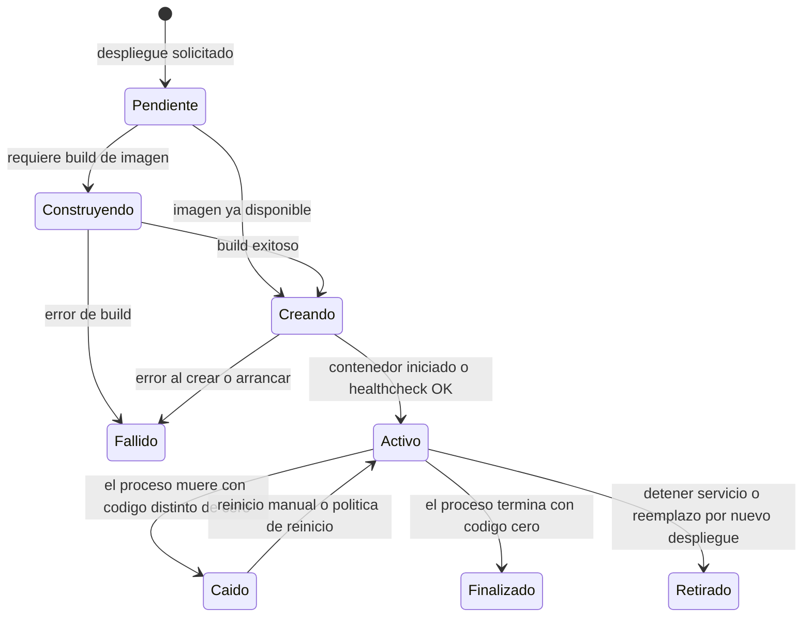
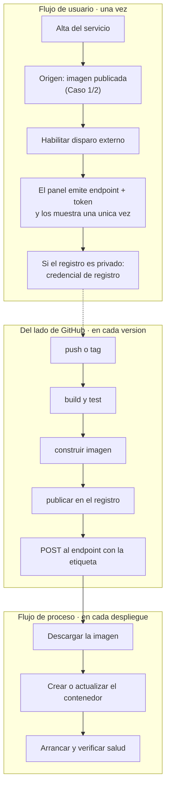
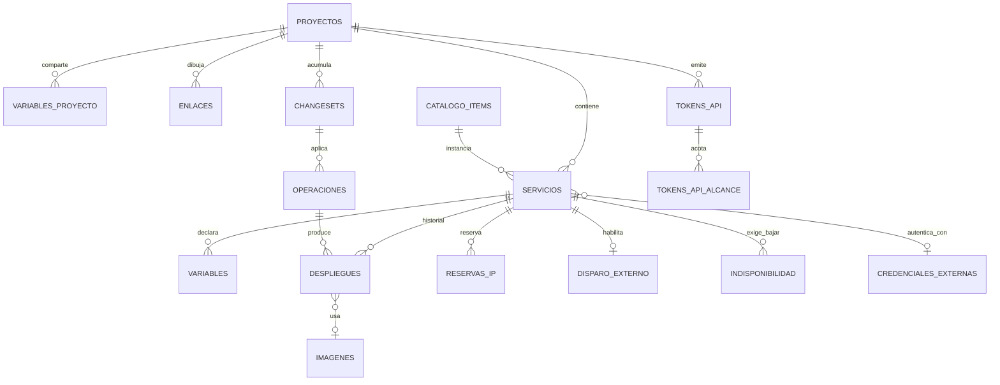

# Casos de estudio redefinidos — Entrada para el orquestador SDD

**Documento:** `Casos-Estudios-Re-Definidos.md`
**Versión:** 3.6
**Fecha:** 2026-08-01
**Estado:** Emitido — pendiente de reintroducción en el flujo del orquestador
**Profile aplicado:** `Study-Guide-Documentation`, con `RuleSet-Study-Guide`
**Producto:** SelfHosted Service · especificación en `DEV/SelfHosted.Service.Core/SDD/`
**Naturaleza:** documento de trabajo del agente humano del proyecto. **No es especificación.** Es la entrada que se reintroduce en el orquestador para redefinir flujos de usuario, modelos de datos y ejemplos, y para replantear la maqueta.
**Precede a:** la aprobación de la maqueta de la Fase B2, que sigue abierta.

---

## Tabla de contenido

- [1. Qué cambia respecto de la versión 1.0](#1-qué-cambia-respecto-de-la-versión-10)
- [2. La corrección de fondo: son tres ejes, no dos](#2-la-corrección-de-fondo-son-tres-ejes-no-dos)
- [3. El hallazgo principal: el modelo ya soporta el Caso 3](#3-el-hallazgo-principal-el-modelo-ya-soporta-el-caso-3)
- [4. Flujo de usuario y flujo de proceso](#4-flujo-de-usuario-y-flujo-de-proceso)
  - [4.1 La distinción, en el producto de referencia](#41-la-distinción-en-el-producto-de-referencia)
  - [4.2 La traducción a nuestro vocabulario](#42-la-traducción-a-nuestro-vocabulario)
  - [4.3 Dónde está el corte](#43-dónde-está-el-corte)
- [5. Caso 1/2 — Alta desde una imagen publicada](#5-caso-12--alta-desde-una-imagen-publicada)
  - [5.1 Enunciado](#51-enunciado)
  - [5.2 Por qué se unifican](#52-por-qué-se-unifican)
  - [5.3 La variante como consecuencia derivada, no como elección](#53-la-variante-como-consecuencia-derivada-no-como-elección)
  - [5.4 Cómo sabe el formulario que hace falta credencial](#54-cómo-sabe-el-formulario-que-hace-falta-credencial)
  - [5.5 El flujo de usuario del alta](#55-el-flujo-de-usuario-del-alta)
  - [5.6 Lo que falta](#56-lo-que-falta)
- [6. Caso 3 — Servicio preparado para despliegue externo](#6-caso-3--servicio-preparado-para-despliegue-externo)
  - [6.1 Enunciado](#61-enunciado)
  - [6.2 Su composición](#62-su-composición)
  - [6.3 Lo que el panel tiene que mostrar, y hoy no muestra](#63-lo-que-el-panel-tiene-que-mostrar-y-hoy-no-muestra)
  - [6.4 El token del disparo externo: forma, alcance e identificador](#64-el-token-del-disparo-externo-forma-alcance-e-identificador)
- [7. Caso 4 — Adoptar lo que ya corre en el servidor](#7-caso-4--adoptar-lo-que-ya-corre-en-el-servidor)
  - [7.1 Enunciado](#71-enunciado)
  - [7.2 Qué lo hace distinto: nace materializado](#72-qué-lo-hace-distinto-nace-materializado)
  - [7.3 Los dos sub-casos, que el planteo separa bien](#73-los-dos-sub-casos-que-el-planteo-separa-bien)
  - [7.4 El sub-caso 4b no está modelado, y le falta una variante de origen](#74-el-sub-caso-4b-no-está-modelado-y-le-falta-una-variante-de-origen)
  - [7.5 La tensión de 4b con una necesidad de negocio declarada](#75-la-tensión-de-4b-con-una-necesidad-de-negocio-declarada)
  - [7.6 Lo que la adopción hereda del proyecto, y el conflicto que abre](#76-lo-que-la-adopción-hereda-del-proyecto-y-el-conflicto-que-abre)
  - [7.7 Qué pide la interfaz](#77-qué-pide-la-interfaz)
- [8. El flujo de proceso de despliegue y sus tres disparadores](#8-el-flujo-de-proceso-de-despliegue-y-sus-tres-disparadores)
- [9. Orquestación del proyecto y coherencia del conjunto](#9-orquestación-del-proyecto-y-coherencia-del-conjunto)
  - [9.1 ¿Cómo orquesto el despliegue de todo el proyecto?](#91-cómo-orquesto-el-despliegue-de-todo-el-proyecto)
  - [9.2 ¿Voy a permitir el despliegue individual?](#92-voy-a-permitir-el-despliegue-individual)
  - [9.3 En el despliegue, ¿hay reglas opcionales y no opcionales, y son parte del orquestado?](#93-en-el-despliegue-hay-reglas-opcionales-y-no-opcionales-y-son-parte-del-orquestado)
  - [9.4 El problema de coherencia: tres flujos sobre el mismo conjunto de contenedores](#94-el-problema-de-coherencia-tres-flujos-sobre-el-mismo-conjunto-de-contenedores)
  - [9.5 Lo que el producto de referencia no resuelve](#95-lo-que-el-producto-de-referencia-no-resuelve)
  - [9.5.1 El despliegue de conjunto como unidad, que el agente humano pide pensar](#951-el-despliegue-de-conjunto-como-unidad-que-el-agente-humano-pide-pensar)
  - [9.6 La separación que falta: materializar y poner en marcha](#96-la-separación-que-falta-materializar-y-poner-en-marcha)
  - [9.7 La pieza que hay que agregar: intención de ejecución](#97-la-pieza-que-hay-que-agregar-intención-de-ejecución)
  - [9.8 Las opciones configurables](#98-las-opciones-configurables)
  - [9.9 Matriz de coherencia](#99-matriz-de-coherencia)
  - [9.10 Dos huecos del esquema relacional que este análisis destapa](#910-dos-huecos-del-esquema-relacional-que-este-análisis-destapa)
  - [9.11 El despliegue que necesita bajar otros servicios](#911-el-despliegue-que-necesita-bajar-otros-servicios)
- [10. El ciclo de vida, de punta a punta](#10-el-ciclo-de-vida-de-punta-a-punta)
  - [10.1 La secuencia de armado](#101-la-secuencia-de-armado)
  - [10.2 Son tres fases, no dos](#102-son-tres-fases-no-dos)
  - [10.3 Qué cambia entre modalidades: sólo la fase 1](#103-qué-cambia-entre-modalidades-sólo-la-fase-1)
  - [10.4 El arranque del proyecto: qué alcanza y en qué orden](#104-el-arranque-del-proyecto-qué-alcanza-y-en-qué-orden)
  - [10.5 La precedencia del autoarranque](#105-la-precedencia-del-autoarranque)
  - [10.6 Qué hacer cuando algo falla](#106-qué-hacer-cuando-algo-falla)
  - [10.7 La consecuencia sobre la interfaz del servicio](#107-la-consecuencia-sobre-la-interfaz-del-servicio)
- [11. Qué pasa con «Repositorio remoto»](#11-qué-pasa-con-repositorio-remoto)
- [12. Redefiniciones a aplicar en el SDD](#12-redefiniciones-a-aplicar-en-el-sdd)
  - [12.1 Estructurales, primero](#121-estructurales-primero)
  - [12.2 De interfaz](#122-de-interfaz)
  - [12.3 De modelo y de reglas](#123-de-modelo-y-de-reglas)
  - [12.4 Impacto por wireframe](#124-impacto-por-wireframe)
- [13. Decisiones pendientes](#13-decisiones-pendientes)
  - [13.0 Estado general](#130-estado-general)
- [14. Anexo A — Workflow de ejemplo](#14-anexo-a--workflow-de-ejemplo)
- [15. Anexo B — Archivo de construcción de ejemplo](#15-anexo-b--archivo-de-construcción-de-ejemplo)
- [16. Anexo C — Los cuatro servicios de ejemplo, completos](#16-anexo-c--los-cuatro-servicios-de-ejemplo-completos)
  - [16.1 Caso 1 — Imagen pública, disparo manual](#161-caso-1--imagen-pública-disparo-manual)
  - [16.2 Caso 2 — Imagen privada, disparo manual](#162-caso-2--imagen-privada-disparo-manual)
  - [16.3 Caso 3 — Imagen privada, disparo desde el workflow](#163-caso-3--imagen-privada-disparo-desde-el-workflow)
  - [16.4 Caso 4a — Contenedor adoptado](#164-caso-4a--contenedor-adoptado)
- [17. Anexo D — Plantilla para el próximo caso](#17-anexo-d--plantilla-para-el-próximo-caso)
- [18. Anexo E — Modelo de datos completo](#18-anexo-e--modelo-de-datos-completo)
  - [18.1 Vista de conjunto](#181-vista-de-conjunto)
  - [18.2 Proyectos](#182-proyectos)
  - [18.3 Servicios](#183-servicios)
  - [18.4 Origen: las seis variantes](#184-origen-las-seis-variantes)
  - [18.5 Variables y variables compartidas](#185-variables-y-variables-compartidas)
  - [18.6 Enlaces: el grafo del lienzo](#186-enlaces-el-grafo-del-lienzo)
  - [18.7 Conjunto de cambios y operaciones](#187-conjunto-de-cambios-y-operaciones)
  - [18.8 Despliegues, reservas e imágenes](#188-despliegues-reservas-e-imágenes)
  - [18.9 Disparo externo](#189-disparo-externo)
  - [18.10 Credenciales de máquina: ámbito y alcance](#1810-credenciales-de-máquina-ámbito-y-alcance)
  - [18.11 Credenciales externas](#1811-credenciales-externas)
  - [18.12 Indisponibilidad](#1812-indisponibilidad)
  - [18.13 Catálogo y auditoría](#1813-catálogo-y-auditoría)
  - [18.14 Qué toca cada decisión pendiente](#1814-qué-toca-cada-decisión-pendiente)
- [19. Anexo F — Referencias normativas transcriptas](#19-anexo-f--referencias-normativas-transcriptas)
  - [19.1 Las diez invariantes del modelo](#191-las-diez-invariantes-del-modelo)
  - [19.2 Reglas de negocio citadas](#192-reglas-de-negocio-citadas)
  - [19.3 Las siete reglas de adopción](#193-las-siete-reglas-de-adopción)
  - [19.4 Ciclo de vida del despliegue](#194-ciclo-de-vida-del-despliegue)
  - [19.5 Contrato del endpoint de despliegue](#195-contrato-del-endpoint-de-despliegue)
  - [19.6 Endpoints y sus ámbitos](#196-endpoints-y-sus-ámbitos)
  - [19.7 Las siete vías de alta y su origen resultante](#197-las-siete-vías-de-alta-y-su-origen-resultante)
  - [19.8 Los cuatro criterios de verificación del origen](#198-los-cuatro-criterios-de-verificación-del-origen)
  - [19.9 Rango de direcciones gestionado](#199-rango-de-direcciones-gestionado)
  - [19.10 Capacidades citadas y su prioridad](#1910-capacidades-citadas-y-su-prioridad)
  - [19.11 Glosario de los términos que este documento usa](#1911-glosario-de-los-términos-que-este-documento-usa)
- [20. Anexo G — Orden de los entregables](#20-anexo-g--orden-de-los-entregables)
  - [20.1 Las seis primeras, fijadas por el agente humano](#201-las-seis-primeras-fijadas-por-el-agente-humano)
  - [20.2 Por qué el paso 5 es una puerta técnica y no la épica del lienzo](#202-por-qué-el-paso-5-es-una-puerta-técnica-y-no-la-épica-del-lienzo)
  - [20.3 Por qué adoptar es una buena primera meta funcional, y qué hay que acotar](#203-por-qué-adoptar-es-una-buena-primera-meta-funcional-y-qué-hay-que-acotar)
  - [20.4 Continuación propuesta](#204-continuación-propuesta)
  - [20.5 Qué de este documento entra en cada tramo](#205-qué-de-este-documento-entra-en-cada-tramo)
- [21. Observaciones y límites](#21-observaciones-y-límites)
  - [21.1 Hechos](#211-hechos)
  - [21.2 Interpretaciones](#212-interpretaciones)
  - [21.3 No verificado](#213-no-verificado)
- [22. Registro de evidencias](#22-registro-de-evidencias)

---

## 1. Qué cambia respecto de la versión 1.0

La versión 1.0 trató los casos como **alternativas**: o construye el panel, o construye GitHub. El repaso de casos del agente humano corrigió esa lectura, y la corrección es acertada:

> «Si te fijas, ahí va a tener que ir a dockerhub para tomar la imagen, lo que nos deja en el **Caso 1** y **Caso 2**. Es decir que el **Caso 3** se basa en el **Caso 1/2**.»

**El Caso 3 no es un origen alternativo: es el Caso 1/2 más un disparador externo.** Cuando el workflow termina de publicar y llama al panel, el panel hace exactamente lo que haría en el Caso 1/2: descargar una imagen de un registro y recrear el contenedor. No hay un tercer procedimiento.

Eso invalida el eje sobre el que la versión 1.0 organizaba todo —«Modelo A contra Modelo B»— y lo reemplaza por una composición: **un origen, y un disparador que puede o no ser externo**.

| | Versión 1.0 | Versión 2.x |
|---|---|---|
| Relación entre casos | Alternativos y excluyentes | El Caso 3 **compone** sobre el Caso 1/2 |
| Ejes del modelo | Dos: vía y origen | **Tres**: vía, origen y disparador |
| Unificación de las dos variantes de imagen | Propuesta abierta con dos formas | **Interfaz común con variante derivada**, que conserva `RN-08` intacta (§5.3) |
| «Repositorio remoto» | Camino alternativo descartado | Capacidad **distinta**, que sigue existiendo y no es el Caso 3 |
| Redefiniciones | Once | **Cuarenta y seis**, reagrupadas en estructurales, de interfaz y de modelo |

---

## 2. La corrección de fondo: son tres ejes, no dos

El intake ya separó dos ejes que estaban colapsados, y esa separación fue el fix de definiciones de servicio del 2026-07-29:

| Eje | Qué es | Cuántos valores | ¿Se persiste? |
|---|---|---|---|
| **Vía de alta** | Cómo llega el usuario a crear el servicio | Siete | No |
| **Origen** | Qué queda declarado como fuente de la imagen | Cinco variantes | Sí |

**Falta un tercero, y es el que el repaso de casos destapa: el disparador del despliegue.** Quién inicia la cadena que descarga la imagen y recrea el contenedor.

| Eje | Qué es | Valores | ¿Se persiste? |
|---|---|---|---|
| **Disparador** | Quién inicia el despliegue | Usuario · orquestador del proyecto · automatismo externo | Parcialmente: `disparoExterno` sí, los otros dos son actos |

Los tres son **independientes**. Un servicio de origen imagen privada puede desplegarse a mano, dentro del conjunto de cambios del proyecto, o por un POST del workflow, y las tres cosas a la vez. Confundir origen con disparador es lo que hace que el menú de siete tarjetas parezca ofrecer «la forma de desplegar desde GitHub» cuando en realidad ofrece «de dónde sale la imagen».

**Este es el mismo error de forma que el fix anterior corrigió un nivel más arriba.** Aquella vez el catálogo y la adopción figuraban como orígenes cuando eran vías. Ahora «Repositorio remoto» figura como la vía del despliegue automatizado cuando es un origen, y el despliegue automatizado es un disparador.

---

## 3. El hallazgo principal: el modelo ya soporta el Caso 3

**El modelo de datos no necesita cambiar para el Caso 3. Ya lo declara, y su ejemplo canónico es exactamente ese caso.**

El intake declara `disparoExterno` como **propiedad transversal del servicio y no un origen**, con esta formulación textual: «Bloque opcional con su token y su último uso. Es **propiedad transversal del servicio, no un origen**: cualquier variante puede tenerlo, y E-13 ya lo ejercita sobre este mismo servicio 101, de origen imagen».

Y el servicio 101 del anexo E-2 es esto:

```jsonc
{
  "nombre": "api",
  "estado": "aplicado",
  "origen": {
    "tipo": "imagen-privada",              // <- Caso 2
    "registroUrl": "registry.interno.lan",
    "imagen": "registro-privado/portal-api",
    "etiqueta": "1.4.2",
    "politicaActualizacion": "fijada",
    "credencialRegistroId": 3
  },
  "disparoExterno": {                       // <- Caso 3, compuesto sobre el anterior
    "habilitado": true,
    "tokenPrefijo": "sk-a41f",
    "ambito": "despliegues:ejecutar",
    "ultimoUso": { "en": "2026-07-29T11:02:00-03:00", "actor": "token:sk-a41f", "resultado": "desplegado" }
  }
}
```

Y el anexo E-13 muestra el workflow llamando a `POST /api/v1/servicios/101/desplegar` con `"etiquetaImagen": "1.4.3"`.

**O sea: el Caso 3 del repaso es, literalmente, el ejemplo canónico del intake.** Origen imagen privada, disparo externo habilitado, y el workflow enviando la etiqueta nueva.

**Lo que falla no es el modelo: es la interfaz.** Las diecinueve superficies especificadas y las siete tarjetas del alta **no ofrecen en ningún punto habilitar el disparo externo**. El campo existe en el modelo, el endpoint existe en la API, el ámbito de credencial existe en la configuración del sistema, y el usuario no tiene dónde decir «este servicio se despliega desde mi workflow».

Es la misma clase de defecto que la Fase B2 ya encontró tres veces en la maqueta: **el modelo declara la capacidad y el cableado no la expone**.

---

## 4. Flujo de usuario y flujo de proceso

El repaso pide diferenciarlos, y es la distinción correcta. Railway la resuelve con una separación de entidades que el análisis de referencia relevó y que conviene adoptar como vocabulario.

### 4.1 La distinción, en el producto de referencia

| | **Service** | **Deployment** |
|---|---|---|
| Qué es | La **configuración**: fuente, variables, comandos, recursos, política de reinicio | El **intento de construir y entregar** esa configuración |
| Existencia | Existe siempre mientras no se lo elimine | Se crea en cada despliegue; los viejos pasan a historial |
| Estado on/off | **No lo tiene** | Sí: inicializando, construyendo, desplegando, activo, fallido, caído, retirado |
| Multiplicidad | Un nodo en el lienzo | N por servicio a lo largo del tiempo |

El análisis de referencia lo interpreta así: «el nodo del lienzo representa al **Service** (algo permanente y posicionable), mientras que su color e insignia de estado reflejan al **Deployment** activo (algo volátil). Es exactamente el patrón *desired state* / *current state*».

### 4.2 La traducción a nuestro vocabulario

| Concepto del repaso | Entidad del modelo | Qué lo gobierna |
|---|---|---|
| **Flujo de usuario** | El **servicio**: configuración persistida | Estados `borrador` → `pendiente-de-aplicar` → `aplicado` |
| **Flujo de proceso** | El **despliegue**: intento concreto | Máquina de estados del anexo E-17 |

Nuestro modelo **ya tiene las dos entidades separadas**, y ya tiene declarado que sus estados son ortogonales: los tres estados del servicio no son los del despliegue, y un servicio `aplicado` puede tener su último despliegue `Fallido`.

La máquina de estados del despliegue está declarada:



**Nótese la bifurcación de `Pendiente`.** El modelo ya distingue «requiere build» de «imagen ya disponible». El Caso 1/2 y el Caso 3 entran por la rama derecha —`Pendiente → Creando`— y sólo el origen repositorio entra por la izquierda. Es otra evidencia de que el Caso 3 comparte procedimiento con el Caso 1/2.

### 4.3 Dónde está el corte

El corte entre los dos flujos es la **confirmación**, y el instrumento que la materializa es el conjunto de cambios pendientes:

- **Flujo de usuario:** el humano crea y configura. Nada se despliega. Cada cambio se acumula en el conjunto de cambios del proyecto y el nodo se pinta como pendiente de aplicar.
- **Confirmación:** el humano aplica.
- **Flujo de proceso:** la cadena corre. Descarga, crea o actualiza el contenedor, arranca, y el despliegue recorre su máquina de estados.

El análisis de referencia describe el mismo corte en el producto comercial: «el changeset convierte al canvas en un **editor transaccional**: se edita un borrador de la infraestructura y recién al confirmar se materializa».

---

## 5. Caso 1/2 — Alta desde una imagen publicada

### 5.1 Enunciado

Desplegar un servicio a partir de una imagen ya publicada en un registro. Si la imagen es privada, hace falta credencial.

### 5.2 Por qué se unifican

Las dos variantes comparten tres campos de cinco, verificado contra el modelo:

| Campo | `imagen-publica` | `imagen-privada` |
|---|---|---|
| Registro | `registro`: selector de registro público admitido | `registroUrl`: dirección libre |
| Imagen | `imagen` | `imagen` |
| Etiqueta | `etiqueta` | `etiqueta` |
| Política de actualización | `fijada \| flotante` | `fijada \| flotante` |
| Credencial | — | `credencialRegistroId` |

El propio intake ya lo decía: «difieren en dos campos y no en su naturaleza».

**Misma naturaleza implica interfaz común, y no sólo tarjeta común.** Es la observación del agente humano del proyecto del 2026-07-31, y corrige la recomendación que la versión 1.0 traía. Si la naturaleza es la misma, lo que el usuario recorre es lo mismo: declarar dónde está la imagen, cuál es y qué etiqueta. La credencial no es otra naturaleza; es un dato más que a veces hace falta. Presentarlo como dos caminos obliga a decidir antes de tiempo algo que el usuario muchas veces todavía no sabe.

**Conviene registrar que el intake sacó la conclusión contraria de la misma premisa.** Su frase completa es que difieren en dos campos y no en su naturaleza, «lo que justifica **separarlas en la interfaz** sin duplicar el modelo». Misma premisa, dos conclusiones opuestas. La premisa sola no decide: lo que decide es qué necesita ver el usuario y cuándo.

### 5.3 La variante como consecuencia derivada, no como elección

Esta es la formulación que resuelve la objeción que la versión 1.0 levantaba.

La 1.0 recomendaba unificar sólo la vía, por miedo a romper `RN-08` —la regla de que cada variante exige sus campos y ninguno de otra, y que un campo ajeno es dato inválido y no campo opcional vacío—. Con la interfaz común esa objeción desaparece:

> **La variante de origen deja de ser una elección del usuario y pasa a ser una consecuencia derivada de lo que declaró.** El usuario escribe una dirección de registro y, si hace falta, una credencial. El panel deriva si eso es `imagen-publica` o `imagen-privada`, y lo persiste.

`RN-08` sigue vigente **sin tocarla**: valida la variante derivada en lugar de la elegida. Se obtienen las tres cosas a la vez: interfaz común, modelo intacto y regla intacta.

Es además coherente con lo que el producto ya hace en el otro eje: la vía de alta tampoco se persiste, y deja su huella en el campo de procedencia. Acá pasa lo mismo un nivel más abajo.

### 5.4 Cómo sabe el formulario que hace falta credencial

Es la única pregunta de diseño que la interfaz común deja abierta. Tres formas:

| Forma | Cómo funciona | Costo |
|---|---|---|
| **Por la dirección** | Si el registro declarado no es el público de referencia, aparece el campo de credencial | Frágil: un registro privado no siempre se distingue por su dirección |
| **Interruptor explícito** | El usuario declara «requiere credencial» | Vuelve a pedirle que sepa de antemano lo que la interfaz común quería evitar |
| **Por la verificación** | Verifica sin credencial; si el registro responde que la imagen existe pero no autoriza, **entonces** pide la credencial | Requiere un desenlace de verificación que hoy no existe |

**La tercera es divulgación progresiva real** y es la que mejor cumple el propósito: el usuario no declara nada que no sepa, y el sistema le pide exactamente lo que faltó.

Su costo está acotado y es verificable. Hoy la verificación del origen declara **dos** desenlaces de fallo —`V-2`: «no existe» y «no pude consultar» son fallos distintos y se tratan distinto, corregir un dato contra reintentar— y **no tiene un tercero** para «existe pero requiere credencial». Agregarlo es una capacidad chica de rendimiento alto: con ella el formulario se vuelve uno solo sin adivinar nada.

**Esto revierte `DI-18`, confirmada el 2026-07-30**, y conviene hacerlo sabiéndolo.

### 5.5 El flujo de usuario del alta

Los pasos, con lo que el repaso enumera contrastado contra lo que la especificación ya declara:

| # | Paso del repaso | Estado en la especificación |
|---|---|---|
| 1 | Obtener datos de la imagen desde el registro | **Es la verificación del origen**, ya declarada: comprueba que la imagen y la etiqueta existen y **devuelve el digesto** |
| 2 | Si corresponde, autenticarse y verificar conexión | Ya declarado: la verificación de `imagen-privada` comprueba además que la credencial autentique. Distingue «no existe» de «no pude consultar», que son fallos distintos |
| 3 | Configuración de red, variables, secretos, puertos | Ya declarado: pasos de red, puertos y dimensiones |
| 4 | Descargar la imagen | **No es del alta: es del flujo de proceso.** Ver sección 7 |
| 5 | Crear o actualizar el contenedor | Íd. |
| 6 | Iniciar, o guardar para despliegue del proyecto | Íd. Es el corte de la confirmación |

**Los pasos 1 a 3 son flujo de usuario; los pasos 4 a 6 son flujo de proceso.** El repaso los enumera juntos y por eso pide diferenciarlos: es exactamente el corte de §4.3.

### 5.6 Lo que falta

**La superficie de alta de credenciales de registro.** El repaso lo dice: «Aquí se requiere credenciales, se piden, por eso el usuario debería poder cargar las credenciales». Verificado: ninguna de las diecinueve superficies la administra. La superficie de configuración del sistema gobierna **credenciales de máquina**, que son la entidad inversa —las que un automatismo usa para llamarnos, no las que nosotros usamos para llamar a un registro—.

---

## 6. Caso 3 — Servicio preparado para despliegue externo

### 6.1 Enunciado

Crear un servicio y dejarlo preparado para que un workflow de GitHub Actions dispare su despliegue. El workflow construye la imagen, la publica en un registro, y avisa.

### 6.2 Su composición



**El bloque P es idéntico al del Caso 1/2.** Es lo que el repaso afirma y la evidencia confirma: «Cuando recibe el post al endpoint prefijado, sigue el procedimiento Caso 1/2».

### 6.3 Lo que el panel tiene que mostrar, y hoy no muestra

El repaso lo enumera con precisión:

> «a.1. Mostrar endpoint y token (opción, regenerar para este servicio) que usará el workflow para el despliegue de este servicio.»

**Pero el reparto por nivel corrige esa enumeración**, y conviene declararlo acá porque es donde se lee primero. El token **no es del servicio**: es del proyecto, por §6.4.3.2 y `DP-04.2`. Lo que es del servicio es el **destino**. Entonces:

| Qué | Nivel | Estado |
|---|---|---|
| Emitir y revocar la credencial, con su alcance | **Proyecto** | **Sin superficie.** No existe configuración de proyecto |
| Interruptor de disparo externo | **Servicio** | **Sin superficie.** El campo existe en el modelo |
| La URL del endpoint con su destino, lista para copiar | **Servicio** | **Sin superficie.** El contrato existe en la API |
| Qué credencial del proyecto habilita este disparo | **Servicio**, como referencia | **Sin superficie** |
| **Regenerar el destino** de este servicio | **Servicio** | **Sin superficie** |
| **Rotar la credencial** del proyecto | **Proyecto** | Parcial: la revocación existe para credenciales de máquina |
| Último uso del disparo | **Servicio** | **Sin superficie.** El campo existe en el modelo |

**Dos acciones de revocación, en dos niveles, y no son la misma.** Regenerar el **destino** invalida el disparo de **ese servicio** y no toca a nadie más: es lo que se hace si se sospecha que se filtró la URL. Rotar la **credencial** invalida todo lo que esa credencial disparaba, en todo su alcance: es lo que se hace si se filtró el secreto. Presentarlas juntas como «regenerar el token de este servicio» las confunde, y esa confusión es lo que la enumeración del repaso arrastraba.

**Un acceso directo que conviene, sin romper el reparto.** Cuando el servicio habilita el disparo y el proyecto todavía no tiene credencial, el panel del servicio ofrece emitir una **sin hacer navegar al humano**. La credencial que se emite sigue siendo del proyecto y aparece en su configuración; lo que se acorta es el camino, no la pertenencia.

### 6.4 El token del disparo externo: forma, alcance e identificador

Es la decisión de diseño más consecuente de este caso, y se descompone en tres preguntas que conviene no mezclar. La versión 2.1 de este documento las respondió mal, en una sola línea, y esta sección corrige.

#### 6.4.1 Qué había recomendado, y por qué estaba mal

La 2.1 recomendaba «una credencial de máquina general y que el bloque por servicio declare cuál la habilita», con el argumento de que veinte servicios serían veinte secretos que rotar.

**El argumento asumía que el único consumidor del token es el dueño del panel.** El agente humano planteó el caso que lo rompe: delegar la implementación a un equipo externo. Ahí una credencial general con los ámbitos de acción que el modelo tiene hoy **permite desplegar cualquier servicio**, incluidos los que el equipo externo no toca. El ámbito `despliegues:ejecutar` autoriza la acción y no dice sobre qué.

Y se agrava con la forma del identificador: la API expone `POST /api/v1/servicios/101/desplegar`, y la clave del servicio es `INTEGER PRIMARY KEY AUTOINCREMENT`. Es **enumerable**: con un token general, probar 102, 103 y siguientes alcanza para recorrer el parque.

#### 6.4.2 La forma del token: opaco, no JWT

**Esta pregunta ya está respondida por el modelo, y conviene no reabrirla.** Dos decisiones vigentes la cierran:

| Decisión vigente | Por qué excluye el JWT |
|---|---|
| `RN-16`: el token se muestra una única vez y **sólo se persiste su hash**. Es **invariante del modelo**, no decisión de infraestructura | Un JWT se valida por firma, no por búsqueda de hash. Guardar su hash no aporta nada y no es como se lo usa |
| **Revocación inmediata**, declarada en el reparto por capa como parte del ciclo de vida del token | Es la debilidad conocida del JWT: revocarlo antes de su vencimiento exige una lista de denegación consultada en cada petición, que es exactamente la búsqueda en base que el JWT venía a evitar |

La tabla `tokens_api` lo confirma: `hash_token TEXT NOT NULL UNIQUE`, `prefijo`, `ambitos`, `expira_en`, `revocado_en`. Es un token opaco con búsqueda en base.

**Conclusión: token opaco.** La pregunta del agente humano —«si es jwt con claim, o no»— tiene respuesta, y es que no. Conviene que quede escrita, porque hoy se deduce de dos reglas y no está dicha.

#### 6.4.3 Dos campos, no uno: ámbito y alcance

Ni la credencial general ni la credencial por servicio resuelven bien la delegación:

| Forma | Delegación a un equipo externo | Rotación | Radio de daño si se filtra |
|---|---|---|---|
| General, sólo ámbito de acción | **Insegura**: despliega cualquier servicio | Un secreto | Todo el parque |
| Una por servicio | Segura | **N secretos** por N servicios | Un servicio |
| **Ámbito + alcance** | **Segura**: declara sobre qué | Un secreto **por consumidor** | Lo declarado |

**Qué es un ámbito hoy.** Seis valores, todos con la forma `clase-de-recurso:acción`: `catalogo:leer`, `catalogo:escribir`, `proyectos:leer`, `proyectos:escribir`, `despliegues:ejecutar` y `sistema:leer`. Dicen **qué se puede hacer sobre una clase de cosas**, no sobre cuáles.

**La forma equivocada de agregarle el recurso**, que conviene descartar explícitamente: meterlo dentro del ámbito, como `despliegues:ejecutar:servicio-101`. La columna es una lista separada por espacios y entraría sin migrar nada, y aun así rompe tres cosas. El dominio declara que **el conjunto de ámbitos es cerrado**, y un ámbito que lleva adentro un identificador deja de serlo: crece con cada servicio. No se podría responder «qué credenciales alcanzan a este servicio» sin parsear cadenas. Y revocar el acceso a un servicio sería cirugía de texto.

**La forma correcta: son dos campos ortogonales.**

| | **Ámbito** | **Alcance** |
|---|---|---|
| Qué declara | Qué acciones puede ejecutar | Sobre qué recursos |
| Ejemplo | `despliegues:ejecutar` | el servicio `sai-service` · el proyecto `Portal` |
| Forma | **Conjunto cerrado**, seis valores, **sin cambios** | Relación entre la credencial y los recursos |
| Cambia cuando | Se agrega una capacidad al producto | Se le da o se le quita a alguien un recurso |

Una credencial autoriza una acción **si tiene el ámbito y el recurso está en su alcance**. El ámbito no se toca: sigue siendo exactamente lo que es hoy.

**Tres reglas que la forma exige:**

1. **El alcance por defecto es nada.** Una credencial sin alcance declarado no llega a ningún recurso. Si el defecto fuera «todo», la mitad quedaría con acceso total por omisión, que es el problema de hoy con otro nombre.
2. **Los ámbitos globales quedan afuera.** `sistema:leer` no tiene instancia sobre la cual acotarse. El alcance aplica sólo a los ámbitos cuya clase tiene instancias.
3. **El alcance por proyecto se extiende solo.** Un servicio nuevo en un proyecto alcanzado queda cubierto sin tocar la credencial. Es lo que se quiere al delegar un proyecto entero, y lo que **no** se quiere al delegar un servicio puntual dentro de un proyecto compartido.

#### 6.4.3.1 La analogía con el repositorio, y dónde deja de servir

El agente humano propone pensarlo como GitHub, con el repositorio en el papel de nuestro proyecto. Es un buen mapeo y conviene tomarlo en serio, incluido el punto donde se rompe.

**Dónde funciona.** GitHub atravesó exactamente esta corrección: su token clásico declara sólo permisos y **alcanza todos** los repositorios de la cuenta —que es nuestro modelo de hoy, acción sin instancia—, y su token de grano fino declara **dos cosas por separado**: a qué repositorios accede y qué permisos tiene sobre ellos. Es la misma separación de arriba, con otros nombres. Que una plataforma de ese tamaño haya llegado ahí es evidencia de la forma, no del detalle.

> **Naturaleza de este párrafo:** conocimiento técnico general sobre GitHub, **no verificado** contra su documentación en esta sesión, que no tiene salida de red. El análisis del producto de referencia **no releva credenciales ni permisos**: sus únicas menciones a *scope* son sobre red privada y configuración por entorno, y su propia sección de limitaciones declara que el enfoque fue UX/UI y modelo de abstracción.

**Dónde se rompe, y es lo que decide la granularidad.** En GitHub el repositorio es **el grano más fino** que un token puede alcanzar: no hay token que alcance sólo una carpeta. Cuando hace falta delegar menos que un repositorio, la salida es partirlo en dos, y eso cuesta poco.

**Acá partir cuesta caro.** Si `sai-service` vive en un proyecto junto a `db` y `cache`, moverlo a un proyecto propio para poder delegarlo le hace **perder la capacidad de referenciar las variables de `db` y `cache`**: `RN-21` declara que los ámbitos de resolución válidos son el propio servicio, las compartidas del proyecto, o otro servicio **del mismo proyecto**, y que una referencia a un servicio de otro proyecto es siempre inválida.

Nuestro proyecto es una unidad **más apretada** que un repositorio: es red, grafo de arranque, variables compartidas y conjunto transaccional a la vez. Por eso su frontera no se puede usar como frontera de delegación sin pagar con funcionalidad del producto.

**Conclusión: el alcance por proyecto es el grano cómodo y el camino por defecto, y no alcanza solo.** Hace falta poder acotar a servicios dentro de un proyecto, precisamente porque acá la delegación no se resuelve partiendo.

#### 6.4.3.2 Dónde se emiten las credenciales

Consecuencia directa de la analogía, planteada por el agente humano: si el proyecto hace el papel del repositorio, **la credencial se emite desde la configuración del proyecto**, como una clave de despliegue se emite desde su repositorio.

Hoy no hay dónde. Las credenciales de máquina viven en la superficie de configuración **del sistema**, que es de instancia y está por encima de cualquier proyecto, y **ninguna de las diecinueve superficies es una configuración de proyecto**: la única de ese nivel es la de variables compartidas, que cubre variables y nada más.

| Qué hace falta | Estado |
|---|---|
| Superficie de configuración **del proyecto** | **No existe.** Candidata a superficie nueva, o a ampliar la de variables compartidas a configuración de proyecto con secciones |
| Emisión de credencial **desde el proyecto**, con su alcance ya acotado a él | **No existe** |
| Que la configuración del sistema siga emitiendo las de instancia | Existe, y conviene que quede claro cuál es cuál |

**La tensión que esto abre y hay que declarar:** con emisión por proyecto, una credencial que alcanza **dos** proyectos no tiene dónde emitirse. Dos salidas: aceptar que una credencial pertenece a un solo proyecto —que es lo que hace la clave de despliegue de un repositorio— o conservar la emisión de instancia para los casos que cruzan. La primera es más simple de explicar y cubre el caso del equipo externo.

#### 6.4.4 El identificador: hace falta un GUID

El agente humano lo plantea así: «suponiendo que estemos en el alta, aún no hay un ID del servicio; creo que es necesario un guid mejor, y así desde el workflow tendría su token y su guid para saber en qué servicio desplegar».

**Es correcto, y su argumento más fuerte es el que menciona al pasar: en el alta todavía no hay identificador.** La clave del servicio es autoincremental y no existe hasta persistir. Si la superficie de alta tiene que mostrar el endpoint que el workflow va a invocar —que es lo que `R-05` pide—, con la clave interna **no se puede**: no hay qué mostrar hasta guardar.

Tres razones, entonces, y las tres independientes:

| # | Razón | Qué resuelve |
|---|---|---|
| 1 | En el alta no hay clave todavía | Permite mostrar el endpoint **durante** el alta, y no sólo después de guardar |
| 2 | La clave autoincremental es enumerable | Quita el recorrido del parque probando números |
| 3 | El contrato externo queda atado a la clave interna | Desacopla: exportar, importar o recrear un servicio no rompe el workflow que lo dispara |

**Forma propuesta:** un identificador opaco del **destino de disparo**, propio del bloque `disparoExterno`, que no reemplaza la clave interna. El resto de la API sigue usando la clave entera; el disparo externo, que es un contrato con otra audiencia, usa el suyo. El workflow queda con exactamente lo que el agente humano describe: su token y su identificador.

```http
POST /api/v1/despliegues/{destino}
Authorization: Bearer <token opaco>
Content-Type: application/json

{ "etiquetaImagen": "1.4.3", "esperarActivo": true, "tiempoLimiteSegundos": 180 }
```

**Dónde vive cada pieza, que es lo que cierra el reparto por nivel:**

| Pieza | Nivel | Por qué ahí |
|---|---|---|
| **Credencial** | **Proyecto** | Es la unidad de delegación, por la analogía de §6.4.3.1. Se emite desde la configuración del proyecto |
| **Identificador de destino** | **Servicio** | Es lo que le dice al workflow **a qué servicio** despliega. Uno por servicio con disparo habilitado |

Es el mismo reparto que el agente humano describe: la credencial se saca del proyecto una vez, y cada servicio aporta su identificador. Un workflow que despliega dos servicios del mismo proyecto usa **un token y dos identificadores**, no dos tokens.

```yaml
# En el repositorio: un secreto, y un identificador por servicio.
secrets:
  SELFHOSTED_TOKEN: <emitido desde la configuracion del proyecto>
vars:
  DESTINO_SAI_SERVICE: <identificador del servicio>
  DESTINO_SAI_WORKER:  <identificador del otro servicio del mismo proyecto>
```

#### 6.4.5 Por qué hacen falta las dos cosas, y no una

Conviene no confundir qué resuelve cada una, porque es el error clásico:

- **El identificador opaco resuelve el descubrimiento**, no la autorización. Quita la enumeración; no impide que quien conoce dos identificadores despliegue en los dos.
- **El ámbito con recurso resuelve la autorización.** Es lo que hace que un identificador filtrado no alcance.

Un identificador imposible de adivinar sin ámbito es seguridad por oscuridad. Un ámbito bien puesto sin identificador opaco funciona, pero deja el parque enumerable y no resuelve el problema del alta. **Las dos.**

**Decide el agente humano.** Lo que este documento sostiene es que la recomendación de la 2.1 era incorrecta y que el caso de la delegación es el que hay que usar como prueba de cualquier alternativa.

---

## 7. Caso 4 — Adoptar lo que ya corre en el servidor

### 7.1 Enunciado

Descubrir los contenedores que ya existen en el servidor, elegir uno e incorporarlo como servicio del proyecto, tomando su configuración observada. El agente humano lo plantea así:

> «Este descubre todos los repositorios locales (invalidando aquellos que ya fueron dados de alta como servicios), y aquí selecciono la imagen, toma la imagen local y básicamente lo demás es similar o tiene su parte final a los casos anteriores. Sólo cambia el origen. De hecho, si te fijas en los casos anteriores, esos tienen que llegar a crear el contenedor; aquí el contenedor ya está o existe, e incluso está corriendo.»

### 7.2 Qué lo hace distinto: nace materializado

**Es la observación más importante del planteo, y la especificación la confirma.** La regla de adopción `RA-02` declara que la adopción «importa la configuración observada —imagen, red, dirección, montajes, variables no secretas— y **crea el servicio sin recrear el contenedor**».

Contra la separación de §9.6, eso significa:

| | Casos 1/2 y 3 | Caso 4 |
|---|---|---|
| Materializar | Hay que hacerlo: descargar la imagen y crear el contenedor | **Ya está hecho.** El contenedor existe |
| Poner en marcha | Puede hacerse o no, según la intención | **Puede estar ya en marcha**, y la adopción no lo toca |

**Es el único caso en que el servicio nace con un despliegue ya activo.** Los otros tres nacen sin ninguno. Esa asimetría no está declarada en ninguna parte y es la que hace que este caso necesite tratamiento propio en lugar de ser «los casos anteriores con otro origen».

`RA-03` cierra el círculo hacia los otros casos: el contenedor adoptado queda vinculado por su identificador, y si desaparece del motor el servicio queda **huérfano** y se ofrece redesplegarlo desde la configuración importada. O sea que a partir de la primera pérdida, el Caso 4 se comporta como los anteriores.

### 7.3 Los dos sub-casos, que el planteo separa bien

El agente humano distingue dos cosas que conviene no mezclar:

> «Si también ponemos como opción tomar las imágenes, es diferente, porque podríamos instanciar tantos servicios como quisiéramos y tendríamos que prácticamente especificar los mismos parámetros que los casos anteriores.»

| | **4a · Adoptar un contenedor** | **4b · Instanciar desde una imagen local** |
|---|---|---|
| Qué se toma | Un contenedor concreto, con su configuración observada | Sólo la imagen |
| Cardinalidad | **Uno a uno.** Un contenedor es un servicio, por la invariante `I2` | **Uno a muchos.** De una imagen salen los servicios que se quieran |
| Qué hay que completar | Casi nada: se importa y se clasifican las variables | **Todo**: red, puertos, variables, recursos. Igual que los Casos 1/2 |
| Estado inicial | Puede nacer corriendo | Nace sin desplegar |
| ¿Está modelado? | **Sí** | **No** |

**La cardinalidad es lo que los vuelve casos distintos y no dos modos del mismo.** Adoptar es incorporar algo que existe una sola vez; instanciar desde una imagen es crear algo nuevo tantas veces como haga falta. Presentarlos juntos porque los dos «vienen de lo local» los confundiría igual que el menú confunde origen con disparador.

### 7.4 El sub-caso 4b no está modelado, y le falta una variante de origen

Verificado: las cinco variantes de origen son imagen pública, imagen privada, repositorio, archivo de construcción en línea y ninguna. **No hay variante para una imagen del almacén local.** Y el descubrimiento lista **contenedores**, no imágenes: su salida trae candidatos con su identificador de contenedor, su estado, sus redes, sus montajes y sus variables detectadas.

El agente humano lo señala con precisión: «ahí es más limpio el origen, porque el origen en los otros viene de un registro; aquí viene del propio sistema».

**Y hay una superficie que ya existe y es el lugar natural de 4b.** `SUP-18`, la superficie de imágenes, se emitió el 2026-07-30 y ya lista el almacén local, distinguiendo lo administrado de lo ajeno. Instanciar un servicio desde una imagen del almacén es una acción de esa superficie, no una tarjeta más del menú de alta.

### 7.5 La tensión de 4b con una necesidad de negocio declarada

Antes de agregar la variante conviene mirar esto, porque no es menor.

Un servicio cuyo origen es **una imagen que sólo existe en el almacén local** no se puede reproducir en otro servidor: al exportar el proyecto e importarlo en otra máquina, esa imagen no está. Y la reproducibilidad de la arquitectura es una **necesidad de negocio declarada** del producto, con documento propio en la categoría de necesidades.

Tres salidas se evaluaron:

| Salida | Qué implica |
|---|---|
| **No agregar 4b** | El almacén local se mira pero no se instancia desde ahí. Quien quiera reusar una imagen la publica primero en un registro |
| **Agregarlo y declarar el servicio como no reproducible** | Se permite, y el servicio queda marcado: la exportación advierte que ese origen no viaja |
| **Agregarlo con promoción a registro** | Al instanciar, el producto ofrece publicar la imagen en un registro y usa esa referencia como origen. Es el más caro y el único que no deja deuda |

**DECIDIDA por el agente humano del proyecto el 2026-07-31: la segunda.** Se agrega el sub-caso 4b y el servicio así creado queda marcado como no reproducible.

#### 7.5.1 Qué arrastra esta decisión

No es una sola cosa. La decisión abre seis frentes y conviene que estén enumerados antes de ejecutarla:

| # | Consecuencia | Dónde se resuelve |
|---|---|---|
| 1 | **Sexta variante de origen**, la imagen del almacén local. `RN-08` crece con una fila: qué campos exige y cuáles le son ajenos | Intake E-2 y E-16; `02` |
| 2 | **Atributo de reproducibilidad en el servicio**, derivado de su origen y no declarado a mano. Es el que sostiene la marca | Intake E-2 y E-9; `02` |
| 3 | **La exportación advierte antes de exportar**, no después. Es el mismo criterio que la categoría de experiencia ya aplica a la ventana de indisponibilidad: advertir después es informar, no advertir | `03-UX-UI-DX`, superficie de exportación e importación |
| 4 | **La importación declara qué servicios no van a poder levantar** en el destino, con su motivo, en lugar de fallar al desplegar | `02` y `03` |
| 5 | **La marca es visible en el servicio y en el proyecto**, no sólo al exportar. Un proyecto con servicios no reproducibles lo declara donde el humano lo vea antes de necesitarlo | `03-UX-UI-DX` |
| 6 | **La promoción a registro queda como camino de salida**, no como requisito: un servicio marcado puede dejar de estarlo publicando su imagen. Es la tercera salida, disponible después y no obligatoria antes | Alcance posterior |

**Por qué conviene que el punto 6 quede escrito ahora aunque se implemente después.** La decisión tomada acepta deuda a cambio de costo, y la deuda se paga con la tercera salida. Si no queda declarado el camino de pago, la marca de no reproducible se vuelve permanente por omisión y el producto termina con dos clases de servicio en lugar de una clase y un estado transitorio.

### 7.6 Lo que la adopción hereda del proyecto, y el conflicto que abre

El agente humano lo plantea así, y es correcto:

> «Creo que una vez catalogo el contenedor bajo un servicio de selfhosted, ahí ya queda bajo el flujo de vida/estado del proyecto en el que se haya catalogado.»

La especificación lo respalda: un contenedor adoptado pertenece a un solo proyecto (`I10`), y `RN-11` impide que otro lo tome.

**Pero abre un conflicto que la matriz de §9.9 no cubría:** ¿qué pasa si adopto un contenedor **corriendo** dentro de un proyecto cuya intención de ejecución es **detenido**?

Tres lecturas, ninguna declarada hoy:

| Lectura | Consecuencia |
|---|---|
| El contenedor sigue corriendo y el proyecto pasa a **parcialmente activo** | Respeta `RA-02` —adoptar no recrea ni toca el contenedor— y usa un estado que el modelo ya tiene |
| La adopción **detiene** el contenedor para alinearlo con el proyecto | Contradice `RA-02` y, peor, apaga un servicio en producción como efecto secundario de catalogarlo |
| La adopción se **rechaza** mientras el proyecto esté detenido | Simple de explicar, pero obliga a arrancar el proyecto para poder catalogar |

**Interpretación: la primera.** Adoptar es un acto de catalogación, no de operación, y no debería cambiar lo que está corriendo. El proyecto queda parcialmente activo, que es un estado que el producto ya declara legítimo, y el humano decide después si lo alinea.

### 7.7 Qué pide la interfaz

| # | Qué | Estado |
|---|---|---|
| 1 | Descubrimiento con los candidatos ya marcados: adoptable, no adoptable con motivo, o ya tomado por otro proyecto | **Especificado**, en la superficie de descubrimiento e incorporación |
| 2 | Paso obligatorio de **clasificación de variables**, donde se ven todas y no sólo las sugeridas como secretas | **Especificado** por `RA-06` |
| 3 | Que el servicio adoptado **declare visiblemente que nació corriendo** y desde cuándo | **Sin especificar.** Es la asimetría de §7.2 |
| 4 | Que el proyecto muestre por qué quedó parcialmente activo tras una adopción | **Sin especificar** |
| 5 | Acción «crear servicio desde esta imagen» en la superficie de imágenes | **Sin especificar**, y depende de la decisión de §7.5 |

---

## 8. El flujo de proceso de despliegue y sus tres disparadores

Unificado el Caso 1/2, y compuesto el Caso 3 sobre él, la cadena de despliegue es **una sola** y cambia sólo quién la inicia.

| Disparador | Quién inicia | Endpoint | Alcance |
|---|---|---|---|
| **Usuario, servicio individual** | El humano, desde el panel del servicio | `POST /api/v1/servicios/{id}/desplegar` | Un servicio |
| **Orquestador del proyecto** | El humano, al aplicar el conjunto de cambios | `POST /api/v1/proyectos/{id}/changeset/aplicar` | Los servicios afectados |
| **Orquestador del proyecto, arranque** | El humano, al arrancar el proyecto | `POST /api/v1/proyectos/{id}/arrancar` | El proyecto completo |
| **Automatismo externo** | El workflow, tras publicar | `POST /api/v1/servicios/{id}/desplegar` | Un servicio |

**Los tres endpoints ya están declarados**, los tres con ámbito `despliegues:ejecutar`. El disparador externo y el individual del usuario **usan el mismo endpoint**: la diferencia es quién presenta la credencial, y queda registrada en la auditoría como `admin` o `token:<prefijo>`.

La cadena, una sola vez, con lo que cada paso exige:

| # | Paso | Regla que lo gobierna |
|---|---|---|
| 1 | Resolver el origen y descargar la imagen | Verificación del origen; `422` si la imagen no existe |
| 2 | Resolver las variables que son referencias | `422` si una referencia no resuelve, señalando la expresión; el contenedor no se crea |
| 3 | Reservar la dirección, si es fija | `409` con el informe de conflicto |
| 4 | Crear o actualizar el contenedor | |
| 5 | Arrancar y verificar salud | Un contenedor corriendo con salud en rojo queda `Activo (degradado)`, no `Caído` |
| 6 | Registrar el despliegue con su digesto | Decisión `Q-15`, cerrada el 2026-07-30 |

---

## 9. Orquestación del proyecto y coherencia del conjunto

El repaso abre tres. Las tres tienen respuesta parcial en la especificación, y conviene verla antes de decidir.

### 9.1 ¿Cómo orquesto el despliegue de todo el proyecto?

**Ya está declarado, con dos operaciones distintas que conviene no confundir:**

| Operación | Qué hace |
|---|---|
| Aplicar el conjunto de cambios | Redespliega **sólo los servicios afectados**, y el informe de impacto lo declara **antes** de ejecutar |
| Arrancar el proyecto | Arranca el proyecto completo y valida conflictos de dirección |

**El orden de arranque lo da el grafo, y ya está definido.** Es el subgrafo de las aristas que **declaran espera** al destino, y no puede tener ciclos. Una arista que sólo referencia una variable, sin declarar espera, no ordena el arranque.

**El resultado es por contenedor y no de la operación.** Los endpoints que despliegan más de un contenedor devuelven el seguimiento, y esa operación «no tiene un estado propio: informa el de cada contenedor por separado. Es lo que hace que un despliegue parcial sea un estado legítimo y no un error a resolver».

**Lo que falta:** que el flujo de usuario de esa orquestación esté maquetado más allá del cajón de cambios pendientes. La operación existe en la API; la superficie que muestra el avance servicio por servicio, con su orden y su resultado individual, no está entre las diecinueve.

### 9.2 ¿Voy a permitir el despliegue individual?

**Ya está permitido:** el endpoint por servicio existe y es el mismo que usa el disparo externo. La pregunta real no es si se permite sino **qué pasa con el conjunto de cambios pendientes cuando alguien despliega un servicio suelto**, y eso no está declarado.

Tres lecturas posibles, ninguna escrita hoy:

| Lectura | Consecuencia |
|---|---|
| El despliegue individual aplica sólo los cambios de ese servicio | El conjunto queda parcialmente aplicado, y hay que poder representarlo |
| El despliegue individual redespliega con la configuración **ya aplicada**, ignorando lo pendiente | Coherente con que el conjunto es transaccional; puede sorprender a quien acaba de editar |
| El despliegue individual está bloqueado mientras haya cambios pendientes de ese servicio | Más simple de explicar, más rígido |

**Interpretación:** la segunda es la más coherente con el modelo transaccional del conjunto de cambios, y es la que el disparo externo necesita: un workflow no puede quedar bloqueado porque alguien dejó una edición a medias en el panel. Pero hay que declararlo, porque hoy no está.

### 9.3 En el despliegue, ¿hay reglas opcionales y no opcionales, y son parte del orquestado?

Sí, y la distinción ya existe aunque no esté nombrada así. Clasificadas:

| Regla | ¿Bloquea? | Naturaleza |
|---|---|---|
| El grafo de arranque no puede tener ciclos | **Sí** | No opcional: sin orden no hay arranque |
| Una referencia que no resuelve impide crear el contenedor | **Sí** | No opcional |
| Toda dirección fija pertenece al rango gestionado | **Sí** | No opcional |
| Un puerto del host no puede estar publicado dos veces | **Sí** | No opcional |
| Aplicar el conjunto redespliega sólo lo afectado | No bloquea: **acota** | Optimización del orquestado |
| Un proyecto con conflictos puede arrancar **parcialmente** | No bloquea | **Opcional por diseño**: el arranque parcial es estado legítimo |
| Los cambios visuales no entran al conjunto ni disparan redespliegue | No bloquea | Invariante |
| Higiene del modelo: cinco detecciones que **advierten sin bloquear** | No bloquea | Opcional |

**La regla del arranque parcial es la que más define el carácter del orquestado:** el producto prefiere levantar lo que puede e informar qué quedó afuera, antes que no levantar nada. Es una decisión de producto ya tomada y conviene que el flujo de proceso la respete de punta a punta.

### 9.4 El problema de coherencia: tres flujos sobre el mismo conjunto de contenedores

Los tres disparadores de §8 no actúan sobre cosas distintas: actúan sobre **el mismo parque de contenedores corriendo**. El servicio pertenece a un proyecto, y el proyecto tiene un estado de conjunto que el disparo individual puede romper.

El agente humano lo plantea con el caso que lo expone mejor:

> «hay que tener en cuenta que el proyecto puede estar parado, o corriendo — pero si está parado y un repositorio dispara su workflow para desplegar, este no debería echar a correr todo el servicio; en ese estado de parado debería quedar parado, listo para correr, pero parado.»

**Es correcto, y es el caso que ninguna de las tres piezas resuelve hoy.** Un disparo externo que arranca un servicio de un proyecto detenido produce tres daños: contradice una decisión explícita del humano —él lo paró—, deja el proyecto en un estado que nadie pidió, y puede arrancar un servicio cuyas dependencias de arranque están detenidas.

### 9.5 Lo que el producto de referencia no resuelve

Conviene decirlo antes de diseñar, para no buscar donde no hay: **Railway no tiene respuesta para esto.**

Su matriz de acción a entidad afectada declara que toda acción que produce un despliegue lo deja corriendo, y su operación de apagado —`Remove`— actúa sobre **el despliegue de un servicio**, no sobre el proyecto. No hay estado de encendido a nivel de proyecto: un push a un servicio apagado lo vuelve a levantar.

**Corrección de una afirmación de la versión 2.4 de este documento.** La 2.4 explicaba la diferencia diciendo que «en su modelo el proyecto es un agrupador» y acá es la unidad de arquitectura. **La distinción era demasiado gruesa**, y el agente humano lo observó: nuestro proyecto también tiene mucho de agrupador.

Contrastado contra el relevamiento, el reparto real es este:

| Capacidad | Producto de referencia | Nuestro producto |
|---|---|---|
| Agrupar servicios | Sí, el proyecto | Sí, el proyecto |
| Aislar por red privada | Sí, pero en el **entorno**, no en el proyecto | Sí, en el proyecto |
| Cambios acumulados y aplicados en lote | **Sí, por proyecto** | Sí, por proyecto |
| Estado de ejecución del proyecto | **No.** Su documentación define el proyecto como contenedor de entornos y servicios, sin estado de ejecución | **Sí**: arrancar y detener el proyecto completo son operaciones declaradas |
| Orden de arranque derivado de un grafo | No relevado | Sí |

**La diferencia real es una sola: nosotros tenemos operaciones de encendido a nivel de proyecto y ellos no.** Lo demás es más parecido de lo que la 2.4 afirmaba. Y es precisamente esa única diferencia la que crea el problema de coherencia, porque es la que permite que el conjunto esté detenido mientras llega un disparo para uno de sus miembros.

**Consecuencia: este es diseño propio y no hay de dónde copiarlo.** Se declara para que nadie lo busque en el análisis de referencia.

### 9.5.1 El despliegue de conjunto como unidad, que el agente humano pide pensar

El planteo es: «hay una idea de despliegue grupal, lo que pasa es que pienso en el despliegue también como unidad o servicio».

**Esa unidad ya existe y tiene nombre, tabla y estado: es el conjunto de cambios.** El esquema relacional lo declara con identidad propia, con estado `pendiente`, `aplicado` o `descartado`, con un **mensaje** —que es lo mismo que un mensaje de confirmación— y con el momento de aplicación. Y cada despliegue guarda **de qué conjunto de cambios salió**.

O sea que el modelo ya tiene la pieza que el planteo busca. Lo que no tiene es el tratamiento:

| Pieza | Estado |
|---|---|
| Identidad del conjunto de cambios | **Existe**: tabla propia |
| Su mensaje y su momento de aplicación | **Existen** |
| Trazabilidad de cada despliegue a su conjunto | **Existe** |
| **Resultado del conjunto como tal** | **No existe, y es deliberado.** Una decisión declarada del agente humano fija que el resultado se determina **por contenedor y no por operación**, para que un despliegue parcial sea estado legítimo |
| Persistencia de la operación en lote | **No existe.** La operación tiene identificador en la API y ruta de seguimiento, pero **no hay tabla de operaciones**: es efímera |
| Volver a un estado de conjunto anterior | **No existe.** El conjunto guarda el **delta** que se aplicó, no el estado resultante |

**La tensión, dicha con precisión.** El producto trata el conjunto de cambios como **unidad de intención** —qué quiero cambiar, con su mensaje, aplicado en lote— y el despliegue como **unidad de resultado**. Son dos unidades distintas a propósito, y la razón es buena: si el conjunto tuviera un estado propio, un despliegue parcial sería un fallo, y el producto decidió que es un estado legítimo.

Pensarlo «también como unidad» en el sentido de resultado exigiría responder qué significa que un conjunto de siete servicios haya salido con cinco activos y dos caídos. Hoy la respuesta es «cinco activos y dos caídos», y no un veredicto único, que es defendible.

**Lo que sí falta y no es contradictorio con esa decisión**, porque es sobre la intención y no sobre el resultado:

| # | Hueco | Por qué importa |
|---|---|---|
| 1 | La operación en lote **no se persiste** | Cerrado el navegador y pasado el momento, no queda registro de que hubo una operación: sólo quedan sus despliegues sueltos y el conjunto marcado como aplicado |
| 2 | No hay forma de **volver a un conjunto anterior** | Con el digesto por despliegue ya decidido, volver un servicio es posible; volver **el proyecto** a como estaba antes de un conjunto, no |
| 3 | El conjunto de cambios **se presenta como bandeja de pendientes y no como versión del proyecto** | Es la misma pieza con dos lecturas, y la segunda es la que el planteo pide. Cambiar la lectura es de interfaz, no de modelo |

### 9.6 La separación que falta: materializar y poner en marcha

**«Desplegar» son dos operaciones que el modelo trata como una.**

| Operación | Qué hace | Equivalente en el motor |
|---|---|---|
| **Materializar** | Resolver el origen, descargar o construir la imagen, resolver variables, reservar la dirección y **crear el contenedor** con la configuración nueva | `create` |
| **Poner en marcha** | Arrancar el proceso y esperar su verificación de salud | `start` |

La buena noticia es que **el estado intermedio ya existe en la especificación**: la tabla de correspondencia con el motor mapea el contenedor `created` a `Pendiente`, con la nota «Creado, aún sin arrancar».

**Lo que falla es que ese estado está mal nombrado y tratado como transitorio.** `Pendiente` es también el estado inicial de la máquina —«despliegue solicitado»—, de modo que un contenedor materializado y en reposo es indistinguible por nombre de uno que todavía no empezó a procesarse. Y la máquina lo dibuja como paso de camino a `Creando`, no como estado donde un despliegue puede **quedarse**.

Propuesta: **separar el nombre y declararlo estado de reposo legítimo**. Un despliegue puede terminar correctamente en «materializado y sin arrancar», y eso no es un despliegue a medias: es el resultado correcto cuando la intención de ejecución dice que no hay que arrancar.

### 9.7 La pieza que hay que agregar: intención de ejecución

Es el patrón de estado deseado contra estado real que la separación servicio-despliegue ya aplica un nivel más abajo, subido al nivel del conjunto.

| Nivel | Qué declara | Estado hoy |
|---|---|---|
| **Proyecto** | Si el conjunto debe estar corriendo o detenido | **No existe.** La tabla de proyectos no tiene columna de estado: el estado del proyecto se **deriva** de sus servicios, y por eso «parcialmente activo» es un estado y no un error |
| **Servicio** | Si el arranque del conjunto lo alcanza | **No existe** como tal, y **no puede existir como encendido**. Ver la corrección de abajo |

**Que el estado del proyecto sea derivado es correcto para el estado real y insuficiente para el deseado.** Derivar «está corriendo» de sus contenedores es lo que hace bien; pero «debe estar corriendo» es una declaración del humano y no se deriva de nada. Sin ella, no hay contra qué contrastar el disparo externo.

**Corrección respecto de la versión 2.4 de este documento, por la invariante `I3`.** La 2.4 proponía una «intención de ejecución» también a nivel de servicio, con valores «sigue al proyecto» y «siempre detenido». **Eso roza una invariante declarada `[E]` del modelo**: `I3` dice que **el servicio no tiene estado de encendido**, e `I4` que el ciclo de vida vive en el despliegue. Son las dos que sostienen la separación configuración-instancia de §4.

La distinción que salva la propuesta es real pero fina, y conviene enunciarla en lugar de darla por obvia: una **intención** es una declaración de estado deseado, no el estado de encendido, que sigue viviendo en el despliegue. Aun así, un servicio con «siempre detenido» **se lee** como un servicio apagado, y esa lectura es la que `I3` quiere impedir.

**Formulación corregida.** La intención de ejecución vive **sólo en el proyecto**, que no está alcanzado por `I3`. En el servicio, lo que se declara es su **participación en el arranque del conjunto** —si el arranque del proyecto lo alcanza o no—, que es un atributo de configuración y no un estado. Con eso se obtiene el mismo comportamiento sin tocar la invariante.

Con la intención declarada, la regla que el agente humano pide se enuncia en una línea:

> **Un disparo externo materializa siempre y no cambia nunca la intención de ejecución.** Si el proyecto está detenido, el despliegue nuevo queda materializado y en reposo, listo para arrancar con el proyecto.

### 9.8 Las opciones configurables

Lo que hay que ofrecer para elegir, en dos niveles.

**En la configuración del orquestado del proyecto:**

| Opción | Valores | Recomendado |
|---|---|---|
| Intención de ejecución del proyecto | Corriendo · Detenido | — |
| Qué hace un disparo externo con el proyecto detenido | **(a)** Materializar y no arrancar · **(b)** Arrancar sólo ese servicio y las dependencias que espera · **(c)** Rechazar el disparo | **(a)** |
| Qué hace un disparo externo con el proyecto parcialmente activo | **(a)** Materializar, y arrancar sólo si las dependencias que espera están corriendo · **(b)** Materializar y no arrancar nunca | **(a)** |
| Orden de arranque | Derivado del grafo, no configurable | — |

**En la configuración del servicio individual:**

| Opción | Valores | Nota |
|---|---|---|
| Participa del arranque del conjunto | Sí · No | Es un **atributo de configuración**, no un encendido: declara si el arranque del proyecto alcanza a este servicio. Respeta `I3` |
| Autoarranque | Ya existe | **Cuidado, no es lo mismo:** el modelo lo define como levantarse **al iniciar el sistema administrador**, que es otra pregunta |

**Por qué (a) es la recomendada en los dos casos.** Materializar sin arrancar hace que el trabajo del workflow no se pierda —la imagen está descargada y el contenedor creado, así que arrancar después es instantáneo—, respeta la decisión del humano que paró el proyecto, y **resuelve de paso el problema de coherencia**: un servicio que no arranca no puede arrancar con sus dependencias caídas.

### 9.9 Matriz de coherencia

Qué debe pasar en cada cruce. Es el insumo directo de `02` y de la superficie del cajón de cambios.

| Estado del proyecto | Disparador | Efecto esperado |
|---|---|---|
| Corriendo | Usuario, servicio individual | Materializa y arranca |
| Corriendo | Orquestador, aplicar cambios | Materializa y arranca **sólo lo afectado** |
| Corriendo | Automatismo externo | Materializa y arranca ese servicio |
| **Detenido** | Usuario, servicio individual | Materializa y arranca **sólo ese servicio**: es un acto explícito del humano sobre ese servicio |
| **Detenido** | Orquestador, aplicar cambios | Materializa **todo lo afectado y no arranca nada**. El proyecto sigue detenido con los cambios ya aplicados |
| **Detenido** | Automatismo externo | **Materializa y no arranca.** Es el caso del enunciado |
| Parcialmente activo | Automatismo externo | Materializa; arranca sólo si las dependencias que ese servicio espera están corriendo, y si no, lo declara en el informe |
| Cualquiera | Automatismo externo sobre servicio que **no participa del arranque del conjunto** | Materializa y no arranca. Sólo lo arranca un acto explícito del humano sobre ese servicio |
| **Detenido** | Adopción de un contenedor que ya corre (Caso 4) | **No se toca el contenedor.** El proyecto pasa a parcialmente activo y lo declara. Ver §7.6 |

**Dos propiedades que esta matriz mantiene y conviene no perder al implementarla.** Materializar nunca se saltea: el trabajo del disparador siempre queda hecho y visible. Y el disparo externo **nunca cambia la intención**: puede cambiar qué está materializado, no si el conjunto debe correr.

### 9.10 Dos huecos del esquema relacional que este análisis destapa

Al contrastar el modelo de datos contra estos casos aparecieron dos desfases entre el anexo del modelo de servicio y el del esquema relacional, y conviene registrarlos porque son anteriores a esta discusión:

| # | Hueco | Evidencia |
|---|---|---|
| 1 | **La tabla de servicios no tiene columna de estado**, aunque el modelo de servicio declara los tres valores `borrador`, `pendiente-de-aplicar` y `aplicado` que `DI-19` incorporó | La tabla declara veinte columnas y ninguna es el estado |
| 2 | **El comentario de la columna de origen declara tres variantes**, `imagen | repositorio | dockerfile`, cuando el modelo vigente declara **cinco** desde la redefinición del alta | El comentario quedó de antes del fix del 2026-07-29 |

Los dos son del esquema relacional, que no se actualizó cuando el modelo de servicio creció. **Es trabajo de la Fase C**, pero conviene que el orquestador lo sepa antes de llegar ahí.

### 9.11 El despliegue que necesita bajar otros servicios

El agente humano plantea el caso que falta:

> «Imagina que tengo que hacer un despliegue automatizado desde GitHub: el servicio tal vez necesita bajar el proyecto, pararlo, y luego disparar su despliegue. O mejor dicho, el despliegue requiere que pare todo el proyecto. Es difícil pensarlo, porque qué pasa si tengo servicios con diferentes orígenes, y tal vez no haya una dependencia de que todos los servicios estén corriendo.»

**La duda es la correcta, y la respuesta es que el modelo tiene una relación y hacen falta dos.**

#### 9.11.1 Son dos relaciones distintas, no una

| Relación | Qué responde | ¿Existe hoy? |
|---|---|---|
| **Grafo de arranque** | En qué orden levanto los servicios. Es el subgrafo de las aristas que **declaran espera** | **Sí** |
| **Alcance de indisponibilidad de un despliegue** | Qué tiene que estar **abajo** mientras despliego este servicio | **No** |

**La segunda no se deriva de la primera**, y el agente humano llega a esa conclusión por su cuenta al notar que «tal vez no haya una dependencia de que todos los servicios estén corriendo». Los dos sentidos fallan:

- Un servicio puede **esperar** a la base al arrancar y no necesitarla abajo cuando se despliega a sí mismo. Espera de arranque sin indisponibilidad.
- Una migración de esquema puede exigir que sus consumidores estén abajo **aunque ninguno declare espera** hacia ella. Indisponibilidad sin espera de arranque.

Y la preocupación por los orígenes heterogéneos se disuelve sola: **el alcance de indisponibilidad no tiene nada que ver con de dónde sale la imagen.** Un servicio que viene de un registro y otro que viene de una adopción se paran igual. El origen gobierna cómo se materializa; la indisponibilidad, qué se apaga mientras tanto.

#### 9.11.2 Lo que la especificación ya acepta

No se parte de cero: el producto **ya asume ventanas de indisponibilidad**. La categoría de experiencia declara que reemplazar una versión de un servicio es detener y arrancar, con una ventana «que la interfaz debe advertir explícitamente al confirmar el redespliegue», y que la advertencia va **antes** de confirmar y no en un acuse posterior. Es consecuencia aceptada de que el producto no administre proxies inversos, que están declarados fuera del primer alcance.

**Lo que falta es el alcance de esa ventana.** Hoy se asume que abarca al servicio que se redespliega. El caso planteado necesita poder declarar que abarca más.

#### 9.11.3 Las tres formas de resolverlo

| Forma | Cómo | Problema |
|---|---|---|
| **(a) Declarativa en el servicio** | El servicio declara qué exige bajar al desplegarse: nada · los que lo esperan · un conjunto declarado · el proyecto | Hay que modelarlo y versionarlo en el conjunto de cambios |
| **(b) Imperativa en la llamada** | El workflow declara el alcance en cada disparo | La decisión queda del lado del que llama, y se repite en cada pipeline |
| **(c) Orquestada por el workflow** | Tres llamadas: detener el proyecto, desplegar, arrancar | **Funciona hoy sin cambiar nada, y es la peor.** Ver abajo |

**Por qué (c) es tentadora y conviene descartarla.** Los tres endpoints existen. Pero tiene dos defectos graves: si el despliegue falla a la mitad, **el proyecto queda abajo y nadie lo levanta** —el workflow ya terminó, y el panel nunca supo que la parada era transitoria—; y obliga a darle al automatismo poder para detener el proyecto entero, que es mucho más de lo que necesita.

**Recomendación: (a).** El servicio declara su alcance de indisponibilidad, el panel orquesta la secuencia, y el humano ve la ventana declarada antes de aplicar, que es lo que la categoría de experiencia ya exige.

#### 9.11.4 Cómo encaja con la regla del disparo externo

Podría parecer que esto contradice la regla de §9.7 —«un disparo externo materializa siempre y no cambia nunca la intención de ejecución»—, porque bajar el proyecto es cambiarlo. **No la contradice, y la distinción es la que hace todo el trabajo:**

> **La parada por ventana de indisponibilidad es transitoria y no toca la intención declarada.** El proyecto sigue declarado «corriendo»; el proceso lo baja y lo vuelve a subir. Si el despliegue falla, el panel **restaura la intención declarada**, que es exactamente lo que la forma (c) no puede garantizar.

Es la misma separación de estado deseado y estado real de §4, aplicada al transitorio: la intención es lo que el humano declaró, y el estado real puede apartarse de ella durante una operación y tiene que volver.

#### 9.11.5 Un hallazgo de seguridad que apareció al verificar esto

Contrastando los endpoints contra sus ámbitos apareció algo que no es de este caso pero conviene no dejar pasar:

| Endpoint | Ámbito |
|---|---|
| `POST /api/v1/servicios/{id}/desplegar` | `despliegues:ejecutar` |
| `POST /api/v1/proyectos/{id}/arrancar` | `despliegues:ejecutar` |
| **`POST /api/v1/proyectos/{id}/detener`** | **`despliegues:ejecutar`** |

**Detener el proyecto entero comparte ámbito con desplegar un servicio.** O sea que el token que le das al workflow para que despliegue **ya puede bajarte el proyecto completo**, hoy, sin que nadie lo haya decidido. Es el mismo defecto que `R-11b` describe —ámbito de acción sin dimensión de recurso— pero acá es peor, porque ni siquiera separa acciones de riesgo muy distinto.

---

## 10. El ciclo de vida, de punta a punta

Esta sección consolida el ciclo completo —del alta del proyecto al servicio corriendo— a partir del planteo del agente humano del proyecto del 2026-07-31. La mayor parte encaja con lo ya declarado y lo precisa; **dos puntos chocan con reglas confirmadas** y se declaran como tales en §10.6 en lugar de aplicarse.

### 10.1 La secuencia de armado

El planteo la enumera así, y es coherente con lo decidido hasta acá:

| # | Paso | Nivel | Estado |
|---|---|---|---|
| 1 | Alta del proyecto y su configuración | Proyecto | Existe |
| 2 | **Emitir su credencial con su alcance** | Proyecto | **Sin superficie** (`R-11e`) |
| 3 | Alta de los servicios del proyecto | Servicio | Existe |
| 4 | Configurar el origen de cada servicio y su configuración | Servicio | Existe |
| 5 | Opcionalmente, su despliegue y su arranque | Servicio | Existe parcialmente |

El paso 2 es el que la analogía del repositorio ubicó en el proyecto (§6.4.3.2): la credencial se emite una vez por proyecto y sirve para todos sus servicios, cada uno identificado por su destino.

### 10.2 Son tres fases, no dos

La §9.6 separaba **materializar** de **poner en marcha**. El planteo del agente humano la refina, y la refinación es correcta: materializar son en realidad **dos** cosas.

| # | Fase | Qué hace | Equivalente en el motor |
|---|---|---|---|
| 1 | **Obtener la imagen** | Descargarla del registro, construirla desde el código, tomarla del almacén local, o encontrarla ya presente | `pull` · `build` · nada |
| 2 | **Crear el contenedor** | Resolver variables, reservar la dirección y crear el contenedor con la configuración | `create` |
| 3 | **Poner en marcha** | Arrancar el proceso y esperar su verificación de salud | `start` |

#### 10.2.1 «Construir» tiene dos referentes, y confundirlos desordena todo

**Es la precisión más importante de esta sección**, señalada por el agente humano del proyecto el 2026-07-31: «el construir es relativo, porque teniendo la imagen tenés que construir el contenedor; así que guarda ahí, pero no en el sentido de construir la imagen».

| Se dice | Significa | Quién lo hace |
|---|---|---|
| **Construir la imagen** | Producir la imagen a partir de código: clonar, leer el archivo de construcción y compilar | **Está en discusión.** En el modelo adoptado lo hace el ejecutor de integración continua |
| **Crear el contenedor** | Instanciar esa imagen con la configuración del servicio: variables resueltas, dirección reservada, montajes, recursos | **El panel, siempre, en los cuatro casos** |

> **Invariante del ciclo: crear el contenedor nunca sale del producto.** Es la fase 2 y ocurre en todos los casos sin excepción, incluido el adoptado —donde ya ocurrió, sólo que lo hizo otro—. Lo único que puede vivir afuera es la fase 1.

**Dónde está el daño hoy, verificado.** La especificación **no confunde los términos**: usa «crear el contenedor» dieciocho veces y «construir el contenedor» **cero**. El problema está en un único lugar, y es el texto que el usuario lee: la tarjeta de la vía de repositorio dice «Tengo el código en un repositorio y quiero que **el panel construya**», **sin complemento**. Como el panel siempre crea contenedores, la frase se lee como si «que el panel construya» fuera lo que distingue a esa vía, cuando lo que la distingue es que construya **la imagen**.

**Y contamina el razonamiento sobre el alcance.** Una versión anterior de este documento formuló la decisión de `DP-02` como «el servidor no construye», y así dicha es falsa y alarmante: el servidor **siempre** crea contenedores. La formulación correcta es «el servidor no construye **imágenes**».

**Las fases 1 y 2 son «el despliegue». La fase 3 es «el arranque».** Es la separación que el planteo pide y la que la máquina de estados del anexo E-17 ya insinúa: `Pendiente → Construyendo → Creando → Activo`, donde `Construyendo` es la fase 1 cuando hay que construir, `Creando` es la fase 2 y `Activo` es la 3.

**Y la correspondencia con el motor ya declara el reposo entre la 2 y la 3:** el contenedor `created` mapea a `Pendiente`, con la nota «creado, aún sin arrancar». Lo que falta sigue siendo nombrarlo aparte y tratarlo como estado donde un despliegue puede **quedarse**, que es `R-18`.

**Una diferencia con el producto de referencia que conviene declarar.** El planteo lo observa: allá «el despliegue es levantar el proyecto», o sea que las tres fases van juntas y no hay reposo entre la 2 y la 3. Acá se separan, y esa separación es la que hace posible desplegar sobre un proyecto detenido sin encenderlo.

### 10.3 Qué cambia entre modalidades: sólo la fase 1

**Es la conclusión de fondo del planteo, y se sostiene.** Los cuatro casos de este documento se diferencian **únicamente en cómo llega la imagen**. Las fases 2 y 3 son idénticas.

| Caso | Fase 1 · obtener la imagen | Fases 2 y 3 |
|---|---|---|
| **1/2** · imagen publicada | Descargar del registro, con credencial si es privado | Idénticas |
| **3** · disparo desde el workflow | Igual que 1/2. **El workflow no cambia la fase, cambia quién la dispara** | Idénticas |
| **4a** · adoptar un contenedor | **Ya está**: la imagen y el contenedor existen. Las fases 1 y 2 se saltean | Sólo la 3, y puede estar ya corriendo |
| **4b** · imagen del almacén local | **Ya está** en el almacén; no hay que traerla | Idénticas |
| Repositorio remoto | Clonar y construir | Idénticas |

**Esto es lo que justifica una interfaz unificada del servicio** (§10.7): si sólo cambia una fase, sólo cambia un apartado de la pantalla.

**Y explica la asimetría del Caso 4** que §7.2 declaraba: la adopción no es «otro origen», es el caso donde las dos primeras fases **ya ocurrieron** fuera del producto.

### 10.4 El arranque del proyecto: qué alcanza y en qué orden

#### 10.4.1 Qué alcanza

El planteo lo enuncia con precisión y conviene adoptarlo literal:

> «El que un proyecto inicie todos los contenedores que previamente fueron desplegados debe implicar que esos que inicia sean de inicio automático, y de esos que son automáticos, tengan despliegue exitoso.»

O sea, el arranque del proyecto alcanza a un servicio si se cumplen **tres** condiciones:

| # | Condición | Dónde vive |
|---|---|---|
| 1 | El servicio **participa del arranque del conjunto** | `servicios.participa_arranque` (`R-25`) |
| 2 | El servicio tiene **autoarranque** | `servicios.auto_arranque`, ya existe |
| 3 | Su **último despliegue fue exitoso**: la fase 2 se completó | Se deriva del estado del despliegue |

**La tercera es la que el planteo agrega y no estaba dicha.** Arrancar un servicio cuyo contenedor nunca se creó no es un fallo de arranque: es una operación sin objeto. Distinguirlo importa porque cambia el informe: no es lo mismo «falló al arrancar» que «no había nada que arrancar».

#### 10.4.2 En qué orden

El planteo propone: «ejecutar en orden cada servicio, siempre que cada servicio se configuró con un orden de prioridad; si no, lanza todos juntos».

**Eso introduce un segundo mecanismo de orden, y hay que reconciliarlo con el que ya existe.** El modelo deriva el orden del **grafo de arranque**: el subgrafo de las aristas que declaran espera, que no puede tener ciclos (`RN-05`).

| Mecanismo | Qué da | Naturaleza |
|---|---|---|
| **Grafo de arranque** | Un orden **parcial**: quién antes que quién, sólo donde hay espera declarada | **Restricción dura.** Violarla rompe el arranque |
| **Prioridad declarada** | Un orden **total**, si se completa en todos los servicios | **Preferencia.** No puede contradecir al grafo |

**Reconciliación propuesta: el grafo manda y la prioridad desempata.** Los servicios que el grafo no ordena entre sí arrancan en el orden de su prioridad, y los que no declaran prioridad arrancan juntos. Así los dos mecanismos conviven sin que uno invalide al otro.

**Por qué el grafo no puede ceder ante la prioridad.** La espera declarada existe porque un servicio necesita a otro **arriba** para arrancar bien. Una prioridad que la contradiga produce un arranque que falla por una razón que el modelo ya sabía evitar.

**Nótese que el orden es de la fase 3 y no de las fases 1 y 2.** Obtener imágenes y crear contenedores no tiene por qué respetar ningún orden: son independientes entre servicios y pueden ir en paralelo. Es el arranque el que tiene dependencias, y por eso la regla se llama **grafo de arranque** y no grafo de despliegue.

### 10.5 La precedencia del autoarranque

El planteo resuelve la asimetría que §17.2 registraba —el autoarranque viene en `0` para proyectos y en `1` para servicios, sin declarar cuál manda— y la resuelve bien:

> «El proyecto tiene un tilde que no inicia automáticamente; eso invalida a todos los servicios que contiene, así que ninguno auto inicia. […] Supongamos que un proyecto tiene autostart en true pero uno de sus servicios quedó en no iniciar automáticamente: arrancan todos los demás servicios de ese proyecto, y el o los que están en no autostart no arrancan.»

**El proyecto compuerta al servicio.** No es una conjunción simétrica: es una jerarquía.

| Proyecto | Servicio | Al reiniciar el servidor |
|---|---|---|
| Autoarranque **no** | Cualquiera | **No arranca nada.** El tilde del servicio es irrelevante |
| Autoarranque **sí** | Autoarranque **sí** | Arranca |
| Autoarranque **sí** | Autoarranque **no** | **No arranca ese**, arrancan los demás |

Es coherente con que el proyecto sea la unidad de arquitectura y con que detenerlo baje todos sus contenedores, que es el punto 4 del planteo.

**El hueco que esto deja abierto, y que el planteo no cubre:** qué pasa cuando el autoarranque del proyecto dice «sí» y su **intención de ejecución** dice `detenido` porque alguien lo paró ayer. Son dos marcas distintas —una es política de encendido de la máquina, la otra es estado deseado declarado— y pueden contradecirse. Va como `DP-18`.

### 10.6 Qué hacer cuando algo falla

El planteo propone dos reglas, una por fase. **La primera encaja; la segunda revierte una decisión confirmada.**

#### 10.6.1 Fallo durante el despliegue: encaja

> «Que termine el despliegue completo y marque los que fallaron con su causa de error.»

**Coincide exactamente con lo declarado.** `RN-31` fija que el resultado de un despliegue se determina **por contenedor y no por operación**, que cada contenedor se marca como desplegado o como fallido con su error, y que un despliegue parcial es un estado legítimo. La operación en lote responde con el resultado de cada contenedor y no con un veredicto único.

No hay nada que decidir acá: el planteo describe la regla vigente.

#### 10.6.2 Fallo durante el arranque: choca

> «Al primer servicio que falla, seguir hasta completar todos los fallados, generar la lista de fallos, informarlos, pero luego **bajar todas las ejecuciones que no fallaron**.»

La primera mitad —seguir, juntar los fallos e informarlos— es exactamente lo vigente. **La segunda mitad no.**

| | Regla vigente | Lo que el planteo propone |
|---|---|---|
| Tras un arranque con fallos | El proyecto queda **«parcialmente activo»**, que es un estado explícito y no un error silencioso (`RN-20`) | **Bajar los que arrancaron bien**: todo o nada |
| Estado del asunto | **Confirmado por el agente humano el 2026-07-28**, decisión `D-4`: «las tres resoluciones ante conflicto **o fallo**, incluida la de arrancar parcialmente, quedan como están» | Lo revierte |

**No se aplica y se eleva como `DP-19`**, porque revierte una decisión confirmada y hay argumento de los dos lados:

| A favor de bajar todo | A favor de dejar parcial |
|---|---|
| Estado predecible: o el proyecto está arriba o no lo está | Ocho servicios de diez arriba sirven más que cero de diez |
| Evita un sistema a medias que parece funcionar | Bajar lo que arrancó bien **corta servicios que estaban sirviendo** |
| Más simple de explicar | Es lo que `RN-20` declara y `D-4` confirmó |

**Un matiz que conviene mirar antes de decidir.** `RN-20` habla de arrancar parcialmente **ante conflicto de dirección**, y ahí «parcial» es una de tres resoluciones que el sistema **ofrece** al humano. El planteo habla de **fallos al arrancar**, que no es lo mismo. Podrían convivir: conflicto resuelto por elección del humano, fallo resuelto por política. Pero `D-4` dice «conflicto **o** fallo», así que hoy están unificados, y separarlos también es una decisión.

### 10.7 La consecuencia sobre la interfaz del servicio

El planteo cierra con una conclusión que este documento comparte:

> «Creo que el UX/UI del servicio se puede mejorar enormemente y unificar en una única UI agregando los apartados correspondientes.»

**Se sostiene, y §10.3 es su fundamento:** si entre modalidades sólo cambia la fase 1, entonces sólo cambia **un apartado** de la pantalla. Todo lo demás —red, puertos, variables, montajes, recursos, política de reinicio, disparo externo— es idéntico.

Forma propuesta de la superficie única del servicio, con sus apartados:

| # | Apartado | Cambia por modalidad | Nota |
|---|---|---|---|
| 1 | Identidad: nombre y descripción | No | |
| 2 | **Origen de la imagen** | **Sí, es el único** | Registro y credencial · repositorio y rama · archivo en línea · almacén local · adoptado, en lectura |
| 3 | Red, dirección y puertos | No | Los puertos se deshabilitan en macvlan por `RN-07` |
| 4 | Variables y secretos | No | |
| 5 | Montajes y dispositivos | No | |
| 6 | Recursos y política de reinicio | No | |
| 7 | Arranque: participación, autoarranque y prioridad | No | Lo de §10.4 |
| 8 | **Disparo externo**: interruptor, endpoint con su destino, último uso | No | La credencial es del proyecto (§6.3) |
| 9 | **Estado**: último despliegue, su fase y su resultado | No | Es la lectura de las tres fases |

**Dos acciones propias del ciclo, que el planteo pide y hoy no existen como tales:** «desplegar sin arrancar» —correr las fases 1 y 2 y dejarlo en reposo— y «arrancar» y «detener» sobre un servicio ya desplegado. El planteo las describe como la forma natural de probar: «que el usuario le pegue un start para saber si va todo bien, y luego un stop para seguir con otra cosa».

**Y una consecuencia de diseño que conviene declarar:** el apartado 2 es el único que la vía de alta determina. Los otros ocho son iguales para todos los casos, de modo que **la vía de alta deja de ser una bifurcación de pantalla y pasa a ser el punto de entrada a un apartado**. Es la misma corrección que §5.3 hizo con las dos variantes de imagen, un nivel más arriba.

---

## 11. Qué pasa con «Repositorio remoto»

Con el Caso 3 redefinido como composición sobre el Caso 1/2, la vía «Repositorio remoto» **queda sin el rol que parecía tener**. No era la vía del despliegue automatizado: es la vía en la que **el panel construye**, que es una capacidad distinta y más cara.

Tres salidas posibles, y la decisión es del agente humano:

| Salida | Qué implica |
|---|---|
| **Conservarla** como capacidad independiente | Sigue habiendo una vía en la que el panel clona y construye. Requiere resolver `Q-5` —cuándo se reconstruye— y sostener la complejidad de construir en el servidor, que es lo que el repaso quiere evitar |
| **Diferirla** a un alcance posterior | La vía desaparece del menú del primer alcance y vuelve cuando haga falta. El modelo conserva la variante `repositorio`, sin interfaz que la produzca |
| **Retirarla** | Se elimina la variante. Es el cambio más grande: toca `RN-08`, el modelo, `02`, `03` y la maqueta |

**Interpretación:** diferirla. El fundamento del agente humano —«construir del lado del servidor es super complejo»— es un argumento de costo, no de utilidad, y el costo se evita difiriendo sin perder la opción. Retirar la variante obligaría a rehacer `RN-08`, que está construida sobre cinco variantes, a cambio de nada que el primer alcance necesite.

**Y hay un dato que conviene mirar:** el archivo de construcción en línea tiene un límite declarado —sin contexto no puede copiar archivos locales—, de modo que no reemplaza al origen repositorio para un servicio que se compila desde su código. Si se retira `repositorio`, no queda ninguna vía en la que el panel construya desde código.

---

## 12. Redefiniciones a aplicar en el SDD

Reordenadas y ampliadas respecto de la versión 1.0. Cada fila es un cambio concreto con destinatario.

### 12.1 Estructurales, primero

| # | Redefinición | Destinatario |
|---|---|---|
| R-01 | **Declarar el tercer eje: el disparador del despliegue**, con sus tres valores, independiente de la vía y del origen. Es la corrección de fondo y ordena todo lo demás | Intake §4; luego `02` y `03` |
| R-02 | **Declarar la separación flujo de usuario / flujo de proceso** como vocabulario del producto, anclada a las dos entidades que ya existen: servicio y despliegue | Intake; `Vocabulario` de `02`; `03` |
| R-03 | **Declarar que el Caso 3 compone sobre el Caso 1/2** y no es un procedimiento propio: cuando llega el POST, la cadena es la misma | Intake E-13; `02` |
| R-04 | **`F-16` deja de ser Could Have** y **`F-15` deja de ser Should Have**: el disparo desde workflow es el camino principal, y los tokens son su condición | Intake §4; luego `06` y `07` |

### 12.2 De interfaz

| # | Redefinición | Destinatario |
|---|---|---|
| R-05 | **Superficie para habilitar el disparo externo por servicio**, con endpoint, token mostrado una única vez, regeneración y último uso. El modelo ya tiene los campos y ninguna superficie los expone | `03-UX-UI-DX` |
| R-06 | **Superficie de alta de credenciales de registro y de repositorio.** Ninguna de las diecinueve las administra | `03-UX-UI-DX` |
| R-07 | **Interfaz común para imagen pública y privada. DECIDIDA el 2026-07-31 como parte del alta unificada de `DP-01`.**: una sola tarjeta y **un solo formulario**, con la variante **derivada** de lo que el usuario declara en lugar de elegida por él. Las dos variantes del modelo se conservan y `RN-08` no se toca: valida la variante derivada. Revierte `DI-18` | `03`, maqueta; decide el agente humano |
| R-07b | **Agregar un tercer desenlace a la verificación del origen**: «existe pero requiere credencial», además de los dos que `V-2` ya declara. Es lo que permite que el formulario único pida la credencial sólo cuando hace falta, sin adivinar por la dirección ni preguntar de antemano | Intake E-2 §20.2.5; luego `02` y `03` |
| R-08 | **Superficie de avance del despliegue orquestado**, que muestre el resultado por servicio en su orden de arranque, y no un estado único de la operación | `03-UX-UI-DX` |
| R-09 | **Revisar el texto de la tarjeta «Repositorio remoto»**, que hoy insinúa ser el camino del despliegue automatizado | `03-UX-UI-DX` |

### 12.3 De modelo y de reglas

| # | Redefinición | Destinatario |
|---|---|---|
| R-10 | **Declarar qué pasa con el conjunto de cambios pendientes ante un despliegue individual.** Tres lecturas posibles, ninguna escrita | Intake; `02` |
| R-11 | **Declarar que el token de disparo externo es opaco y no un JWT con claims.** Hoy se deduce de `RN-16` —sólo se persiste el hash— y de la exigencia de revocación inmediata, y no está dicho | Intake §17.P.5; `05` |
| R-11b | **Agregar el alcance como campo propio de la credencial**, ortogonal al ámbito. El **ámbito no se toca**: sigue siendo el conjunto cerrado de seis acciones. El **alcance** es nuevo y declara sobre qué recursos. Con tres reglas: alcance por defecto **nada**, los ámbitos globales quedan afuera, y el alcance por proyecto se extiende solo a los servicios nuevos. **No** meter el recurso dentro del ámbito: rompe el conjunto cerrado, impide consultar qué credenciales alcanzan un recurso y vuelve la revocación cirugía de texto | Intake E-2 y E-15; `05` |
| R-11c | **Incorporar un identificador opaco del destino de disparo**, propio de `disparoExterno`, que no reemplaza la clave interna del servicio. Resuelve tres cosas: que el alta pueda mostrar el endpoint antes de que exista la clave autoincremental, que el parque deje de ser enumerable desde afuera, y que exportar o recrear un servicio no rompa el workflow que lo dispara | Intake E-2, E-9 y E-15; `02` y `05` |
| R-11d | **Granularidad del alcance: por proyecto y por servicio.** Por proyecto es el grano cómodo y el camino por defecto; **no alcanza solo**, porque acá la delegación no se puede resolver partiendo el proyecto —`RN-21` hace que un servicio movido a otro proyecto pierda las referencias a sus vecinos—, que es donde la analogía con el repositorio deja de servir | Intake E-2; `05` |
| R-11e | **Emitir las credenciales desde la configuración del proyecto**, como una clave de despliegue se emite desde su repositorio. Hoy **no existe superficie de configuración de proyecto**: las credenciales de máquina viven en la del sistema, que es de instancia, y la única superficie de nivel proyecto cubre variables compartidas. Hay que decidir además si una credencial pertenece a un solo proyecto o si se conserva la emisión de instancia para las que cruzan | `03-UX-UI-DX`; Intake E-15 |
| R-11f | **Gobernar la polisemia de «ámbito».** Ya tiene dos sentidos vigentes: lo que un token puede hacer, y el alcance de resolución de una variable en `RN-21`. El campo nuevo se llama **alcance** justamente para no agregarle un tercero. Corresponde declararlo por el procedimiento de polisemia del framework en lugar de dejarlo pasar | `Vocabulario` de `02`; Intake |
| R-12 | **Separar la credencial que publica de la que descarga**, por ámbito mínimo | Intake E-2; `05` |
| R-13 | **Declarar que el pipeline no fija variables de entorno.** Hoy se deduce por omisión del contrato | Intake E-13 |
| R-14 | **Adelantar el modelado del secreto**, hoy diferido a la Fase C. Un despliegue automatizado con secretos lo vuelve urgente | `05`, Fase C |
| R-15 | **Acotar `F-10` quitándole el repositorio y conservando la definición local. DECIDIDA el 2026-08-01.** Clonar y compilar es redundante con el ejecutor de integración continua; construir desde un archivo pegado en el formulario **no lo es** y su límite declarado —sin contexto no copia archivos locales— le impide solaparse. La variante del repositorio se conserva en el modelo aunque la interfaz no la produzca | Agente humano |
| R-16 | **Resolver `Q-5`.** Con el Caso 3 redefinido, el disparo automático vive del lado del workflow, y la respuesta coherente para el origen repositorio es «siempre manual» | Agente humano |
| R-17 | **Declarar la intención de ejecución del proyecto. DECIDIDA por el agente humano el 2026-07-31: se incorpora.** Es el estado **deseado**, que hoy no existe: ni la tabla de proyectos ni la de servicios tienen columna de estado, y el estado real se deriva de los contenedores —lo cual es correcto para el estado real e insuficiente para el deseado—. Sin la intención declarada no hay contra qué contrastar un disparo externo. Su formulación en el servicio la acota `R-25` | Intake E-2 y E-9; `02` y `05` |
| R-18 | **Separar «materializar» de «poner en marcha»** dentro del despliegue, y declarar **«materializado y sin arrancar» como estado de reposo legítimo** y no como paso transitorio. El estado ya existe en la correspondencia con el motor —`created` → `Pendiente`, «creado, aún sin arrancar»— pero comparte nombre con el estado inicial de la máquina y se dibuja de paso | Intake E-17; `02` y `05` |
| R-19 | **Declarar la matriz de coherencia** de §9.9: qué hace cada disparador según el estado del proyecto. La regla rectora es que **un disparo externo materializa siempre y no cambia nunca la intención de ejecución** | Intake E-13 y E-17; `02` |
| R-20 | **Ofrecer las opciones de orquestado** de §9.8, por proyecto y por servicio, **y declarar la precedencia entre las tres marcas que se confunden**: el **autoarranque** responde «¿vuelve solo al reiniciar el servidor?», la **intención de ejecución** responde «¿este proyecto debe estar corriendo?» y la **participación en el arranque** responde «¿arrancar el proyecto alcanza a este servicio?». Son ortogonales. El cruce a decidir: proyecto con intención `detenido` y servicios con autoarranque en verdadero, cuando el servidor reinicia. **La intención debe ganarle al autoarranque**, o un reinicio deshace en silencio la decisión de parar el proyecto. Hay además una asimetría de defectos sin resolver: el autoarranque viene en falso para proyectos y en verdadero para servicios, y cuál manda no está declarado | `03-UX-UI-DX`; Intake §4 y E-9 |
| R-21 | **Corregir dos desfases del esquema relacional** respecto del modelo de servicio: la tabla de servicios no tiene columna de estado pese a los tres valores que `DI-19` incorporó, y el comentario de la columna de origen declara tres variantes cuando son cinco | Intake E-9; `05`, Fase C |
| R-22 | **Declarar la asimetría del Caso 4**: la adopción es el único alta que **nace materializada**, y puede nacer con el despliegue ya activo. Los otros tres nacen sin ninguno. Hoy no está dicho en ninguna parte, y es lo que obliga a tratar la adopción aparte en lugar de como «los otros con otro origen» | Intake E-7 y E-17; `02` |
| R-23 | **Declarar qué pasa al adoptar un contenedor corriendo dentro de un proyecto detenido.** La recomendación es no tocar el contenedor y dejar el proyecto parcialmente activo, que es un estado que el modelo ya declara legítimo. Adoptar es catalogar, no operar | Intake E-7; `02` y `03` |
| R-24 | **Sub-caso 4b, instanciar desde una imagen del almacén local. DECIDIDO por el agente humano el 2026-07-31: se agrega, con el servicio marcado como no reproducible.** Implica **sexta variante de origen** con su fila en `RN-08`, atributo de reproducibilidad derivado del origen, advertencia **antes** de exportar, declaración en la importación de qué no va a poder levantar, y marca visible en el servicio y en el proyecto. Su lugar natural en la interfaz es una acción de la superficie de imágenes, no una tarjeta más del menú de alta. El detalle está en §7.5.1 | Intake E-2, E-9 y E-16; `02` y `03` |
| R-24b | **Declarar la promoción a registro como camino de salida** de la marca de no reproducible: publicar la imagen y pasar a un origen de registro. No es requisito previo y puede ser de alcance posterior, pero **conviene declararlo ahora**: sin camino de pago, la marca se vuelve permanente por omisión y el producto queda con dos clases de servicio en lugar de una clase y un estado transitorio | Intake E-2; alcance posterior |
| R-25 | **Corregir la formulación de `R-17` para no rozar la invariante `I3`**: la intención de ejecución vive **sólo en el proyecto**; en el servicio, lo que se declara es su **participación en el arranque del conjunto**, que es atributo de configuración y no estado de encendido | Intake E-2; `02` |
| R-26 | **Declarar el alcance de indisponibilidad de un despliegue**, que es una relación **distinta del grafo de arranque** y no se deriva de él: qué servicios deben estar abajo mientras se despliega uno. Forma recomendada: declarativa en el servicio, orquestada por el panel, con la ventana visible antes de confirmar —que es lo que la categoría de experiencia ya exige— | Intake E-2 y E-5; `02` y `03` |
| R-27 | **Separar el ámbito de detener el proyecto del de desplegar un servicio.** Hoy `POST /proyectos/{id}/detener` y `POST /servicios/{id}/desplegar` comparten `despliegues:ejecutar`, de modo que **el token que se le da a un workflow para desplegar ya puede bajar el proyecto entero**. Es más grave que `R-11b`: ni siquiera separa acciones de riesgo distinto | Intake E-15; `05` |
| R-28 | **Persistir la operación en lote.** Hoy tiene identificador y ruta de seguimiento en la API pero **no tiene tabla**: cerrada la sesión, no queda registro de que hubo una operación, sólo sus despliegues sueltos y el conjunto marcado como aplicado | Intake E-9 y E-13; `05` |
| R-29 | **Leer el conjunto de cambios también como versión del proyecto** y no sólo como bandeja de pendientes. Es la unidad de despliegue de conjunto que el agente humano pide pensar, y **ya existe**: tiene tabla, estado, mensaje y momento de aplicación, y cada despliegue declara de qué conjunto salió. Lo que falta es la lectura, que es de interfaz, y poder **volver a un conjunto anterior**, que hoy no se puede porque el conjunto guarda el delta y no el estado resultante | `03-UX-UI-DX`; Intake E-5 |
| R-30 | **Declarar que el despliegue son tres fases y no dos**: obtener la imagen, crear el contenedor y poner en marcha. Las dos primeras son «el despliegue» y la tercera «el arranque». Refina `R-18`, que separaba en dos, y es lo que hace visible que **entre modalidades sólo cambia la primera** | Intake E-17; `02` y `05` |
| R-31 | **Declarar las tres condiciones del arranque del proyecto**: que el servicio participe del arranque, que tenga autoarranque, y que **su último despliegue haya sido exitoso**. La tercera no estaba dicha, y distingue «falló al arrancar» de «no había nada que arrancar» | Intake §4 y E-17; `02` |
| R-32 | **Declarar la precedencia del autoarranque: el proyecto compuerta al servicio.** Autoarranque del proyecto en falso invalida el de todos sus servicios; en verdadero, cada servicio decide el suyo. Resuelve la asimetría de defectos que §18.2 registra | Intake §4 y E-9; `02` |
| R-33 | **Reconciliar los dos mecanismos de orden de arranque**: el **grafo** de aristas con espera da un orden parcial y es restricción dura; la **prioridad declarada** por servicio da un orden total y es preferencia. El grafo manda y la prioridad desempata; sin prioridad, arrancan juntos. Y el orden es de la **fase de arranque**, no de las de despliegue, que son independientes entre servicios | Intake E-16 (`RN-05`); `02` |
| R-34 | **Unificar la interfaz del servicio en una sola superficie con apartados**, de los cuales **sólo el del origen cambia por modalidad**. Es la consecuencia directa de `R-30`, y sube un nivel la misma corrección que §5.3 hizo con las dos variantes de imagen: la vía de alta deja de bifurcar la pantalla y pasa a ser el punto de entrada a un apartado | `03-UX-UI-DX`; maqueta |
| R-35 | **Emitir las acciones del ciclo que hoy no existen**: «desplegar sin arrancar» —correr las dos primeras fases y dejar el servicio en reposo— y «arrancar» y «detener» sobre un servicio ya desplegado, que es la forma natural de probar que quedó bien | `03-UX-UI-DX`; Intake E-15 |
| R-36 | **Declarar la distinción entre construir la imagen y crear el contenedor**, con la invariante de que **crear el contenedor nunca sale del producto**: ocurre en los cuatro casos, y lo único que puede vivir afuera es la construcción de la imagen. El modelo ya es consistente —usa «crear el contenedor» dieciocho veces y «construir el contenedor» cero— así que el trabajo es de vocabulario y de textos de interfaz, no de modelo | `Vocabulario` de `02`; `03` |
| R-37 | **Corregir todo «construir» sin complemento en los textos que el usuario lee.** El caso verificado es la tarjeta de la vía de repositorio: «quiero que **el panel construya**», sin decir qué. Como el panel siempre crea contenedores, la frase sugiere que eso es lo que distingue a la vía, cuando lo que la distingue es que construya **la imagen** | `03-UX-UI-DX`; maqueta |
| R-38 | **Ajustar `NB-04` al modelo adoptado.** Su descripción exige «la construcción de la imagen dentro del alcance del registro en lugar de ocurrir por afuera», y el modelo adoptado la pone en el ejecutor de integración continua. **No cambia el núcleo de la necesidad** —que el alta deje de ser copiar y adaptar— y **sí** su frase sobre la construcción y su criterio de éxito, que pasa de **4 de 4 vías a 3 de 3** al quitarse el repositorio remoto de la enumeración. Conviene que el ajuste **conserve lo que la frase perseguía**, que era trazabilidad, hoy cubierta por el digesto registrado por despliegue y la auditoría del actor | `01-Necesidades-Negocio`; agente humano |
| R-39 | **Acotar el enunciado de `F-10` y ajustar el criterio de `NB-04` de 4 a 3 vías**, enumerando las que quedan: imagen de registro, definición local y plantilla del catálogo. `F-10` conserva su prioridad y su fase; lo que cambia es su alcance. Es lo que vuelve a `DP-02` una decisión de alcance y no de interfaz | `00-Contexto`, `01`; agente humano |

**Orden sugerido.** R-01 a R-04 primero: son conceptuales y cambian el marco del resto. R-07 y R-15 antes que R-05 y R-06, porque definen cuántas tarjetas y dónde vive cada credencial. R-14 al entrar en la Fase C.

### 12.4 Impacto por wireframe

Las diecisiete redefiniciones aterrizan en las diecinueve superficies especificadas. Esta tabla es el insumo directo de `03-UX-UI-DX` y de la reconstrucción de la maqueta: dice qué superficie se toca, con qué alcance y por qué.

| Superficie | Alcance | Qué cambia | Redefiniciones |
|---|---|---|---|
| **`SUP-17` Alta de servicio** | **Rehacer** | Es la que más cambia. Ver §12.4.1 | R-01, R-05, R-07, R-07b, R-09, R-15 |
| **`SUP-06` Panel lateral del servicio** | **Mayor** | Suma la sección de disparo externo del servicio ya creado: interruptor, **endpoint con su destino**, último uso y **regenerar el destino**. **No emite el token**: la credencial es del proyecto (§6.3). Y suma las acciones del ciclo de `R-35`: desplegar sin arrancar, arrancar y detener | R-05, R-10, R-11c, R-35 |
| **`SUP-12` Configuración del sistema** | **Mayor** | Suma la sección de **credenciales de registro y de repositorio**, distinta de la de credenciales de máquina que ya tiene. Hoy tiene seis secciones y su propio wireframe declara que seis está en el límite superior de Miller: hay que evaluar si la séptima entra o si las credenciales se van a superficie propia | R-06, R-11, R-12 |
| **`SUP-07` Cajón de cambios pendientes** | **Mayor** | Suma el avance del despliegue orquestado: resultado **por servicio**, en su orden de arranque, con el parcial como estado legítimo. Y declara qué pasa con lo pendiente cuando alguien despliega un servicio suelto | R-08, R-10 |
| **`SUP-05` Lienzo del proyecto** | **Menor** | El menú de vías pasa de siete tarjetas a cinco. Y el nodo distingue configuración de despliegue según la separación de R-02 | R-01, R-02, R-07, R-15 |
| **`SUP-19` Exploración de registro** | **Menor** | Deja de colgar sólo de las vías 3 y 4: con la vía de imagen unificada, cuelga de una sola | R-07 |
| **Nueva · Credenciales de registro** | **Emitir**, sólo si no entra en `SUP-12` | Alta, listado y revocación de las credenciales que el panel usa para llegar a un registro o a un repositorio | R-06 |
| **Nueva · Configuración del proyecto** | **Emitir** | No existe ninguna superficie de ese nivel: la de configuración es de instancia y la de variables compartidas cubre variables y nada más. Aloja la **emisión de credenciales del proyecto** con su alcance, y es el lugar natural de las opciones de orquestado de §9.8. Alternativa: ampliar la de variables compartidas a configuración de proyecto con secciones | R-11e, R-20 |
| `SUP-01` a `SUP-04`, `SUP-08`, `SUP-09`, `SUP-10`, `SUP-11`, `SUP-13` a `SUP-16`, `SUP-18` | **Sin cambio de forma** | Ninguna redefinición las alcanza. `SUP-18` acaba de emitirse y no la toca ninguna | — |

Y fuera de los wireframes, en la misma categoría:

| Artefacto | Alcance | Qué cambia |
|---|---|---|
| `Experiencia-De-Uso.md` | **Mayor** | El mapa de navegación pierde dos rutas y gana una; la tabla de superficies cambia de conteo si se emite la superficie nueva; y el documento incorpora la separación flujo de usuario / flujo de proceso como estructura, no como nota |
| `Glosario-UX.md` | **Menor** | Términos nuevos: disparador del despliegue, disparo externo, variante derivada. Y la coherencia con el glosario funcional de `02`, que recibe los mismos |

#### 12.4.1 `SUP-17`, en detalle

Es la superficie que concentra el cambio, y conviene desagregarla porque se rehace casi entera.

| # | Qué cambia | Por qué |
|---|---|---|
| 1 | **El menú desaparece.** El alta es una sola entrada, y «de dónde sale la imagen» pasa a ser un **campo** del apartado de origen, con dos valores: un registro o el almacén local. Adoptar y usar el catálogo **salen del alta** y quedan como acciones de sus propias superficies | `DP-01`, decidida el 2026-07-31 |
| 2 | **El paso del origen deja de ramificar por variante elegida.** Un solo formulario: dirección de registro, imagen, etiqueta, política de actualización, y credencial cuando haga falta | R-07 |
| 3 | **La credencial aparece por divulgación progresiva**, cuando la verificación responde que la imagen existe pero no autoriza | R-07b |
| 4 | **El indicador de avance suma un paso**: de «Nombre · Origen · Red · Puertos · Dimensiones» a incorporar el disparo del despliegue | R-01, R-05 |
| 5 | **Sección nueva de disparo del despliegue**, con el interruptor y el **endpoint con su destino** listo para copiar. **No emite el token**: la credencial es del proyecto (§6.3) | R-05, R-11c |
| 6 | **Repositorio remoto deja de ofrecerse**, conservando su variante en el modelo. **La definición local se conserva** y es el tercer valor del campo de origen | R-09, R-15 |
| 7 | **La tabla de estados se rehace.** Se van los estados propios de la variante privada frente a la pública; entran los del disparo externo y el de «existe pero requiere credencial» | R-07, R-07b, R-05 |

**Lo que NO cambia de `SUP-17`, y conviene decirlo** para que la reconstrucción no lo toque: el paso del nombre, el guardado en cualquier punto, el nodo borrador del servicio sin origen, los dos informes de verificación separados con sus cuatro criterios, y el corte de que el alta no despliega. Todo eso es del fix del 2026-07-29 y sigue vigente.

#### 12.4.2 Consecuencia sobre la maqueta

La maqueta tiene hoy diecinueve superficies construidas, tres de ellas emitidas o rehechas en la ronda del 2026-07-30. El impacto de estas redefiniciones sobre ella:

| Superficie de la maqueta | Qué le toca |
|---|---|
| `Alta-De-Servicio.html` | **Rehacer**, por segunda vez en dos días |
| `Panel-Lateral-Del-Servicio.html` | Rehacer la sección de disparo externo |
| `Configuracion-Del-Sistema.html` | Sumar credenciales de registro, o quitarlas si van a superficie propia |
| `Cajon-De-Cambios-Pendientes.html` | Sumar el avance por servicio |
| `Lienzo-Del-Proyecto.html` | Menú de vías de siete a cinco |
| `Exploracion-De-Registro-De-Imagenes.html` | Ajustar el punto de entrada |
| Superficie nueva de credenciales | Construir, si se emite |

**Recomendación de secuencia.** No rehacer la maqueta hasta que `03` esté corregida: es el mismo orden que el fix de definiciones de servicio ya impuso una vez, y por el mismo motivo —una maqueta construida antes que su especificación no traza a ningún artefacto—. Y conviene aprovechar esa misma pasada para cerrar la verificación de navegación pendiente, en lugar de verificar ahora un cableado que va a cambiar.

#### 12.4.3 Lo que `R-34` cambia de todo lo anterior

**Las dos tablas de arriba se escribieron antes que §10, y `R-34` las reencuadra.** No las invalida —las superficies y sus cambios siguen siendo los mismos— pero cambia **cómo se reparten**.

Si la interfaz del servicio se unifica en una sola superficie con apartados, y **sólo el apartado del origen cambia por modalidad**, entonces la frontera entre `SUP-17` —alta de servicio— y `SUP-06` —panel lateral del servicio— deja de ser una frontera de contenido y pasa a ser una de **momento**: la misma superficie, con los mismos nueve apartados, vista al crear o vista al editar.

| Lectura | Consecuencia sobre el trabajo de `03` |
|---|---|
| **Dos superficies con contenido distinto**, como hoy | Hay que mantener sincronizados dos wireframes que declaran los mismos campos. Es lo que ya produjo que el origen se especificara dos veces |
| **Una superficie con dos momentos** | Un wireframe con sus apartados, y una declaración de qué apartado está disponible en cada momento. Menos superficie que mantener y una sola fuente para cada campo |

**Recomendación: la segunda**, y conviene decidirlo **antes** de rehacer los wireframes, porque cambia cuántos hay que escribir. Queda anotado acá y no como decisión propia porque es consecuencia de `R-34`: si `R-34` se acepta, esto se sigue.

**Lo que no cambia con ninguna de las dos lecturas:** el alta tiene un paso que el panel lateral no tiene —elegir la vía— y el panel lateral tiene estados que el alta no tiene —el servicio ya desplegado, con su historial—. Esos dos tramos son propios de cada momento y no se unifican.

---

## 13. Decisiones pendientes

Esta sección existe para que el agente humano del proyecto decida punto por punto. Cada entrada declara **qué hay que decidir**, **por qué importa** —o sea qué se rompe o queda ambiguo si no se decide—, las **opciones con su consecuencia**, un **ejemplo concreto** sobre el parque de referencia, y una **recomendación con su fundamento**.

Los identificadores `DP-XX` son propios de esta sección y no se reciclan. Responder alcanza con el identificador y la opción: «DP-04: b».

### 13.0 Estado general

| Grupo | Decisiones | Bloquea |
|---|---|---|
| A · El menú del alta | `DP-01` a `DP-03` | Cuántas tarjetas tiene el alta, y por lo tanto `SUP-17` y la maqueta |
| B · Seguridad del disparo externo | `DP-04` a `DP-07` | La superficie de disparo externo y la de credenciales |
| C · Orquestación y coherencia | `DP-08` a `DP-11` | El cajón de cambios y el flujo de proceso |
| D · El conjunto como unidad | `DP-12` y `DP-13` | La lectura del cajón de cambios |
| E · Alcance y prioridad | `DP-14` a `DP-17` | El plan de sprint, no la especificación |
| F · El ciclo de vida | `DP-18` a `DP-20` | El arranque del proyecto y la interfaz unificada del servicio |

**Qué está cerrado, y por qué vía.** Conviene distinguir dos cosas que no son lo mismo, porque una versión anterior de este documento las mezclaba:

| Punto | Estado | Cómo se cerró |
|---|---|---|
| Intención de ejecución del proyecto (`R-17`) | **Decidido** | El agente humano del proyecto, 2026-07-31 |
| Sub-caso 4b con marca de no reproducible (`R-24`) | **Decidido** | Íd. |
| Política de fallo al arrancar, por servicio (`DP-19`) | **Decidido en lo sustancial** | Íd. Quedan tres puntos finos en la propia `DP-19` |
| El token es opaco y no JWT (`R-11`) | **Resuelto por derivación** | No requiere decisión: lo fijan `RN-16` y la exigencia de revocación inmediata. Lo que falta es **escribirlo** |
| El pipeline no fija variables (`R-13`) | **Resuelto por derivación** | El contrato del endpoint no tiene campo para ellas |
| El Caso 3 compone sobre el Caso 1/2 (`R-03`) | **Resuelto por derivación** | El endpoint recibe una etiqueta de imagen ya publicada |
| **Alta de servicio unificada: una sola entrada (`DP-01`)** | **Decidido** | El agente humano del proyecto, 2026-07-31: «con una tarjeta te alcanza». Arrastra la interfaz común de imagen (`R-07`) y **revierte `DI-18`**, confirmada el 2026-07-30 |
| Adoptar y usar el catálogo salen del menú del alta | **Decidido**, como consecuencia | Íd. Son listados donde se elige y ya tienen superficie propia: pasan a ser acciones de ellas |

**La distinción importa.** «Resuelto por derivación» significa que las reglas vigentes ya lo determinan y sólo falta escribirlo; «decidido» significa que el humano eligió entre alternativas. Presentar lo primero como lo segundo infla la lista de decisiones tomadas, y presentar lo segundo como lo primero se saltea una elección.

---

### Grupo A · El menú del alta

#### DP-01 · El menú de alta · **DECIDIDA el 2026-07-31**

**Decisión del agente humano del proyecto: el alta de servicio se unifica.** Una sola entrada, no un menú de vías. En sus palabras: «con una tarjeta te alcanza; el concepto es simple, es decir de dónde va a obtener la imagen».

##### Por qué la grilla de siete tarjetas deja de justificarse

La categoría `03` fundamenta hoy la grilla así, textual: «El paso 1 es una **grilla de tarjetas de acceso** y no un desplegable: **siete opciones que hay que comparar antes de elegir necesitan verse juntas**, y un desplegable las esconde».

**El argumento está atado al número.** No dice que comparar sea siempre necesario: dice que **siete** opciones heterogéneas lo son. Y las siete dejan de ser siete por tres razones independientes, ninguna de las cuales se tomó para simplificar el menú:

| Qué se funde | Por qué | Decisión que lo produjo |
|---|---|---|
| Imagen pública y privada → **una** | Difieren en dos campos y no en su naturaleza; la variante se **deriva** de lo que el usuario declara | `R-07` |
| Repositorio remoto → **ninguna**; definición local → **se conserva** | Clonar y compilar es lo que ya hace el ejecutor. La definición local **no**: sirve para ajustar una imagen publicada y su límite declarado le impide compilar código | `DP-02` |
| Servicio sin origen → **ninguna** | Nunca fue una vía: es el formulario guardado en el paso del nombre. Lo declara el propio intake | Ya declarado |

Lo que queda de «de dónde sale la imagen» son **tres valores**: de un registro, del almacén local, o de una **definición local** pegada en el formulario. Tres opciones no necesitan una grilla para compararse: son un campo.

##### Adoptar y usar el catálogo salen del alta

Es la parte menos obvia de la decisión y la que más ordena. **Las siete tarjetas nunca fueron siete cosas del mismo tipo.** Cinco eran «declará de dónde sale la imagen» y dos eran «elegí algo que ya existe»: adoptar un contenedor y usar una plantilla. Son exactamente las dos que el intake llama **sin origen propio**, y por eso se sentían distintas desde el principio.

Esas dos no son formularios: son **listados donde se elige**, y **ya tienen superficie propia** — descubrimiento e incorporación, y catálogo de plantillas. No son entradas del menú del alta: son **acciones de sus propias superficies** cuyo resultado es un servicio.

| Antes | Ahora |
|---|---|
| Siete tarjetas en el alta | **Una entrada: nuevo servicio** |
| Imagen pública / privada | Un campo de dirección de registro; la variante se deriva |
| Repositorio remoto | **No se ofrece.** Es redundante con el ejecutor de integración continua |
| Imagen del almacén local | Otro valor del mismo campo, y acción desde la superficie de imágenes |
| Definición local, archivo de construcción en línea | **Se conserva**, como tercer valor del campo |
| Servicio sin origen | No era una vía: es el formulario guardado en el paso del nombre |
| Adoptar / desde el catálogo | **Salen del alta.** Acciones de sus propias superficies |

##### Qué se pierde, y con qué se compensa

El wireframe defendía la grilla por el primer minuto de uso: quien no sabe qué quiere ve las opciones juntas. Con un formulario, no las ve. **Es una pérdida real y conviene no minimizarla.**

Se compensa con dos cosas que ya están decididas. El caso común queda en **un campo con el registro público de referencia ya puesto**, así que quien sabe qué imagen quiere escribe la dirección y sigue. Y quien no sabe tiene la **exploración de registro**, que es exactamente la respuesta a «no sé qué poner acá» y que se decidió el 2026-07-31 por `Q-27`.

##### Lo que esta decisión NO hace

**No retira nada del modelo.** Las cinco variantes de origen siguen en `RN-08` y en el esquema; lo que cambia es **cuáles produce la interfaz**. Es la diferencia entre «el producto no te lo ofrece» y «el producto no lo sabe representar», y conviene quedarse en la primera: retirarlas obligaría a rehacer `RN-08` y no gana nada.

---

#### DP-02 · Qué suerte corre la vía «Repositorio remoto»

> **Nota de vocabulario.** Una versión anterior de este documento titulaba esta decisión «destino de la vía», y era ambiguo: en este documento «destino» ya nombra el identificador opaco del disparo externo. Acá se pregunta **qué suerte corre**: si se conserva, se difiere o se retira.

**Qué hay que decidir.** Qué pasa con la vía en la que **el panel clona el código y construye la imagen**.

> **Precisión que hay que sostener en toda esta decisión, por §10.2.1.** Lo que está en discusión es **construir la imagen**. **Crear el contenedor no está en discusión y nunca lo estuvo**: lo hace el panel siempre, en los cuatro casos. Una versión anterior de este documento decía «el servidor no construye», y así dicha la afirmación es falsa.

**Por qué importa, con un argumento más fuerte que el de la versión anterior.** La 2.0 la difería **por costo**: construir imágenes en el servidor de referencia es caro y el ejecutor de integración continua ya lo hace. El agente humano aportó el argumento que la vuelve otra cosa:

> «¿A qué te referís con destino del repositorio remoto? Si éste en realidad va a ser desde GitHub Actions que se le diga que lo saque desde el registro cuando esté listo, qué versión y qué etiqueta debe tomar.»

**No es que sea cara: es redundante.** En el modelo adoptado, el ejecutor construye la imagen, la publica y avisa qué etiqueta tomar. El panel no necesita clonar ni construir imágenes **en ningún momento del recorrido**. Una vía que existe para hacer algo que ya hace otro no es una capacidad diferida: es una capacidad sin caso.

##### Y acá está el problema real, que no es de interfaz

Lo anterior se lee como una limpieza del menú. **No lo es**, y conviene verlo antes de decidir.

| Hecho verificado | Consecuencia |
|---|---|
| `F-10` es **Must Have**, y su enunciado dice «construyendo la imagen desde un Dockerfile local **o** desde un repositorio»: **una sola capacidad cubre dos cosas que no son igual de caras ni igual de redundantes** | No se saca `F-10`: se **acota**, quitándole el repositorio y dejándole la definición local |
| En este intake la etiqueta MoSCoW **traduce pertenencia a un alcance** | Must Have significa que está **en el Alcance 1** |
| Tiene épica propia, `EP-10`, en **Fase 1** | Sacarla mueve el roadmap |
| Traza a **`NB-04`** | Toca una necesidad de negocio |
| `NB-04` declara un criterio de éxito: «**Vías de alta soportadas** — imagen de registro, **repositorio remoto**, definición local y plantilla del catálogo — **4 de 4 vías**», fechado al cierre de la etapa que entrega `EP-14` | Quitar el repositorio deja el criterio en **3 de 4**. Hay que **reescribirlo a 3 de 3** enumerando las que quedan, no dejarlo incumplible |

**O sea que `DP-02` no es una decisión de `03-UX-UI-DX`: es una decisión de alcance**, que toca el roadmap, las necesidades de negocio y sus criterios de éxito medibles.

##### La frase de `NB-04` que hay que ajustar

`NB-04` describe la necesidad diciendo, textual, que el alta debe partir de un formulario «con la **construcción de la imagen dentro del alcance del registro** en lugar de ocurrir por afuera».

**Esa frase quedó desalineada con el modelo adoptado**, donde la imagen se construye en el ejecutor de integración continua, que es precisamente «por afuera». El agente humano lo señaló el 2026-07-31: la definición era mala y corresponde **ajustarla**, no tratarla como obstáculo.

**Qué ajustar y qué conservar**, porque no es todo:

| | |
|---|---|
| **No cambia** | El núcleo de `NB-04`: que el alta deje de ser copiar y adaptar. Que la imagen se construya afuera **no reintroduce** el copiar y adaptar |
| **Cambia** | La frase que exige la construcción dentro del producto, y el criterio de las cuatro vías con su enumeración |
| **Se conserva por otra vía** | Lo que esa frase perseguía era **trazabilidad**: saber qué se construyó y con qué. El modelo adoptado la conserva con el **digesto registrado por despliegue** y la auditoría del actor que lo disparó. El ajuste conviene que lo diga, en lugar de borrar la frase y dejar la necesidad más pobre |
| **Se pierde de verdad** | El **seguimiento del progreso de construcción** que `F-10` nombra, y la construcción como operación del producto |

**Y NO arrastra al archivo de construcción en línea**, que es la corrección que el agente humano introdujo el 2026-08-01 sobre una afirmación de más de la versión 3.5. Las dos hacen que el panel construya la imagen, y ahí termina el parecido:

| | Clonar un repositorio y construir | Construir desde una definición local |
|---|---|---|
| Qué necesita | Acceso al repositorio, credencial, red hacia el proveedor y clonado | **Nada**: el contenido está pegado en el formulario |
| ¿Se pisa con el ejecutor de integración continua? | **Sí, entero.** Es exactamente lo que ese ejecutor hace | **No.** El ejecutor no cubre este caso |
| Para qué sirve | Compilar código fuente | **Ajustar una imagen ya publicada**, que es lo que su propia tarjeta declara |
| Límite declarado del modelo | — | **Sin contexto no puede copiar archivos locales**, así que no compila código fuente aunque se quisiera |

**Ese límite declarado cierra el argumento:** la definición local **no puede** hacer lo que hace el repositorio. Son dos capacidades distintas y **sólo una es redundante**.

| Opción | Qué implica | Qué hay que tocar además |
|---|---|---|
| **(a) Conservar `F-10` entera** | El origen sigue ofreciendo clonar y construir. El criterio de las cuatro vías se cumple tal como está | Nada. Hay que resolver `DP-03` |
| **(b) Acotar `F-10` a la definición local** | Se le quita el repositorio y **conserva** construir desde un archivo pegado en el formulario. `DP-03` se vuelve sin objeto | **Reescribir el enunciado de `F-10`**, **el criterio de `NB-04` a 3 de 3** enumerando las que quedan, y ajustar `EP-10` |
| **(c) Retirar `F-10` completa** | No queda ninguna forma de construir una imagen desde el panel | Todo lo de (b), más `RN-08`, el esquema, `02`, `03` y la maqueta |

**Recomendación: (b), acotar y no retirar. DECIDIDA por el agente humano el 2026-08-01**: quitar el repositorio del enunciado de `F-10` y conservar la definición local.

**Por qué es la correcta y no un punto medio de compromiso.** Lo que se quita es lo **redundante**: clonar y compilar es exactamente lo que hace el ejecutor de integración continua. Lo que se conserva es lo que **ningún otro camino cubre**: ajustar una imagen ya publicada desde el propio panel, sin credencial, sin red hacia un proveedor y sin clonado.

**Y con el procedimiento completo**, que es lo que la versión anterior omitía: acotar una Must Have sin tocar el criterio de éxito que la mide deja la documentación afirmando algo que el producto no va a cumplir.

| Opción | Consecuencia |
|---|---|
| **(a) Conservar** | Sigue en el menú. Obliga a resolver `DP-03` y a construir en el servidor de referencia |
| **(b) Diferir** | Sale del menú del primer alcance. **La variante del modelo se conserva**, sin interfaz que la produzca. `RN-08` no se toca |
| **(c) Retirar** | Se elimina la variante. Toca `RN-08`, el modelo, `02`, `03` y la maqueta |

**Ejemplo.** `SAI.Service.Core` no tiene archivo de construcción, así que hoy esta vía no le sirve igual. Y cuando lo tenga, su workflow ya compila en .NET 10 en el ejecutor de GitHub: construir otra vez en el servidor de referencia es trabajo duplicado sobre la máquina más chica de las dos.

**Recomendación: (b), diferir.** El costo se evita igual y la opción se conserva. Retirar obligaría a rehacer `RN-08`, que está construida sobre cinco variantes, a cambio de nada que el primer alcance necesite. Y hay un dato que conviene mirar: si se retira, **no queda ninguna vía en la que el panel construya desde código**, porque el archivo de construcción en línea no puede copiar los fuentes.

---

#### DP-03 · `Q-5`, el disparo automático del origen repositorio

**Qué hay que decidir.** Si esa vía, cuando existe, reconstruye por ejecutor autoalojado, por consulta periódica al repositorio, o sólo cuando alguien lo pide.

**Por qué importa.** La tarjeta promete que «el panel construye» y no dice cuándo. Es una afirmación de producto sobre algo que nadie decidió.

**Sólo aplica si `DP-02` es (a).** Con (b) o (c) la pregunta se pospone o desaparece.

**Recomendación: siempre manual.** Con el Modelo B adoptado, el disparo automático vive del lado del workflow. Que la vía del panel también tenga automatismo duplicaría el mecanismo con otra semántica.

---

### Grupo B · Seguridad del disparo externo

#### DP-04 · Alcance del token de disparo externo

**Qué hay que decidir.** Si la credencial que usa un automatismo para disparar despliegues es una general, una por servicio, o una con **alcance declarado** que dice sobre qué recursos puede actuar.

**Por qué importa.** Hoy el ámbito `despliegues:ejecutar` autoriza **la acción** y no dice **sobre qué**. Una credencial general puede desplegar cualquier servicio del parque.

| Opción | Delegar a un equipo externo | Rotación | Radio de daño |
|---|---|---|---|
| **(a) General, sólo ámbito** | **Insegura** | Un secreto | Todo el parque |
| **(b) Una por servicio** | Segura | **N secretos** | Un servicio |
| **(c) Ámbito + alcance** | Segura | Un secreto **por consumidor** | Lo declarado |

**Precisión de vocabulario, que evita un malentendido.** La opción (c) **no renombra ni modifica el ámbito**: agrega un **segundo campo**. El ámbito sigue siendo el conjunto cerrado de seis acciones —`despliegues:ejecutar` y compañía— y el alcance es un campo nuevo con los recursos. Se lo llama distinto porque «ámbito» ya tiene dos sentidos en la especificación: lo que un token puede hacer, y el alcance de resolución de una variable en `RN-21`. Darle un tercero sería peor que nombrar lo nuevo.

**Ejemplo.** Le delegás a un equipo externo el desarrollo de `sai-service`. Con (a), su token también despliega `portal-api`, `cache` y `db`. Con (b), si mañana el equipo toma tres servicios más, son cuatro secretos que mantener en GitHub. Con (c), un token del equipo con su alcance declarado, y agregar un servicio es editar el alcance sin rotar nada.

**Recomendación: (c).** Es la única que resuelve la delegación sin multiplicar secretos.

##### DP-04.1 · Granularidad del alcance

**Qué hay que decidir.** Si el alcance se declara por proyecto, por servicio, o los dos.

**Por qué importa.** Por proyecto es cómodo y **se extiende solo**: un servicio nuevo en un proyecto alcanzado queda cubierto sin tocar la credencial. Es lo que se quiere al delegar un proyecto entero y lo que no se quiere al delegar un servicio puntual.

**El argumento que lo decide.** Con la analogía del repositorio, el grano natural sería sólo el proyecto: en GitHub un token no alcanza menos que un repositorio, y cuando hace falta delegar menos, se parte el repositorio. **Acá partir cuesta caro**: mover `sai-service` a un proyecto propio le hace perder las referencias a `db` y `cache`, porque `RN-21` invalida toda referencia a un servicio de otro proyecto.

**Recomendación: los dos.** Proyecto como camino por defecto, servicio como acotamiento, porque la frontera del proyecto no se puede usar como frontera de delegación sin pagar con funcionalidad.

##### DP-04.2 · Dónde se emiten las credenciales

**Qué hay que decidir.** Si la credencial se emite desde la configuración del proyecto —como una clave de despliegue se emite desde su repositorio— o sigue emitiéndose desde la configuración del sistema.

**Por qué importa.** Hoy **no hay dónde**: las credenciales de máquina viven en la superficie de configuración del sistema, que es de instancia, y **ninguna de las diecinueve superficies es una configuración de proyecto**. La única de ese nivel cubre variables compartidas y nada más.

**La tensión.** Con emisión por proyecto, una credencial que alcanza **dos** proyectos no tiene dónde emitirse. O una credencial pertenece a un solo proyecto —que es lo que hace la clave de despliegue de un repositorio— o se conserva la emisión de instancia para los casos que cruzan.

**Ejemplo.** El workflow de `sai-service` necesita un secreto y un identificador por servicio. Si el equipo mañana despliega también `sai-worker`, del mismo proyecto: **un token y dos identificadores**, no dos tokens.

**Recomendación: emisión por proyecto**, con la credencial perteneciendo a un solo proyecto. Es más simple de explicar y cubre el caso del equipo externo. Implica una superficie de configuración de proyecto que hoy no existe.

---

#### DP-05 · Identificador del destino de disparo

**Qué hay que decidir.** Si el disparo externo usa la clave interna del servicio o un identificador opaco propio.

**Por qué importa.** Tres cosas distintas dependen de esto, y la primera es la que más duele: **en el alta todavía no existe la clave**, porque es autoincremental y no hay fila hasta guardar. Si la superficie de alta tiene que mostrarte el endpoint que el workflow va a invocar, con la clave interna no hay qué mostrar. Además la clave es enumerable, y el contrato externo queda atado a la clave interna.

**Ejemplo.** Estás dando de alta `sai-service` y querés copiar el endpoint para pegarlo en el workflow antes de terminar. Con la clave interna tenés que guardar primero, volver a entrar y recién ahí copiarlo. Y una vez en producción, `POST /api/v1/servicios/101/desplegar` invita a probar 102 y 103.

**Recomendación: identificador opaco propio del bloque de disparo**, que no reemplaza la clave interna. El resto de la API sigue con enteros; el disparo externo, que es un contrato con otra audiencia, usa el suyo. El workflow queda con su token y su identificador.

**Ojo con esto, que es donde se suele fallar:** el identificador opaco resuelve el **descubrimiento**, no la autorización. Sin `DP-04` en la opción (c), un identificador filtrado sigue funcionando. **Las dos cosas o ninguna.**

---

#### DP-06 · Separar el ámbito de detener del de desplegar

**Qué hay que decidir.** Si `detener el proyecto` sigue compartiendo el ámbito `despliegues:ejecutar` con `desplegar un servicio`.

**Por qué importa.** Hoy lo comparten. **El token que le das a un workflow para que despliegue ya puede bajarte el proyecto entero.** No es una hipótesis: es lo que la tabla de endpoints declara hoy.

**Ejemplo.** El equipo externo de `sai-service` tiene su token para desplegar. Con una línea de más en su workflow —o con un error— baja el proyecto completo, incluidos `db` y `portal-api`, que no son suyos.

**Recomendación: separar.** Es más grave que `DP-04`, porque ahí el problema es el alcance y acá es que dos acciones de riesgo muy distinto comparten permiso.

---

#### DP-07 · La credencial que publica y la que descarga

**Qué hay que decidir.** Si la credencial con la que el **workflow publica** en el registro y aquella con la que el **panel descarga** son la misma o dos distintas.

**Por qué importa.** Por ámbito mínimo: quien descarga no necesita poder publicar. El modelo tiene hoy una sola credencial de registro y no declara para qué operaciones sirve.

**Ejemplo.** El panel guarda una credencial para bajar `sai-service:1.4.3` del registro privado. Si es la misma que usa el workflow para publicar, entonces el panel —y quien acceda a su base— tiene permiso de escritura sobre el registro, que no necesita para nada.

**Recomendación: dos distintas**, y que el modelo declare el uso de cada una.

---

### Grupo C · Orquestación y coherencia

#### DP-08 · Despliegue individual con cambios pendientes

**Qué hay que decidir.** Qué pasa cuando alguien despliega un servicio suelto y ese servicio tiene cambios sin aplicar en el conjunto.

**Por qué importa.** El conjunto de cambios es transaccional por diseño. Un despliegue individual que aplique sólo lo suyo lo parte.

| Opción | Consecuencia |
|---|---|
| **(a)** Aplica sólo los cambios de ese servicio | El conjunto queda parcialmente aplicado y hay que poder representarlo |
| **(b)** Redespliega con la configuración **ya aplicada**, ignorando lo pendiente | Coherente con el modelo transaccional; puede sorprender a quien acaba de editar |
| **(c)** Se bloquea mientras haya cambios pendientes de ese servicio | Simple de explicar, más rígido |

**Ejemplo.** Editás el límite de memoria de `sai-service` en el panel y lo dejás sin aplicar. Diez minutos después el workflow publica `1.4.4` y dispara el despliegue. Con (a) el servicio arranca con la memoria nueva que nadie confirmó. Con (c) el despliegue del workflow **falla** porque vos dejaste una edición a medias, que es el peor de los tres.

**Recomendación: (b).** Un automatismo no puede quedar bloqueado ni alterado por una edición sin confirmar en el panel.

---

#### DP-09 · Cómo se declara el alcance de indisponibilidad

**Qué hay que decidir.** Cómo se expresa que desplegar un servicio exige bajar otros.

**Por qué importa.** El grafo de arranque dice en qué orden levanto, no qué tiene que estar abajo mientras despliego. Son dos relaciones distintas y la segunda no existe.

| Opción | Consecuencia |
|---|---|
| **(a) Declarativa en el servicio** | El servicio declara qué exige bajar: nada · los que lo esperan · un conjunto declarado · el proyecto. El panel orquesta y **restaura** |
| **(b) Imperativa en la llamada** | El workflow lo declara en cada disparo. La decisión se repite en cada pipeline |
| **(c) Orquestada por el workflow** | Tres llamadas: detener, desplegar, arrancar. **Funciona hoy sin cambiar nada** |

**Ejemplo.** `sai-service` incluye una migración de esquema que exige que `portal-api` no esté escribiendo. Con (c), el workflow baja el proyecto, la migración falla a la mitad y el workflow termina: **el proyecto queda abajo y nadie lo levanta**, porque el panel nunca supo que la parada era transitoria. Con (a), el panel sabe que bajó para desplegar y restaura la intención declarada aunque el despliegue falle.

**Recomendación: (a).** Y notar que no contradice la regla del disparo externo: la parada por ventana **es transitoria y no toca la intención declarada**.

---

#### DP-10 · Adoptar un contenedor corriendo en un proyecto detenido

**Qué hay que decidir.** Qué pasa si adoptás un contenedor que está corriendo dentro de un proyecto cuya intención es «detenido».

**Por qué importa.** Es el cruce que la matriz de coherencia no cubría, y aparece apenas se junta la adopción con la intención de ejecución.

| Opción | Consecuencia |
|---|---|
| **(a)** El contenedor sigue corriendo y el proyecto pasa a **parcialmente activo** | Respeta la regla de adopción, que crea el servicio sin recrear el contenedor, y usa un estado que el modelo ya tiene |
| **(b)** La adopción **detiene** el contenedor para alinearlo | Apaga algo en producción como efecto secundario de catalogarlo |
| **(c)** La adopción se **rechaza** mientras el proyecto esté detenido | Obliga a arrancar el proyecto para poder catalogar |

**Ejemplo.** `print-server` lleva ocho meses corriendo en el servidor. Lo querés incorporar a un proyecto que armaste y todavía no arrancaste. Con (b), catalogarlo **apaga la impresora de la oficina**.

**Recomendación: (a).** Adoptar es un acto de catalogación, no de operación.

---

#### DP-11 · Valores por defecto del orquestado

**Qué hay que decidir.** Los valores por defecto de las opciones de §9.8: qué hace un disparo externo con el proyecto detenido, y qué hace con el proyecto parcialmente activo.

**Por qué importa.** Son las opciones que gobiernan el caso que originó toda esta discusión.

**Recomendación:** materializar y no arrancar en el proyecto detenido; y en el parcialmente activo, materializar y arrancar sólo si las dependencias que ese servicio espera están corriendo, declarándolo en el informe si no.

---

### Grupo D · El conjunto de cambios como unidad

#### DP-12 · Leer el conjunto de cambios como versión del proyecto

**Qué hay que decidir.** Si el conjunto de cambios se presenta sólo como bandeja de pendientes o también como **versión del proyecto**, con su historial.

**Por qué importa.** La pieza ya existe: tiene tabla, estado, mensaje y momento de aplicación, y cada despliegue declara de qué conjunto salió. Lo que falta es la lectura. Y falta poder **volver a un conjunto anterior**, que hoy no se puede porque guarda el delta y no el estado resultante.

**Ejemplo.** Aplicás un conjunto que toca cuatro servicios y algo sale mal. Hoy podés volver **un** servicio a su despliegue anterior, uno por uno, mirando cuál era. No podés decir «volvé el proyecto a como estaba antes de este conjunto».

**Recomendación: sí a la lectura**, que es de interfaz y barata. Lo de volver a un conjunto anterior es más caro y puede ser de alcance posterior, pero conviene decidir si se quiere, porque cambia qué hay que guardar **desde ahora**.

---

#### DP-13 · Persistir la operación en lote

**Qué hay que decidir.** Si la operación de aplicar un conjunto se guarda o sigue siendo efímera.

**Por qué importa.** Hoy tiene identificador y ruta de seguimiento en la API, pero **no hay tabla de operaciones**. Cerrada la sesión, no queda registro de que hubo una operación: quedan sus despliegues sueltos y el conjunto marcado como aplicado.

**Ejemplo.** Aplicaste un conjunto anoche y hoy querés saber qué pasó: cuántos servicios se tocaron, cuáles fallaron, cuánto tardó. Hoy tenés que reconstruirlo mirando los despliegues uno por uno.

**Recomendación: persistirla.** Es barato y es lo que vuelve auditable el flujo de proceso.

---

### Grupo E · Alcance y prioridad

#### DP-14 · Prioridad de los tokens de API y del disparo desde workflow

**Qué hay que decidir.** Si `F-15` —tokens de API— y `F-16` —disparo desde GitHub Actions— siguen siendo Should Have y Could Have.

**Por qué importa.** Al elegir el Modelo B como definitivo, el disparo desde el workflow dejó de ser una capacidad marginal y pasó a ser el camino principal del producto. Y los tokens son su condición: sin credencial de máquina no hay disparo, así que no pueden tener menor prioridad que lo que habilitan.

**Recomendación: las dos suben.** `F-15` no puede ser de menor prioridad que `F-16`.

---

#### DP-15 · Umbral de la sugerencia de limpieza y criterio de descarte

**Qué hay que decidir.** Dos cosas ligadas: cuánto espacio recuperable y qué ocupación disparan la sugerencia, y **qué vuelve descartable a una imagen**.

**Por qué importa.** `Q-17` decidió el **disparo** —sugerida— y no el criterio. Sin el criterio, la condición de espacio recuperable tiene forma y no aritmética, y la maqueta dibuja los dos campos sin valor por defecto.

**Dato que falta y que nadie declara:** la capacidad de disco del servidor de referencia. El intake dice «un único SSD sin RAID ni LVM», sin capacidad.

**Ejemplo.** ¿Es descartable una imagen que ningún despliegue **activo** referencia, o una que ningún despliegue referencia **en absoluto**, incluido el historial de cincuenta que se retienen? La diferencia entre las dos lecturas puede ser todo el disco.

---

#### DP-16 · Dónde se configuran los registros explorables

**Qué hay que decidir.** Dónde se declara el conjunto de registros que la exploración ofrece, y si viene alguno de fábrica.

**Por qué importa.** El estado vacío de la superficie de exploración tiene hoy **una acción sin destino**: «configurar un registro» no sabe a dónde llevar.

**Ejemplo.** Instalación nueva, catálogo vacío, primer servicio. Abrís la exploración y no hay registros. El botón que debería sacarte del paso no tiene a dónde ir.

---

#### DP-17 · Adelantar el modelado del secreto

**Qué hay que decidir.** Si el secreto se modela antes de lo previsto.

**Por qué importa.** Está declarado como objeto con identidad propia por decisión del agente humano, y su modelo lógico está diferido a la Fase C. Hoy la referencia al secreto es **una columna de texto sin nada del otro lado**.

**Ejemplo.** `sai-service` necesita la cadena de conexión a `db`, que es secreta. Con el despliegue automatizado, ese valor viaja en cada recreación del contenedor y nadie puede auditar quién lo leyó ni cuándo cambió, porque no hay entidad que lo represente.

**Recomendación: adelantarlo**, o al menos declarar explícitamente que hasta la Fase C los secretos son cadenas de texto y que eso limita qué se puede prometer sobre ellos.

---

### Grupo F · El ciclo de vida

#### DP-18 · Autoarranque contra intención de ejecución

**Qué hay que decidir.** Qué pasa cuando el autoarranque del proyecto dice «levantame al reiniciar» y su intención de ejecución dice `detenido` porque alguien lo paró.

**Por qué importa.** Son dos marcas distintas —una es política de encendido de la máquina, la otra es estado deseado declarado— y pueden contradecirse. El planteo de §10.5 resuelve la precedencia **entre proyecto y servicio**, y deja este cruce abierto.

| Opción | Consecuencia |
|---|---|
| **(a)** La intención gana | Un reinicio **respeta** que el proyecto estaba parado. Arrancarlo requiere un acto explícito |
| **(b)** El autoarranque gana | Un reinicio **deshace** la decisión de parar el proyecto, y te enterás cuando algo que creías apagado está sirviendo |
| **(c)** Detener el proyecto también apaga su autoarranque | Colapsa las dos marcas en una. Simple, pero pierde la distinción entre «parado ahora» y «no arranca solo nunca» |

**Ejemplo.** Parás el proyecto Portal para una intervención el viernes. El sábado hay un corte de luz y el servidor reinicia. Con (b), Portal vuelve a estar sirviendo con la intervención a medias.

**Recomendación: (a).** Es la misma lógica que rige para el disparo externo: ningún automatismo cambia lo que el humano declaró, y un reinicio es un automatismo.

---

#### DP-19 · Qué hacer cuando el arranque del proyecto falla a la mitad

**Qué hay que decidir.** Qué pasa con un servicio que se **desplegó bien y no arranca**, y qué pasa con el resto del proyecto.

**El planteo se refinó y eso cambia la respuesta.** La primera formulación era «bajar todas las ejecuciones que no fallaron», que revertía `D-4`. La segunda es distinta y **mejor**, y conviene transcribirla:

> «Un grupo de desarrolladores mete un workflow que hace el despliegue sólo de un servicio; el servicio se despliega correctamente. El tema es que tiene que iniciar y no lo hace: se genera el error, se informa, pero **el servicio anterior debería recuperarse**. Y si es un segundo despliegue, significa que hay una imagen disponible para volverla a iniciar. Supongamos que ésta falla: como política podemos dejar **el proyecto corriendo y ese servicio pasado a no autostart**.»

**Esto ya no revierte `D-4`: lo respeta.** El proyecto queda corriendo y el fallo se acota al servicio. La política es **por servicio**, no por proyecto, que era el problema de la primera formulación.

#### La política, en tres pasos

| # | Situación | Qué hace el sistema |
|---|---|---|
| 1 | El despliegue nuevo se creó bien y **no arranca** | Informa el error con su causa e **intenta recuperar el despliegue anterior** |
| 2 | El anterior **arranca** | El servicio queda sirviendo la versión previa. Se informa que la nueva quedó fallida y cuál está corriendo |
| 3 | El anterior **tampoco arranca** | **El proyecto sigue corriendo** y el servicio pasa a **no autoarranque**: queda en cuarentena |

**Por qué el paso 3 es la mejor parte del planteo.** Sin la cuarentena, un servicio roto con autoarranque encendido **reintenta en cada reinicio y falla siempre**. Apagarle el autoarranque corta ese ciclo y deja el fallo visible y quieto, en vez de ruidoso y repetido. Es lo que el planteo llama «considerarlo para un reinicio automático con servicios fallidos».

#### De qué depende, y qué cierra

| Depende de | Estado |
|---|---|
| Que exista **volver a un despliegue anterior** | **`Q-19`, abierta.** Esta política la necesita, así que decidirla en positivo **cierra `Q-19`** |
| Que se sepa **qué imagen usó** el despliegue anterior | **`Q-15`, ya decidida**: el despliegue registra el digesto. Sin eso, «volver» sólo conocería una etiqueta que puede apuntar a otra cosa |
| Retención de despliegues | Ya existe: se retienen cincuenta por servicio |

**El paso 1 es exactamente lo que `Q-15` volvió posible.** Antes de esa decisión, «recuperar el anterior» era una promesa sin dato: la etiqueta no identifica nada de forma estable. Con el digesto registrado, el despliegue anterior es reproducible.

#### Lo que queda por decidir

| # | Punto | Opciones |
|---|---|---|
| 1 | ¿La recuperación del anterior es **automática o se ofrece**? | Automática es más rápida; ofrecida deja al humano elegir entre volver o corregir |
| 2 | ¿La cuarentena apaga el **autoarranque** o la **participación en el arranque**? | Son las dos marcas de §11.4. El autoarranque es más acotado: no lo levanta un reinicio, pero un arranque explícito del proyecto sí |
| 3 | ¿Se avisa que un servicio quedó en cuarentena, y dónde? | Un servicio silenciosamente apagado es peor que uno visiblemente caído |

**Recomendación:** recuperación **automática** con el resultado declarado en el informe; cuarentena sobre el **autoarranque** y no sobre la participación, para que un arranque explícito del humano siga alcanzándolo; y aviso visible en el nodo del lienzo y en el tablero.

**Y una precisión sobre el arranque completo del proyecto**, que es el caso del que partía esta decisión: con esta política, un arranque donde un servicio falla deja el proyecto **parcialmente activo** —que es lo que `RN-20` declara— con ese servicio recuperado a su versión anterior o en cuarentena. No hace falta bajar nada que estuviera funcionando.

---

#### DP-20 · Prioridad de arranque declarada por servicio

**Qué hay que decidir.** Si además del grafo de arranque existe una **prioridad declarada** por servicio, y cómo conviven.

**Por qué importa.** El modelo ya deriva el orden del grafo de aristas que declaran espera. El planteo propone una prioridad configurable, con «si no hay, arrancan todos juntos». Son dos mecanismos y hay que decir cuál manda.

| Mecanismo | Qué da | Naturaleza |
|---|---|---|
| Grafo de arranque | Orden **parcial**: sólo donde hay espera declarada | **Restricción dura** |
| Prioridad declarada | Orden **total**, si se completa | **Preferencia** |

**Ejemplo.** `api` declara espera hacia `db`. Si alguien le pone prioridad 1 a `api` y 2 a `db`, la prioridad pide arrancar `api` primero y el grafo lo prohíbe. Si el grafo no manda, el arranque falla por una razón que el modelo ya sabía evitar.

**Recomendación: el grafo manda y la prioridad desempata** entre los servicios que el grafo no ordena entre sí. Sin prioridad declarada, arrancan juntos.

---

## 14. Anexo A — Workflow de ejemplo

**Naturaleza:** ejemplo **propuesto por este documento**. El workflow del repositorio de referencia hoy compila y prueba, y su propio comentario declara que las etapas de imagen y publicación son posteriores.

```yaml
name: build-and-deploy

on:
  push:
    branches: [main]
    tags: ["v*"]

permissions:
  contents: read
  packages: write

jobs:
  build-test:
    runs-on: ubuntu-latest
    steps:
      - uses: actions/checkout@v4
      - uses: actions/setup-dotnet@v4
        with:
          dotnet-version: "10.0.x"
      - run: dotnet restore SAI.Service.Core.sln
      - run: dotnet format SAI.Service.Core.sln --verify-no-changes --no-restore
      - run: dotnet build SAI.Service.Core.sln --configuration Release --no-restore
      - run: dotnet test SAI.Service.Core.sln --configuration Release --no-build

  publicar-y-desplegar:
    needs: build-test
    runs-on: ubuntu-latest
    steps:
      - uses: actions/checkout@v4

      # La etiqueta se deriva del tag de git. La politica del servicio
      # es `fijada`: el panel despliega exactamente esta y no vigila nada.
      - name: Resolver etiqueta
        id: version
        run: echo "etiqueta=${GITHUB_REF_NAME#v}" >> "$GITHUB_OUTPUT"

      # Credencial C1: del workflow al registro. Vive en GitHub. El panel NO la ve.
      - name: Autenticar contra el registro
        run: |
          echo "${{ secrets.REGISTRO_TOKEN }}" \
            | docker login "${{ vars.REGISTRO_URL }}" \
                --username "${{ vars.REGISTRO_USUARIO }}" --password-stdin

      - name: Construir y publicar
        run: |
          IMG="${{ vars.REGISTRO_URL }}/sai-service:${{ steps.version.outputs.etiqueta }}"
          docker build --file src/SAI.Service.Core.Web/Dockerfile \
                       --build-arg CONFIGURATION=Release --tag "$IMG" .
          docker push "$IMG"

      # Credencial C2: del workflow al panel. Emitida desde el panel,
      # ambito `despliegues:ejecutar`, mostrada UNA sola vez.
      - name: Disparar el despliegue
        run: |
          curl --silent --show-error --fail-with-body \
            --request POST \
            --url "${{ vars.SELFHOSTED_URL }}/api/v1/servicios/${{ vars.SERVICIO_ID }}/desplegar" \
            --header "Authorization: Bearer ${{ secrets.SELFHOSTED_TOKEN }}" \
            --header "Content-Type: application/json" \
            --data '{
              "etiquetaImagen": "${{ steps.version.outputs.etiqueta }}",
              "esperarActivo": true,
              "tiempoLimiteSegundos": 180,
              "mensaje": "Despliegue automatico desde workflow ${{ github.run_number }}"
            }'
```

**Los códigos que este paso puede recibir**, según el contrato declarado:

| Código | Situación | Qué debería hacer el workflow |
|---|---|---|
| `202` | Aceptado, sin esperar | Terminar; el seguimiento queda en el panel |
| `200` | Aceptado y el servicio quedó activo | Terminar en verde |
| `403` | El token no tiene el ámbito | Fallar: es configuración de la credencial |
| `422` | La imagen no existe en el registro | Fallar: publicó mal o la etiqueta no coincide |
| `409` | Conflicto de dirección al recrear | Fallar y elevar: es del parque, no del workflow |
| `504` | Se superó el tiempo límite | **No es fallo del despliegue**: devuelve el último estado conocido |

---

## 15. Anexo B — Archivo de construcción de ejemplo

**Naturaleza:** ejemplo propuesto. El repositorio de referencia **no tiene** archivo de construcción; verificado.

```dockerfile
FROM mcr.microsoft.com/dotnet/sdk:10.0 AS build
ARG CONFIGURATION=Release
WORKDIR /src

COPY *.sln Directory.Build.props ./
COPY src/SAI.Service.Core.Domain/*.csproj          src/SAI.Service.Core.Domain/
COPY src/SAI.Service.Core.Application/*.csproj     src/SAI.Service.Core.Application/
COPY src/SAI.Service.Core.Infrastructure/*.csproj  src/SAI.Service.Core.Infrastructure/
COPY src/SAI.Service.Core.Api/*.csproj             src/SAI.Service.Core.Api/
COPY src/SAI.Service.Core.Web/*.csproj             src/SAI.Service.Core.Web/
RUN dotnet restore

COPY . .
RUN dotnet publish src/SAI.Service.Core.Web \
      --configuration $CONFIGURATION --no-restore --output /app

FROM mcr.microsoft.com/dotnet/aspnet:10.0 AS runtime
WORKDIR /app
COPY --from=build /app .
EXPOSE 8080
ENV ASPNETCORE_URLS=http://+:8080
ENTRYPOINT ["dotnet", "SAI.Service.Core.Web.dll"]
```

**No verificado:** los nombres y la disponibilidad de las imágenes base para .NET 10. Sin salida de red en esta sesión. Los cinco proyectos bajo `src/` **sí** están verificados contra el disco.

---

## 16. Anexo C — Los cuatro servicios de ejemplo, completos

### 16.1 Caso 1 — Imagen pública, disparo manual

```jsonc
{
  "nombre": "cache",
  "estado": "pendiente-de-aplicar",
  "origen": {
    "tipo": "imagen-publica",
    "registro": "<REGISTRO_PUBLICO>",     // selector de registros admitidos
    "imagen": "redis",
    "etiqueta": "7.2-alpine",
    "politicaActualizacion": "fijada"
  },
  "red": { "modo": "bridge", "aliasDns": "cache", "ipFija": null },
  "puertos": [],
  "recursos": { "limiteMemoriaMb": 512, "reservaMemoriaMb": 128, "limiteCpus": 0.5 },
  "politicaReinicio": "unless-stopped",
  "disparoExterno": null                  // se despliega desde el panel
}
```

### 16.2 Caso 2 — Imagen privada, disparo manual

```jsonc
{
  "nombre": "informes",
  "estado": "pendiente-de-aplicar",
  "origen": {
    "tipo": "imagen-privada",
    "registroUrl": "<REGISTRO>",
    "imagen": "registro-privado/informes",
    "etiqueta": "2.1.0",
    "politicaActualizacion": "fijada",
    "credencialRegistroId": null          // R-06: sin superficie de alta todavia
  },
  "red": { "modo": "bridge", "aliasDns": "informes", "ipFija": null },
  "puertos": [ { "contenedor": 8080, "host": 8081, "protocolo": "tcp", "publicar": true } ],
  "recursos": { "limiteMemoriaMb": 512, "reservaMemoriaMb": 128, "limiteCpus": 1.0 },
  "politicaReinicio": "unless-stopped",
  "disparoExterno": null
}
```

### 16.3 Caso 3 — Imagen privada, disparo desde el workflow

**Es el Caso 2 con el bloque de disparo externo habilitado. El origen no cambia.**

```jsonc
{
  "nombre": "sai-service",
  "estado": "pendiente-de-aplicar",
  "origen": {
    "tipo": "imagen-privada",             // identico al Caso 2
    "registroUrl": "<REGISTRO>",
    "imagen": "sai-service",
    "etiqueta": "1.4.3",                  // la que el workflow publica y envia
    "politicaActualizacion": "fijada",    // el workflow manda; el panel no vigila
    "credencialRegistroId": null
  },
  "red": {
    "modo": "macvlan",
    "aliasDns": "sai-service",
    "ipFija": "192.168.1.141",            // dentro del rango gestionado 192.168.1.128/26
    "interfazPadre": "enp1s0"
  },
  "puertos": [],                          // en macvlan no se publican
  "recursos": { "limiteMemoriaMb": 1024, "reservaMemoriaMb": 256, "limiteCpus": 2.0 },
  "variables": [
    { "clave": "ASPNETCORE_ENVIRONMENT", "valor": "Production", "secreta": false, "origen": "manual" }
  ],
  "politicaReinicio": "unless-stopped",
  "disparoExterno": {                     // <- lo unico que agrega el Caso 3
    "habilitado": true,
    "ambito": "despliegues:ejecutar"      // el prefijo lo asigna el panel al emitir
  }
}
```

### 16.4 Caso 4a — Contenedor adoptado

**Es el único que nace materializado**, y puede nacer corriendo. La regla de adopción crea el servicio **sin recrear el contenedor**, así que las dos primeras fases del ciclo ya ocurrieron fuera del producto.

```jsonc
{
  "nombre": "print-server",
  "estado": "aplicado",                   // nace aplicado, no pendiente
  "origen": {
    "tipo": "imagen-privada",             // DEDUCIDO de la configuracion observada
    "registroUrl": "registry.interno.lan",
    "imagen": "registro-privado/print-server",
    "etiqueta": "1.4.18",
    "politicaActualizacion": "fijada",
    "credencialRegistroId": null          // no hizo falta: la imagen ya esta en el almacen local
  },
  "red": {
    "modo": "macvlan",
    "aliasDns": "print-server",
    "ipFija": "192.168.1.139",            // observada, dentro del rango gestionado
    "interfazPadre": "enp1s0"
  },
  "puertos": [],                          // RA-07: la lista vacia es dato valido, no ausencia
  "recursos": { "limiteMemoriaMb": 512, "reservaMemoriaMb": 128, "limiteCpus": 0.5 },
  "montajes": [
    { "tipo": "directorio", "nombre": "/srv/despliegues/print-server/data", "destino": "/data", "soloLectura": false }
  ],
  "variables": [
    { "clave": "TZ", "valor": "America/Argentina/Buenos_Aires", "secreta": false, "origen": "adopcion" },
    { "clave": "ADMIN_TOKEN", "valor": null, "secreta": true, "origen": "adopcion" }
    // RA-05: la heuristica la SUGIRIO como secreta; RA-06 exige que el humano confirme
  ],
  "politicaReinicio": "unless-stopped",
  "participa_arranque": true,
  "reproducible": true,
  "adopcion": {
    "contenedorId": "b71c9d4a2f10",       // RA-03: vinculado por identificador
    "adoptadoEn": "2026-07-31T10:20:00-03:00"
  },
  "disparoExterno": null
}
```

**Cuatro cosas que este ejemplo muestra y los otros tres no.** El servicio nace en `aplicado` y no en `pendiente-de-aplicar`, porque no hay nada que aplicar: ya está. El origen es **deducido** y no declarado. Las variables llevan `origen: adopcion`, y la secreta viene **sugerida y no decidida**, porque la clasificación es paso obligatorio. Y el bloque de adopción guarda el identificador del contenedor: si desaparece del motor, el servicio queda **huérfano** y se ofrece redesplegarlo desde esta misma configuración.

---

## 17. Anexo D — Plantilla para el próximo caso

```markdown
## Caso <NN> — <titulo>

### Enunciado
<en las palabras de quien lo trae, sin reescribir>

### Sobre qué caso compone
<ninguno, o el caso base cuyo procedimiento reutiliza>

### Los tres ejes
| Eje | Valor |
| Via de alta | |
| Origen | |
| Disparador | |

### Flujo de usuario
<lo que el humano configura, una vez>

### Flujo de proceso
<la cadena que corre en cada despliegue; si es identica a otro caso, se cita y no se repite>

### Credenciales
| # | Credencial | Direccion | Donde vive | Estado en el producto |

### Configuración de ejemplo
<yml, archivo de construccion, JSON del servicio, comentados>

### Redefiniciones que dispara
| # | Redefinicion | Destinatario |
```

**Casos candidatos que este documento no cubre:** alta desde el catálogo de plantillas con parámetros; importación de un proyecto completo desde un archivo de composición; y un proyecto multi-servicio con dependencias, que es el que ejercita el grafo de arranque y la orquestación de la sección 9.

---

## 18. Anexo E — Modelo de datos completo

**Naturaleza de este anexo.** Es el esquema **completo y autocontenido**: todas las tablas del modelo, no sólo las que este documento propone. Lo que el documento agrega va marcado `-- PROPUESTO` con la decisión que lo origina; lo demás es transcripción del esquema vigente.

Está escrito para que se pueda leer sin abrir el intake, y para que cada decisión de §12 se pueda evaluar viendo qué tabla toca. **Lo marcado como propuesto no es especificación** mientras las `DP-XX` no estén decididas.

Motor: SQLite. Las fechas son texto ISO 8601. Los JSON embebidos se declaran con el sufijo `_json`.

### 18.1 Vista de conjunto



**Seis entidades no existen hoy** y las propone este documento: `disparo_externo`, `tokens_api_alcance`, `credenciales_externas`, `operaciones`, `indisponibilidad` e `imagenes`. Las demás existen y algunas reciben columnas.

### 18.2 Proyectos

El proyecto agrupa servicios, aporta la red compartida, el lienzo y el conjunto transaccional de cambios. **No tiene columna de estado real**: el estado de ejecución se deriva de los contenedores de sus servicios, y por eso «parcialmente activo» es un estado legítimo.

```sql
CREATE TABLE proyectos (
    id                INTEGER PRIMARY KEY AUTOINCREMENT,
    nombre            TEXT    NOT NULL,
    slug              TEXT    NOT NULL UNIQUE,
    descripcion       TEXT,
    auto_arranque     INTEGER NOT NULL DEFAULT 0,   -- 0/1 · levantarse al INICIAR EL SISTEMA administrador
    red_json          TEXT    NOT NULL DEFAULT '{}',
    canvas_json       TEXT    NOT NULL DEFAULT '{}',
    creado_en         TEXT    NOT NULL,
    modificado_en     TEXT    NOT NULL,

    -- PROPUESTO · R-17, decidida el 2026-07-31. Estado DESEADO del conjunto.
    -- Es contra esto que se contrasta todo disparo externo.
    intencion_ejecucion TEXT NOT NULL DEFAULT 'detenido'   -- corriendo | detenido
);
```

**Por qué el defecto de la intención es «detenido».** Un proyecto recién creado no tiene nada que correr, y ante una operación ambigua el defecto seguro es no levantar nada.

| id | nombre | intencion_ejecucion | auto_arranque | Lectura |
|---|---|---|---|---|
| 12 | Portal | `corriendo` | 1 | Debe estar arriba, y vuelve solo al reiniciar el servidor |
| 7 | Impresión 3D | `corriendo` | 0 | Debe estar arriba, pero un reinicio **no** lo levanta: alguien lo arranca |
| 21 | Portal · pruebas | `detenido` | 1 | **El cruce de `R-20`:** declarado abajo, y el autoarranque dice que suba |

**La regla que `R-20` debe declarar, visible en la fila 21: la intención le gana al autoarranque.** Sin eso, un reinicio deshace en silencio la decisión de parar el proyecto. Y hay una asimetría de defectos sin resolver: el autoarranque viene en `0` para proyectos y en `1` para servicios.

### 18.3 Servicios

Un servicio es **configuración**, no instancia. Por la invariante `I3` **no tiene estado de encendido**, y por `I2` es siempre exactamente un contenedor.

```sql
CREATE TABLE servicios (
    id                INTEGER PRIMARY KEY AUTOINCREMENT,
    proyecto_id       INTEGER NOT NULL REFERENCES proyectos(id) ON DELETE CASCADE,
    nombre            TEXT    NOT NULL,
    descripcion       TEXT,
    origen_json       TEXT    NOT NULL,             -- ver §17.4: SEIS variantes con lo propuesto
    red_json          TEXT    NOT NULL,             -- modo, alias, ip fija, interfaz padre
    puertos_json      TEXT    NOT NULL DEFAULT '[]',
    montajes_json     TEXT    NOT NULL DEFAULT '[]',
    dispositivos_json TEXT    NOT NULL DEFAULT '[]',
    recursos_json     TEXT    NOT NULL DEFAULT '{}',
    healthcheck_json  TEXT    NOT NULL DEFAULT '{}',
    replicas          INTEGER NOT NULL DEFAULT 1,
    politica_reinicio TEXT    NOT NULL DEFAULT 'unless-stopped',
    auto_arranque     INTEGER NOT NULL DEFAULT 1,   -- 0/1 · al iniciar el sistema administrador
    efimero           INTEGER NOT NULL DEFAULT 0,
    adopcion_json     TEXT,                          -- NULL si no fue adoptado
    pos_x             REAL    NOT NULL DEFAULT 0,
    pos_y             REAL    NOT NULL DEFAULT 0,
    creado_en         TEXT    NOT NULL,
    modificado_en     TEXT    NOT NULL,

    -- PROPUESTO · R-25. ATRIBUTO de configuracion, no encendido: declara si
    -- «arrancar el proyecto» alcanza a este servicio. Respeta I3.
    participa_arranque INTEGER NOT NULL DEFAULT 1,   -- 0/1

    -- PROPUESTO · R-21. El modelo de servicio lo declara desde DI-19 y el
    -- esquema nunca lo incorporo. NO es nuevo de este documento.
    estado TEXT NOT NULL DEFAULT 'borrador',         -- borrador | pendiente-de-aplicar | aplicado

    -- PROPUESTO · R-24, decidida el 2026-07-31. DERIVADO del origen, no editable.
    reproducible INTEGER NOT NULL DEFAULT 1,         -- 0 si el origen es imagen-local

    UNIQUE (proyecto_id, nombre)
);

CREATE INDEX ix_servicios_proyecto ON servicios(proyecto_id);
```

**Tres precisiones que evitan malentendidos.** `participa_arranque` no es un encendido y por eso se llama así. `estado` no lo inventa este documento: es el hueco que §9.10 registra. `reproducible` se deriva del origen y se persiste para poder consultarlo sin abrir el JSON.

| id | nombre | participa_arranque | estado | reproducible | Lectura |
|---|---|---|---|---|---|
| 101 | api | 1 | `aplicado` | 1 | Normal: arranca con el proyecto |
| 305 | print-server | 1 | `aplicado` | 1 | Adoptado, y participa igual |
| 412 | db-backup | **0** | `aplicado` | 1 | Corre a pedido. «Arrancar proyecto» **no lo toca** |
| 520 | sai-service | 1 | `pendiente-de-aplicar` | **0** | Desde imagen del almacén local: **no viaja al exportar** |

### 18.4 Origen: las seis variantes

El origen vive como JSON en `servicios.origen_json` y es una **variante discriminada**: cada tipo exige sus campos y **ninguno de otra**. Un campo ajeno es dato inválido y no campo opcional vacío, por `RN-08`.

> **Corrección pendiente del esquema.** El comentario de la columna declara hoy `imagen | repositorio | dockerfile`, tres variantes, cuando el modelo vigente ya declara **cinco**. Es el hueco 2 de §9.10.

```jsonc
// 1 · imagen publica — registro como SELECTOR de registros admitidos
{ "tipo": "imagen-publica", "registro": "…", "imagen": "redis", "etiqueta": "7.2-alpine",
  "politicaActualizacion": "fijada" }            // fijada | flotante

// 2 · imagen privada — registro como DIRECCION, mas credencial
{ "tipo": "imagen-privada", "registroUrl": "registry.interno.lan",
  "imagen": "registro-privado/portal-api", "etiqueta": "1.4.2",
  "politicaActualizacion": "fijada", "credencialRegistroId": 3 }

// 3 · repositorio — el panel clona y construye
{ "tipo": "repositorio", "proveedor": "github", "url": "…", "rama": "main",
  "rutaDockerfile": "src/Web/Dockerfile", "contextoBuild": ".",
  "argumentosBuild": { "CONFIGURATION": "Release" },
  "credencialRepositorioId": 4, "reconstruirEnDespliegue": true }

// 4 · archivo de construccion en linea — CONTENIDO, no ruta.
//     Limite declarado: sin contexto NO puede copiar archivos locales.
{ "tipo": "dockerfile", "contenido": "FROM …", "argumentosBuild": {}, "modificadoEn": "…" }

// 5 · ninguno — el alta detenida en el paso del nombre
{ "tipo": "ninguno" }

// 6 · PROPUESTO · R-24 · imagen del almacen local
//     NO admite politica flotante: no hay registro remoto que vigilar.
//     Es la unica variante que pone servicios.reproducible en 0.
{ "tipo": "imagen-local", "digesto": "sha256:…", "referencia": "sai-service:dev",
  "politicaActualizacion": "fijada" }
```

**Con la interfaz común ya decidida**, las variantes 1 y 2 **no las elige el usuario**: escribe una dirección de registro y, si hace falta, una credencial, y el panel **deriva** cuál de las dos es y la persiste. `RN-08` no se toca: valida la variante derivada.

### 18.5 Variables y variables compartidas

La variable **es entidad con identidad propia**. El secreto todavía **no**: su referencia es una columna de texto, y modelarlo es `R-14`.

```sql
CREATE TABLE variables (
    id                 INTEGER PRIMARY KEY AUTOINCREMENT,
    servicio_id        INTEGER NOT NULL REFERENCES servicios(id) ON DELETE CASCADE,
    clave              TEXT    NOT NULL,
    valor              TEXT,                         -- NULL si es secreta
    secreta            INTEGER NOT NULL DEFAULT 0,
    referencia_secreto TEXT,                         -- R-14: hoy texto suelto, sin entidad del otro lado
    referencia         TEXT,                         -- expresion ${{ … }} sin resolver
    resuelta_en        TEXT,
    origen             TEXT    NOT NULL DEFAULT 'manual', -- manual | enlace | catalogo | adopcion | referencia
    UNIQUE (servicio_id, clave),
    CHECK (referencia IS NOT NULL OR resuelta_en IS NULL)
);

CREATE TABLE variables_proyecto (
    id                 INTEGER PRIMARY KEY AUTOINCREMENT,
    proyecto_id        INTEGER NOT NULL REFERENCES proyectos(id) ON DELETE CASCADE,
    clave              TEXT    NOT NULL,
    valor              TEXT,
    secreta            INTEGER NOT NULL DEFAULT 0,
    referencia_secreto TEXT,
    descripcion        TEXT,
    creado_en          TEXT    NOT NULL,
    modificado_en      TEXT    NOT NULL
    -- SIN clave unica sobre (proyecto_id, clave): la clave de una compartida NO
    -- exige unicidad, porque es descriptiva. Dos se distinguen por identidad.
);

CREATE INDEX ix_variables_con_referencia ON variables(servicio_id) WHERE referencia IS NOT NULL;
CREATE INDEX ix_variables_proyecto_proy  ON variables_proyecto(proyecto_id);
```

**El pipeline no fija variables** (`R-13`): el contrato del endpoint de despliegue no tiene campo para ellas. La configuración del servicio tiene una sola fuente, que es el panel.

### 18.6 Enlaces: el grafo del lienzo

Toda arista aporta un vínculo: **o referencia una variable del destino, o declara espera, o las dos**. El **grafo de arranque** es el subgrafo de las que declaran espera, y no puede tener ciclos (`RN-05`).

```sql
CREATE TABLE enlaces (
    id                  INTEGER PRIMARY KEY AUTOINCREMENT,
    proyecto_id         INTEGER NOT NULL REFERENCES proyectos(id) ON DELETE CASCADE,
    origen_servicio_id  INTEGER NOT NULL,
    destino_servicio_id INTEGER NOT NULL,
    clave_variable      TEXT,                        -- variable del origen que contiene la referencia
    clave_destino       TEXT,                        -- variable del destino referenciada
    puerto_destino      INTEGER,
    espera_destino      INTEGER NOT NULL DEFAULT 0,  -- 0/1 · propiedad declarada
    estado              TEXT    NOT NULL DEFAULT 'pendiente',
    creado_en           TEXT    NOT NULL,
    CHECK (origen_servicio_id <> destino_servicio_id),
    CHECK ((clave_variable IS NULL) = (clave_destino IS NULL)),
    CHECK (clave_variable IS NOT NULL OR espera_destino = 1),
    UNIQUE (origen_servicio_id, clave_variable, destino_servicio_id, clave_destino)
);

CREATE INDEX        ix_enlaces_proyecto      ON enlaces(proyecto_id);
CREATE INDEX        ix_enlaces_destino       ON enlaces(destino_servicio_id, clave_destino);
CREATE INDEX        ix_enlaces_arranque      ON enlaces(proyecto_id, destino_servicio_id) WHERE espera_destino = 1;
CREATE UNIQUE INDEX ux_enlaces_espera_sola   ON enlaces(origen_servicio_id, destino_servicio_id) WHERE clave_variable IS NULL;
```

**El índice de arranque es el que materializa el grafo de orden.** Y `ux_enlaces_espera_sola` impide más de una arista de espera sin variable entre dos servicios.

### 18.7 Conjunto de cambios y operaciones

El conjunto de cambios es **la unidad de intención**: qué se quiere cambiar, con su mensaje, aplicado en lote (`I9`). El despliegue es la **unidad de resultado**.

```sql
CREATE TABLE changesets (
    id                INTEGER PRIMARY KEY AUTOINCREMENT,
    proyecto_id       INTEGER NOT NULL REFERENCES proyectos(id) ON DELETE CASCADE,
    estado            TEXT    NOT NULL DEFAULT 'pendiente', -- pendiente | aplicado | descartado
    mensaje           TEXT,                                 -- equivalente a un mensaje de confirmacion
    cambios_json      TEXT    NOT NULL DEFAULT '[]',        -- el DELTA, no el estado resultante
    creado_en         TEXT    NOT NULL,
    aplicado_en       TEXT
);

-- PROPUESTO · R-28. Hoy la operacion tiene identificador en la API y ruta de
-- seguimiento, y NO se persiste: cerrada la sesion no queda registro de que existio.
CREATE TABLE operaciones (
    id             TEXT    PRIMARY KEY,           -- op-9f21c
    proyecto_id    INTEGER NOT NULL REFERENCES proyectos(id) ON DELETE CASCADE,
    changeset_id   INTEGER REFERENCES changesets(id) ON DELETE SET NULL,
    clase          TEXT    NOT NULL,              -- aplicar | arrancar | detener | desplegar
    solicitado_por TEXT    NOT NULL,              -- ui | api | autoarranque | politica
    actor          TEXT    NOT NULL,              -- admin | token:<prefijo>
    iniciada_en    TEXT    NOT NULL,
    finalizada_en  TEXT
    -- SIN columna de estado, y es deliberado: el resultado se determina POR
    -- CONTENEDOR y no por operacion, para que el despliegue parcial sea legitimo.
);
```

**Que `cambios_json` guarde el delta y no el estado resultante es lo que hoy impide volver a un conjunto anterior**, que es la mitad cara de `DP-12`.

| id | proyecto_id | clase | solicitado_por | actor |
|---|---|---|---|---|
| `op-a41f7` | 12 | `aplicar` | `ui` | `admin` |
| `op-9f21c` | 12 | `desplegar` | `api` | `token:sk-a41f` |

### 18.8 Despliegues, reservas e imágenes

El despliegue es el **intento de construir y entregar** la configuración. Su ciclo de vida es el que vive en el despliegue por `I4`, y su resultado se determina por contenedor (`RN-31`).

```sql
CREATE TABLE despliegues (
    id                INTEGER PRIMARY KEY AUTOINCREMENT,
    servicio_id       INTEGER NOT NULL REFERENCES servicios(id) ON DELETE CASCADE,
    numero_replica    INTEGER NOT NULL DEFAULT 1,
    contenedor_id     TEXT,
    nombre_contenedor TEXT,
    imagen_resuelta   TEXT,
    digest_imagen     TEXT,                        -- Q-15 decidida: el despliegue REGISTRA el digesto
    estado            TEXT    NOT NULL,
    codigo_salida     INTEGER,
    solicitado_por    TEXT    NOT NULL DEFAULT 'ui', -- ui | api | autoarranque | politica
    changeset_id      INTEGER REFERENCES changesets(id) ON DELETE SET NULL,
    iniciado_en       TEXT    NOT NULL,
    finalizado_en     TEXT,

    -- PROPUESTO · R-28. De que operacion salio este despliegue.
    operacion_id      TEXT REFERENCES operaciones(id) ON DELETE SET NULL
);

CREATE TABLE reservas_ip (
    id             INTEGER PRIMARY KEY AUTOINCREMENT,
    servicio_id    INTEGER NOT NULL REFERENCES servicios(id) ON DELETE CASCADE,
    numero_replica INTEGER NOT NULL DEFAULT 1,
    direccion      TEXT    NOT NULL,
    interfaz_padre TEXT    NOT NULL,
    UNIQUE (servicio_id, numero_replica)
);

-- PROPUESTO. El anexo E-23 del intake declara la imagen como objeto con
-- identidad y su modelo logico queda para la Fase C; esta es la forma minima.
CREATE TABLE imagenes (
    digesto        TEXT    PRIMARY KEY,           -- identidad REAL, calculada sobre el contenido
    referencia     TEXT    NOT NULL,              -- registro/imagen:etiqueta
    pertenencia    TEXT    NOT NULL,              -- gestionada | ajena
    conservada     INTEGER NOT NULL DEFAULT 0,    -- RN-40: marcada, no se limpia
    tamano_mb      INTEGER,
    descubierta_en TEXT    NOT NULL
);

CREATE INDEX ix_despliegues_servicio   ON despliegues(servicio_id, estado);
CREATE INDEX ix_despliegues_contenedor ON despliegues(contenedor_id);
CREATE INDEX ix_reservas_direccion     ON reservas_ip(direccion);
```

**El campo `solicitado_por` es el tercer eje de §2 ya persistido**: el disparador queda registrado por despliegue. Lo que falta no es el dato sino que **gobierne comportamiento**, que es `R-01` y la matriz de §9.9.

**La etiqueta no identifica nada de forma estable; el digesto sí.** Por eso volver a un despliegue anterior es posible desde que `Q-15` se decidió, y por eso la columna existe.

### 18.9 Disparo externo

**Propuesto entero.** Sale del JSON del servicio y pasa a tabla propia porque tiene identidad, se consulta por su identificador y se revoca.

```sql
-- PROPUESTO · R-11c y DP-05
CREATE TABLE disparo_externo (
    servicio_id   INTEGER PRIMARY KEY REFERENCES servicios(id) ON DELETE CASCADE,
    destino       TEXT    NOT NULL UNIQUE,   -- OPACO. No es la clave interna del servicio.
    habilitado    INTEGER NOT NULL DEFAULT 1,
    creado_en     TEXT    NOT NULL,
    ultimo_uso_en TEXT,
    ultimo_actor  TEXT,                      -- token:<prefijo>
    ultimo_result TEXT
);
```

**Las tres razones del identificador opaco**, y la primera es la que obliga: en el alta **todavía no existe la clave**, porque es autoincremental; la clave es **enumerable** desde afuera; y ata el contrato externo a la clave interna, de modo que recrear un servicio rompe el workflow que lo dispara.

| servicio_id | destino | habilitado | ultimo_uso_en | ultimo_actor |
|---|---|---|---|---|
| 520 | `d7f3a91c…` | 1 | 2026-07-31T09:14 | `token:sk-a41f` |
| 101 | `b2e88f04…` | 1 | 2026-07-29T11:02 | `token:sk-a41f` |

**Las dos filas comparten actor**, y eso ilustra el reparto por nivel: **un token, dos destinos**, porque los dos servicios son del mismo proyecto.

### 18.10 Credenciales de máquina: ámbito y alcance

Son las que un **automatismo usa para llamarnos**. Sólo se persiste el hash y el valor se muestra una única vez (`RN-16`), lo que junto con la exigencia de revocación inmediata **excluye el JWT**.

```sql
CREATE TABLE tokens_api (
    id            INTEGER PRIMARY KEY AUTOINCREMENT,
    nombre        TEXT    NOT NULL,
    hash_token    TEXT    NOT NULL UNIQUE,   -- RN-16: solo el hash
    prefijo       TEXT    NOT NULL,
    ambitos       TEXT    NOT NULL DEFAULT '',   -- lista separada por espacios. CONJUNTO CERRADO.
    creado_en     TEXT    NOT NULL,
    expira_en     TEXT,
    ultimo_uso_en TEXT,
    revocado_en   TEXT,

    -- PROPUESTO · R-11e y DP-04.2. NULL = credencial de instancia.
    proyecto_id   INTEGER REFERENCES proyectos(id) ON DELETE CASCADE
);

-- PROPUESTO · R-11b y DP-04. El ALCANCE va aparte y NO dentro de `ambitos`:
-- un ambito que lleva adentro un identificador deja de ser conjunto cerrado,
-- no se puede consultar por recurso, y revocar seria edicion de texto.
CREATE TABLE tokens_api_alcance (
    token_id    INTEGER NOT NULL REFERENCES tokens_api(id) ON DELETE CASCADE,
    proyecto_id INTEGER REFERENCES proyectos(id) ON DELETE CASCADE,
    servicio_id INTEGER REFERENCES servicios(id) ON DELETE CASCADE,
    CHECK ((proyecto_id IS NULL) <> (servicio_id IS NULL)),   -- exactamente uno
    UNIQUE (token_id, proyecto_id, servicio_id)
);
```

**Los seis ámbitos vigentes**, que son el conjunto cerrado y **no se tocan**: `catalogo:leer`, `catalogo:escribir`, `proyectos:leer`, `proyectos:escribir`, `despliegues:ejecutar` y `sistema:leer`.

**Las tres reglas del alcance.** Por defecto **nada**: una credencial sin filas de alcance no llega a ningún recurso, y la ausencia de filas ya significa eso. Los **ámbitos globales quedan afuera**: `sistema:leer` no tiene instancia que acotar. Y el alcance **por proyecto se extiende solo** a los servicios que se agreguen.

```
tokens_api
| id | nombre        | proyecto_id | ambitos              |
| 31 | ci-equipo-sai | 12          | despliegues:ejecutar |
| 32 | ci-portal     | 12          | despliegues:ejecutar |
| 33 | monitoreo     | NULL        | sistema:leer         |   <- de instancia

tokens_api_alcance
| token_id | proyecto_id | servicio_id |
| 31       | NULL        | 520         |   <- solo sai-service: delegacion al equipo externo
| 32       | 12          | NULL        |   <- todo el proyecto Portal, y lo que se agregue
```

**Falta separar `detener`** (`R-27`): hoy comparte `despliegues:ejecutar` con desplegar, de modo que la credencial 32 puede bajar el proyecto Portal entero.

### 18.11 Credenciales externas

**Propuesta entera, y no es la misma entidad que la de máquina**: aquélla es para que un automatismo nos llame; ésta, para que **nosotros** lleguemos a un registro o a un repositorio. Ninguna de las diecinueve superficies la administra hoy.

```sql
-- PROPUESTO · R-06 y DP-07
CREATE TABLE credenciales_externas (
    id          INTEGER PRIMARY KEY AUTOINCREMENT,
    nombre      TEXT    NOT NULL,          -- nombre VISIBLE; su ausencia era una ambiguedad abierta
    clase       TEXT    NOT NULL,          -- registro | repositorio
    uso         TEXT    NOT NULL,          -- DP-07: descargar | publicar
    destino     TEXT    NOT NULL,          -- direccion del registro o del proveedor
    usuario     TEXT,
    secreto_ref TEXT    NOT NULL,          -- R-14: hoy texto; entidad secreto cuando exista
    creado_en   TEXT    NOT NULL
);
```

| id | nombre | clase | uso | destino |
|---|---|---|---|---|
| 3 | Registro interno · lectura | `registro` | `descargar` | `registry.interno.lan` |
| 4 | GitHub · sai-service | `repositorio` | `descargar` | `github.com` |

**El campo `uso` es `DP-07`**, por ámbito mínimo: quien descarga no necesita poder publicar. **El campo `nombre` resuelve una ambigüedad concreta**: el modelo declaraba la credencial como número y ninguna fuente decía con qué nombre visible se la elige.

### 18.12 Indisponibilidad

**Propuesta entera.** Declara qué hay que **bajar** para desplegar un servicio. Es una relación **distinta del grafo de arranque** y no se deriva de él.

```sql
-- PROPUESTO · R-26 y DP-09
CREATE TABLE indisponibilidad (
    servicio_id          INTEGER NOT NULL REFERENCES servicios(id) ON DELETE CASCADE,
    alcance              TEXT    NOT NULL,  -- ninguno | los-que-esperan | declarado | proyecto
    servicio_afectado_id INTEGER REFERENCES servicios(id) ON DELETE CASCADE,  -- solo si 'declarado'
    UNIQUE (servicio_id, servicio_afectado_id)
);
```

| servicio_id | alcance | servicio_afectado_id | Lectura |
|---|---|---|---|
| 520 | `declarado` | 101 | Desplegar `sai-service` exige bajar `api`: la migración de esquema de §9.11 |
| 101 | `ninguno` | NULL | `api` se despliega en caliente |

**La fila 520 es la prueba de que esta relación no se deriva del grafo de arranque:** `api` no espera a `sai-service` para arrancar, y aun así hay que bajarlo para desplegarlo.

**La parada que esta tabla produce es transitoria y no toca `proyectos.intencion_ejecucion`.** Si el despliegue falla, el panel restaura la intención declarada.

### 18.13 Catálogo y auditoría

```sql
CREATE TABLE catalogo_items (
    id              TEXT    PRIMARY KEY,
    nombre          TEXT    NOT NULL,
    categoria       TEXT    NOT NULL,
    icono           TEXT,
    version         INTEGER NOT NULL DEFAULT 1,
    formato_version INTEGER NOT NULL DEFAULT 2,
    plantilla_json  TEXT    NOT NULL,             -- subgrafo: compartidas, servicios y enlaces
    parametros_json TEXT    NOT NULL DEFAULT '[]',
    modificado_en   TEXT    NOT NULL,
    CHECK (formato_version IN (1, 2))
);

CREATE TABLE eventos_auditoria (
    id           INTEGER PRIMARY KEY AUTOINCREMENT,
    en           TEXT    NOT NULL,
    actor        TEXT    NOT NULL,               -- admin | token:<prefijo>
    accion       TEXT    NOT NULL,
    entidad      TEXT,
    entidad_id   TEXT,
    detalle_json TEXT,
    resultado    TEXT    NOT NULL                -- ok | error | rechazado
);

CREATE INDEX ix_auditoria_en ON eventos_auditoria(en DESC);
```

**Un ítem del catálogo contiene un subgrafo, no un servicio**: al instanciarlo se crean N servicios y N contenedores, uno por nodo, más los enlaces (`RN-30`). El catálogo **arranca vacío**: el producto no se distribuye con contenido precargado.

### 18.14 Qué toca cada decisión pendiente

Tabla de ida y vuelta con §12, para evaluar el costo de cada decisión antes de tomarla.

| Decisión | Qué toca del modelo |
|---|---|
| `DP-02` destino de «Repositorio remoto» | Nada si es diferir; `RN-08` y la variante 3 de §17.4 si es retirar |
| `DP-04` ámbito y alcance | `tokens_api` y `tokens_api_alcance` (§17.10) |
| `DP-04.1` granularidad | Si es sólo proyecto, sobra la columna `servicio_id` del alcance |
| `DP-04.2` dónde se emiten | `tokens_api.proyecto_id`, y si una credencial puede cruzar proyectos |
| `DP-05` identificador de destino | `disparo_externo` (§17.9) |
| `DP-06` separar detener | Conjunto de ámbitos: un valor más. Sin tabla nueva |
| `DP-07` publicar contra descargar | `credenciales_externas.uso` (§17.11) |
| `DP-08` despliegue individual con pendientes | Ninguna tabla: es regla de aplicación |
| `DP-09` alcance de indisponibilidad | `indisponibilidad` (§17.12) |
| `DP-10` adoptar en proyecto detenido | Ninguna tabla: es regla |
| `DP-11` valores por defecto del orquestado | Ninguna tabla: son valores |
| `DP-12` conjunto como versión | Nada para **leerlo**; para **volver** hay que guardar el estado resultante y no sólo el delta |
| `DP-13` persistir la operación | `operaciones` y `despliegues.operacion_id` (§17.7 y §17.8) |
| `DP-14` prioridad de F-15 y F-16 | Ninguna: es alcance |
| `DP-15` umbral y criterio de descarte | Descriptores de configuración e `imagenes`; sin tabla nueva |
| `DP-16` registros explorables | Configuración; posible reuso de `credenciales_externas.destino` |
| `DP-17` modelar el secreto | Reemplaza `secreto_ref` y `variables.referencia_secreto` por una entidad |
| `DP-18` autoarranque contra intención | Ninguna tabla: es regla de precedencia entre `proyectos.auto_arranque` y `proyectos.intencion_ejecucion` |
| `DP-19` fallo al arrancar | Ninguna tabla nueva. Usa `despliegues.digest_imagen` para recuperar el anterior, y escribe `servicios.auto_arranque` al poner en cuarentena |
| `DP-20` prioridad de arranque | Una columna en `servicios` con la prioridad declarada; el grafo ya vive en `enlaces` |

---

## 19. Anexo F — Referencias normativas transcriptas

**Por qué existe este anexo.** El documento cita reglas, invariantes y contratos de la especificación. Transcribirlos acá lo vuelve **autocontenido**: se puede leer, discutir y decidir sin abrir el intake, y las referencias no se pierden si el intake se reordena.

**Todo lo de este anexo es transcripción, no propuesta.** Lo que este documento propone vive en §11, §12 y §17.

### 19.1 Las diez invariantes del modelo

Declaradas `[E]` en el intake §17.4 P.2. Son las que el modelo debe hacer cumplir.

| # | Invariante |
|---|---|
| `I1` | Un proyecto SelfHosted contiene N servicios, y un servicio pertenece a exactamente un proyecto |
| `I2` | **Un servicio es siempre exactamente un contenedor** |
| `I3` | **El servicio no tiene estado de encendido** |
| `I4` | **El ciclo de vida vive en el despliegue** |
| `I5` | Un servicio tiene como máximo un despliegue activo por réplica |
| `I6` | Los datos persistentes viven en el volumen o montaje adjunto al servicio y sobreviven a la parada |
| `I7` | Dos servicios **activos** de proyectos distintos no pueden ocupar la misma dirección; dos configurados sí |
| `I8` | El nombre de servicio es único dentro del proyecto y es también su nombre DNS interno |
| `I9` | Los cambios de arquitectura se acumulan en un changeset y se aplican en lote |
| `I10` | Un contenedor adoptado pertenece a un solo proyecto |

**`I2`, `I3` e `I4` son las que más pesan en este documento.** `I2` es la que hace que adoptar sea uno a uno e instanciar desde una imagen sea uno a muchos (§7.3). `I3` e `I4` son las que obligaron a corregir la formulación de la intención de ejecución (§9.7).

### 19.2 Reglas de negocio citadas

Transcriptas del catálogo del anexo E-16. Se incluyen sólo las que este documento usa.

| # | Enunciado | Cuándo se aplica |
|---|---|---|
| `RN-05` | El **grafo de arranque** no puede tener ciclos. El grafo de arranque es el subgrafo de las aristas que **declaran espera** al destino; un ciclo formado por aristas que no esperan no es un ciclo de arranque | Creación de enlace y cambio de la propiedad de espera |
| `RN-06` | Toda dirección IP fija debe pertenecer al rango gestionado y no estar excluida | Alta y edición |
| `RN-07` | Un servicio en macvlan **no puede publicar puertos** en el host | Alta y edición |
| `RN-08` | **Cada variante de origen exige sus propios datos obligatorios y ninguno de otra.** `imagen-publica`: registro, imagen y etiqueta. `imagen-privada`: los mismos con el registro como dirección, más la credencial. `repositorio`: URL, rama, **ruta del archivo de construcción** y contexto. `dockerfile`: el **contenido**. `ninguno`: nada. **Un campo que pertenece a otra variante es dato inválido, no campo opcional vacío** | Alta, edición y verificación del origen |
| `RN-11` | Un contenedor adoptado no puede adoptarse dos veces | Descubrimiento y adopción |
| `RN-13` | Aplicar el changeset redespliega **sólo** los servicios afectados; el informe de impacto lo declara **antes** de ejecutar | Aplicación |
| `RN-16` | **El token de API se muestra una única vez y sólo se persiste su hash** | Creación de token |
| `RN-20` | Un proyecto con al menos un conflicto **puede arrancar parcialmente**, quedando «parcialmente activo». Estado explícito, no error silencioso | Arranque |
| `RN-21` | Toda referencia `${{ … }}` debe resolver a una variable de ámbito válido, y los ámbitos válidos son exactamente tres: del propio servicio, compartida del proyecto con `shared.`, o **de otro servicio del mismo proyecto**. **Una referencia a un servicio de otro proyecto es siempre inválida** | Alta y edición de variable, aplicación y creación del contenedor |
| `RN-30` | Instanciar un ítem del catálogo crea **N servicios y N contenedores**, uno por nodo del subgrafo, más los enlaces. Ninguno comparte contenedor con otro | Instanciación |
| `RN-31` | **El resultado de un despliegue se determina por contenedor, no por operación.** Un despliegue parcial es un estado legítimo. La operación en lote responde con el resultado de cada contenedor, no con un resultado único | Despliegue y apertura del proyecto |
| `RN-38` | **Un puerto del host no puede ser publicado por más de un servicio.** No aplica a macvlan, que no publica; sí aplica a los pendientes de aplicar | Alta, edición y validación |
| `RN-40` | **Una imagen marcada como conservada no se limpia, y una imagen ajena no se toca**, aunque ningún despliegue activo la referencie | Toda operación de limpieza |

**`RN-21` es la que hace que la analogía con el repositorio se rompa** (§6.4.3.1): mover un servicio a otro proyecto para poder delegarlo le hace perder las referencias a sus vecinos.

### 19.3 Las siete reglas de adopción

Del anexo E-7. Gobiernan el Caso 4 de §7.

| # | Regla |
|---|---|
| `RA-01` | Un contenedor ya adoptado por otro proyecto **no vuelve a ofrecerse**; se muestra en gris con el proyecto que lo tomó |
| `RA-02` | La adopción importa la configuración observada —imagen, red, dirección, montajes, variables no secretas— y **crea el servicio sin recrear el contenedor** |
| `RA-03` | El contenedor adoptado queda **vinculado por su identificador**; si desaparece del motor, el servicio queda **huérfano** y se ofrece redesplegarlo desde la configuración importada |
| `RA-04` | Un contenedor que **monta el socket** del motor se marca no adoptable por defecto, porque gobernarlo desde el administrador crearía una dependencia circular de control. Puede forzarse con confirmación explícita |
| `RA-05` | La heurística por nombre —claves con `PASSWORD`, `TOKEN`, `SECRET`, `KEY` o `PAT`— **sugiere, no decide**: se ofrecen premarcadas como secretas |
| `RA-06` | La adopción **no se completa** sin el paso de clasificación de variables: el usuario ve **todas** las importadas, no sólo las sugeridas, y puede marcar o desmarcar cualquiera. Es paso obligatorio |
| `RA-07` | El descubrimiento devuelve los **puertos publicados** de cada candidato y la adopción los traduce. Un contenedor adoptado **conserva sus puertos**. La lista vacía es dato válido |

**`RA-02` es la que sostiene la asimetría del Caso 4** (§7.2): la adopción es el único alta que nace materializada.

### 19.4 Ciclo de vida del despliegue

Máquina de estados del anexo E-17. **Nótese la bifurcación de `Pendiente`**: el modelo ya distingue «requiere construir» de «imagen ya disponible», y los Casos 1/2 y 3 entran por la segunda.


Correspondencia con el estado real que reporta el motor:

| Estado del contenedor | Estado del despliegue | Nota |
|---|---|---|
| `created` | `Pendiente` | **Creado, aún sin arrancar** |
| `running` sin healthcheck | `Activo` | |
| `running` con healthcheck `starting` | `Creando` | Todavía no confirmado |
| `running` con healthcheck `healthy` | `Activo` | |
| `running` con healthcheck `unhealthy` | `Activo (degradado)` | Visible en el nodo; **no es caída** |
| `restarting` | `Caido` | La política de reinicio está actuando |
| `exited` con código 0 | `Finalizado` | Típico de tareas puntuales |
| `exited` con código distinto de 0 | `Caido` | |
| `paused` | `Activo (pausado)` | |
| `dead` o eliminado | `Retirado` | |
| No existe en el motor, con despliegue registrado como activo | `Huérfano` | |

**La fila `created` es la clave de §9.6:** el estado «materializado y sin arrancar» ya existe en la correspondencia, y lo que falta es nombrarlo aparte y tratarlo como reposo legítimo y no como paso.

### 19.5 Contrato del endpoint de despliegue

Del anexo E-13. Es lo que invoca el workflow del Caso 3.

```http
POST /api/v1/servicios/{id}/desplegar
Authorization: Bearer <credencial de maquina>
Content-Type: application/json

{
  "etiquetaImagen": "1.4.3",
  "esperarActivo": true,
  "tiempoLimiteSegundos": 180,
  "mensaje": "Despliegue automatico desde workflow ci 482"
}
```

**Sus cuatro campos son todos los que hay: no existe campo de variables de entorno.** Es la evidencia de `R-13` y de §5.1: el automatismo dice qué versión desplegar, no cómo está configurado el servicio.

| Situación | Respuesta |
|---|---|
| Despliegue aceptado | `202` con identificador de operación y ruta de seguimiento |
| `esperarActivo` y el servicio queda activo | `200` con el despliegue final |
| Tiempo límite superado | `504` con el último estado conocido y las últimas líneas del registro |
| Imagen inexistente en el registro | `422` con el detalle del error de descarga |
| Token sin el ámbito requerido | `403` indicando el ámbito faltante |
| Conflicto de dirección al recrear | `409` con el informe de conflicto |
| Referencia de variable que no resuelve | `422` señalando la expresión y su causa. **El contenedor no se crea** |

### 19.6 Endpoints y sus ámbitos

| Endpoint | Ámbito | Nota |
|---|---|---|
| `POST /api/v1/proyectos` | `proyectos:escribir` | |
| `POST /api/v1/proyectos/{id}/servicios` | `proyectos:escribir` | |
| `POST /api/v1/proyectos/{id}/adoptar` | `proyectos:escribir` | Su carga incluye la clasificación de variables confirmada |
| `POST /api/v1/proyectos/{id}/changeset/aplicar` | `despliegues:ejecutar` | Redespliega **sólo lo afectado** |
| `POST /api/v1/proyectos/{id}/arrancar` | `despliegues:ejecutar` | Valida conflictos de dirección |
| **`POST /api/v1/proyectos/{id}/detener`** | **`despliegues:ejecutar`** | **Comparte ámbito con desplegar: es el hallazgo de §9.11.5** |
| `POST /api/v1/servicios/{id}/desplegar` | `despliegues:ejecutar` | |
| `GET /api/v1/operaciones/{id}` | `proyectos:leer` | Devuelve el **resultado por contenedor** |
| `POST /api/v1/proyectos/importar/compose` | `proyectos:escribir` | Devuelve el informe de importación |
| `POST /api/v1/proyectos/{id}/catalogo/{itemId}/instanciar` | `proyectos:escribir` | Crea N servicios |

### 19.7 Las siete vías de alta y su origen resultante

Del intake §4, nota de los dos ejes. La **vía no se persiste**; el **origen** sí.

| # | Vía | Origen resultante | Qué la hace distinta |
|---|---|---|---|
| 1 | Adoptar un contenedor existente | El que deduzca la traducción de la configuración observada | **No tiene origen propio: produce uno** |
| 2 | Desde el catálogo | El que declare la plantilla | Tampoco tiene origen propio. Es la única que crea **más de un servicio** de una confirmación |
| 3 | Imagen de registro público | `imagen-publica` | Registro como selector |
| 4 | Imagen de registro privado | `imagen-privada` | Registro como dirección, más credencial |
| 5 | Repositorio remoto | `repositorio` | Rama, ruta del archivo de construcción, contexto y argumentos |
| 6 | Archivo de construcción en línea | `dockerfile` | El **contenido**, no una ruta del servidor |
| 7 | Servicio sin origen | `ninguno` | **No es una vía nueva: es el alta detenida en el paso del nombre** |

**Adopción y catálogo dejan huella en el campo `procedencia`**, que es auditoría y no configuración.

### 19.8 Los cuatro criterios de verificación del origen

Del anexo E-2 §20.2.5. La verificación del **origen** y la validación de la **configuración** son operaciones distintas con informes distintos.

| # | Criterio |
|---|---|
| `V-1` | **Toda verificación emite informe que declara su propio alcance.** Un tilde sin decir qué se consultó es afirmación sin evidencia |
| `V-2` | **«No existe» y «no pude consultar» son fallos distintos** y se tratan distinto: corregir un dato contra reintentar |
| `V-3` | **Ninguna de las dos bloquea guardar.** Las dos bloquean el paso a `pendiente-de-aplicar` |
| `V-4` | Qué verifica la del origen **depende de la variante**: que la imagen y la etiqueta existan y **devolver el digesto**; lo mismo más que la credencial autentique; que el repositorio y la rama sean alcanzables y la ruta del archivo de construcción exista, devolviendo el último commit; o que el contenido del archivo sea interpretable |

**`V-2` es la que `R-07b` propone ampliar:** hoy hay dos desenlaces de fallo y falta el tercero, «existe pero requiere credencial», que es el que permite pedir la credencial sólo cuando hace falta.

### 19.9 Rango de direcciones gestionado

Del anexo E-8. Es el que hace que la dirección del caso de estudio anterior fuera rechazada.

```jsonc
{
  "rangoGestionado": {
    "subred": "192.168.1.128/26",
    "desde":  "192.168.1.129",
    "hasta":  "192.168.1.190",
    "gateway": "192.168.1.1",
    "interfazPadre": "enp1s0",
    "excluidas": ["192.168.1.129"],
    "nota": "Debe estar excluido del rango que reparte el servidor DHCP de la red"
  }
}
```

### 19.10 Capacidades citadas y su prioridad

Del intake §4. Se incluyen sólo las que este documento discute.

| # | Capacidad | Prioridad |
|---|---|---|
| `F-06` | Arranque y parada del proyecto completo y de cada servicio, con marca de autoarranque y respeto del orden topológico | **Must Have** |
| `F-11` | Descubrimiento de contenedores existentes y adopción sin reinstanciarlos | **Must Have** |
| `F-13` | Exportación e importación de la arquitectura como Compose, más el manifiesto propio | **Must Have** |
| `F-14` | Catálogo editable de plantillas reutilizables, con parámetros. Es **una de las siete vías** y no un origen | **Must Have** |
| `F-15` | **Tokens de API con ámbitos, vigencia y revocación inmediata**, emitidos desde la interfaz | **Should Have** |
| `F-16` | **Disparo de despliegue desde un workflow de GitHub Actions** con token de ámbito mínimo | **Could Have** |
| `F-19` | Administración de proxies inversos y dominios públicos | **Won't Have v1** |

**`F-15` y `F-16` son las que `DP-14` propone subir.** Que `F-19` esté fuera es lo que hace que el reemplazo de una versión tenga **ventana de indisponibilidad**, y que esa ventana sea consecuencia aceptada y no defecto.

### 19.11 Glosario de los términos que este documento usa

| Término | Definición |
|---|---|
| **Vía de alta** | Cómo llega el usuario a crear el servicio. Decisión de interfaz. **No se persiste** |
| **Origen** | Qué queda declarado como fuente de la imagen. Variante discriminada. **Sí se persiste** |
| **Disparador** | Quién inicia el despliegue: usuario, orquestador del proyecto o automatismo externo. **Es el tercer eje de §2** |
| **Etiqueta** | Nombre reasignable de una imagen. **No identifica nada de forma estable** |
| **Digesto** | Identidad real de una imagen, calculada sobre su contenido |
| **Política de actualización** | `fijada` o `flotante`: si el servicio se ata a una etiqueta concreta o sigue su movimiento |
| **Ámbito** | Qué acciones puede ejecutar una credencial. **Conjunto cerrado de seis valores** |
| **Alcance** | Sobre qué recursos actúa una credencial. **Campo propuesto**, distinto del ámbito |
| **Autoarranque** | Marca que indica que un proyecto o servicio debe levantarse **al iniciar el sistema administrador** |
| **Intención de ejecución** | Si el **proyecto** debe estar corriendo. Estado **deseado**, decidido el 2026-07-31 |
| **Participación en el arranque** | Si «arrancar el proyecto» alcanza a este servicio. **Atributo**, no encendido |
| **Construir la imagen** | Producir la imagen a partir de código. **Está en discusión quién lo hace**; en el modelo adoptado, el ejecutor de integración continua |
| **Crear el contenedor** | Instanciar una imagen con la configuración del servicio. **Lo hace el panel siempre, en los cuatro casos.** Nunca sale del producto |
| **Materializar** | Resolver el origen, obtener la imagen y **crear** el contenedor |
| **Poner en marcha** | Arrancar el proceso y esperar su verificación de salud |
| **Alcance de indisponibilidad** | Qué servicios deben estar **abajo** mientras se despliega uno. **Distinto del grafo de arranque** |
| **Conjunto de cambios** | Lo pendiente de aplicar en un proyecto. **Unidad de intención**; el despliegue es la de resultado |
| **Higiene del modelo** | Condiciones que el sistema detecta y **advierte sin bloquear** |

**Tres sentidos de «ámbito» conviven** y por eso el campo nuevo se llama alcance: el de la credencial —qué acciones—, el de `RN-21` —dónde puede resolver una referencia— y el de `RN-37` —el espacio de nombres donde dos elementos colisionan—. Gobernarlo es `R-11f`.

---

## 20. Anexo G — Orden de los entregables

**Por qué está acá.** El agente humano del proyecto fijó el 2026-07-31 el orden de las primeras seis entregas y pidió que el documento lo tome en cuenta. Este anexo lo registra, lo contrasta contra las etapas y épicas **ya declaradas** en la especificación, y propone la continuación.

**Regla de corte que gobierna todo el plan, ya declarada:** la descomposición es **vertical con esqueleto caminante inicial**, cada etapa atraviesa interfaz, aplicación, dominio, datos y motor, y **está explícitamente prohibido planificar por capa técnica**. De la etapa `c` en adelante, toda etapa es un hito demostrable: si no produce algo que el cliente pueda recorrer en el navegador, está mal cortada y se redivide.

### 20.1 Las seis primeras, fijadas por el agente humano

| # | Entregable | Corresponde a | Estado |
|---|---|---|---|
| 1 | Andamiaje y compilación exitosa | **Etapa `a`** ya declarada: el producto compilando y ejecutándose desde los scripts en el contenedor de desarrollo, con página de salud en el navegador del host | **Hecho** |
| 2 | Panel web vacío, corriendo y mostrado, con la **implementación estética de la maqueta**: JavaScript, disposición y demás | **Etapa `b`** ya declarada: el panel navegable con las rutas del mapa de navegación, validado contra la maqueta | Pendiente |
| 3 | Acceso y cambio de contraseña, entidades, persistencia y su interfaz | **Etapa `c`** ya declarada, y es `EP-01`: primer hito demostrable, atraviesa las cuatro capas | Pendiente |
| 4 | Panel de proyectos: las tarjetas del listado, con datos fijos como en la maqueta | Parte de `EP-02` | Pendiente |
| 5 | Alta de proyecto y **lienzo con datos fijos**, con dos o tres contenedores de ejemplo, para ver si la librería de lienzo se comporta | **Es la puerta técnica `PT-01`**, no `EP-04`. Ver §20.2 | Pendiente |
| 6 | Alta de servicio completa, con la **primera meta funcional: catalogar un contenedor que ya está corriendo** | `EP-03` más una versión acotada de `EP-11`. Ver §20.3 | Pendiente |

**Los tres primeros coinciden exactamente con las etapas `a`, `b` y `c` ya declaradas.** No hay nada que reconciliar: el orden fijado es el que la especificación ya tenía.

### 20.2 Por qué el paso 5 es una puerta técnica y no la épica del lienzo

El paso 5 pide el lienzo **con datos fijos**, para ver si la librería se muestra bien. Eso no es `EP-04` —la épica del lienzo con nodos, aristas, zoom y disposición persistente— sino la validación de un riesgo declarado.

La especificación lo tiene nombrado: el riesgo `RG-01` es «la latencia del lienzo bajo Interactive Server con el arrastre manejado en C#, que es la pantalla principal del producto», con impacto **alto**, y su mitigación es «`PT-01` medida **antes de comprometer el corte del lienzo**». Y el intake declara como **supuesto crítico que, si se rompe, hace inviable el resultado**: que un lienzo de treinta nodos sea fluido bajo Interactive Server en red local.

**Adelantar el lienzo con datos fijos es exactamente medir `PT-01`, y el orden lo pide.** `EP-04` depende de `EP-03` **y de la puerta técnica `PT-01`**, así que hacer la puerta antes es lo correcto y no una alteración del plan.

**Conviene declararlo como puerta y no como entrega funcional**, por dos motivos: su criterio de éxito es una medición y no un recorrido de usuario, y si falla no invalida el producto pero **obliga a revisar la decisión de librería**, que es una conversación distinta de «esta etapa no cerró».

### 20.3 Por qué adoptar es una buena primera meta funcional, y qué hay que acotar

El paso 6 pone como primera meta funcional **catalogar un contenedor que ya corre**. Es una buena elección y el motivo lo da §10.3: **la adopción es el único caso que saltea las dos primeras fases del ciclo.** No hay que descargar imagen, no hay registro, no hay credencial, no hay construcción. El contenedor existe y lo que se ejercita es el camino completo del producto —motor, modelo, persistencia, interfaz— con la menor cantidad de piezas nuevas.

**Pero hay que declarar un desvío del orden de dependencias declarado.** El grafo de épicas pone `EP-11`, descubrimiento y adopción, **después de `EP-08`**, direcciones y conflictos. La razón es real: un contenedor adoptado tiene dirección, y `I7` prohíbe que dos servicios activos de proyectos distintos ocupen la misma. Adoptar sin el modelo de direcciones es adoptar sin poder detectar ese conflicto.

| Salida | Qué implica |
|---|---|
| **(a) Adopción acotada como meta de validación** | Se adopta **un contenedor en modo puente y sin dirección fija**, que es el caso que no toca `EP-08`. La meta se cumple, el riesgo se evita y `EP-11` completa llega en su lugar |
| **(b) Adelantar `EP-08`** | Se respeta la dependencia y se paga con una entrega más antes de la primera meta funcional |
| **(c) Adoptar completo y aceptar el hueco** | Se adopta con dirección fija sin validar conflictos. **No recomendado**: `RN-06` e `I7` existen porque ese conflicto rompe el arranque |

**Recomendación: (a).** Para elegir el contenedor de la prueba de validación conviene uno **en modo puente**, con variables y sin dirección fija. La adopción con dirección fija espera a `EP-08`.

### 20.4 Continuación propuesta

De acá en adelante el orden lo propone este documento, respetando el grafo de dependencias declarado y las decisiones tomadas. Cada entrega es un hito demostrable.

| # | Entregable | Épicas | Por qué acá |
|---|---|---|---|
| 7 | **Arranque y parada** de un servicio adoptado, y del proyecto, con la precedencia del autoarranque | `EP-06` parcial | Lo adoptado en 6 todavía no se puede operar. Es lo que vuelve útil el paso anterior, y ejercita las tres fases con la primera y la segunda ya resueltas |
| 8 | **Alta desde imagen publicada**, registro público, con la interfaz común del origen | `EP-05` | Primera vez que el producto **obtiene una imagen**: aparece la fase 1 completa. Es el corte que `EP-06` y `EP-07` requieren |
| 9 | **Registro privado y credenciales externas** | Parte de `EP-05` | Agrega la credencial y la variante derivada. Necesita la superficie de credenciales de `R-06` |
| 10 | **Cambios pendientes**: conjunto, informe de impacto y aplicación en lote | `EP-07` | El editor transaccional. Requiere que haya algo que cambiar, o sea 8 y 9 |
| 11 | **Lienzo completo**: nodos, aristas, zoom y disposición persistente | `EP-04` | Ahora sí la épica, con `PT-01` ya medida en el paso 5 y con servicios reales que dibujar |
| 12 | **Variables, referencias y aristas con espera** | `EP-23`, `EP-24` | Es lo que le da sentido a las aristas del lienzo, y lo que el grafo de arranque necesita |
| 13 | **Direcciones y conflictos**, con sus tres resoluciones | `EP-08` | Habilita macvlan, la dirección fija y la adopción completa |
| 14 | **Adopción completa** y descubrimiento con sus siete reglas | `EP-11` | Cierra lo que el paso 6 dejó acotado |
| 15 | **Orden de arranque** derivado del grafo, con la prioridad como desempate | `EP-06` completa | Necesita 12 y 13 |
| 16 | **Despliegue construyendo la imagen** | `EP-10` | Sólo si `DP-02` conserva la vía; si se difiere, este corte no existe |
| 17 | **Tokens de API con ámbito y alcance**, emitidos desde el proyecto | `EP-15` | Su épica admite adelanto a la Fase 1, y `DP-14` propone subirla |
| 18 | **Disparo externo**: destino por servicio, endpoint y su política de fallo | `EP-16` | Es el Caso 3 completo. Requiere 17 |
| 19 | **Imágenes**: inventario, digesto, sugerencia de limpieza | Deriva de `Q-15` y `Q-17` | Requiere que haya despliegues con digesto, o sea 8 en adelante |
| 20 | **Escalado manual** | `EP-09` | Depende de 13 |
| 21 | **Catálogo de plantillas** | `EP-14` | Fase 3 declarada |
| 22 | **Exportación e importación** | `EP-13` | Fase 3 declarada |
| 23 | **Higiene del modelo** | `EP-25` | Informativa, no bloquea nada. Última por prioridad declarada |

**Tres observaciones sobre este orden.**

El paso 8 es el que **hace aparecer la fase 1 del ciclo** por primera vez. Hasta ahí el producto administra contenedores que ya existen; desde ahí, los produce. Es la frontera real del plan y conviene tenerla marcada.

El paso 11 mueve la épica del lienzo **después** de tener servicios reales. La maqueta ya validó su forma y `PT-01` su viabilidad, así que dibujar con datos reales es lo que queda, y es más barato hacerlo cuando los datos existen.

Los pasos 17 y 18 dependen de `DP-14`. Con las prioridades declaradas hoy —`F-15` Should y `F-16` Could— caerían mucho más tarde. La decisión de subirlos es la que los pone acá.

### 20.5 Qué de este documento entra en cada tramo

Para que las redefiniciones de §12 no queden sin momento:

| Tramo | Redefiniciones que se aplican |
|---|---|
| Antes de codificar | `R-01` a `R-04`, `R-30` a `R-33`: son conceptuales y ordenan el resto |
| Pasos 4 a 6 | `R-34` interfaz unificada del servicio, `R-22` y `R-23` asimetría de la adopción |
| Pasos 8 y 9 | `R-07` interfaz común del origen, `R-07b` tercer desenlace, `R-06` credenciales externas, `R-12` |
| Paso 10 | `R-08` avance del despliegue orquestado, `R-10`, `R-29` conjunto como versión, `R-28` operación persistida |
| Pasos 13 y 15 | `R-17` a `R-20` intención, materializar, matriz y opciones de orquestado, `R-26` indisponibilidad |
| Pasos 17 y 18 | `R-05`, `R-11` a `R-11f` credenciales, `R-27` separar detener, `R-35` acciones del ciclo |
| Fase C, transversal | `R-14` modelar el secreto, `R-21` desfases del esquema |

---

## 21. Observaciones y límites

### 21.1 Hechos

1. `disparoExterno` está declarado en el modelo como **propiedad transversal del servicio y no un origen**, y cualquier variante puede tenerlo.
2. El servicio 101 del anexo E-2 tiene origen `imagen-privada` **y** disparo externo habilitado, y el anexo E-13 muestra el workflow desplegándolo. Es el Caso 3 del repaso.
3. Ninguna de las diecinueve superficies especificadas expone el disparo externo, ni el alta de credenciales de registro.
4. Los tres endpoints de despliegue existen y comparten el ámbito `despliegues:ejecutar`.
5. La operación en lote **no tiene estado propio**: informa el de cada contenedor por separado.
6. El orden de arranque lo da el subgrafo de aristas que declaran espera, y no puede tener ciclos.
7. Un proyecto con conflictos **puede arrancar parcialmente**, y ese es un estado declarado.
8. La máquina de estados del despliegue bifurca en `Pendiente` entre «requiere build» e «imagen ya disponible».
9. Las variantes `imagen-publica` e `imagen-privada` comparten tres campos de cinco.
10. El contrato del endpoint de despliegue no admite variables de entorno.
11. No existe tabla de secretos en el esquema relacional; la referencia al secreto es una columna de texto.
12. `DI-18` fue confirmada por el agente humano el 2026-07-30.

### 21.2 Interpretaciones

1. El tercer eje —el disparador— es el que falta declarar, y su ausencia es lo que hace que el menú de siete tarjetas confunda origen con forma de desplegar.
2. Conviene diferir la vía «Repositorio remoto» en lugar de retirarla: el costo se evita igual y la opción se conserva.
3. Conviene una credencial de máquina general con ámbito antes que una por servicio, aunque hay argumento en contra.
4. Ante un despliegue individual con cambios pendientes, la lectura más coherente es redesplegar con la configuración ya aplicada.
5. El defecto de fondo es el mismo que la Fase B2 encontró tres veces en la maqueta: el modelo declara la capacidad y el cableado no la expone.

### 21.3 No verificado

1. Los nombres y la disponibilidad de las imágenes base de .NET 10, y las capacidades del registro de imágenes de GitHub. Sin salida de red.
2. Si el repositorio de referencia es público o privado.
3. Qué registro de imágenes va a usar el proyecto.
4. El identificador que el panel asignará al servicio, necesario para la URL del endpoint.

---

## 22. Registro de evidencias

| # | Fuente | Qué se verificó |
|---|---|---|
| E1 | `PRODUCT-INTAKE-SelfHosted-Service.md` v3.3, anexo E-2, §20.2.1 | `disparoExterno` como propiedad transversal, no origen |
| E2 | Íd., anexo E-2, servicio 101 | Origen `imagen-privada` con credencial, y disparo externo habilitado |
| E3 | Íd., anexo E-2, bloque de orígenes | Los cinco tipos y sus campos; pública con selector, privada con dirección y credencial |
| E4 | Íd., anexo E-13 | Contrato del endpoint, sus cuatro campos, y la tabla de comportamiento |
| E5 | Íd., anexo E-15 | Los tres endpoints de despliegue y su ámbito |
| E6 | Íd., anexo E-13, resultado en lote | La operación no tiene estado propio |
| E7 | Íd., anexo E-16, `RN-05`, `RN-12`, `RN-13`, `RN-20`, `RN-37` | Grafo de arranque acíclico, cambios visuales fuera del conjunto, redespliegue acotado, arranque parcial, higiene que advierte sin bloquear |
| E8 | Íd., anexo E-17 | Máquina de estados del despliegue y su bifurcación en `Pendiente` |
| E9 | Íd., anexo E-9 | `variables` y `variables_proyecto` con identidad; sin tabla de secretos |
| E10 | Íd., §4 nota de los dos ejes, y §19 `DI-17`, `DI-18` | Los dos ejes declarados; cinco variantes; separación confirmada el 2026-07-30 |
| E11 | Íd., §4, `F-15` y `F-16` | Should Have y Could Have |
| E12 | `Analisis-Rayway.md` §3.3, §3.4, §4.4, §8 | Service ≠ Deployment; ciclo de vida; changeset como editor transaccional; tabla de traducción a Docker |
| E13 | `SDD/Docs/03-UX-UI-DX/`, las diecinueve superficies | Ninguna expone disparo externo ni alta de credenciales de registro |
| E14 | `DEV/SAI.Service.Core/.github/workflows/ci.yml` y `find -iname "Dockerfile*"` | Compila y prueba; sin archivo de construcción |
| E15 | Prompt `02-Repaso-Casos.md` | El planteo de los tres casos y las tres preguntas de orquestación, transcriptos |

---

## Control de cambios

| Versión | Fecha | Cambios | Autor |
|---|---|---|---|
| 3.6 | 2026-08-01 | **`F-10` se acota en lugar de retirarse. `DP-02` decidida por el agente humano el 2026-08-01**: quitarle el repositorio al enunciado de `F-10` y **conservar la definición local**. Corrige una afirmación de más de la 3.5, que sostenía que sacar el repositorio «arrastra al archivo de construcción en línea» porque las dos hacen construir al panel. **Era cierto e irrelevante:** no son igual de caras ni igual de redundantes. Clonar y compilar necesita acceso al repositorio, credencial, red hacia el proveedor y clonado, y **se pisa entero** con lo que hace el ejecutor de integración continua. Construir desde una definición pegada en el formulario no necesita nada de eso, sirve para **ajustar una imagen ya publicada** —que es lo que su propia tarjeta declara— y **su límite declarado le impide compilar código fuente**, así que no puede solaparse aunque se quisiera. Ese límite es el que cierra el argumento. En consecuencia: el criterio de `NB-04` pasa de **4 de 4 a 3 de 3 vías** enumerando las que quedan, en lugar de quedar incumplible; `F-10` **conserva prioridad y fase** y sólo cambia su alcance; y el campo de origen del alta unificada tiene **tres valores y no dos** —registro, almacén local y definición local—. Se propaga a `DP-01`, `DP-02`, §12.4.1, `R-15`, `R-38` y `R-39`. | Agente de análisis |
| 3.5 | 2026-07-31 | **«Construir» se desambigua, y `DP-02` deja de ser una decisión de interfaz.** El agente humano señaló que el término tiene dos referentes: **construir la imagen**, que es lo que está en discusión, y **crear el contenedor**, que hace el panel siempre. §10.2.1 nueva lo declara con la **invariante de que crear el contenedor nunca sale del producto**, y verifica que el modelo **ya es consistente**: usa «crear el contenedor» dieciocho veces y «construir el contenedor» cero. El daño está en un solo lugar y es el texto que el usuario lee: la tarjeta dice «quiero que **el panel construya**», sin complemento, y como el panel siempre crea contenedores la frase sugiere que eso distingue a la vía. Se corrige además una formulación propia: la versión anterior decía «el servidor no construye», que así dicha es falsa. **`DP-02` reencuadrada como decisión de alcance**, tras verificar cuatro hechos que la versión anterior no tenía: `F-10` es **Must Have** y su enunciado **cubre las dos vías** que se propone no ofrecer, o sea que es sacar la capacidad entera; la etiqueta MoSCoW de este intake **traduce pertenencia a un alcance**, así que Must significa Alcance 1; tiene épica propia en Fase 1; y `NB-04` declara un criterio de éxito medible y fechado —«**4 de 4 vías**», enumerándolas— que quedaría **incumplible por construcción**. Sus tres opciones se reescriben declarando qué hay que tocar además en cada una, y la recomendación pasa de «no ofrecerla y listo» a **bajarla con el procedimiento completo**, porque bajar una Must Have sin tocar el criterio que la mide deja la documentación afirmando algo que el producto no va a cumplir. **Se declara el ajuste de `NB-04`**, cuya descripción exige la construcción de la imagen dentro del producto: no cambia el núcleo de la necesidad —que el alta deje de ser copiar y adaptar— y sí esa frase y su criterio, conservando lo que perseguía, que era **trazabilidad**, hoy cubierta por el digesto por despliegue y la auditoría del actor. Se agregan `R-36` a `R-39` y las dos entradas de glosario. Filas de redefinición: **cuarenta y seis**. | Agente de análisis |
| 3.4 | 2026-07-31 | **El alta de servicio se unifica. `DP-01` decidida por el agente humano el 2026-07-31**: una sola entrada, no un menú de vías. «Con una tarjeta te alcanza; el concepto es simple, es decir de dónde va a obtener la imagen». Se documenta **por qué la grilla de siete deja de justificarse**: la categoría `03` la funda diciendo que «siete opciones que hay que comparar antes de elegir necesitan verse juntas», y ese argumento **está atado al número**; las siete dejan de ser siete por tres razones independientes que se tomaron por otros motivos —la variante derivada funde dos, el modelo adoptado elimina las dos que hacen construir al servidor, y el servicio sin origen nunca fue una vía—, y lo que queda son **dos valores de un campo**. **La parte que más ordena: adoptar y usar el catálogo salen del alta.** Las siete tarjetas nunca fueron siete cosas del mismo tipo: cinco declaraban de dónde sale la imagen y dos eran **listados donde se elige**, que son exactamente las dos que el intake llama «sin origen propio» y que **ya tienen superficie propia**; pasan a ser acciones de ellas. Se declara la pérdida sin minimizarla —quien no sabe qué quiere ya no ve las opciones juntas— y con qué se compensa: el campo con el registro de referencia ya puesto, y la exploración de registro decidida el mismo día. Y se declara **lo que la decisión no hace: no retira nada del modelo**; las cinco variantes siguen en `RN-08` y en el esquema, y lo que cambia es cuáles produce la interfaz. **`DP-02` reformulada**: su título decía «destino de la vía», ambiguo porque «destino» ya nombra el identificador del disparo, y pasa a «qué suerte corre». Su argumento se refuerza con el aporte del agente humano: la vía no es **cara**, es **redundante**, porque en el modelo adoptado GitHub construye y avisa qué etiqueta tomar; y **arrastra al archivo de construcción en línea**, que hace lo mismo un paso más adentro. Se propagan las consecuencias a `R-07`, `R-15`, §12.4.1 y §13.0. | Agente de análisis |
| 3.3 | 2026-07-31 | **Pasada de coherencia y consistencia** sobre el documento completo, con siete correcciones. **La más importante: §13.0 declaraba como «ya decidido» lo que en varios casos estaba sólo derivado o ni siquiera eso.** Se reemplaza por una tabla que distingue **decidido por el agente humano** de **resuelto por derivación** —donde las reglas vigentes ya lo determinan y sólo falta escribirlo— y se corrige el caso más grave: la **interfaz común de imagen (`R-07`) figuraba como cerrada y no lo está**, porque revierte `DI-18`, confirmada el 2026-07-30, y una reversión necesita decisión explícita. **§12.4 estaba desactualizada** respecto de dos correcciones posteriores: la fila del panel lateral seguía diciendo que emite el token, cuando la credencial pasó a ser del proyecto, y ninguna fila reflejaba `R-34`. Se agrega **§12.4.3**, que declara lo que `R-34` reencuadra: si la interfaz del servicio se unifica, la frontera entre alta y panel lateral deja de ser de **contenido** y pasa a ser de **momento**, lo que cambia cuántos wireframes hay que escribir y conviene decidir antes de rehacerlos. **§18.14 no incluía `DP-18` a `DP-20`**: se completan. **El Anexo C tenía numeración de una renumeración anterior** —subsecciones `14.x` dentro de la sección 16— y declaraba tres servicios cuando los casos son cuatro: se corrige y se agrega **§16.4, el contenedor adoptado**, que es el único que nace materializado y muestra cuatro cosas que los otros tres no: nace `aplicado`, su origen es **deducido**, sus variables llevan la marca de adopción con la secreta **sugerida y no decidida**, y guarda el identificador del contenedor que lo vuelve huérfano si desaparece. **Las filas de redefinición estaban desordenadas** en las tres tablas de §12: reordenadas. Conteos verificados en disco: 42 redefiniciones, 20 decisiones, tabla de contenido de dos niveles con 22 y 81 entradas coincidiendo con los encabezados, y cero subsecciones cuya numeración no corresponda a su sección. | Agente de análisis |
| 3.2 | 2026-07-31 | **`DP-19` reescrita y §20 nueva, Orden de los entregables.** El agente humano refinó la política de fallo al arrancar, y el refinamiento **disuelve el conflicto con `D-4` en lugar de reabrirlo**: la política pasa a ser **por servicio y no por proyecto**. Tres pasos: se informa el error e **intenta recuperarse el despliegue anterior**; si arranca, el servicio sirve la versión previa; si tampoco arranca, **el proyecto sigue corriendo y el servicio pasa a cuarentena** apagándole el autoarranque. La cuarentena es la mejor parte: sin ella, un servicio roto con autoarranque **reintenta en cada reinicio y falla siempre**. Se declara de qué depende: exige que exista volver a un despliegue anterior, o sea que **cierra `Q-19`**, y es posible porque `Q-15` ya decidió registrar el digesto —sin él, «volver» sólo conocería una etiqueta que puede apuntar a otra cosa—. Quedan tres puntos finos: si la recuperación es automática u ofrecida, si la cuarentena apaga el autoarranque o la participación, y dónde se avisa. **§20 registra el orden de entregables fijado por el agente humano** y lo contrasta contra lo ya declarado: **los tres primeros coinciden exactamente con las etapas `a`, `b` y `c`**. Se declara que el paso 5 —lienzo con datos fijos— **es la puerta técnica `PT-01` y no la épica del lienzo**, porque su criterio de éxito es una medición y porque `EP-04` depende de esa puerta. Y se declara un **desvío del grafo de dependencias**: adoptar como primera meta funcional es buena elección —es el único caso que saltea las dos primeras fases del ciclo— pero `EP-11` depende de `EP-08`, así que se recomienda **adopción acotada a modo puente sin dirección fija** para no adoptar sin poder detectar conflictos. Se propone la continuación hasta el entregable 23, con la observación de que el paso 8 es la frontera real del plan: es donde el producto **deja de administrar contenedores que ya existen y empieza a producirlos**. Cierra con el reparto de qué redefinición de §12 entra en cada tramo. | Agente de análisis |
| 3.1 | 2026-07-31 | **§10 nueva, El ciclo de vida de punta a punta**, sobre el planteo del agente humano del proyecto. **Son tres fases y no dos:** obtener la imagen, crear el contenedor y poner en marcha; las dos primeras son «el despliegue» y la tercera «el arranque». Refina la separación de §9.6 y encaja con la máquina de estados vigente, cuya correspondencia con el motor **ya declara el reposo entre la segunda y la tercera**. De ahí sale la conclusión de fondo: **entre modalidades sólo cambia la primera fase**, lo que fundamenta unificar la interfaz del servicio en una sola superficie donde **sólo el apartado del origen cambia**. Se declaran las **tres condiciones del arranque del proyecto** —participación, autoarranque y **último despliegue exitoso**, esta última nueva y la que distingue «falló al arrancar» de «no había nada que arrancar»—, la **precedencia del autoarranque** —el proyecto compuerta al servicio, que resuelve la asimetría de defectos registrada— y la **reconciliación de los dos mecanismos de orden**: el grafo es restricción dura y la prioridad declarada desempata, con el orden aplicando a la fase de arranque y no a las de despliegue. **Dos choques declarados y no aplicados.** El manejo de fallo **durante el despliegue** que el planteo propone coincide con `RN-31` y no requiere decisión. El de fallo **durante el arranque** —bajar lo que arrancó bien— **revierte `D-4`**, confirmada el 2026-07-28, que fija el arranque parcial ante conflicto **o fallo**; se eleva como `DP-19` sin recomendación, con el argumento de los dos lados, y se aplica sin discusión la mitad que sí coincide. Se agregan `R-30` a `R-35` y el **grupo F de decisiones**, `DP-18` a `DP-20`: autoarranque contra intención, fallo del arranque, y prioridad declarada. Filas de redefinición: **cuarenta y dos**. | Agente de análisis |
| 3.0 | 2026-07-31 | **El documento pasa de delta a autocontenido**, a pedido del agente humano, para que no se pierdan las referencias. Sube **major** porque cambia la naturaleza del documento y no su contenido. **§17 reescrita como esquema completo**: las once tablas vigentes transcriptas con todas sus columnas, índices y restricciones, más las seis propuestas, con lo agregado marcado `-- PROPUESTO` y la decisión que lo origina. Catorce bloques con fila de ejemplo del parque en cada uno. **§18 nueva, Anexo F — Referencias normativas transcriptas**: las diez invariantes, las trece reglas de negocio citadas, las siete de adopción, la máquina de estados del despliegue con su correspondencia contra el motor, el contrato del endpoint, los endpoints con sus ámbitos, las siete vías, los cuatro criterios de verificación, el rango gestionado, las capacidades con su prioridad y un glosario de dieciséis términos. Se puede leer, discutir y decidir **sin abrir el intake**. **Tabla de contenido de dos niveles**, regenerada desde los encabezados reales. **Corrección de coherencia en §6.3**, señalada por el agente humano: la enumeración original ponía el token a nivel de servicio, y el reparto decidido en §6.4.3.2 lo pone en el **proyecto**. La tabla pasa a declarar el nivel de cada pieza y separa **dos acciones de revocación que no son la misma**: regenerar el **destino** invalida el disparo de un servicio, rotar la **credencial** invalida todo su alcance. Se agrega el acceso directo desde el panel del servicio para emitir la credencial del proyecto sin navegar, que acorta el camino sin cambiar la pertenencia. | Agente de análisis |
| 2.9 | 2026-07-31 | **§17 nueva, Anexo E — Modelo de datos**, a pedido del agente humano. Es el **delta sobre el esquema vigente**, no el esquema completo, con una fila de ejemplo del parque de referencia por bloque para que cada decisión de §12 se pueda evaluar viendo qué tabla toca. Cubre nueve bloques: la intención de ejecución del proyecto; las tres columnas del servicio —participación en el arranque, estado que `DI-19` declaró y el esquema nunca incorporó, y reproducibilidad derivada del origen—; la **sexta variante de origen** con su límite de que no admite política flotante; el **disparo externo como tabla propia** con su destino opaco; **ámbito y alcance como campos distintos**, con la tabla de alcance que hace consultable «qué credenciales alcanzan este recurso»; la **entidad de credenciales externas** que hoy no existe, con el campo de uso que separa publicar de descargar; y las tablas de **operación en lote** e **indisponibilidad**, esta última con la fila que muestra por qué no se deriva del grafo de arranque. Cierra con §17.9, tabla de ida y vuelta de qué toca cada `DP-XX`. **`R-20` reescrita:** declara las **tres marcas que se confunden** —autoarranque, intención de ejecución y participación en el arranque, con la pregunta que responde cada una— y el cruce que hoy nadie decidió: proyecto detenido con servicios de autoarranque verdadero cuando el servidor reinicia. **La intención debe ganarle al autoarranque**, o un reinicio deshace en silencio la decisión de parar el proyecto. Se registra además la asimetría de defectos: autoarranque falso para proyectos y verdadero para servicios, sin declarar cuál manda. | Agente de análisis |
| 2.8 | 2026-07-31 | **Ámbito y alcance como dos campos, y el reparto por nivel.** §6.4.3 reescrita: la 2.3 hablaba de «ámbito con dimensión de recurso», formulación que sugiere meter el identificador **dentro** del ámbito; se descarta explícitamente, porque rompe el conjunto cerrado que el dominio declara, impide consultar qué credenciales alcanzan un recurso y vuelve la revocación cirugía de texto. La forma correcta son **dos campos ortogonales**: el **ámbito no se toca** —seis valores, conjunto cerrado— y el **alcance** es nuevo, con tres reglas: por defecto nada, los ámbitos globales quedan afuera, y el alcance por proyecto se extiende solo. **§6.4.3.1 nueva, la analogía del repositorio**, propuesta por el agente humano: se declara dónde funciona —GitHub atravesó la misma corrección, de token clásico sin instancia a token de grano fino con dos selecciones— y **dónde se rompe**, que es lo que decide la granularidad: allá el repositorio es el grano más fino y partirlo cuesta poco; acá mover un servicio a otro proyecto le hace **perder las referencias a sus vecinos** por `RN-21`, de modo que la frontera del proyecto no sirve como frontera de delegación. Se declara que el análisis del producto de referencia **no releva credenciales ni permisos** y que lo dicho sobre GitHub es conocimiento general no verificado en esta sesión. **§6.4.3.2 nueva:** las credenciales se emiten **desde la configuración del proyecto**, que **no existe** —ninguna de las diecinueve superficies es de ese nivel—, con la tensión de qué pasa con una credencial que cruza dos proyectos. **Reparto por nivel cerrado:** credencial en el **proyecto**, identificador de destino en el **servicio**; un workflow que despliega dos servicios del mismo proyecto usa un token y dos identificadores. Se agregan `R-11d`, `R-11e` y `R-11f` —esta última para gobernar la polisemia de «ámbito», que ya tiene dos sentidos y por eso el campo nuevo se llama alcance—, se reescriben `R-11b` y `DP-04`, y se suman las sub-decisiones `DP-04.1` (granularidad) y `DP-04.2` (dónde se emiten). La tabla de impacto por wireframe suma la **superficie de configuración de proyecto**. Filas de redefinición: **treinta y seis**, contadas en disco. | Agente de análisis |
| 2.7 | 2026-07-31 | **§12 nueva, Decisiones pendientes**, a pedido del agente humano del proyecto, para que el documento pueda cerrarse decisión por decisión. Consolida **diecisiete decisiones abiertas** repartidas hasta ahora por todo el texto, agrupadas en cinco bloques —menú del alta, seguridad del disparo externo, orquestación y coherencia, el conjunto como unidad, y alcance y prioridad— con el bloque que cada una bloquea. Cada entrada declara qué hay que decidir, **por qué importa** —qué se rompe o queda ambiguo si no se decide—, las opciones con su consecuencia, un **ejemplo concreto sobre el parque de referencia**, y una recomendación con su fundamento. Los identificadores `DP-XX` son propios de la sección y no se reciclan. Se declara además el estado de lo ya cerrado, que no requiere acción: interfaz común de imagen con variante derivada, token opaco, intención de ejecución del proyecto y sub-caso 4b con marca de no reproducible. La sección se ubica antes de los anexos y desplaza su numeración; la tabla de contenido se regeneró desde los encabezados reales. | Agente de análisis |
| 2.6 | 2026-07-31 | **Decisión del sub-caso 4b**, instanciar un servicio desde una imagen del almacén local. **El agente humano eligió la segunda salida de §7.5 el 2026-07-31: se agrega, con el servicio marcado como no reproducible.** §7.5.1 nueva enumera los **seis frentes que la decisión arrastra**, porque no es una sola cosa: sexta variante de origen con su fila en `RN-08`, atributo de reproducibilidad derivado del origen y no declarado a mano, advertencia **antes** de exportar —mismo criterio que la categoría de experiencia ya aplica a la ventana de indisponibilidad—, declaración en la importación de qué servicios no van a poder levantar en el destino, y marca visible en el servicio y en el proyecto y no sólo al exportar. Se agrega `R-24b`, la **promoción a registro como camino de salida** de la marca: la decisión acepta deuda a cambio de costo, y sin camino de pago declarado la marca se vuelve permanente por omisión y el producto queda con dos clases de servicio en lugar de una clase y un estado transitorio. `R-24` pasa de pendiente a decidida. Las filas pasan a **treinta y tres**, contadas en disco. | Agente de análisis |
| 2.5 | 2026-07-31 | **Caso 4 —adopción— y tres correcciones.** §7 nueva, con la adopción de un contenedor existente: **es el único alta que nace materializada** y puede nacer con el despliegue ya activo, porque `RA-02` crea el servicio sin recrear el contenedor; los otros tres nacen sin ninguno, y esa asimetría no estaba declarada. Se separan los dos sub-casos que el agente humano distingue —adoptar un **contenedor**, uno a uno por `I2`, contra instanciar desde una **imagen local**, uno a muchos—, se verifica que el segundo **no está modelado** (no hay sexta variante de origen, y el descubrimiento lista contenedores y no imágenes), y se declara su **tensión con la necesidad de negocio de reproducibilidad**, con tres salidas. Se resuelve el conflicto de adoptar un contenedor corriendo dentro de un proyecto detenido: no se toca el contenedor y el proyecto queda parcialmente activo, porque adoptar es catalogar y no operar. **Corrección 1, por la invariante `I3`:** la 2.4 proponía intención de ejecución también en el servicio, e `I3` declara que el servicio no tiene estado de encendido; la intención queda **sólo en el proyecto**, y en el servicio se declara su **participación en el arranque del conjunto**, que es atributo y no estado. **Corrección 2, sobre el producto de referencia:** la 2.4 decía que allá el proyecto «es un agrupador» y acá la unidad de arquitectura; era demasiado grueso y el agente humano lo observó. Contrastado, comparten agrupar y aplicar cambios en lote, y **la única diferencia real es que nosotros tenemos encendido a nivel de proyecto**, que es justamente lo que crea el problema de coherencia. **§9.11 nueva:** el despliegue que necesita bajar otros servicios. El **alcance de indisponibilidad** es una relación distinta del grafo de arranque y **no se deriva de él** en ninguno de los dos sentidos; se evalúan las tres formas de resolverlo y se descarta la que hoy funcionaría sin cambios, porque deja el proyecto abajo si el despliegue falla. Se muestra que la parada por ventana **es transitoria y no toca la intención declarada**, con el panel restaurándola. **§9.5.1 nueva:** la unidad de despliegue de conjunto que el agente humano pide pensar **ya existe** —el conjunto de cambios tiene tabla, estado, mensaje y momento de aplicación, y cada despliegue declara de cuál salió—; lo que falta es la lectura, la persistencia de la operación en lote y poder volver a un conjunto anterior. **Hallazgo de seguridad:** detener el proyecto comparte ámbito con desplegar un servicio, de modo que el token que se le da a un workflow **ya puede bajar el proyecto entero**. **`R-17` queda decidida** por el agente humano el 2026-07-31. Se agregan `R-22` a `R-29`; las filas pasan a **treinta y dos**, contadas en disco. | Agente de análisis |
| 2.4 | 2026-07-31 | **Coherencia entre los tres flujos de orquestado**, §9.4 a §9.10 nuevas, por planteo del agente humano del proyecto: el disparo externo incide sobre un servicio que es parte de un proyecto, y el proyecto puede estar parado. **Se declara que el producto de referencia no resuelve esto** —su apagado es por despliegue y no por proyecto, y toda acción que produce un despliegue lo deja corriendo—, de modo que es diseño propio y no hay de dónde copiarlo. **La separación que falta:** «desplegar» son dos operaciones que el modelo trata como una, materializar y poner en marcha; el estado intermedio **ya existe** en la correspondencia con el motor —`created` → «creado, aún sin arrancar»— pero comparte nombre con el estado inicial de la máquina y se dibuja como paso y no como reposo. **La pieza que falta:** la **intención de ejecución**, en proyecto y en servicio, que hoy no existe porque ninguna de las dos tablas tiene columna de estado y el estado real se deriva de los contenedores; derivar el estado real es correcto, pero el deseado es una declaración del humano y no se deriva. **La regla rectora, en una línea:** un disparo externo materializa siempre y no cambia nunca la intención de ejecución. Se agregan las opciones configurables por proyecto y por servicio, con la advertencia de no confundirlas con el autoarranque, y la **matriz de coherencia** de ocho cruces. **Dos huecos del esquema relacional destapados de paso**: la tabla de servicios no tiene columna de estado pese a los tres valores de `DI-19`, y el comentario de la columna de origen declara tres variantes cuando son cinco. Se agregan `R-17` a `R-21`; las redefiniciones pasan a **veinticuatro**. Se retira la nota de destino del documento, resuelta. | Agente de análisis |
| 2.3 | 2026-07-31 | **Corrección de la recomendación sobre el token de disparo externo**, §6.4 nueva, por objeción del agente humano del proyecto. La 2.1 recomendaba una credencial de máquina general en una sola línea; **el argumento asumía que el único consumidor del token es el dueño del panel**, y el caso de delegar la implementación a un equipo externo lo rompe: con ámbitos de acción, una credencial general despliega **cualquier** servicio, y la clave autoincremental del servicio hace el parque enumerable. La sección descompone la decisión en tres preguntas que la 2.1 mezclaba. **Forma:** el token es **opaco y no un JWT**, y eso ya está decidido por `RN-16` —sólo se persiste el hash, invariante del modelo— y por la exigencia de revocación inmediata; se declara porque hoy se deduce y no está dicho. **Alcance:** el ámbito necesita **dimensión de recurso** —sobre qué servicios—, que es lo único que vuelve segura la delegación; la columna `ambitos` admite crecer sin migración. **Identificador:** hace falta un **identificador opaco del destino de disparo**, por las tres razones que la §6.4.4 separa, la primera de ellas que en el alta todavía no existe la clave. Se declara además por qué hacen falta las dos cosas: el identificador resuelve el descubrimiento y el ámbito resuelve la autorización, y uno sin el otro es seguridad por oscuridad. `R-11` se reescribe y se agregan `R-11b` y `R-11c`; las redefiniciones pasan a **diecinueve**, contadas en disco. | Agente de análisis |
| 2.2 | 2026-07-31 | **Impacto por wireframe**, §12.4 nueva. Aterriza las diecisiete redefiniciones sobre las diecinueve superficies especificadas, con el alcance de cada una: `SUP-17` se rehace, `SUP-06`, `SUP-12` y `SUP-07` tienen cambio mayor, `SUP-05` y `SUP-19` menor, doce quedan sin cambio de forma, y aparece la candidata a superficie nueva de credenciales de registro. Se desagrega `SUP-17` en §12.4.1 con los siete cambios y con **lo que no cambia**, para que la reconstrucción no toque lo que el fix del 2026-07-29 ya resolvió. Se agrega §12.4.2 con el impacto sobre los archivos de la maqueta y la recomendación de secuencia: corregir `03` antes de rehacer, y aprovechar esa pasada para cerrar la verificación de navegación pendiente. Se alcanza también a `Experiencia-De-Uso` y `Glosario-UX`. **Se corrige una cifra falsa de la 2.0**: la tabla comparativa de §1 declaraba trece redefiniciones cuando ya eran dieciséis, y con `R-07b` son **diecisiete**, contadas en disco. La fila histórica de la 2.0 no se reescribe. | Agente de análisis |
| 2.1 | 2026-07-31 | **Corrección de la recomendación sobre las dos variantes de imagen**, por observación del agente humano del proyecto: que difieran en dos campos y no en su naturaleza implica **interfaz común**, no sólo tarjeta común. La 2.0 recomendaba unificar únicamente la vía por miedo a romper `RN-08`; la §5.3 nueva resuelve esa objeción con la **variante derivada** —el usuario declara registro y credencial, y el panel deriva y persiste la variante—, de modo que `RN-08` sigue vigente sin tocarla porque valida la variante derivada. Se agrega §5.4 con las tres formas de resolver cuándo pedir la credencial, y se declara que la tercera —pedirla cuando la verificación responde que la imagen existe pero no autoriza— exige un desenlace que `V-2` hoy no tiene. `R-07` se reescribe y se agrega `R-07b`. Se registra además que el intake sacó la conclusión **contraria** de la misma premisa, y que por lo tanto la premisa sola no decide. La nota de destino del documento pasa de duda planteada a confirmación del agente humano. | Agente de análisis |
| 2.0 | 2026-07-31 | **Reedición por el repaso de casos del agente humano.** Sube **major** porque reemplaza el eje organizador del documento. La 1.0 trataba los casos como alternativas excluyentes —construye el panel contra construye GitHub—; el repaso corrige que **el Caso 3 compone sobre el Caso 1/2** y esa corrección es acertada. Se declara el **tercer eje del modelo, el disparador del despliegue**, independiente de la vía y del origen. Se incorpora la separación **flujo de usuario / flujo de proceso** anclada a la distinción servicio-despliegue del análisis de referencia. **Hallazgo principal nuevo:** el modelo ya soporta el Caso 3 y su ejemplo canónico es el servicio 101 del intake; lo que falta es interfaz, no modelo. Se responden las tres preguntas de orquestación contra lo que la especificación ya declara. Las redefiniciones pasan de once a **dieciséis**, reagrupadas en estructurales, de interfaz y de modelo. | Agente de análisis |
| 1.0 | 2026-07-31 | Emisión inicial. Fijaba el Modelo B como definitivo y respondía cuatro dudas sobre variables, secretos, archivo de release y unificación de variantes de imagen. **Superada por la 2.0**, que corrige su eje organizador; sus respuestas sobre variables, secretos y registro siguen vigentes y están incorporadas. | Agente de análisis |
